# 第 1 章：从零扩展到百万用户

## 简介
把系统扩到支撑百万用户，是一条需要反复打磨和优化的路。本章从单机出发，一步步扩架构，直到能扛百万用户。

---

## 第 1 节：单机部署
一开始，Web 应用、数据库、缓存（cache）都跑在同一台服务器上。

   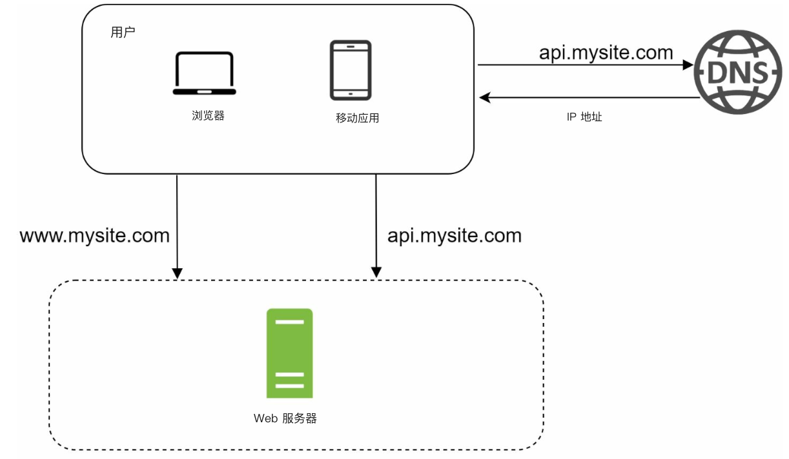

### 请求流程
1. 用户通过域名访问应用（例如 `api.mysite.com`），由 DNS 解析成 IP。
2. Web 服务器（web server）的 IP 返回给浏览器或移动应用。
3. 向 Web 服务器发 HTTP 请求，得到 HTML 或 JSON 响应。

### 流量来源
1. **Web 应用：** 服务端语言（例如 Python、Java）处理业务逻辑，客户端（client）语言（例如 JavaScript、HTML）负责展示。
2. **移动应用：** 用 HTTP 和 JSON 与 Web 服务器通信，交换轻量数据。

---

## 第 2 节：数据库分离
用户变多以后，把数据库迁到独立机器，让 Web 层（web tier）和数据库层可以分别扩展。

   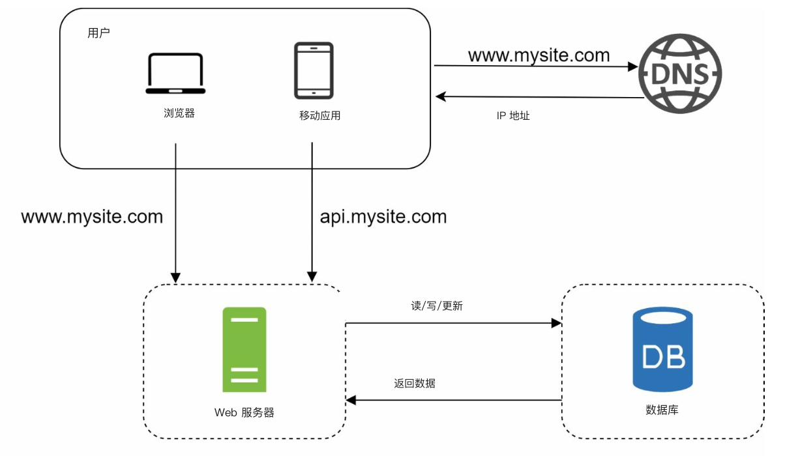

### 数据库选型

1. **关系型数据库（SQL）：** 结构化数据放在表里。例如：MySQL、PostgreSQL。
2. **非关系型数据库（NoSQL）：** 适合非结构化数据或低延迟。类别包括：
   - 键值存储
   - 图数据库
   - 列存储
   - 文档存储

- 在这些情况下，非关系型数据库可能更合适：
   - 应用需要极低延迟。
   - 数据非结构化，或没有关系数据。
   - 只需要序列化 / 反序列化（JSON、XML、YAML 等）。
   - 需要存海量数据。

---

## 第 3 节：垂直扩展与水平扩展
### 垂直扩展（vertical scaling）
- 给现有机器加资源（CPU、RAM）。
- 受硬件上限限制，也没有冗余。

### 水平扩展（horizontal scaling）
- 往池子里加机器，更适合大规模系统。
- 用负载均衡器（load balancer）在服务器之间分发请求。
---

## 第 4 节：负载均衡器

   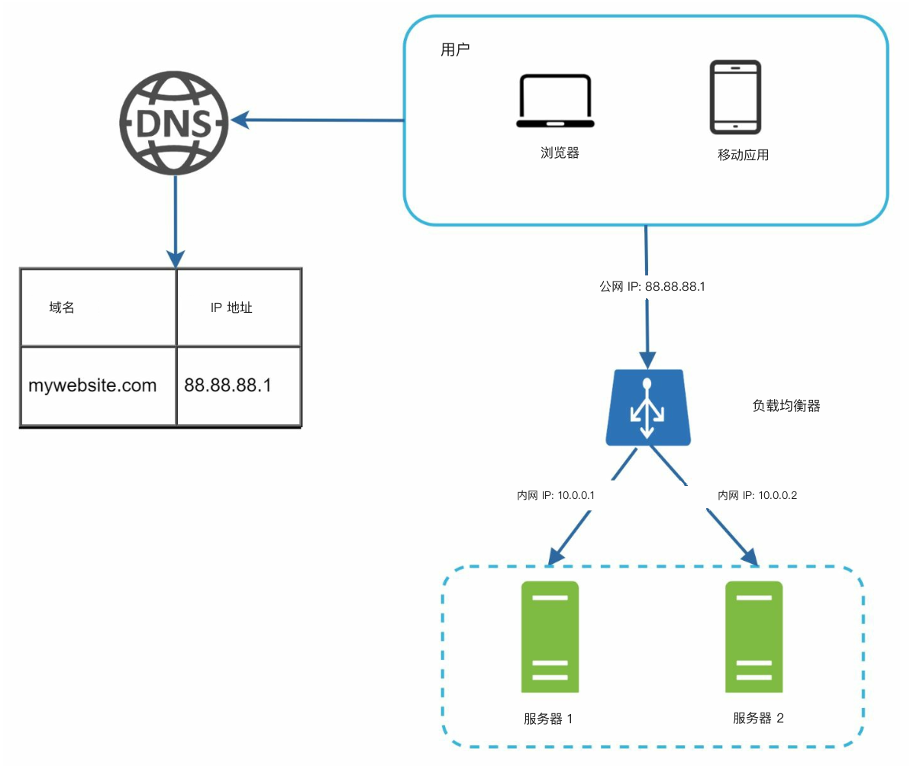

**负载均衡器** 把流量分到多台服务器。好处包括：
1. 冗余：一台宕机，流量改道。
   -  服务器 1 宕机后，全部流量打到服务器 2。
2. 可扩展：流量上涨时加机器即可。
   -  网站流量暴涨时，可以继续加服务器。

---

## 第 5 节：数据库复制

   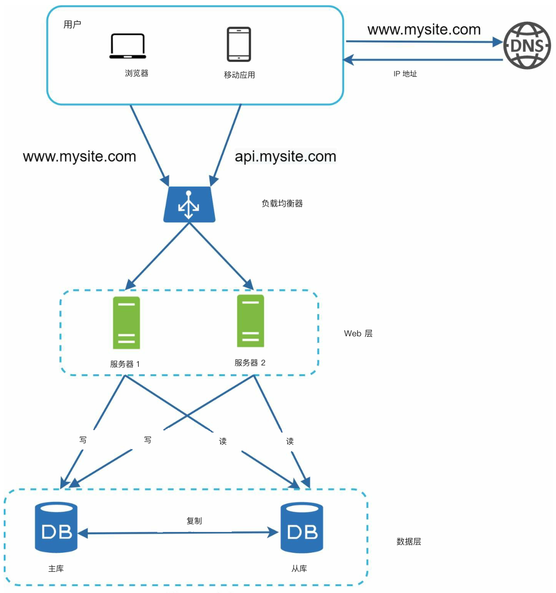

### 主从模型
- **主库（master）：** 处理写。
   - insert、delete、update 等改数据的命令都必须打到主库。
- **从库（slave）：** 处理读，提升性能和可靠性。
   - 多数应用读多写少，所以从库数量通常多于主库。

### 好处
1. 并行读，性能更好。
2. 靠冗余获得高可用（high availability）和数据可靠性。

### 故障处理
- 如果只有一台从库且它宕了，读会临时打到主库。
- 如果有多台从库，读会转到其他健康从库，并用新机器替换故障机。
-  主库宕了，会把一台从库提升为新主库。
- 生产里被选中的从库可能不是最新数据，需要跑数据恢复脚本（多主、环形复制等方法会有帮助）。

---

## 第 6 节：缓存
**缓存** 把常读数据放在内存里，减轻数据库压力。缓存层是临时、比数据库快得多的存储。

   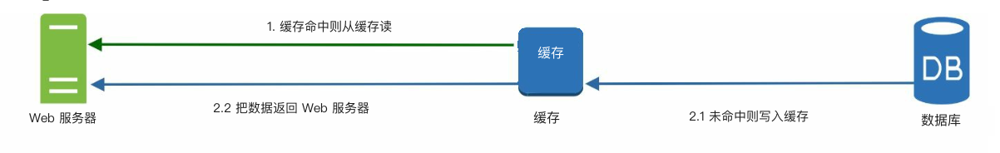

### 缓存注意点
1. **适用场景**：读多改少时适合用缓存。
2. **过期策略：** 缓存到期后删除。如果没有过期策略，数据会一直占内存。
3. **一致性：** 指数据存储和缓存保持同步。对两者的修改不在同一事务里时，可能不一致。
4. **降低故障：** 单台缓存是潜在单点故障（SPOF），建议跨数据中心部署多台缓存。
5. **淘汰策略：** 缓存满了要淘汰条目腾内存。最常用的是 LRU。

---

## 第 7 节：内容分发网络（CDN）
**CDN** 把静态内容（图片、CSS、JavaScript）缓存在地理上分散的节点，加快加载。

   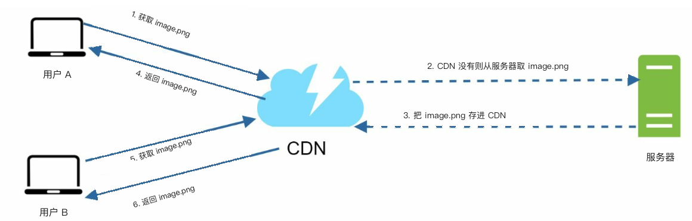

### 工作流程
1. 用户向最近的 CDN 节点要内容。
2. 没有命中时，从源站（origin server）拉取并缓存。

### CDN 注意点
1. **成本：** CDN 由第三方运营，按进出流量收费。
2. **缓存过期：** 过期时间不能太长也不能太短。
3. **CDN 降级：** 临时故障时，客户端应能发现并改向源站要资源。
4. **文件失效：** 文件更新后应让缓存失效，指向新文件。

---

## 第 8 节：无状态 Web 层
把会话（session）数据放到共享存储后，Web 服务器变成无状态（stateless）。这样可以：
1. 更容易水平扩展。
2. 按流量自动扩缩容。

   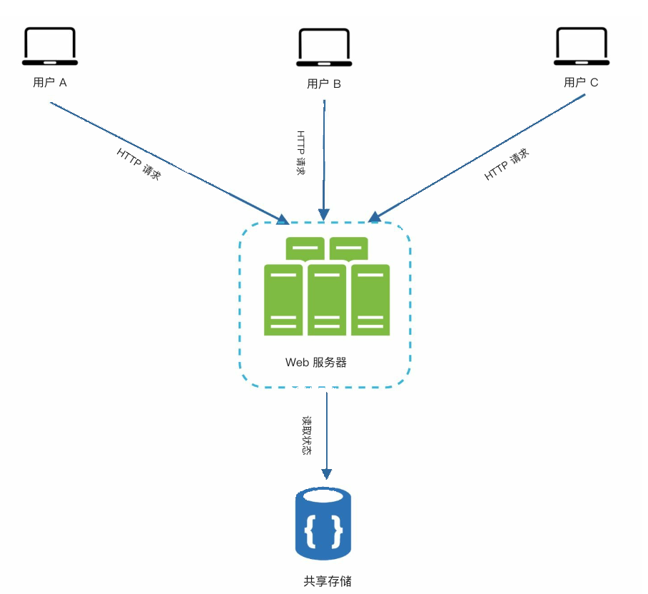

---

## 第 9 节：多数据中心
多数据中心能提高可用性、降低延迟。常见策略：

   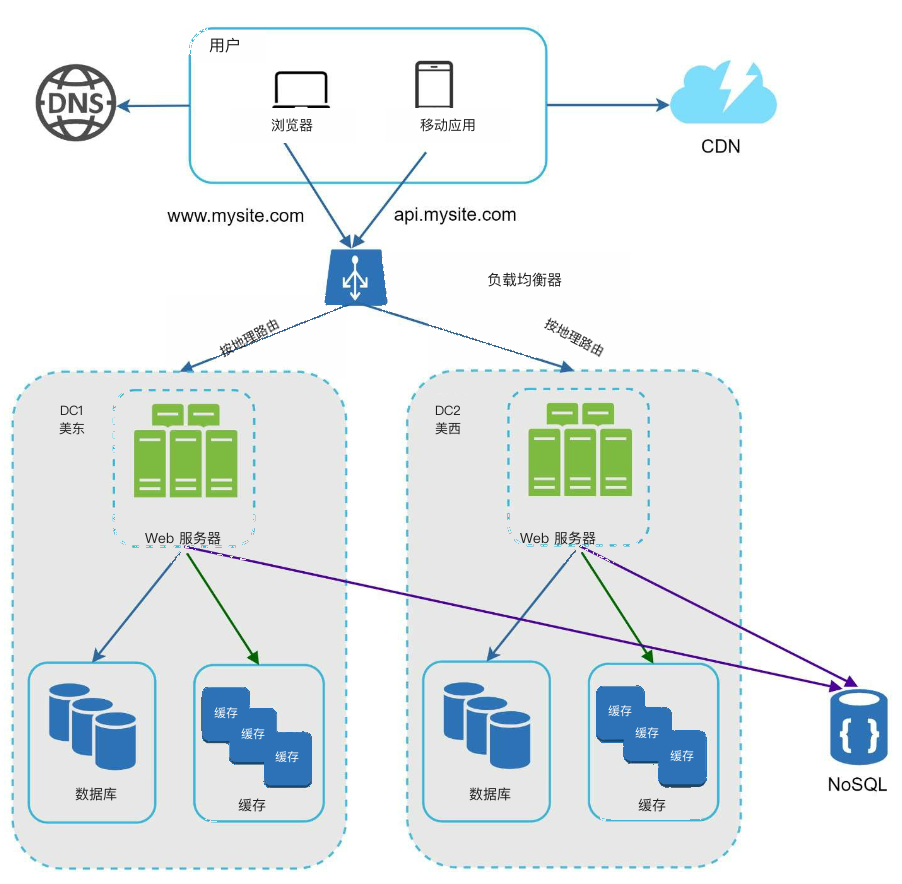

1. **GeoDNS 路由：** 把用户导到最近的数据中心。
2. **数据复制：** 跨中心同步，避免不一致。

### 关键注意点
- **流量调度：** 需要有效工具把流量打到正确的数据中心。
- **数据同步：** 常见做法是跨多个数据中心复制数据。
- **测试与发布：** 自动发布工具对保持各数据中心服务一致很关键。

---

## 第 10 节：消息队列
**消息队列（message queue）** 是耐用的内存组件，支持异步通信。它充当缓冲，并分发异步请求。

   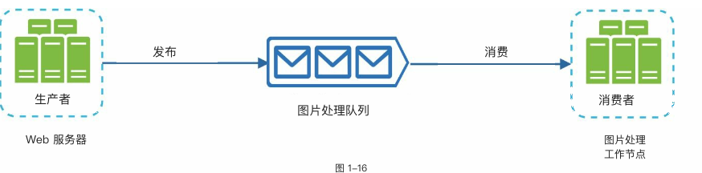

- 输入侧叫生产者 / 发布者（producers/publishers）：创建消息并发布到队列。
- 其他服务叫消费者 / 订阅者（consumers/subscribers）：连接队列，按消息执行动作。

---

## 第 11 节：日志、指标与自动化

   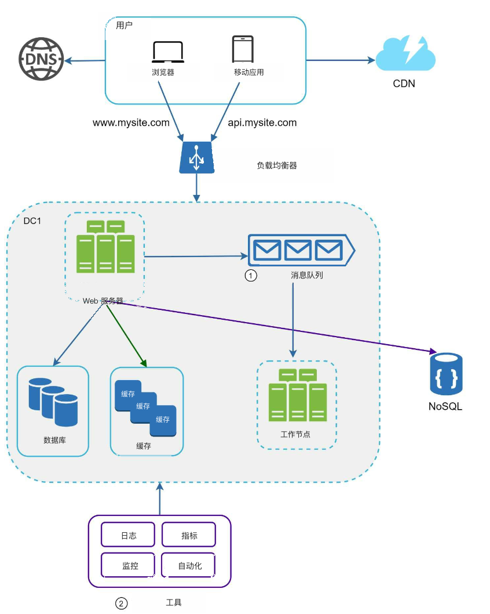

### 重要性
1. **日志：** 跟踪错误和系统健康。
2. **指标：** 观察性能和用户行为。
3. **自动化：** 简化测试、发布和扩缩容。

---

## 第 12 节：数据库扩展
### 垂直扩展
- 加硬件，但有物理和成本上限。
- 几个缺点：
   -  单点故障风险更大。
   -  垂直扩展总体更贵。

### 水平扩展（分片）

   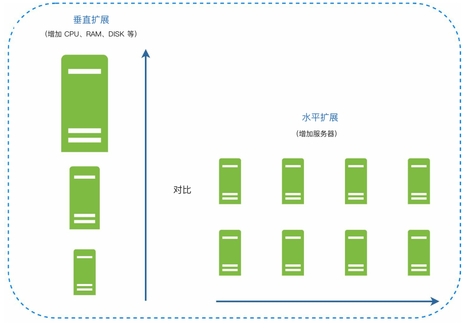

- 用键（例如 `user_id`）把数据切到多个分片（shard）。
   - 分片把大库拆成更好管的小块。
   - 每个分片 schema 相同，数据各不相同。
-  选分片键很关键，要能把数据尽量均匀散开。

#### 挑战
1. **再分片：** 需要再分片的情况：
   - 单个分片因增长装不下。
   - 数据不均导致某些分片更快耗尽。
   - 用一致性哈希（consistent hashing）应对这些问题。

2. **热点问题（celebrity problem）：** 某个分片被过度访问会打满服务器。
   - 解决办法之一是给每个热点对象单独分片。

3. **Join 与反规范化：** 库被分到多台机器后，跨分片 join 很难。
   -  常见做法是反规范化（denormalization），让查询打在一张表上。

---

## 小结
### 要点
1. Web 层保持无状态。
2. 每一层都做冗余。
3. 用缓存和 CDN 提升性能。
4. 数据层（data tier）用分片扩展。
5. 解耦组件，换取灵活。

本章为能支撑百万用户的可扩展系统打下基础。
