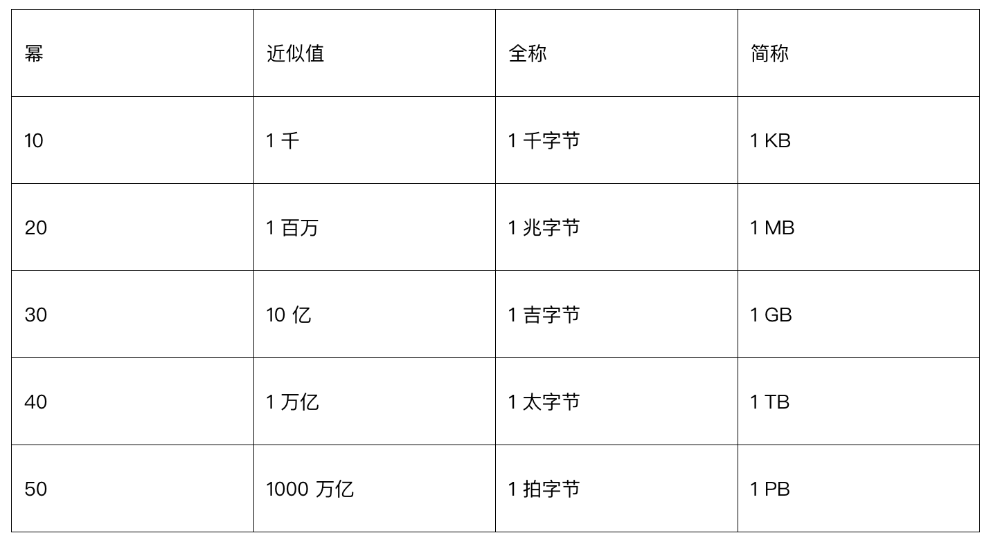

# 第 2 章：粗略估算

## 简介
粗略估算（back-of-the-envelope estimation）是系统设计面试里的关键技能：用快速、粗略的计算判断容量或性能。Google Senior Fellow Jeff Dean 认为，这类估算能通过思想实验和常见性能基准，判断设计是否满足需求。

本章介绍核心概念、方法和例子，用来练扩展性和估算。

---

## 第 1 节：核心概念

### 2 的幂
用 2 的幂来理解数据量是基本功：

这有助于做存储和带宽计算。

---

### 程序员必知的延迟数字
延迟数字表示各类操作要花的时间，用来建立相对性能直觉：

| 操作 | 延迟（2020） |
|------|----------------|
| L1 缓存（cache）访问 | 0.5 ns |
| L2 缓存访问 | 7 ns |
| 主存访问 | 100 ns |
| SSD 随机读 | 150 µs |
| HDD 随机寻道 | 10 ms |
| 数据中心内往返 | 500 µs |
| 跨区域数据中心 | 150 ms |

**要点：**
- 内存快，磁盘慢。
- 能避免磁盘寻道就避免。
- 数据上互联网之前先压缩，省带宽。

---

### 可用性数字
高可用（high availability）要求停机尽量少。可用性用 **几个 9** 表示：
- **99%（两个 9）：** 每年约停机 3.65 天
- **99.9%（三个 9）：** 每年约停机 8.8 小时
- **99.99%（四个 9）：** 每年约停机 52 分钟
- **99.999%（五个 9）：** 每年约停机 5.3 分钟
- **99.9999%（六个 9）：** 每年约停机 31.56 秒

Amazon、Google、Microsoft 等云厂商的 SLA（Service Level Agreement）通常瞄准 **99.9% 或更高**。

---

## 第 2 节：估算示例——Twitter 的 QPS 与存储

### 假设
- **3 亿月活用户（MAU）。**
- **50% 日活用户（DAU）。**
- **每用户每天平均 2 条推文。**
- **10% 的推文带媒体。**
- **数据保留：** 5 年。

### 估算
1. **每秒查询数（QPS）：**
   - DAU = \( 300M x 50\% = 150M \)
   - 发推 QPS = \( 150M x 2 tweets / 24 hour / 3600 seconds = ~3500 )
   - 峰值 QPS = \( 2 x 3500 = ~7000 \)

2. **媒体存储：**
   - **推文字段大小：**
     - `tweet_id`: 64 bytes
     - `text`: 140 bytes
     - `media`: 1 MB
   - **每天媒体存储：** \( 150M x 2 x 10\% x 1MB = 30TB per day \)
   - **5 年存储：** \( 30TB x 365 x 5 = ~55PB \)

---

## 第 3 节：估算技巧

### 1. 取整与近似
精度不是关键，过程才是。用整数简化计算。例如：
- \( 99987 / 9.1 \) 可近似为 \( 100,000 / 10 = 10,000 \)。

### 2. 写下假设
把假设写清楚，方便回头看。

### 3. 标注单位
避免歧义，写成 `5 MB` 而不是 `5`。

### 4. 常见估算场景
- **QPS（Queries Per Second）：** 衡量流量强度。
- **峰值 QPS：** 考虑流量尖峰。
- **存储需求：** 估计总数据量。
- **缓存需求：** 估计缓存要用的内存。
- **服务器数量：** 按负载估算硬件。
