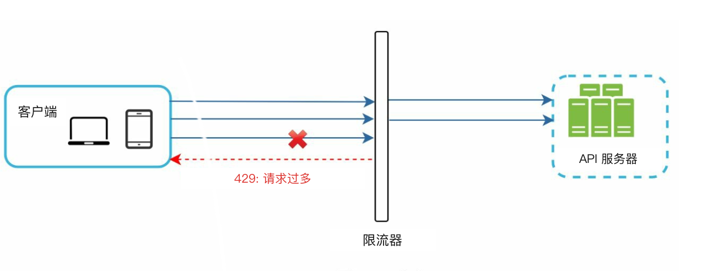
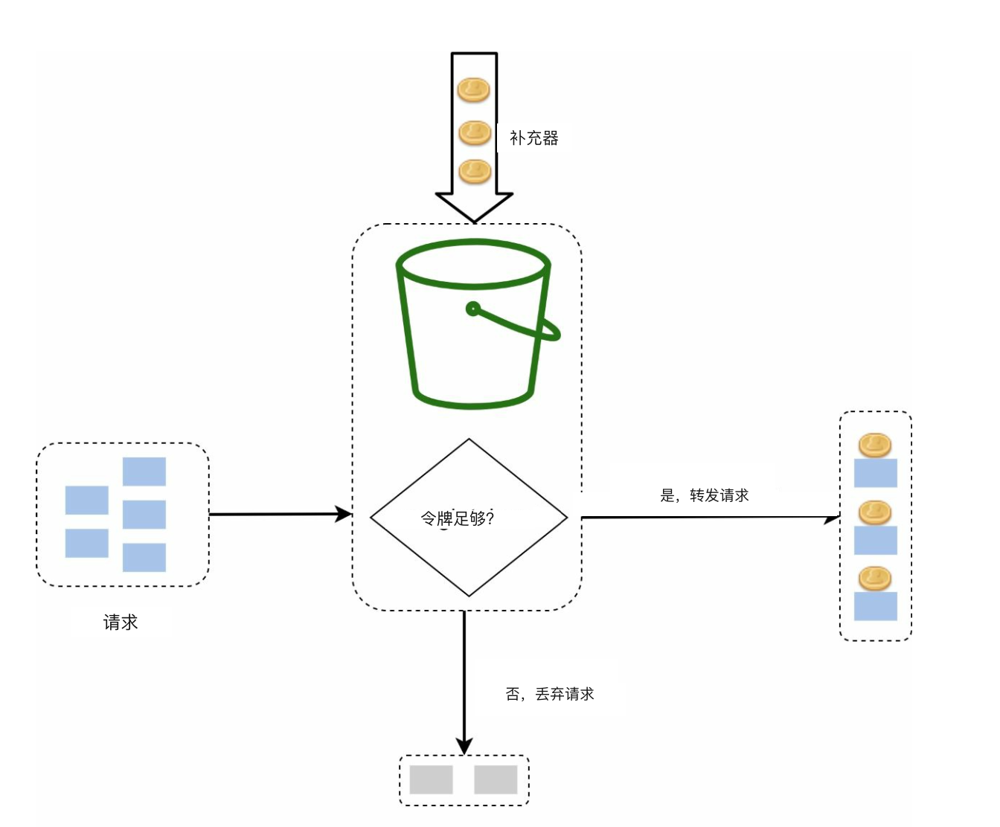
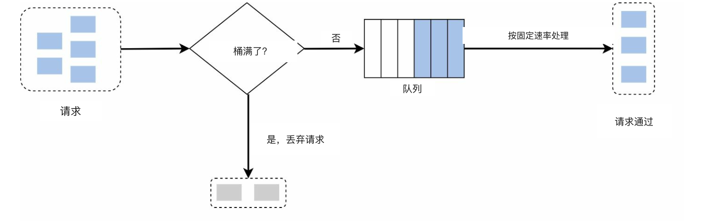
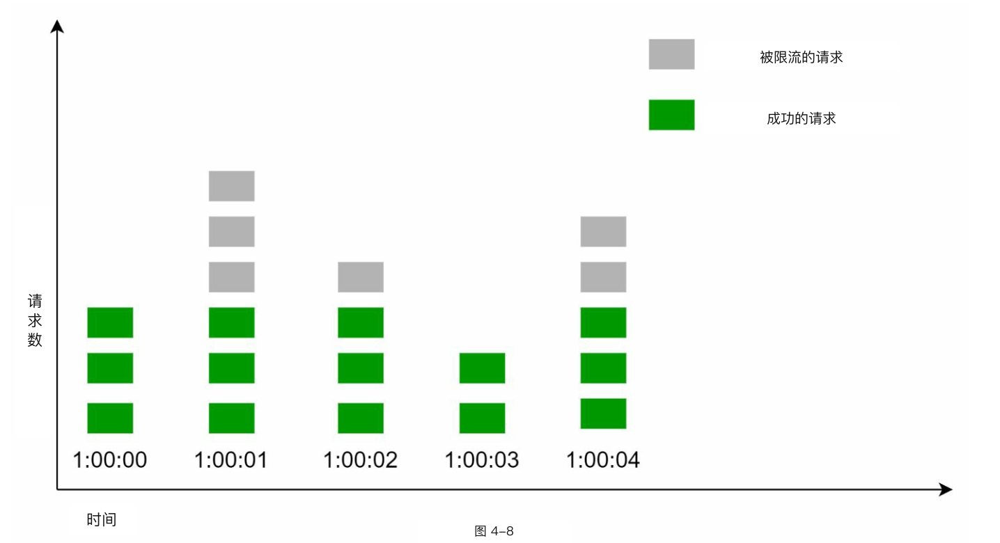
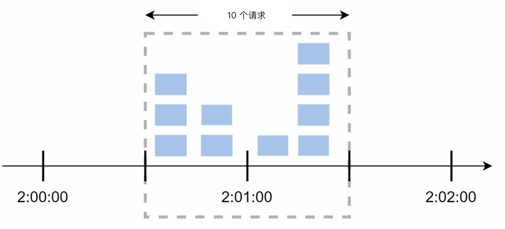
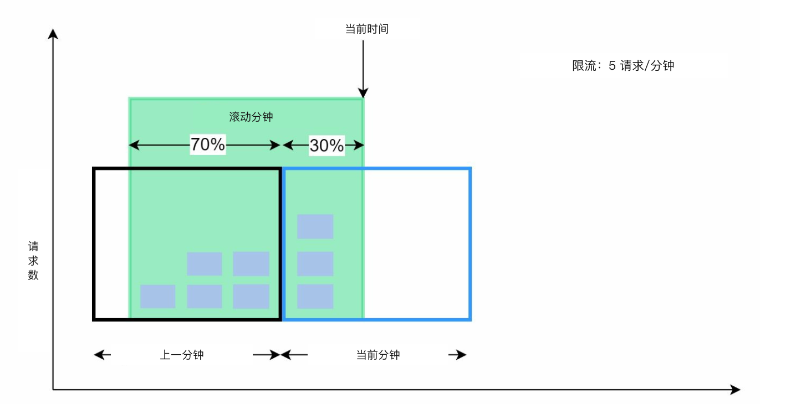
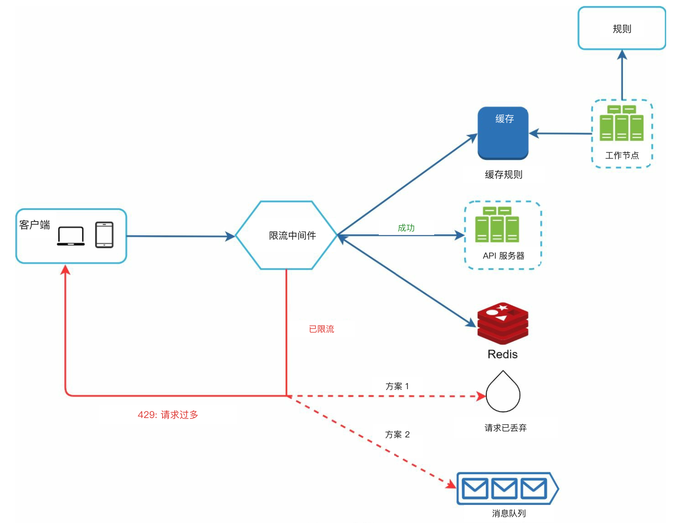

# 第 4 章：设计限流器

## 简介
本章讨论限流器（rate limiter）的设计与实现——一种用来控制客户端（client）或服务发出流量速率的系统组件。限流对于防止滥用、降低成本、保证服务器资源稳定至关重要。典型用途包括限制发帖次数、限制注册账号、限制领奖等。

## 限流的好处
- **防止 DoS 攻击：** 拦截过量调用，避免资源被耗尽。
- **降低成本：** 限制不必要的请求，减少服务器开销。
- **防止过载：** 过滤过量请求，稳定服务器性能。

## 步骤 1：理解问题
### 关键功能
- 服务端 API 限流器。
- 支持多条限流规则。
- 能处理分布式环境下的大规模系统。
- 可作为独立服务，也可作为应用内代码。
- 被限流时告知用户。

### 需求
- 请求限流准确。
- 延迟尽量低。
- 内存占用低。
- 可分布式部署。
- 异常处理清晰。
- 高容错。

## 步骤 2：高层设计
### 放置位置

    

1. **客户端实现：** 不可靠，可能被恶意绕过。
2. **服务端实现：** 更利于控制和可靠性，是首选。
3. **中间件（middleware）/ API 网关（API gateway）：** 灵活，便于集成限流。

### 放置原则
- 评估现有技术栈，选择高效方案。
- 按业务需求选择合适算法。
- 若采用微服务，使用 API 网关。
- 资源有限时可选用商业方案。

## 步骤 3：限流算法
### 1. 令牌桶（token bucket）

  

- **描述：** 令牌按固定速率放入桶中；每个请求消耗一个令牌。
- **参数：** 桶大小和补充速率。
- **优点：** 实现简单，省内存，允许突发流量（burst）。
- **缺点：** 参数需要仔细调。

### 2. 漏桶（leaking bucket）

  

- **描述：** 用 FIFO 队列按固定速率处理请求。
- **优点：** 省内存，出流速率稳定。
- **缺点：** 突发流量可能让新请求排队变久。

  Example: https://github.com/uber-go/ratelimit

### 3. 固定窗口计数器（fixed window counter）

  

- **描述：** 把时间切成固定区间，用计数器限制请求。
- **优点：** 简单，适合部分场景。
- **缺点：** 窗口边缘的流量尖峰可能超过限额。

- 窗口边缘的突然突发流量，可能让超过配额的请求通过。

  

### 4. 滑动窗口日志（sliding window log）

  

- **描述：** 记录时间戳，形成滚动时间窗口。
- **优点：** 限流准确。
- **缺点：** 内存占用高。

### 5. 滑动窗口计数器（sliding window counter）

  

- **描述：** 结合固定窗口和滑动日志，用来平滑尖峰。
- **优点：** 省内存，能应对突发流量。
- **缺点：** 近似计算，严格程度不是百分之百。

## 高层架构

  

- **数据存储：** 用内存缓存（例如 Redis）做快速计数。
- **步骤：**
  1. 客户端把请求发到中间件。
  2. 中间件检查 Redis 中的计数器。
  3. 根据限额处理或拒绝请求。

## 进阶考虑
### 分布式环境
- **挑战：** 竞态条件（race condition）、同步问题。
- **方案：** 使用锁、Lua 脚本，或 Redis 有序集合。用中心化数据存储做同步。

### 性能优化
- 多数据中心部署以降低延迟。
- 用最终一致性（eventual consistency）模型做同步。

### 监控
- 定期分析，确认算法有效并按需调整规则。
