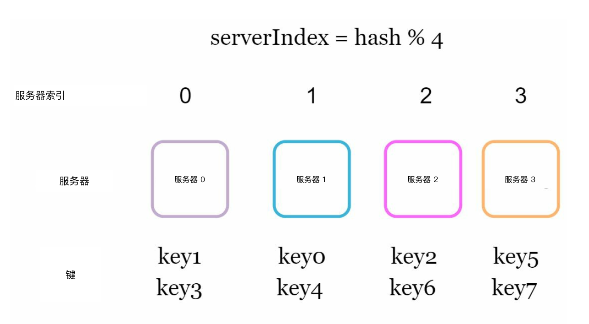
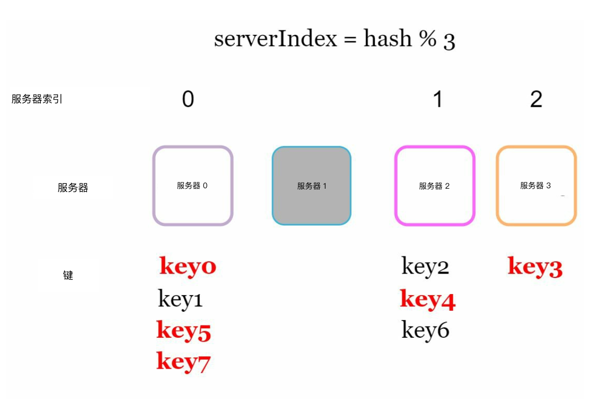
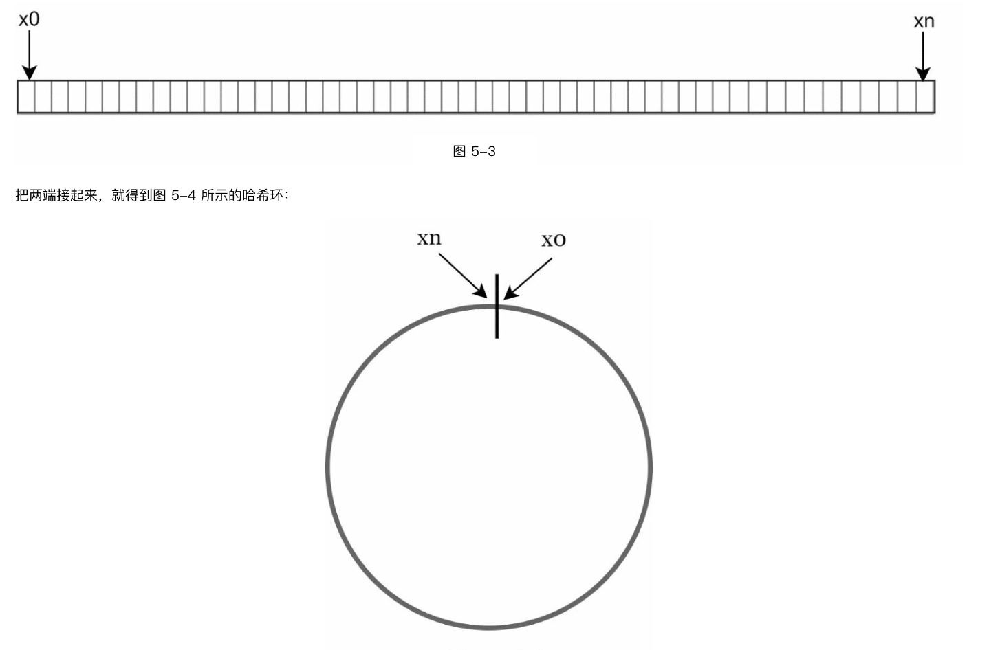
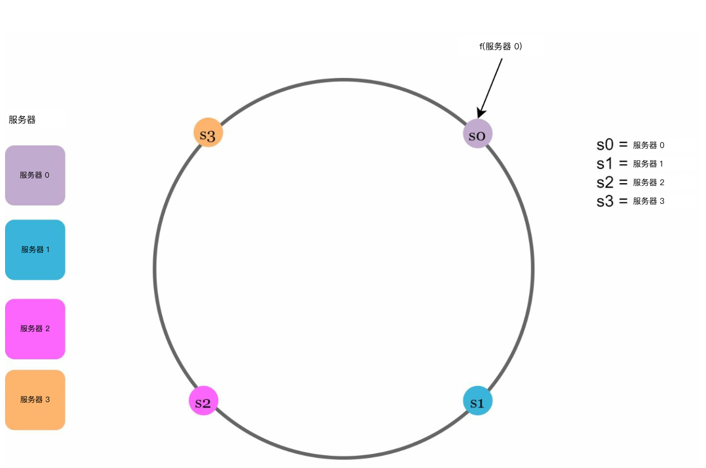
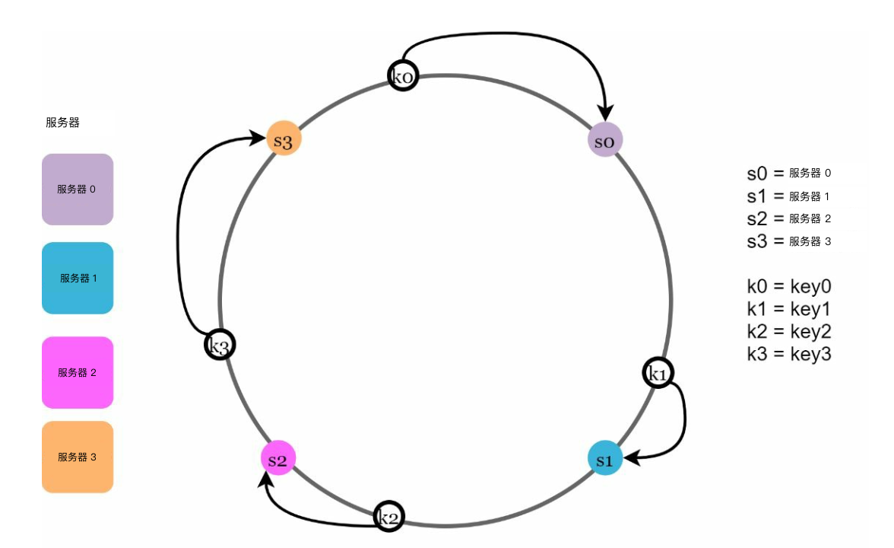
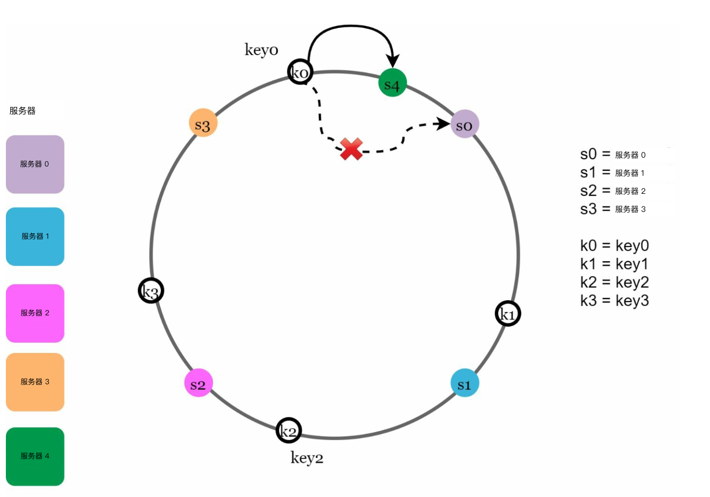
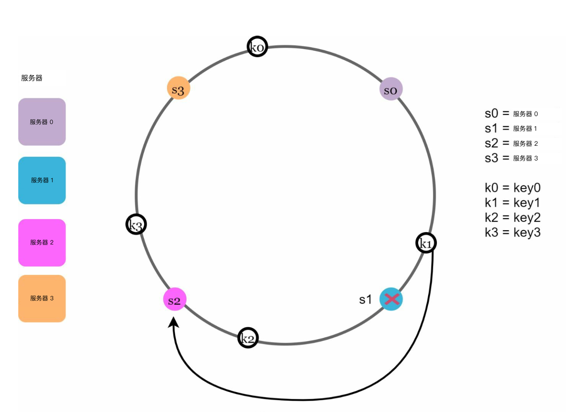
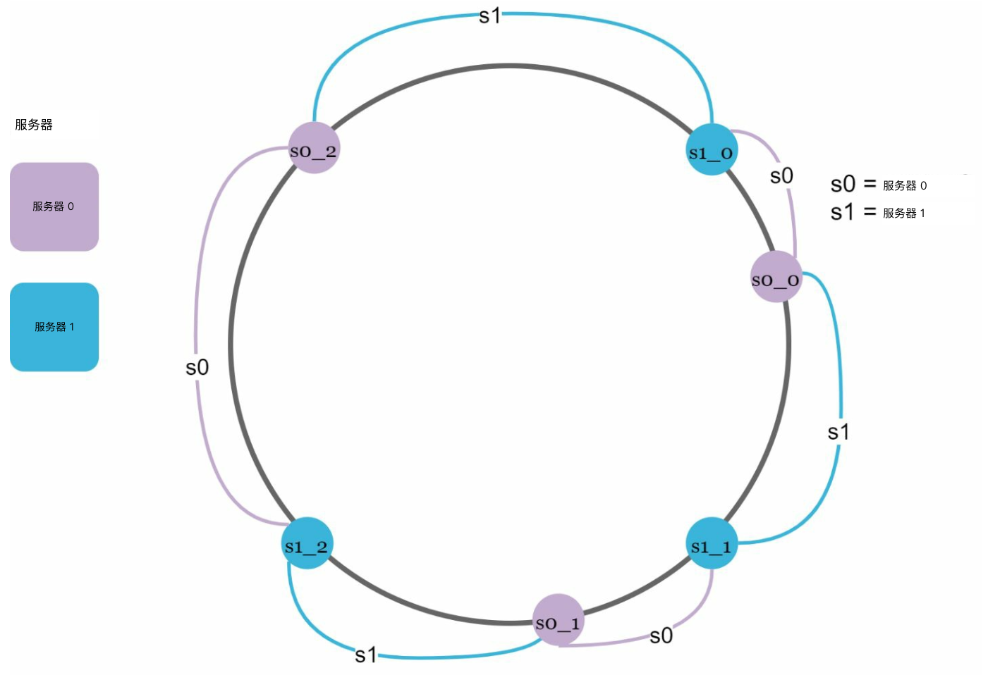
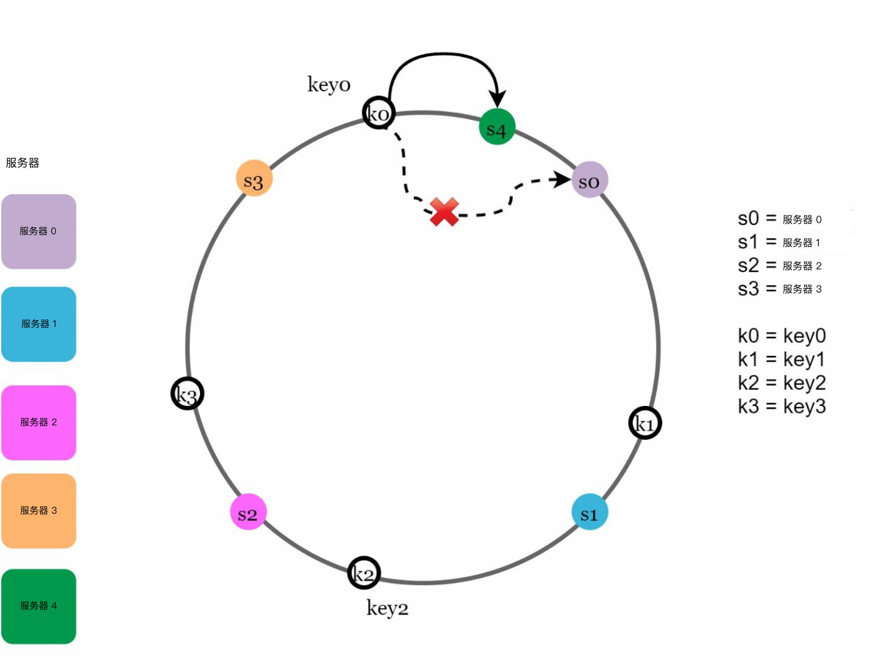
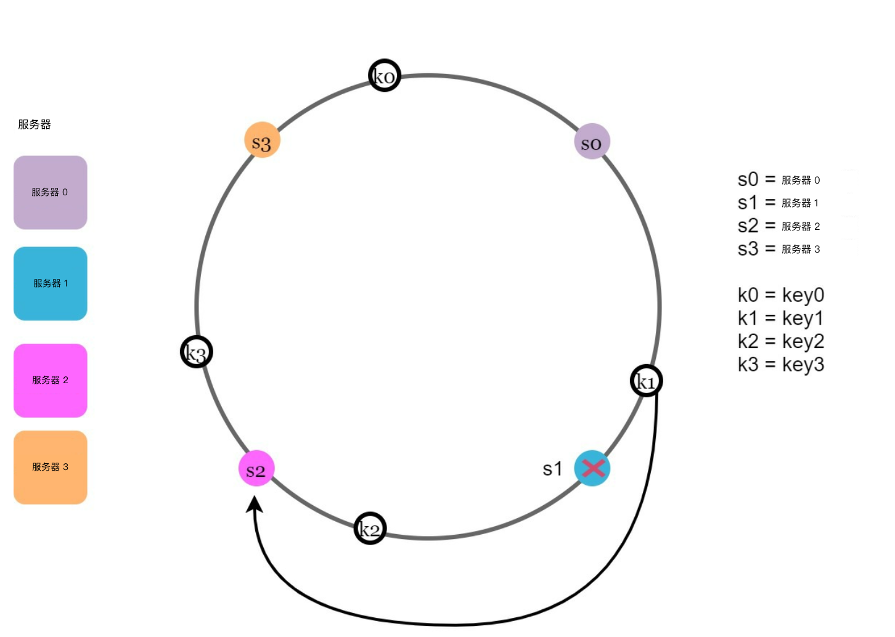

# 第 5 章：设计一致性哈希

## 简介
本章讨论一致性哈希（consistent hashing）：一种通过把请求和数据高效打散到多台服务器，从而实现水平扩展（horizontal scaling）的关键技术。服务器增减时，它能尽量少搬数据，并让数据分布均匀，减轻服务器热点（hotspot）。

## 重哈希问题
### 说明
传统哈希方法（例如 `serverIndex = hash(key) % N`）在服务器数量变化时会出现重哈希（rehashing）问题。例如：
- 去掉一台服务器会让大多数键重新映射，从而产生缓存（cache）未命中。
- 增加一台服务器也会造成不必要的键重分配。

  

- 服务器池大小固定时，这种做法没问题。但一旦新增或下线服务器，问题就来了。

  

### 关键问题
服务器数量一变，大多数键都要重分配，既低效又容易过载。

## 一致性哈希
### 定义
一致性哈希保证在增减服务器时，只有一小部分键需要重新映射。这样能减少扰动，提升可扩展性。

### 核心概念
1. **哈希空间与哈希环：** 哈希空间形成一个连续的哈希环（hash ring），哈希值分布在 `0` 到 `2^160-1`（例如用 SHA-1 这类哈希函数（hash function））。把两端接起来，就得到一个环。
    

    
    

- 用同一个哈希函数 f，按服务器 IP 或名字把服务器映射到环上。

    

    
    

1. **服务器查找**
- 从键的位置沿环顺时针走，遇到的第一台服务器就是该键所在的服务器。

  

  
  

2. **添加与移除服务器**
- 加入一台服务器时，只重分配邻近的键。只有一小部分键会搬到新服务器上。

  

  
  

- 移除一台服务器时，只影响它负责范围内的键。只有被移除服务器上的键，会交给顺时针方向的下一台服务器。

  

  
  

## 挑战与方案
### 基本做法的两个问题
1. **分区大小不均：** 各服务器分到的数据分区可能不相等。
2. **键分布不均匀：** 有的服务器分到的键会明显多于其他服务器。

### 方案：虚拟节点
- 每台服务器在环上对应多个均匀分布的虚拟节点（virtual node）。
- 虚拟节点能改善键的分布、均衡负载。虚拟节点越多，键的分布越均匀，因为标准差会随虚拟节点增多而变小，数据分布也就更均衡。

  

  
  

## 受影响的键
增减服务器时：
- **加入服务器：** 受影响的键是新服务器与其前驱之间的那些。
  下例把服务器 4 加到环上。受影响范围从 s4（新加入的节点）沿环逆时针走到下一台服务器（s3）。因此，位于 s3 与 s4 之间的键需要重分配到 s4。

  

  
  

- **移除服务器：** 受影响的键是被移除服务器与其前驱之间的那些。下例移除服务器（s1）时，受影响范围从 s1（被移除的节点）沿环逆时针走到下一台服务器（s0）。因此，位于 s0 与 s1 之间的键必须重分配到 s2。

  

  
  

## 一致性哈希的好处
- **尽量少搬键：** 只有一小部分键需要重新映射。
- **可扩展：** 能够水平扩展。
- **减轻热点：** 均衡数据分布，避免服务器过载。

## 实际应用
- Amazon Dynamo DB
- Apache Cassandra
- Discord
- Akamai CDN
- Maglev 负载均衡器（load balancer）
