# 第 6 章：设计键值存储

## 简介
**键值存储（key-value store）** 是一种非关系型数据库，数据以键值对形式存放。每个键唯一，通过这些键访问对应的值。本章说明如何设计一套可扩展、高可用（high availability）的分布式键值存储，支持如下操作：
- `put(key, value)` 用于写入数据。
- `get(key)` 用于读取数据。

### 设计特征
- 键值对较小（<10 KB）。
- 支持大数据，同时具备高可用和可扩展性。
- 自动扩缩容，一致性可调。
- 延迟低。

---

## 单机键值存储
### 实现
- 用 **哈希表** 在内存中存放键值对。
- 优化手段：
  - 数据压缩。
  - 较少访问的数据落到磁盘。

### 局限
单机内存有上限，要继续扩展必须采用 **分布式方案**。

---

## 分布式键值存储
**分布式键值存储** 把数据分区到多台服务器上，并且必须面对 **CAP 定理（CAP theorem）** 给出的取舍。

### CAP 定理
1. **一致性：** 所有客户端（client）同时看到同一份数据。
2. **可用性：** 即使部分节点宕机，系统也对每个请求给出响应。
3. **分区容错：** 出现网络分区时系统仍能继续工作。

**取舍：** 按 CAP 定理，三项保证里最多只能同时满足两项。

  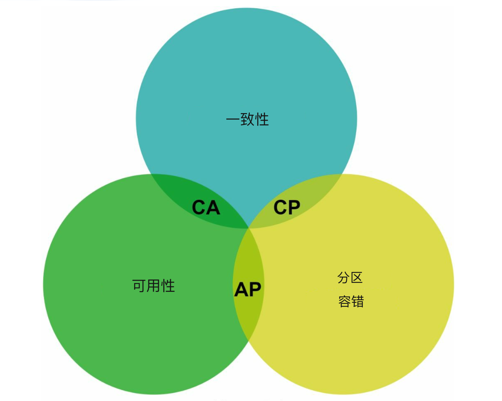

#### 系统类型：
- **CP 系统：** 保证一致性和分区容错，牺牲可用性（例如银行系统）。
- **AP 系统：** 保证可用性和分区容错，牺牲一致性（例如最终一致性（eventual consistency））。
- **CA 系统：** 保证一致性和可用性，牺牲分区容错。

    **网络故障无法避免，分布式系统必须容忍网络分区。因此现实应用里不存在 CA 系统。**

    在分布式系统中，分区不可避免。一旦发生分区，就必须在一致性和可用性之间做选择。例如节点 n3 宕机后，
    写入 n1 或 n2 的数据无法传到 n3。反过来，如果数据写到了 n3 但还没传到 n1 和 n2，n1 和 n2 上就是过期数据。

    

    
    

    
- 如果选 CP 系统，就必须阻塞对 n1 和 n2 的全部写操作，以免数据不一致。
- 如果选 AP 系统，系统会继续接受读，即使可能返回过期数据。
对于写，n1 和 n2 继续接受写入，
网络分区恢复后再把数据同步到 n3。

---

## 系统组件
### 1. 数据分区
- **手法：** 用一致性哈希（consistent hashing）把数据均匀打到多台服务器。
- **优点：**
  - 增减服务器时自动扩缩容。
  - 借助虚拟节点（virtual node）支持异构。某台服务器的虚拟节点数量与其容量成正比。

### 2. 数据复制
- 把数据复制到 `N` 台服务器，以保证高可用。
- 从该服务器在环上的位置顺时针走，取环上前 N 台服务器存放副本（replica）。把副本放到不同数据中心（data center），以便在使用虚拟节点时也能提高可靠性。

    

    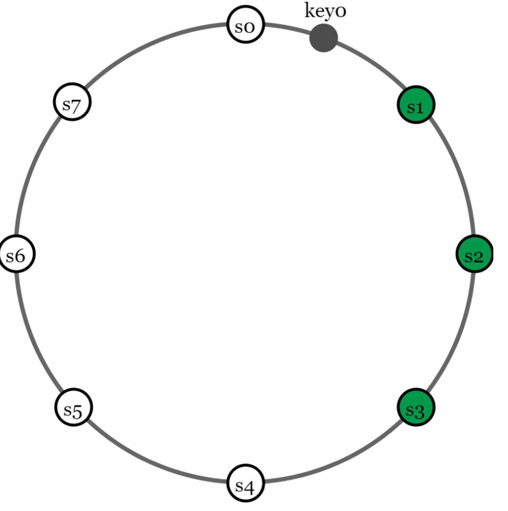
    

### 3. 一致性
数据复制到多个节点后，必须在副本之间同步。
- **法定人数（quorum）共识：**
  - `N`：副本总数。
  - `W`：写法定人数。一次写要被认定为成功，必须得到 W 个副本的确认。
  - `R`：读法定人数。一次读要被认定为成功，必须等到至少 R 个副本的响应。
  - **规则：** `W + R > N` 可保证强一致性（strong consistency）。
  - W、R、N 的配置，是延迟与一致性之间的典型权衡。

    

    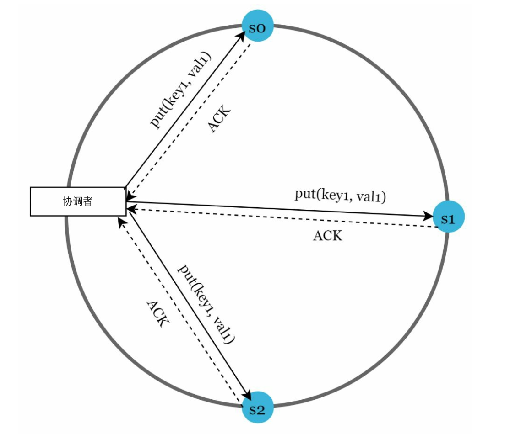
    

    
    - 若 R = 1 且 W = N，系统针对快速读做了优化。
    - 若 W = 1 且 R = N，系统针对快速写做了优化。
    - 若 W + R > N，可保证强一致性（通常 N = 3，W = R = 2）。
    - 若 W + R <= N，则不能保证强一致性。

- **模型**：
  - **强一致性：** 读操作返回的是最近一次写入的结果。
  - **弱一致性：** 后续读可能看不到最新值。
  - **最终一致性：** 只要给够时间，所有更新都会传播，所有副本最终一致。

### 4. 不一致的修复
复制带来高可用，也会让副本之间出现不一致。用版本化和向量时钟（vector clock）来解决不一致。
- **版本化：** 
    - 用 **向量时钟** 跟踪数据版本并解决冲突。
    - 版本化是把每次数据修改都当成一份新的不可变版本。
        

        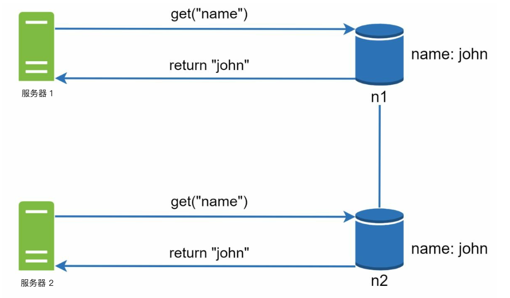
        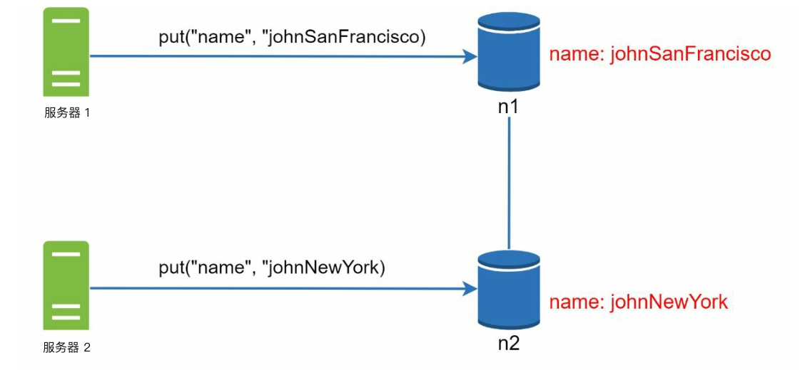
        

    
    - 服务器 1 改了名字，服务器 2 也改了名字。这两次修改同时发生。于是出现冲突的值，称为版本 v1 和 v2。

- **向量时钟**
    1. **设定**：向量时钟是与数据项绑定的 [服务器, 版本] 对。可用来判断
        某个版本是在另一版本之前、之后，还是互相冲突。
        - 假设向量时钟写成 D([S1, v1], [S2, v2], …, [Sn, vn])，若数据项 D 写入服务器
        Si，系统必须执行下面任务之一。
        - 其中：`D` 是数据项。`Si` 是服务器标识。`vi` 是该数据在服务器 `Si` 上的版本计数。

    2. **更新向量时钟：** 某台服务器修改数据项时：
        - 若该服务器已在向量时钟里，就把它的版本计数加一。
        - 否则往向量时钟里加一项。

    3. **冲突检测：**
        - **无冲突：** 若 X 中所有计数都小于或等于 Y 中对应计数，则版本 X 是版本 Y 的祖先。
        - **存在冲突：** 若 Y 中至少有一个计数小于 X 中对应计数，则两个版本是兄弟。

    4. **冲突解决：** 检测到冲突（兄弟版本）时，系统依赖应用逻辑或客户端介入来调和数据。

        

        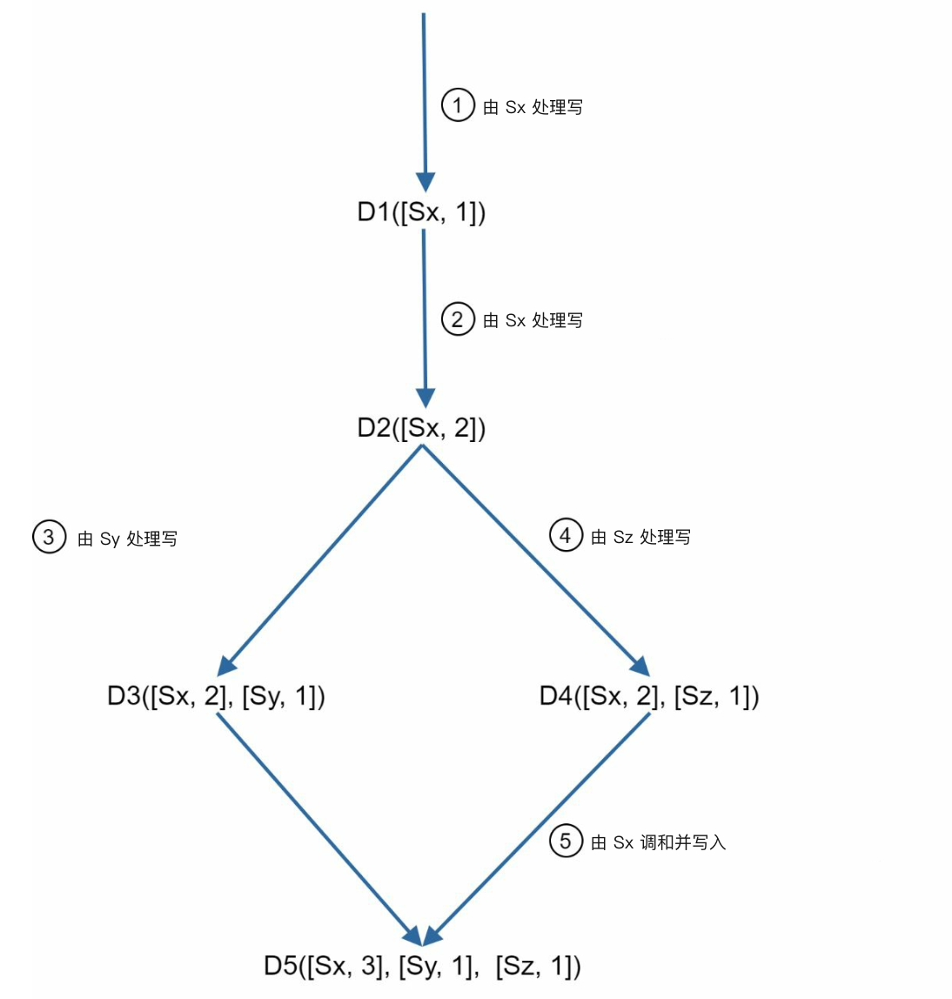
        

- **挑战：**
  - 客户端复杂度上升。
  - 更新很多时向量时钟可能变大，需要裁剪策略来限制其大小。

### 5. 故障处理

#### a. 故障检测
不能仅凭另一台服务器说某台宕了就信。通常至少要有两个独立信息源，才能把一台服务器标为宕机。
- **Gossip 协议（gossip protocol）：**
    

        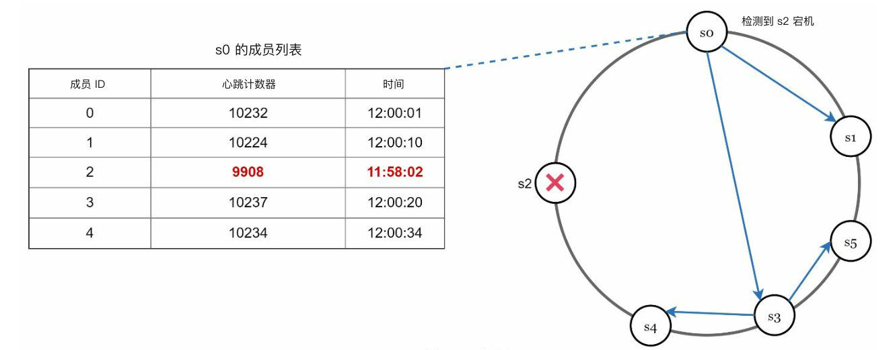
    

    - 每个节点维护成员 ID 和心跳（heartbeat）计数器。
    - 每个节点定期把自己的心跳计数器加一。
    - 每个节点定期向一组随机节点发送心跳。
    - 若心跳超过预定时间没有增加，该成员
    视为离线

#### b. 临时故障
- **宽松法定人数（sloppy quorum）：** 临时用健康节点维持操作。
        

        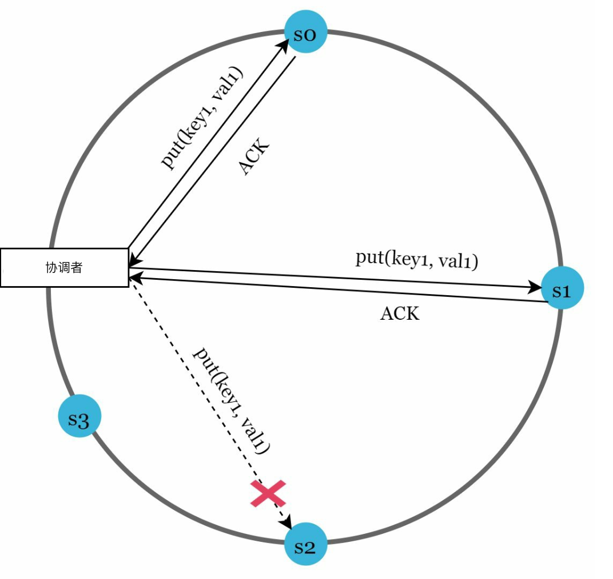
        

    - 检测到故障后，系统需要部署若干机制来保证可用性
    - 系统不强制原来的法定人数要求，而是在哈希环（hash ring）上选前 W 台健康服务器写、前 R 台
    健康服务器读。
    - 离线服务器被忽略。某台服务器不可用时，由另一台临时处理请求

- **暗示移交（hinted handoff）：** 离线服务器恢复后补上变更。
    - 宕机服务器恢复后，变更会被推回去，以达到数据一致

#### c. 永久故障
- 用 **Merkle 树（merkle tree）** 在副本之间高效同步。
    **Merkle 树**（或哈希树）是一种数据结构，用于在永久故障期间高效发现并修复副本之间的不一致。

- 工作方式
    1. **结构：**
        - **叶节点** 存放各个数据块的哈希。
        - **非叶节点** 存放其子节点的哈希。
        - **根哈希** 代表整棵树全部数据的综合状态。

    2. **构建 Merkle 树：**
        - **步骤 1：** 把键空间划分成桶。
            
            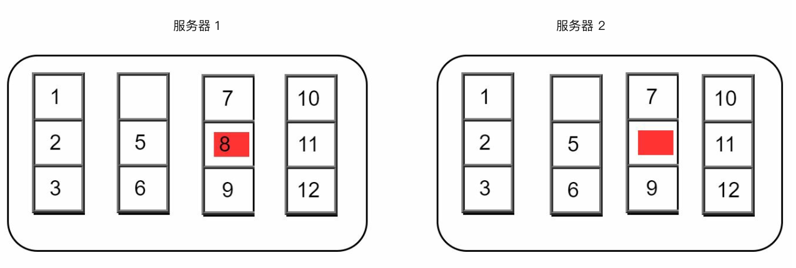

        - **步骤 2：** 用均匀哈希给桶里每个键做哈希。

            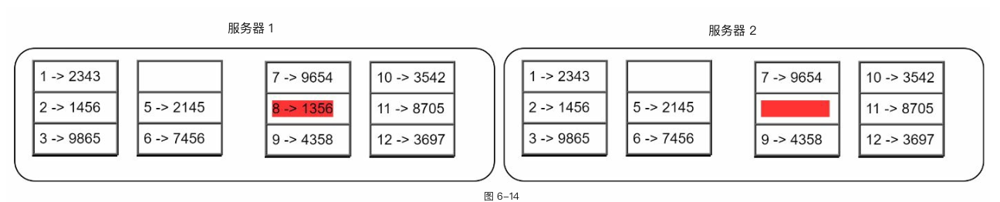

        - **步骤 3：** 为每个桶生成一个哈希。
        
            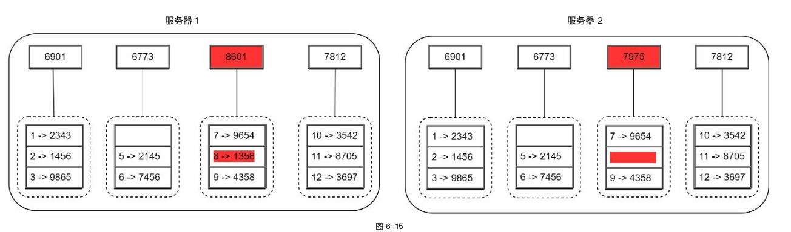

        - **步骤 4：** 把各桶哈希组合起来，算出更高层哈希，最终得到根哈希。

            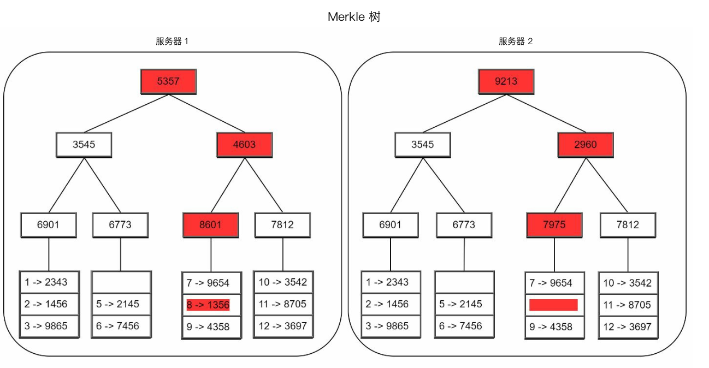

    3. **同步：**
        - 同步两个副本时：
            - 比较它们的根哈希。
            - 根哈希相同，则副本一致。
            - 根哈希不同，则递归比较子哈希，找出不一致的桶。
        - 只同步不一致的数据。

- 优点
    - **效率：** 只同步不一致的数据，减少传输量。
    - **可扩展性：** 适合大数据集，同步开销小。
    - **可靠性：** 保证副本之间数据一致。

### 6. 数据中心故障
- 把数据复制到多个数据中心，以便在故障期间仍可用。

---

## 写路径与读路径
### 1. 写路径（参考 Cassandra 架构）

    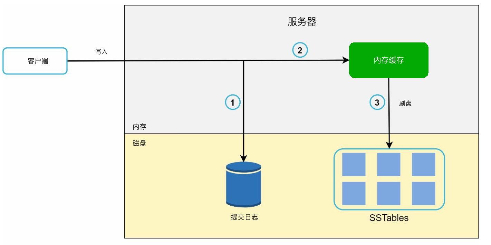

- 把写入持久化到 **提交日志（commit log）**。
- 把数据写入 **内存缓存（cache）**。
- 缓存满了以后，把数据刷到磁盘上的 **SSTable**（Sorted String Table）。

   

### 2. 读路径

    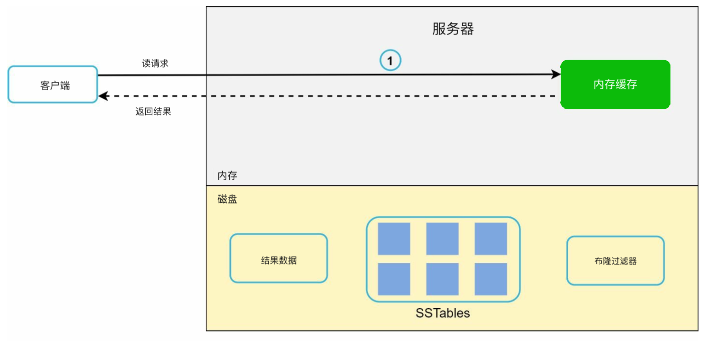
    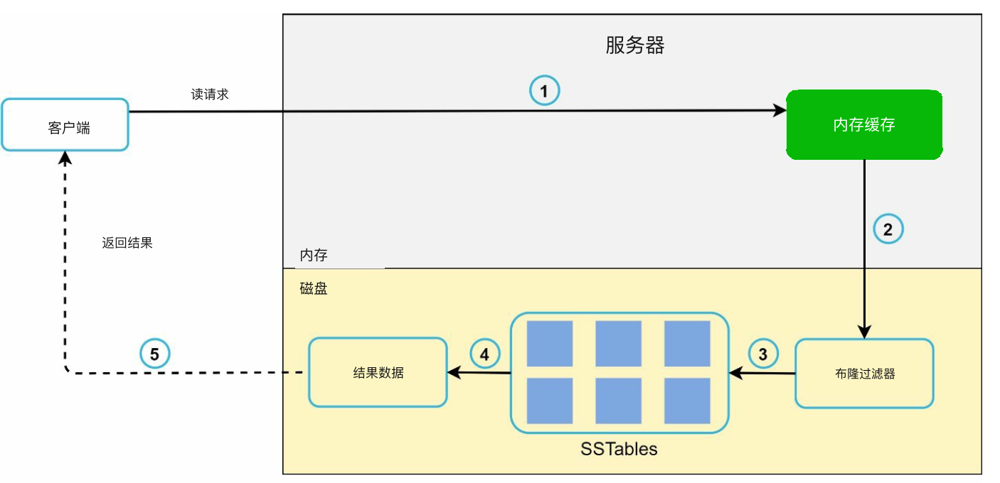

- 先在内存缓存里找数据。
- 找不到时，用 **布隆过滤器（Bloom filter）** 定位 SSTable 里的数据。
- 取出并返回数据。

---

## 最终架构

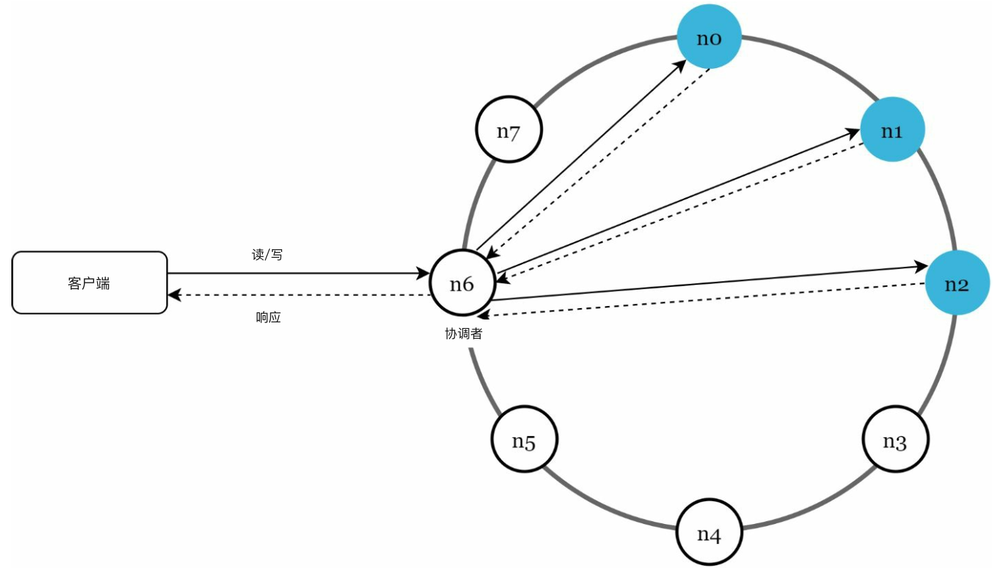

- 客户端通过简单 API 与键值存储通信：get(key) 和 put(key,
value)。
- 协调者（coordinator）是充当客户端与键值存储之间代理的节点。
- 节点用一致性哈希分布在环上。
- 系统完全去中心化，因此增减节点可以自动完成。
- 数据复制到多个节点。
- 没有单点故障（SPOF），因为每个节点职责相同。
