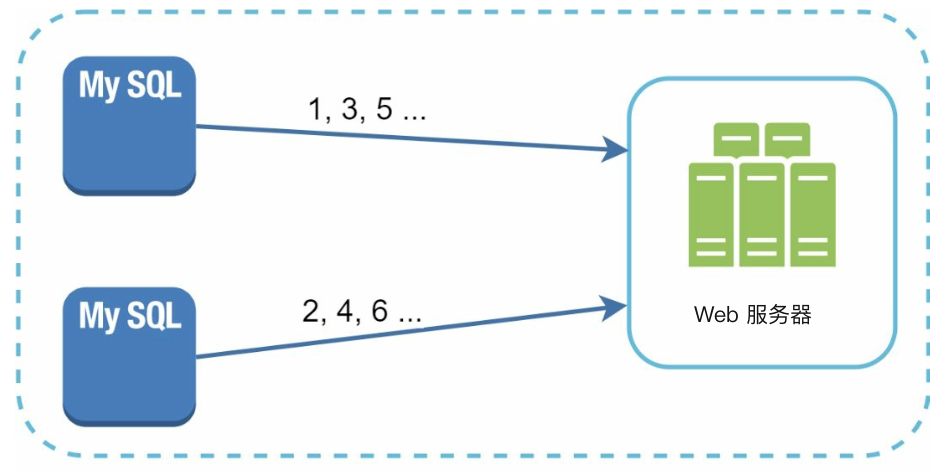
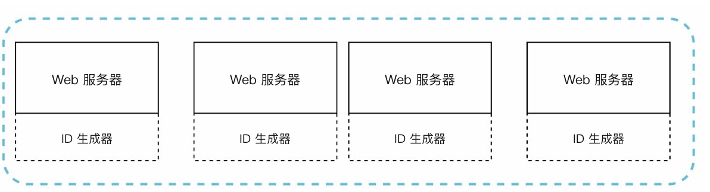
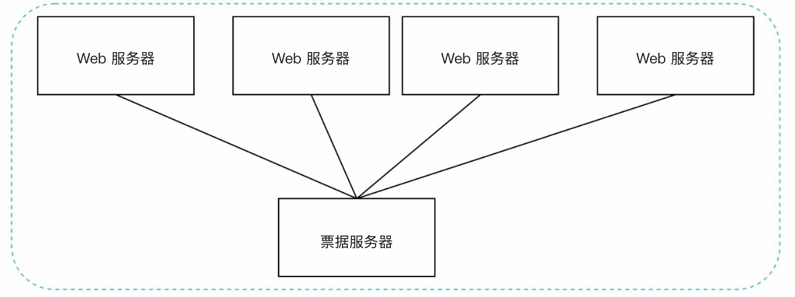
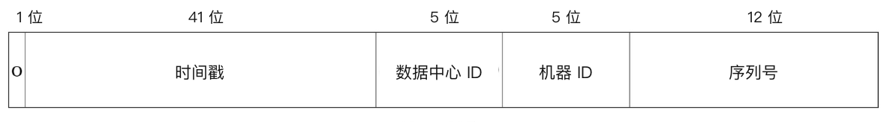
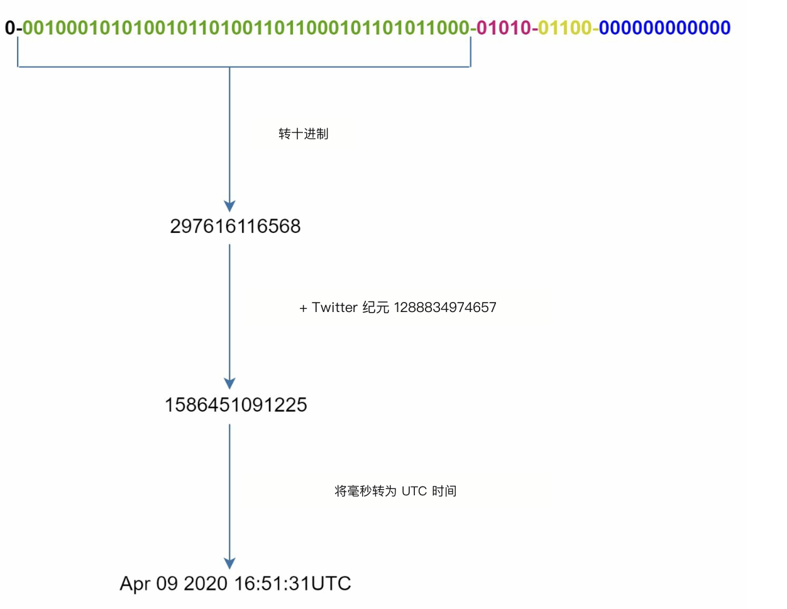

# 第 7 章：设计分布式唯一 ID 生成器

## 简介
本章讨论如何为分布式系统设计 **唯一 ID 生成器（unique ID generator）**。传统自增（auto-increment）主键在分布式环境里不好用，扩展和同步都难。目标是生成唯一、可按时间排序的 64 位数字 ID，并满足：
- ID 必须 **唯一**，并 **按日期有序**。
- ID 必须落在 **64 位** 以内。
- 系统应能每秒生成 **超过 10,000 个 ID**。

---

## 步骤 1：理解问题
### 基本需求
- ID 必须唯一、为数字，且不超过 64 位。
- ID 随时间递增，但不严格按 `+1`。
- ID 应按日期可排序。
- 系统必须支撑高吞吐（每秒 10,000 个 ID）。

---

## 步骤 2：高层设计方案
### 1. 多主复制
- **做法：** 用数据库 `auto_increment`，步长按服务器数递增（例如 k 台服务器用 `+k`）。

    

    
    

- **缺点：**
  - 跨数据中心（data center）难以扩展。
  - ID 并不总是随时间增大。
  - 增减服务器时扩展困难。

### 2. UUID
- **做法：** 
    - 各服务器用 UUID 独立生成 128 位唯一标识符。
    - UUID 可在各服务器上独立生成，彼此无需协调

        

        
        

- **优点：**
  - 服务器之间无需协调。
  - 很容易跟着 Web 服务器（web server）一起扩展。
- **缺点：**
  - 超过 64 位的要求。
  - ID 不能按时间排序，而且可能不是数字。

### 3. 票据服务器
- **做法：** 用一台集中式的票据服务器（ticket server）递增并分配 ID。

    

    
    

- **优点：**
  - 小规模系统实现简单。
  - 生成数字 ID。
- **缺点：**
  - 单点故障（SPOF）。
  - 多服务器部署时同步困难。

### 4. Twitter Snowflake 方案
- **做法：** 

    

      
    

    

      
    

    - 把 ID 拆成若干字段，以保证唯一性和可扩展性。
    - **符号位（1 位）：** 始终为 `0`，可用来区分有符号与无符号数。
    - **时间戳（41 位）：** 自自定义纪元（epoch）起的毫秒数（Twitter 默认是 `1288834974657`，即 2010 年 11 月 4 日 01:42:54 UTC）。保证 ID 按时间有序。
    - **数据中心 ID（5 位）：** 最多标识 `2^5 = 32` 个数据中心。
    - **机器 ID（5 位）：** 每个数据中心里最多标识 `2^5 = 32` 台机器。
    - **序列号（12 位）：** 记录同一毫秒内该机器生成的 ID，每毫秒最多 `2^12 = 4096` 个。序列号每毫秒重置为 `0`。

- **优点：**
    - **可扩展性：** 多台服务器合计可处理每秒 10,000+ 个 ID。
    - **时间有序：** 保证 ID 可按时间排序。
    - **去中心化：** 没有单点故障。

## 步骤 4：补充考虑
### 1. 时钟同步
- **挑战：** ID 生成假定各服务器时钟同步。
- **方案：** 用 **网络时间协议（NTP）** 减小漂移。

### 2. 字段长度调整
- 按用例调整各字段长度（例如少给序列号一些位，多给时间戳一些位）。

### 3. 高可用
- ID 生成器是关键路径，必须容错。
- 要考虑冗余和故障转移，以实现高可用（high availability）。
