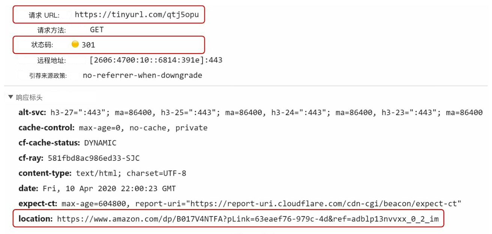
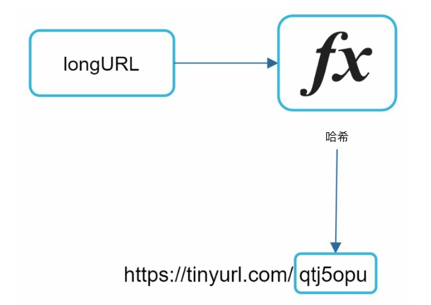
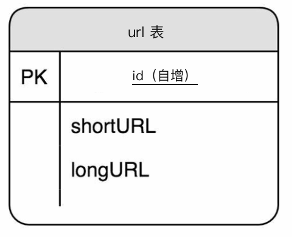
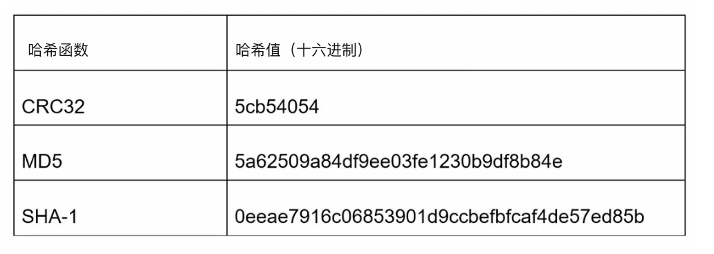
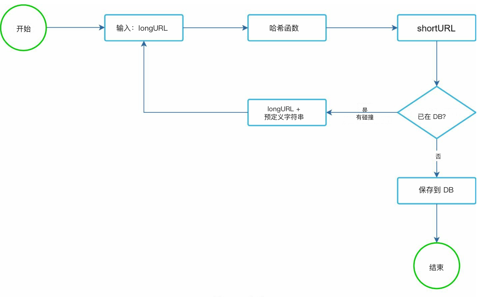
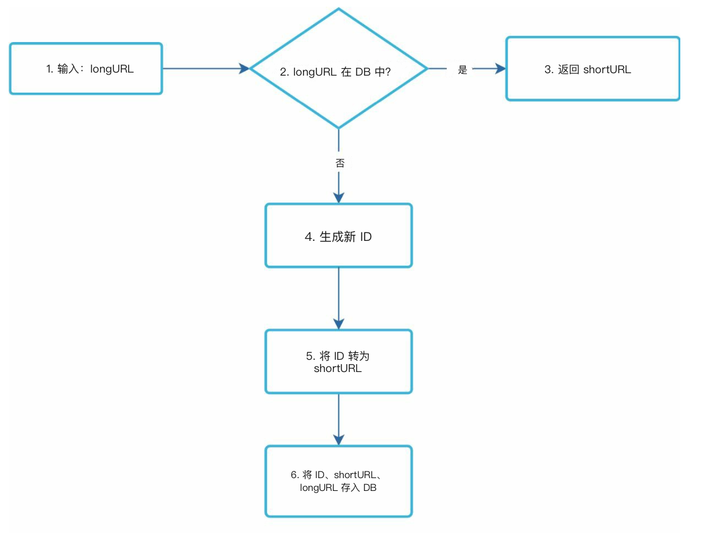
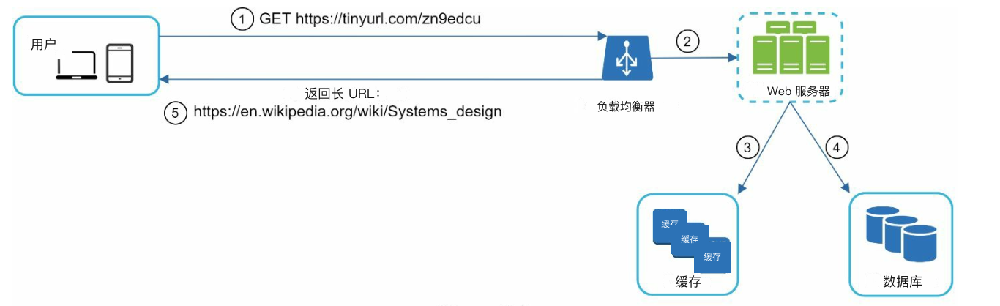

# 第 8 章：设计短链系统

## 简介
本章讨论如何设计 TinyURL 这类短链系统（URL shortener）。系统的主要目标包括 **URL 缩短（URL shortening）**、**重定向（redirecting）**，以及能扛住大流量的 **高可扩展性（high scalability）**。

### 需求
- 缩短后的 URL 必须 **唯一**，并尽可能 **短**。
- 每天处理 **1 亿次 URL 生成**，并支撑 10 年容量。
- 支持 **高效读操作**，读写比为 10:1。
- 10 年要存 3650 亿条记录，大约需要 **365 TB** 存储。

---

## 步骤 1：高层设计

### API 端点
1. **URL 缩短：**  
   - 端点：`POST api/v1/data/shorten`  
   - 参数：`{longUrl: longURLString}`  
   - 返回：`shortURL`

2. **URL 重定向：**  
   - 端点：`GET api/v1/shortUrl`  
   - 返回：用于重定向的 `longURL`。

    

    
    

### URL 重定向
- **301 重定向：** 301 表示请求的 URL 已「永久」迁移到长 URL。浏览器会缓存响应，之后对同一 URL 的请求不会再打到短链服务。
- **302 重定向：** 临时重定向；适合分析场景，例如统计点击。

### URL 缩短

    

- 用 **哈希函数（hash function）** 生成短 URL，把长 URL 映射成唯一的缩短版本。
- 哈希函数必须满足：
    - 每个 longURL 必须哈希成一个 hashValue。
    - 每个 hashValue 都能映射回 longURL。
    

---

## 步骤 2：深入设计

### 数据模型
把 `<shortURL, longURL>` 映射存在关系型数据库里，以节省内存。表结构包括：
- `id`（主键），
- `shortURL`，
- `longURL`。

    

### 哈希函数
#### 1. 62 进制转换：
- 用字符 `[0-9, a-z, A-Z]` 编码数字，共 **62 个可用字符**。
- 进制转换是短链系统常用的另一种做法。
- 可以给短 URL 分配唯一 id，再把 ID 转成 62 进制得到短 URL。
- 7 个字符的哈希最多支持 **3.5 万亿个唯一 URL**，足够覆盖 3650 亿个 URL。

**示例：**  
把 ID `2009215674938` 转成 62 进制：
- `2009215674938` → `zn9edcu`。

#### 2. 哈希 + 碰撞解决：
- 使用 CRC32、MD5 或 SHA-1 这类哈希函数。

    

- 一种做法是取哈希值的前 7 个字符；不过这种方法可能产生哈希碰撞。
- 为解决碰撞，可以递归追加预定义字符串直到不再碰撞，但开销可能很大。
- 用 **布隆过滤器（Bloom filter）** 高效查找来解决碰撞。

    

    
    

### 比较

-  **哈希 + 碰撞解决：**
    - 短 URL 长度固定
    - 不需要唯一 ID 生成器（unique ID generator）
    - 可能碰撞，需要解决
    - 无法找出下一个可用的短 URL，因为它不依赖 ID

- **62 进制转换**
    - 长度不固定，随 ID 变长
    - 需要唯一 ID 生成器
    - 不可能碰撞
    - 若 ID 每次加 1，容易找到下一个短 URL（可能带来安全隐患）

---

### 缩短流程

    

1. 检查数据库里是否已有 `longURL`。
2. 若有，返回已有的 `shortURL`。
3. 否则：
   - 用 **分布式 ID 生成器（distributed ID generator）** 生成唯一 ID。
   - 用 62 进制把 ID 转成 `shortURL`。
   - 把 `<id, shortURL, longURL>` 映射写入数据库。

---

### 重定向流程

    

1. 用户（user）点击 `shortURL`。
2. 查询 `<shortURL, longURL>` 映射：
   - 先查 **缓存（cache）** 以加快访问。
   - 缓存没有再查数据库。
3. 把用户重定向到 `longURL`。

---

## 补充考虑
### 限流器
- 按 IP 限制请求次数，用限流器（rate limiter）防止滥用。

### 可扩展性
1. **Web 层（web tier）：** 无状态（stateless），通过增减 Web 服务器（web server）扩展。
2. **数据库层：** 用复制（replication）和分片（sharding）。

### 分析
- 收集点击率、来源和时间戳等数据，用于业务洞察。

### 高可用与可靠性
- 用数据库复制和容错设计，保证服务一致、可靠，实现高可用（high availability）。
