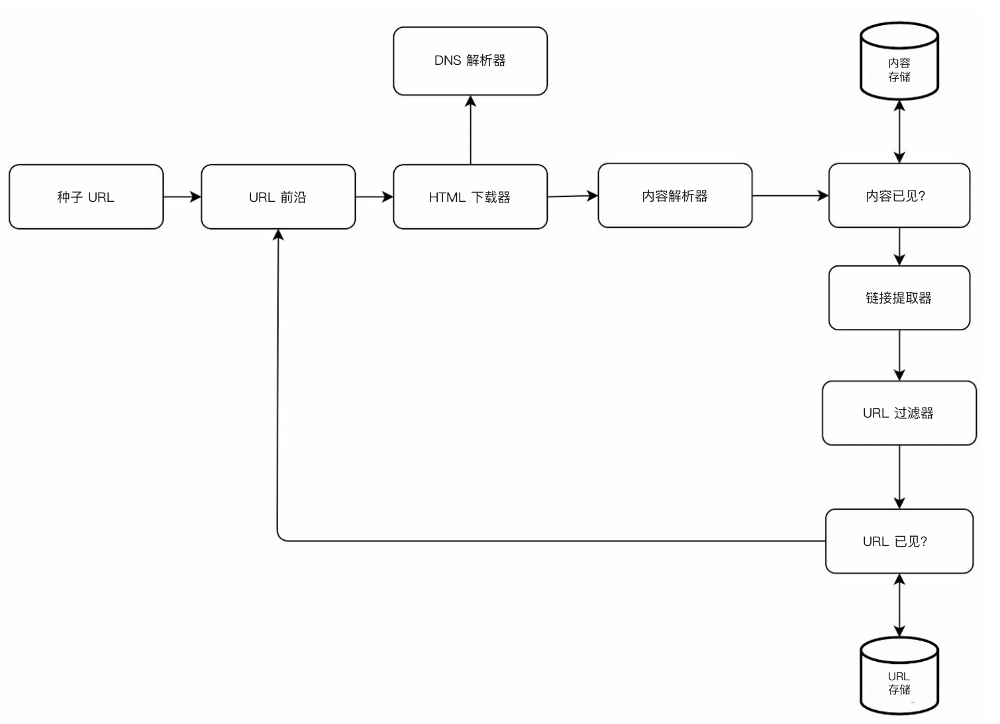
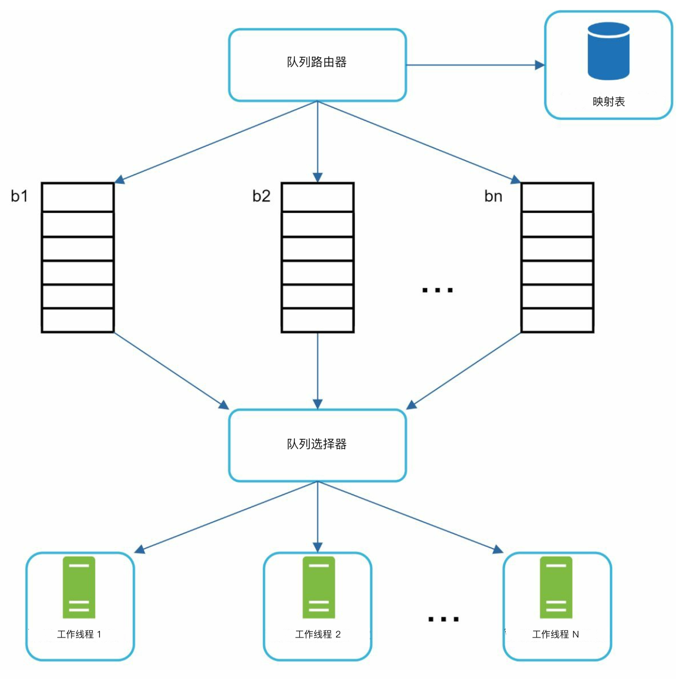
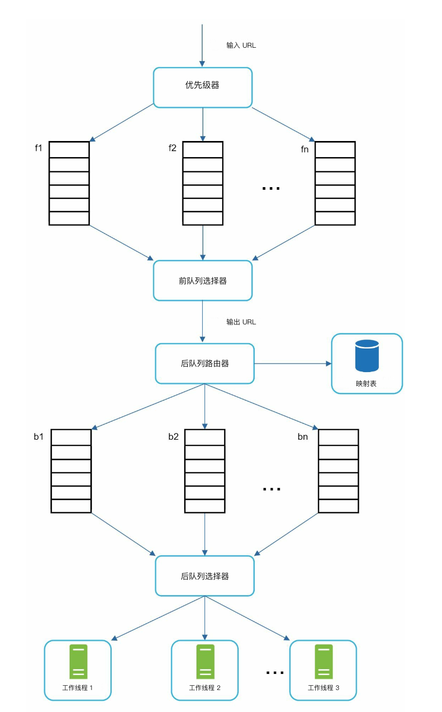
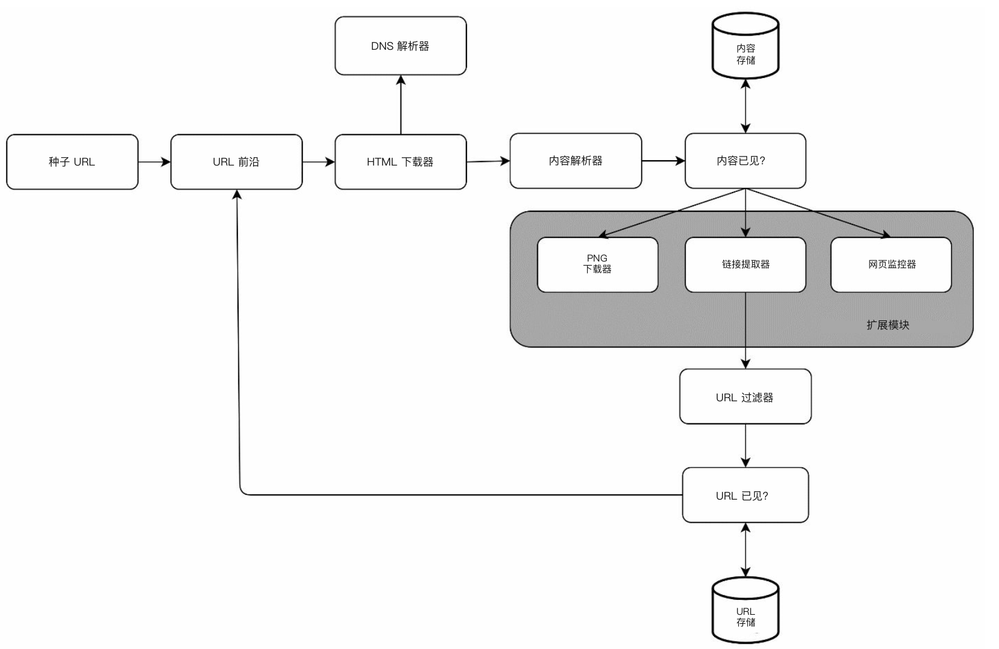

# 第 9 章：设计网络爬虫

## 简介
**网络爬虫（web crawler）** 也叫蜘蛛或机器人，用来发现并收集网页、图片、视频等内容。本章重点是为 **搜索引擎索引（search engine indexing）** 设计一套可扩展的网络爬虫。

### 爬虫的应用
1. **搜索引擎索引：** 收集网页以建立可搜索的索引（例如 Googlebot）。
2. **网页存档（web archiving）：** 为将来使用而保存网页数据（例如美国国会图书馆）。
3. **Web 挖掘（web mining）：** 从网页数据中抽取知识（例如对股东报告做财务分析）。
4. **网页监控（web monitoring）：** 检测版权或商标侵权。

### 设计挑战
一套好的网络爬虫必须解决：
- **可扩展性（scalability）：** 通过并行化处理数十亿页面。
- **健壮性（robustness）：** 应对糟糕的 HTML、崩溃和恶意链接。
- **礼貌性（politeness）：** 避免用过多请求压垮服务器。
- **可扩展性（extensibility）：** 以尽量少的改动支持新内容类型。

---

## 步骤 1：理解问题

### 需求
1. 每月爬取 **10 亿个网页**（400 页/秒，峰值 800 QPS）。
2. 只收集 **HTML 内容**。
3. 跟踪新页面和已更新页面。
4. 忽略重复内容。
5. 爬取的数据保存 **5 年**，大约需要 30 PB 存储。

---

## 步骤 2：高层设计

### 组件

1. **种子 URL（seed URLs）：** 爬虫的起点。
    - 需要精心挑选，作为爬虫能顺着链接走得尽量远的好起点。
    - 可以按地域（不同热门网站）或按主题选取。
    - 策略：按地域或主题分类（例如体育、医疗）。

2. **URL 前沿（URL frontier）：** 存放待下载的 URL。
   - 实现为 **FIFO 队列（queue）**。

3. **HTML 下载器（HTML Downloader）：** 从 URL 前沿拿到 URL 并下载网页。

4. **DNS 解析器（DNS Resolver）：** 把 URL 转成 IP 地址。

5. **内容解析器（content parser）：** 校验并解析网页。
   - 丢弃格式错误的页面。

6. **内容已见？（content seen?）：** 用哈希比较检测重复内容（比较两个网页的哈希值）。

7. **内容存储（content storage）：** 把 HTML 页面存到磁盘（热门内容放内存以降低延迟）。

8. **URL 提取器（URL extractor）：** 从解析后的页面里抽出新链接。

9. **URL 过滤器（URL filter）：** 排除黑名单或错误的 URL。

10. **URL 已见？（URL seen?）** 跟踪已访问 URL，避免重复。

11. **URL 存储（URL storage）：** 存放已经访问过的 URL。

---

### 工作流程
1. 把 **种子 URL** 加入 URL 前沿。
2. **HTML 下载器** 取出 URL，经 DNS 解析器解析 IP。
3. **内容解析器** 校验内容，交给「内容已见？」组件。
4. 如果内容是新的，经 **URL 提取器** 抽出链接。
5. 过滤后，把尚未见过的链接加入 URL 前沿。

---

## 步骤 3：深入关键组件
### DFS/BFS
-  可以把 Web 看成有向图：网页是节点，超链接（URL）是边。
-  图遍历通常用 BFS，因为深度可能非常深，DFS 并不合适。
-  标准 BFS 不考虑 URL 的优先级（priority）；并非每个页面的质量和重要性都一样。

### URL 前沿
- **礼貌性：** 
    - 保证同一时刻每个主机只有一个请求。两次下载任务之间加延迟。
    - 用主机名到队列和工作（下载）线程（worker thread）的映射。
    - 每个下载线程有自己的 FIFO 队列，只从该队列下载 URL。

        

    - **队列路由器（queue router）：** 保证每个队列（b1, b2, … bn）只包含同一主机的 URL。
    - **映射表（mapping table）：** 把每个主机映射到一个队列。
    - **队列选择器（queue selector）：** 每个工作线程映射到一个 FIFO 队列，只从该队列下载 URL。队列选择逻辑由队列选择器完成。
    - **工作线程 1 到 N。** 工作线程按顺序从同一主机下载网页。两次下载任务之间可以加延迟。

- **优先级：** 
    - 给重要页面更高优先级（例如按 PageRank 或更新频率）。

        
    
    - **优先级器（prioritizer）：** 接收 URL 并计算优先级。
    - **队列 f1 到 fn：** 每个队列有指定优先级。高优先级队列被选中的概率更高。
    - **队列选择器：** 带偏向地随机选择队列，偏向高优先级队列。
    - **前队列（front queues）：** 管理优先级
    - **后队列（back queues）：** 管理礼貌性

- **新鲜度（freshness）：** 根据更新历史或重要性重新爬取。

### HTML 下载器
- **遵守 robots.txt：** 遵守 robots.txt 中的规则。
- **性能优化：**
  1. 用多台服务器做分布式爬取。
  2. 用 **DNS 缓存（cache）** 避免重复查找。
  3. 把爬取服务器按地理位置分布，加快下载。
  4. 用较短超时，避开慢或无响应的服务器。

### 健壮性
1. **一致性哈希（consistent hashing）：** 有效地把负载分到各服务器。
2. **错误处理：** 防止异常把系统打挂。
3. **数据校验：** 保证内容完整性。

### 可扩展性
- 为新内容类型加模块（例如 PNG 下载器、网页监控器）。
- 示例：插入一个模块，监控网页内容是否侵犯版权。

    
---

### 避开有问题的内容
1. **重复内容：** 用哈希比较检测。
2. **蜘蛛陷阱（spider traps）：** 用限制 URL 长度等方法避免无限循环。
3. **数据噪声：** 过滤广告、垃圾等无关内容。

---

## 步骤 4：收尾
### 要点
1. 网络爬虫必须兼顾可扩展性、健壮性、礼貌性和可扩展性。
2. **礼貌性** 避免压垮服务器，而 **优先级** 保证先爬重要页面。
3. 高效存储和错误处理对大规模爬取至关重要。

### 补充考虑
- **服务端渲染（server-side rendering）：** 处理 JavaScript 或 AJAX 生成的动态内容。
- **反垃圾措施：** 排除低质量或无关页面。
- **数据库分片：** 用复制（replication）和分片（sharding）扩展数据层（data tier）。
- **水平扩展（horizontal scaling）：** 用无状态（stateless）服务器高效扩展爬取任务。
- **分析：** 收集并分析数据以获得洞察。
