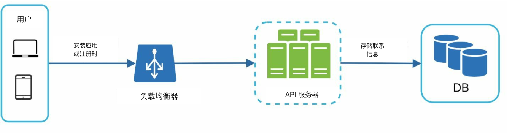
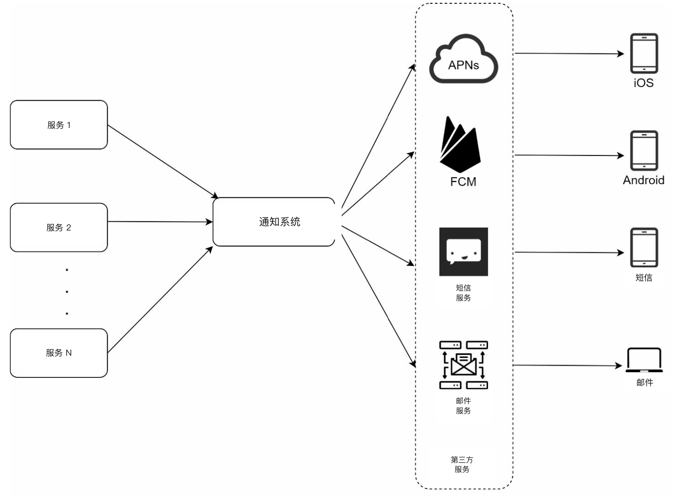
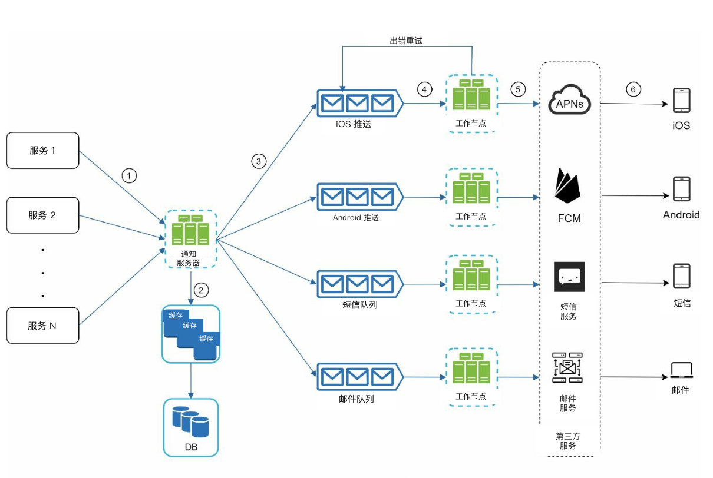
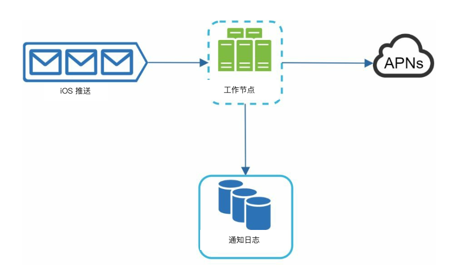
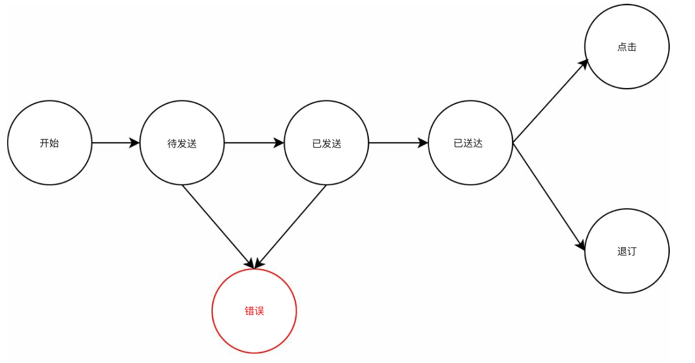
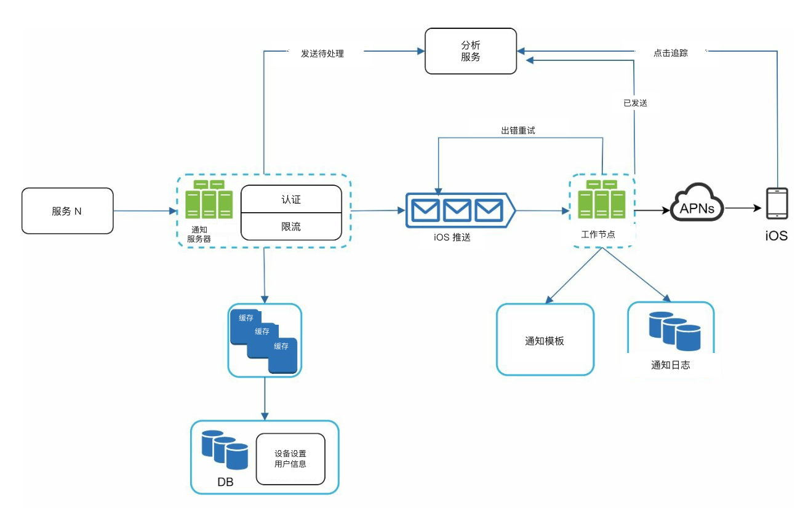

# 第 10 章：设计通知系统

## 简介
**通知系统（notification system）** 对现代应用至关重要，用来及时送达产品通知、活动、优惠和告警。通知可以通过以下渠道发送：
1. **推送通知（push notifications）**（移动端或桌面），
2. **短信（SMS）**，以及
3. **邮件（email）**。

本章重点是设计一套可扩展的系统，每天能够发送数百万条通知。

---

## 步骤 1：理解问题
### 需求
- **通知类型：** 推送通知、短信和邮件。
- **投递：** 软实时系统，延迟尽量小。
- **平台：** iOS、Android 和桌面。
- **触发：** 通知可以由客户端（client）应用触发，也可以在服务器上定时发送。
- **规模：**
  - **推送通知：** 1000 万条/天，
  - **短信：** 100 万条/天，
  - **邮件：** 500 万条/天。
- **支持退订：** 用户（user）可以关闭特定类型的通知。

---

## 步骤 2：高层设计

### 组件

1. **通知类型：**
   - **iOS 推送通知：** 使用 **Apple Push Notification Service (APNS)**。
   - **Android 推送通知：** 使用 **Firebase Cloud Messaging (FCM)**。
   - **短信：** Twilio 或 Nexmo 等第三方服务。
   - **邮件：** SendGrid 或 Mailchimp 等商业邮件服务。

2. **收集联系信息：**
   

      
   

   - 在安装应用或注册时收集设备令牌、电话号码或邮箱地址。
   - 把联系信息存进数据库：
     - **设备令牌表：** 用于推送通知。
     - **用户表：** 用于邮件和电话号码。

3. **通知发送流程：**

   

      
   

   - **触发服务：**
      - 产生事件以发起通知（例如账单提醒、物流更新）。
      - 服务可以是微服务、cron 任务，或触发通知发送事件的分布式系统。
   - **通知服务器：** 
      - 为各服务提供发送通知的 API。 
      - 做基本校验，验证邮箱、电话号码。
      - 查询数据库或缓存（cache），拿到渲染通知所需的数据。
   - **第三方服务：** 把通知投递给用户。

     

### 初版设计的问题
- **单点故障（SPOF）：** 一台通知服务器崩溃会拖垮整个系统。
- **可扩展性问题：** 数据库、缓存和处理组件很难独立扩展。
- **性能瓶颈：** 发送通知对资源要求很高。

### 改进后的设计

   

      
   

- 把数据库和缓存从通知服务器里拆出去。
- 用多台通知服务器做 **水平扩展（horizontal scaling）**。
- 用 **消息队列（message queue）** 解耦系统组件。
   -  要发出大量通知时，消息队列充当缓冲。
- 加入工作节点（workers），从消息队列拉取通知事件，再发给对应的第三方服务。

   

---

## 步骤 3：深入设计

### 可靠性
1. **防止数据丢失：** 
   

   
   

   - 把通知数据持久化到数据库，并实现重试机制。 
   - 加入通知日志数据库，用于持久化。

2. **去重：** 
   - 检查事件 ID，避免发送重复通知。
   - 通知事件第一次到达时，用事件 ID 判断是否见过。
见过就丢弃，否则发出通知。 

### 额外组件
   

   
   

1. **通知模板：** 预格式化模板，保证通知风格一致、发送高效。
2. **通知设置：**
   - 用户可以对特定渠道（推送、短信或邮件）选择加入或退出。
   - 存在专用的通知设置表里。
3. **限流（rate limiting）：** 限制发给用户的通知频率。
4. **重试机制：** 第三方服务失败时重试发送。
5. **监控队列：** 跟踪排队中的通知，动态扩展工作节点。
6. **事件追踪：** 收集打开率、点击率和参与度等指标。

### 安全
- 用 **AppKey** 和 **AppSecret** 鉴权并保护推送通知的 API。

### 通知流程

   

   
   

1. 触发服务调用 API 发送通知。
2. 通知服务器校验请求，从缓存或数据库取元数据（metadata）。
3. 通知事件写入消息队列。
4. 工作节点处理事件，并与第三方服务交互。
5. 第三方服务把通知投递给用户。

---

## 关键优化
1. **水平扩展：** 增加通知服务器以分摊负载。
2. **消息队列：** 解耦处理，扛住高流量。
3. **缓存：** 缓存常访问数据以降低延迟。
4. **分布式投递：** 按地域优化消息投递，以提升性能。
