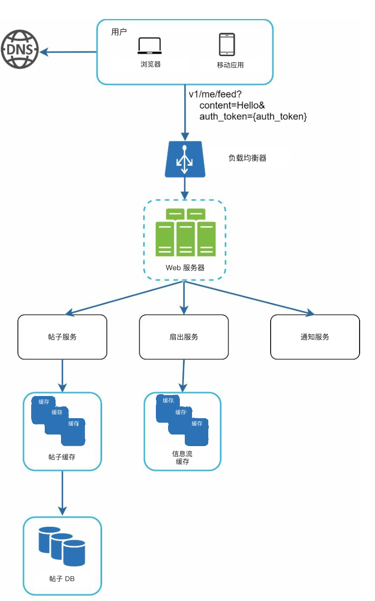
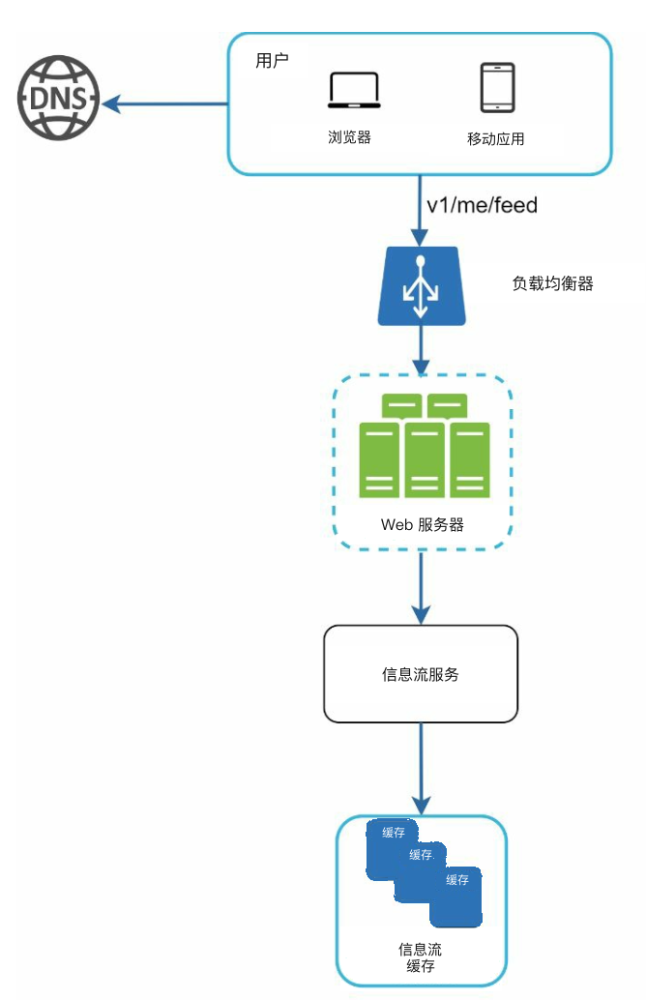
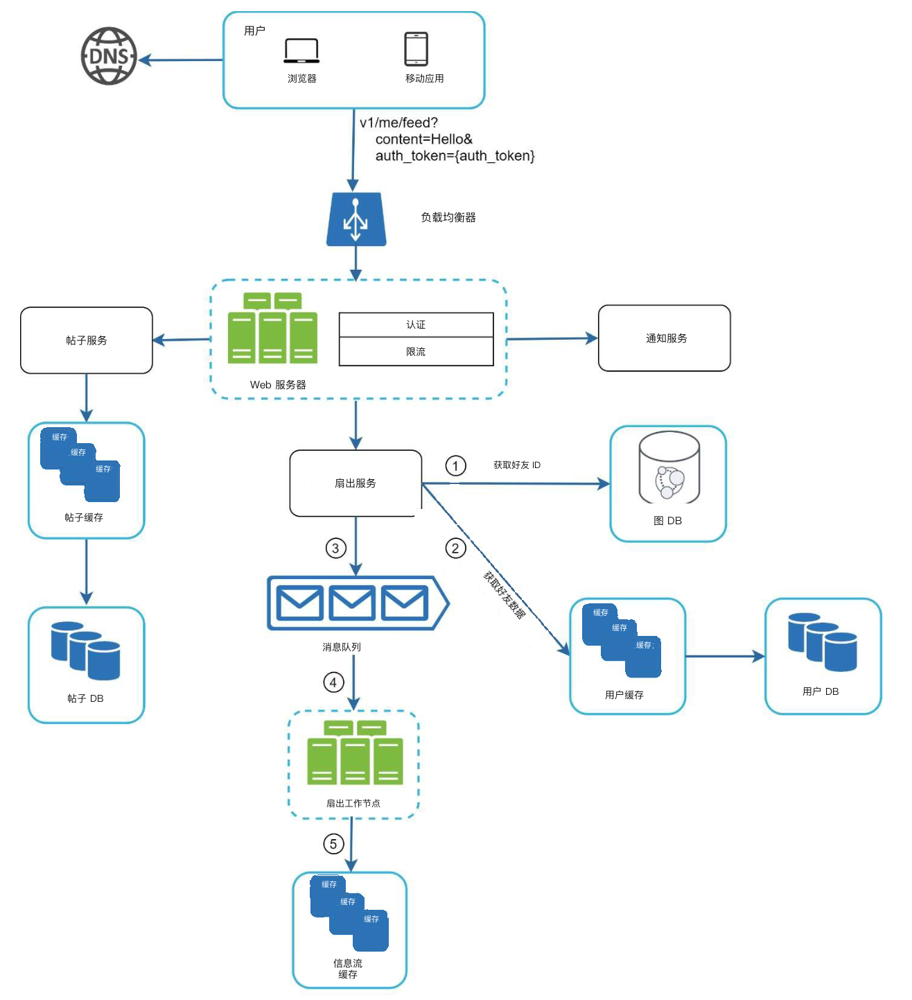
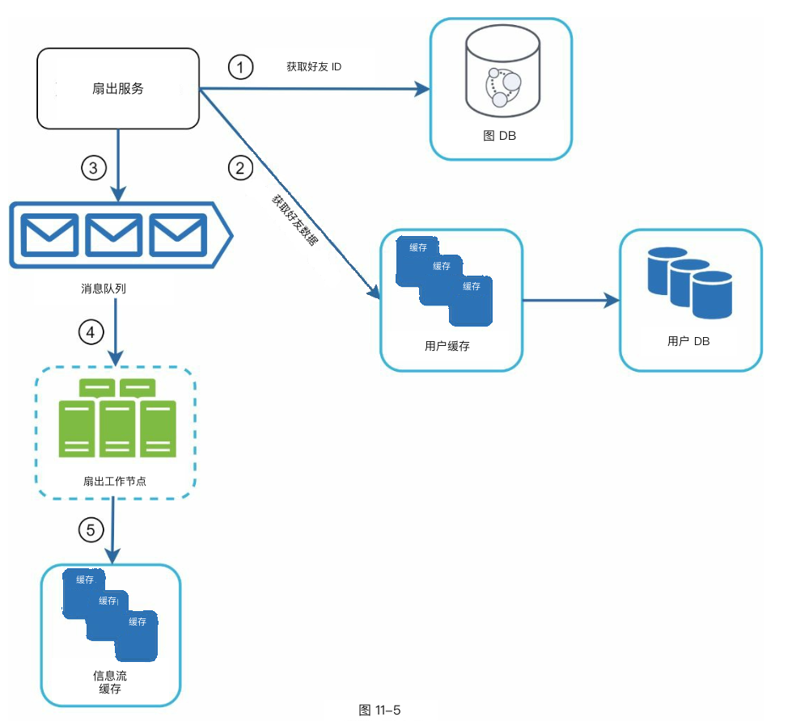
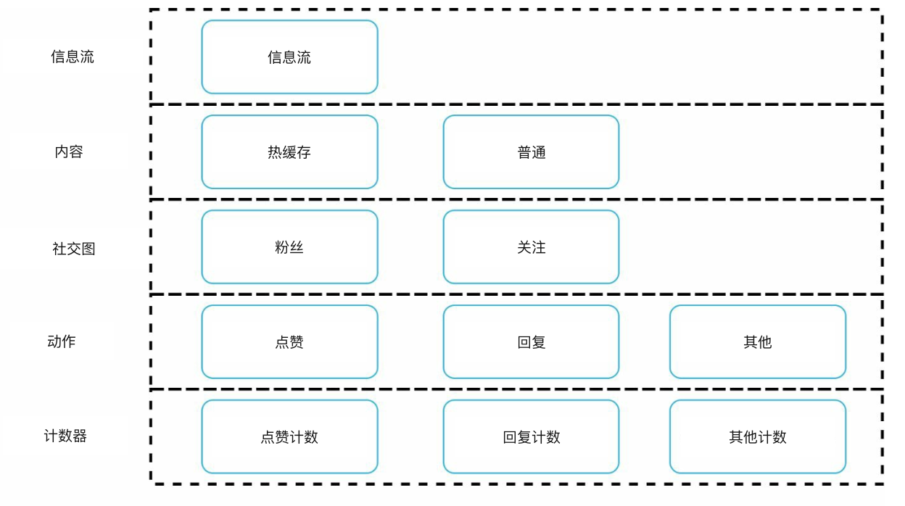

# 第 11 章：设计信息流系统

## 简介
**信息流（news feed）系统** 展示来自用户（user）社交关系的、不断更新的帖子列表（状态更新、照片、视频和链接）。例如 Facebook 的信息流、Instagram 的信息流，以及 Twitter 的时间线。本章讨论如何设计一套可扩展的信息流系统。

---

## 步骤 1：理解问题

### 需求
1. **平台：** 系统同时支持 Web 和移动应用。
2. **功能：**
   - 用户可以发布帖子。
   - 用户可以在信息流中查看好友的帖子。
3. **排序：** 为简化起见，信息流按**时间倒序**排列。
4. **规模：**
   - 用户最多可以有 5000 个好友。
   - 日活用户（DAU）1000 万。
   - 信息流可包含文本、图片和视频。

---

## 步骤 2：高层设计

### 概览
设计包含两条主流程：
1. **信息流发布：** 用户发布帖子，写入数据库并传播到好友的信息流。
2. **信息流构建：** 用户读取信息流时，按时间倒序聚合好友的帖子。

---

### 信息流 API
1. **信息流发布 API：**
   - **端点：** `POST /v1/me/feed`
   - **参数：** `content`（帖子文本）和 `auth_token`（鉴权）。

2. **信息流读取 API：**
   - **端点：** `GET /v1/me/feed`
   - **参数：** `auth_token`（鉴权）。

---

### 信息流发布

   

      
   

1. **用户交互：** 用户通过信息流发布 API 发帖。
2. **负载均衡器（load balancer）：** 把流量分到 Web 服务器（web server）。
3. **Web 服务器：** 鉴权请求并转发到各服务。
4. **帖子服务：** 把帖子写入数据库和缓存（cache）。
5. **扇出（fanout）服务：** 把帖子推送到好友信息流的缓存里。
6. **通知服务：** 向好友发送通知（notification）。

---

### 信息流构建

   

      
   

1. **用户交互：** 用户通过读取 API 请求自己的信息流。
2. **负载均衡器：** 把流量分到 Web 服务器。
3. **Web 服务器：** 把请求转发到信息流服务。
4. **信息流服务：** 从信息流缓存取出帖子 ID，再从数据库或缓存拉取完整帖子详情。

   
---

## 步骤 3：深入设计

### 发布流程深挖
1. **Web 服务器：**
   - 用 `auth_token` 鉴权用户。
   - 做限流（rate limiting）以防垃圾内容。

2. **扇出服务：**
   - **写时扇出：** 写的时候把帖子推到好友信息流。
     - **优点：** 实时更新，读信息流快。
     - **缺点：** 好友很多的用户会很吃资源。
   - **读时扇出：** 读的时候再拉帖子。
     - **优点：** 对不活跃用户更省。
     - **缺点：** 读信息流更慢。
   - **混合方案：** 大多数用户用推模型，高连接数用户（例如名人）用拉模型。

        

    **扇出服务** 的工作方式如下：

    1. **获取好友 ID：** 从图数据库取出好友列表。
    2. **按缓存过滤好友：** 读缓存里的用户设置，排除一部分好友（例如已静音，或按选择性分享偏好）。
    3. **写入消息队列：** 把过滤后的好友列表和新帖子 ID 发到消息队列（message queue）处理。
    4. **扇出工作节点：** 工作节点（workers）从消息队列取数据，更新信息流缓存。缓存存 `<post_id, user_id>` 映射，而不是完整的用户和帖子对象，以节省内存。
    5. **写入信息流缓存：** 把新帖子 ID 追加到好友的信息流缓存。可配置上限，只保留最近的帖子——大多数用户只看最新内容，这样缓存内存也好控。

        

## 读取流程深挖

### 缓存架构
缓存分成五层：
1. **信息流缓存：** 存帖子 ID，便于快速读取。
2. **内容缓存：** 存帖子详情（热门帖子放热缓存）。
3. **社交图缓存：** 存用户关系数据。
4. **动作缓存：** 跟踪用户动作（点赞、回复、分享）。
5. **计数缓存：** 维护点赞、回复、粉丝等计数。

    
---

## 关键优化

### 扩展
1. **数据库扩展：**
   - 水平扩展（horizontal scaling）和分片（sharding）。
   - 高流量查询用读副本（replica）。
2. **无状态（stateless）Web 层（web tier）：** 保持 Web 服务器无状态，以便水平扩展。

### 缓存
1. 把常访问数据放进内存。
2. 用缓存层降低延迟和数据库负载。

### 可靠性
1. **一致性哈希（consistent hashing）：** 把请求均匀分到各服务器。
2. **消息队列：** 解耦系统组件并缓冲流量。

### 监控
1. 跟踪 QPS（每秒查询数）和延迟等关键指标。
2. 监控缓存命中率，并据此调整配置。
