# 第 12 章：设计聊天系统

## 简介
**聊天系统** 支持用户（user）之间的实时消息。本章重点设计一款聊天应用，包含：
- **一对一聊天**
- **群聊（最多 100 人）**
- **在线状态（presence）指示**
- **多设备支持**
- **推送通知（notification）**

系统面向 **5000 万日活用户（DAU）**，并永久保存聊天记录。

---

## 步骤 1：理解问题

### 需求
1. **功能：**
   - 一对一聊天和群聊（最多 100 人）。
   - 文本消息（最长 100,000 个字符）。
   - 在线/离线指示。
   - 支持多设备。
   - 推送通知。
2. **规模：** 按 5000 万 DAU 设计。
3. **存储：** 永久保存聊天记录。

---

## 步骤 2：高层设计

### 通信协议
1. **发送方：** 用 HTTP 发消息，利用持久连接提高效率。

      

      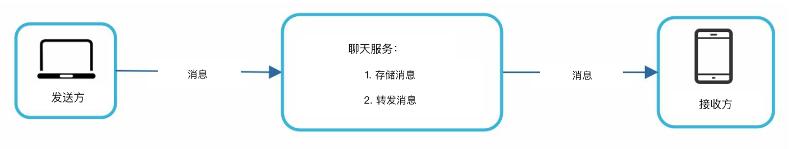    
      

2. **接收方：**
   - **轮询（polling）：**
      - 客户端（client）定期向服务器询问是否有消息。
      - 频繁、重复的请求效率很低。

         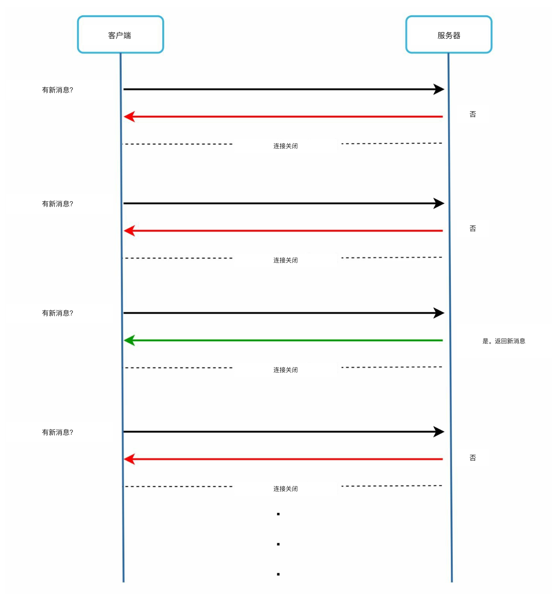    

   - **长轮询（long polling）：** 
      - 连接一直开着，直到有消息到达。 
      - 对不活跃用户效率低。

         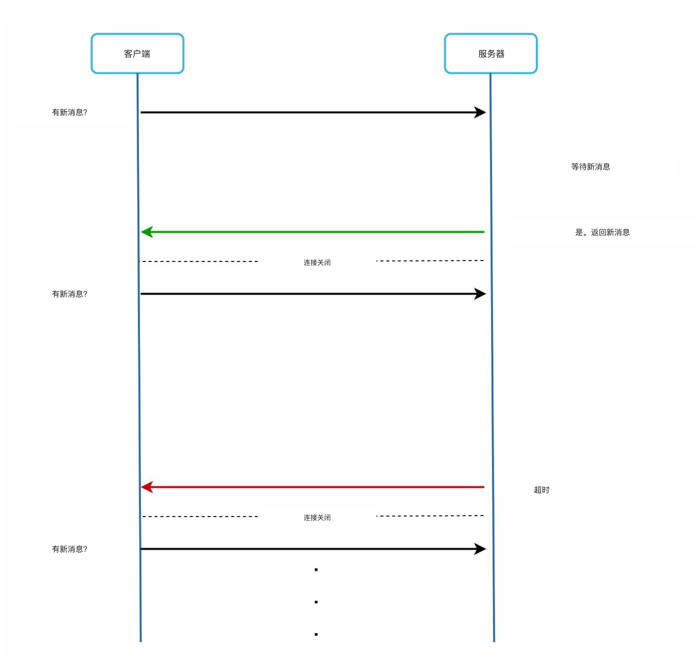

   - **WebSocket：** 
      - 双向持久连接，用于实时通信；收发消息都选用它。
      - 用 WebSocket（ws）协议收发消息。

         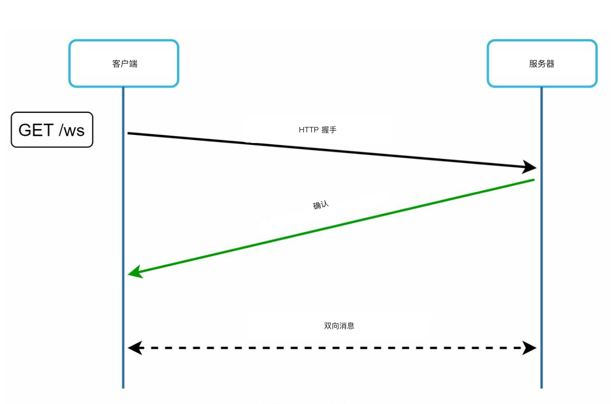    
   
---

### 组件

   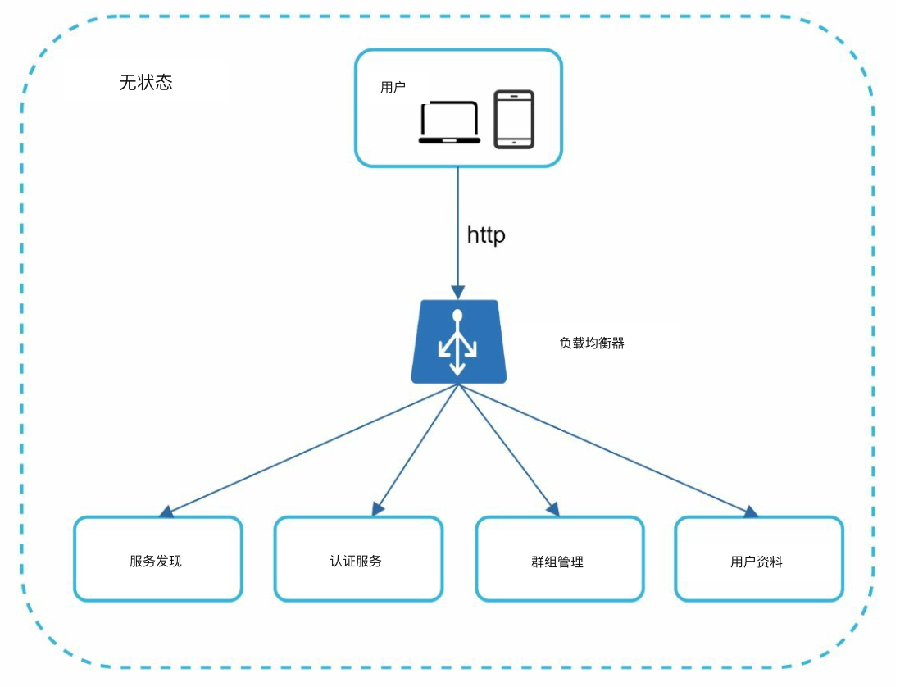    
   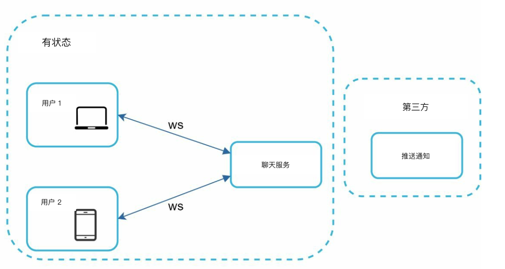

1. **无状态（stateless）服务：**
   - 处理注册、登录和用户资料。
   - 与服务发现（service discovery）集成，推荐最合适的聊天服务器。
2. **有状态（stateful）服务：**
   - 聊天服务器维护持久 WebSocket 连接。
   - 负责消息投递和同步。
3. **第三方集成：**
   - 推送通知服务在有新消息时通知用户。
   - 通知实现参见通知系统一章。

---
### 设计

客户端与聊天服务器保持持久 WebSocket 连接，用于实时消息。

      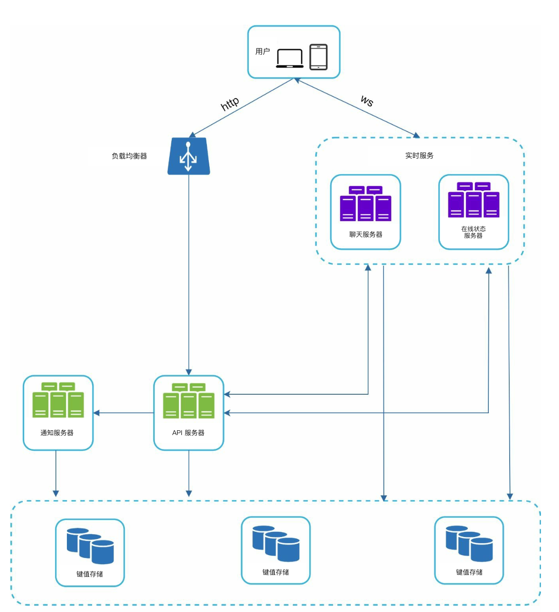 

- 聊天服务器负责收发消息。
- 在线状态服务器管理在线/离线状态。
- API 服务器（API servers）处理登录、注册、修改资料等。
- 通知服务器发送推送通知。
- 最后用键值存储（key-value store）保存聊天记录。用键值存储做聊天记录库，原因如下：
   - 容易水平扩展（horizontal scaling）。
   - 键值存储访问延迟很低。
   - 关系型数据库不太擅长长尾数据。索引变大后，随机访问很贵。
   - 成熟可靠的聊天应用也在用键值存储。例如 Facebook Messenger 和 Discord。

以下是一对一聊天和群聊的数据模型。
   - 主键是 message_id，用来决定消息顺序。
   - 群聊的复合主键是 (channel_id, message_id)。 
      - ID 可以用 Snowflake 这类全局 64 位序列号生成器生成。
      - 更好的做法是用局部序列号生成器。局部意味着 ID 只在一个群内唯一。
      - 局部 ID 够用，是因为只要在一对一频道或群频道内维护消息顺序即可。 
      
         
         

## 步骤 3：深入设计

### 服务发现

   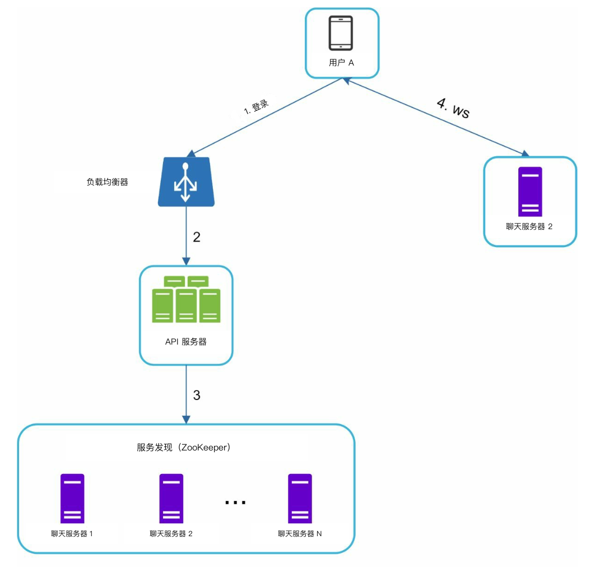   

- 服务发现的主要职责是按地理位置、服务器容量等条件，给客户端推荐最合适的聊天服务器。 
- 用 **Apache ZooKeeper** 按地理位置和服务器容量分配聊天服务器。
- 保证负载分布高效，并尽量降低延迟。

### 消息流
#### 一对一聊天

1. 用户 A 把消息发给聊天服务器 1。
2. 聊天服务器 1 分配唯一消息 ID，并把消息写入键值存储。
3. 若用户 B 在线，消息转发到聊天服务器 2，并保持持久 WebSocket 连接。
4. 若用户 B 离线，则发送推送通知。

#### 群聊

   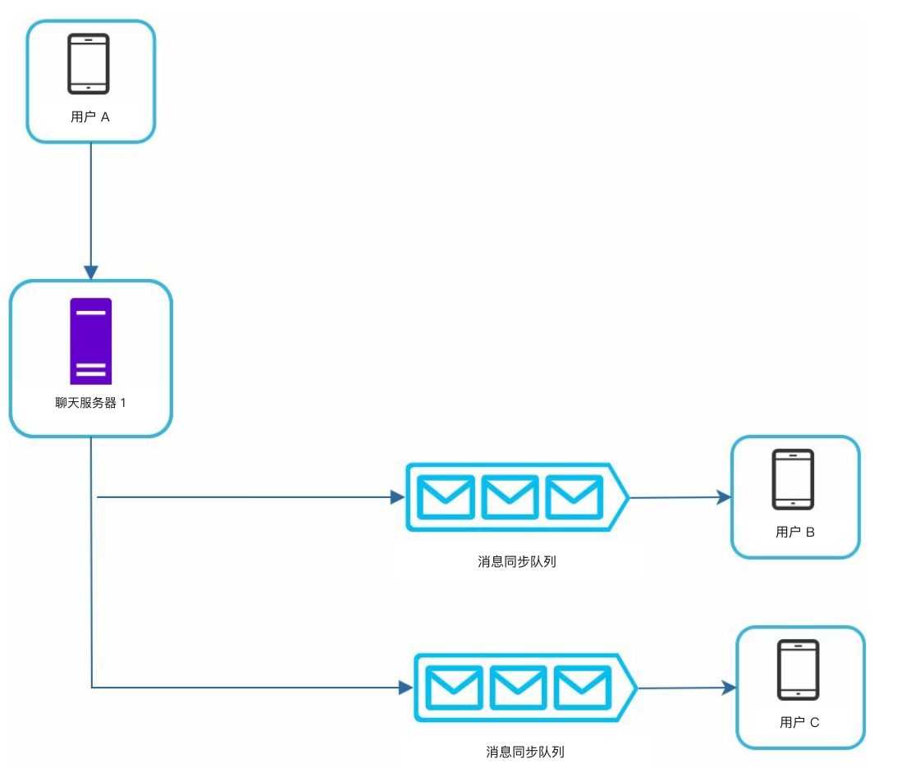  

- 消息会复制到群里每个接收者各自的收件箱。
- 同步更简单，但群变大后成本会升高。
- 接收侧，一个接收者会收到多个用户的消息。每个接收者有一个收件箱（消息同步队列），里面是来自不同发送者的消息。

---

#### 消息同步

很多用户有多台设备，需要把消息同步到各设备。
每台设备维护变量 `cur_max_message_id`，记录该设备上最新的消息 ID。同时满足以下两个条件的消息视为新消息：

   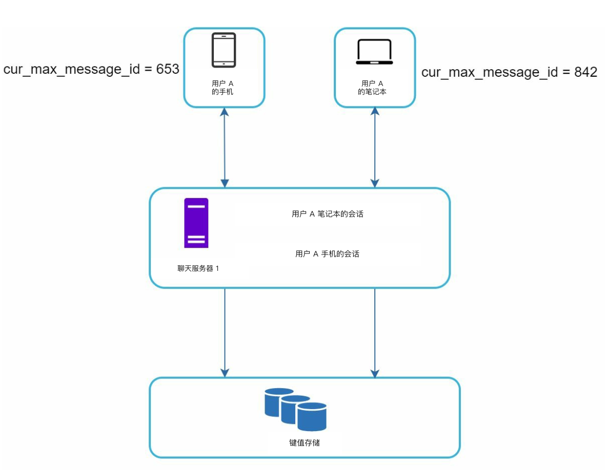  

- 接收者 ID 等于当前登录用户 ID。
- 键值存储里的消息 ID 大于 cur_max_message_id

---

### 在线状态
1. **心跳（heartbeat）机制：** 
   

      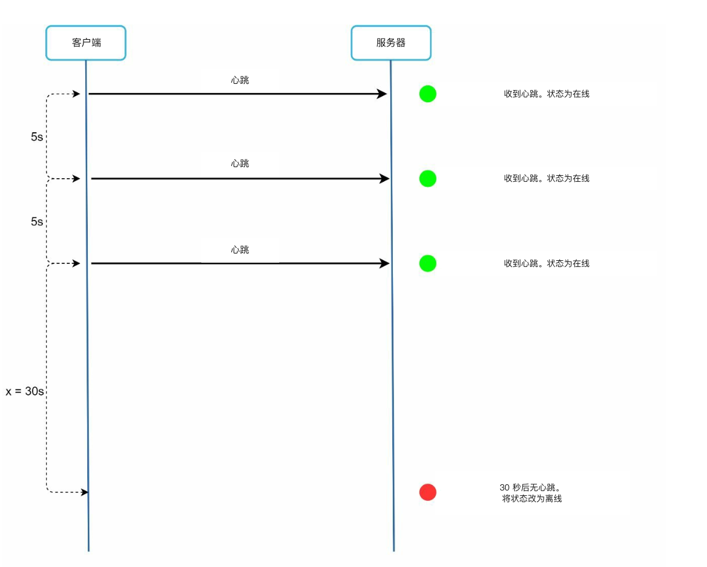 
   

   
   - 客户端定期向在线状态服务器发心跳，表明自己在线。 
   - 若在阈值内（例如 x = 30）没收到心跳，就把用户标为离线。

     

2. **扇出（fanout）模型：** 

   

      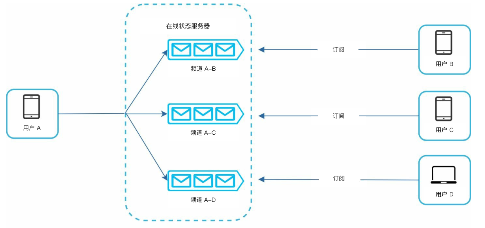 
   

   - 用发布-订阅模型把在线状态更新推给好友；每对好友维护一个频道。
   - 用户 A 的在线状态变化时，把事件发布到三个频道：频道 A-B、A-C 和 A-D。 
   - 这三个频道分别由用户 B、C、D 订阅，从而拿到在线状态更新。
   - 上述设计适合小规模用户群。

---

## 补充考虑
### 可扩展性
- **水平扩展：** 用户增多时加服务器。
- **负载均衡：** 用负载均衡器（load balancer）把流量均匀分到各服务器。
- **缓存（cache）：** 降低数据库负载并改善延迟。

### 错误处理
- **重试机制：** 消息投递失败时用重试和排队处理。
- **服务器故障：** 用服务发现在故障时分配新服务器。

### 后续扩展
1. **媒体支持：** 增加照片和视频处理，包括压缩和云存储。
2. **端到端加密：** 保证消息隐私。
3. **客户端缓存：** 减少数据传输，提升性能。
4. **缩短加载时间：** 使用地理分布式缓存网络。
