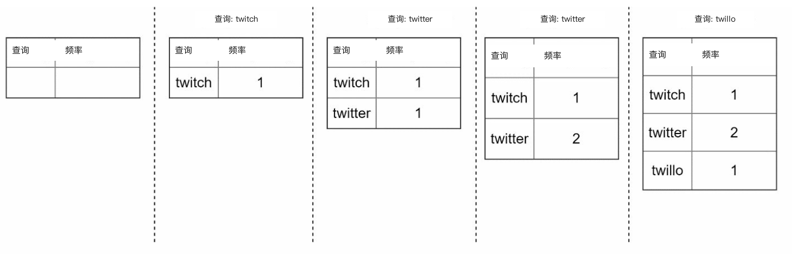
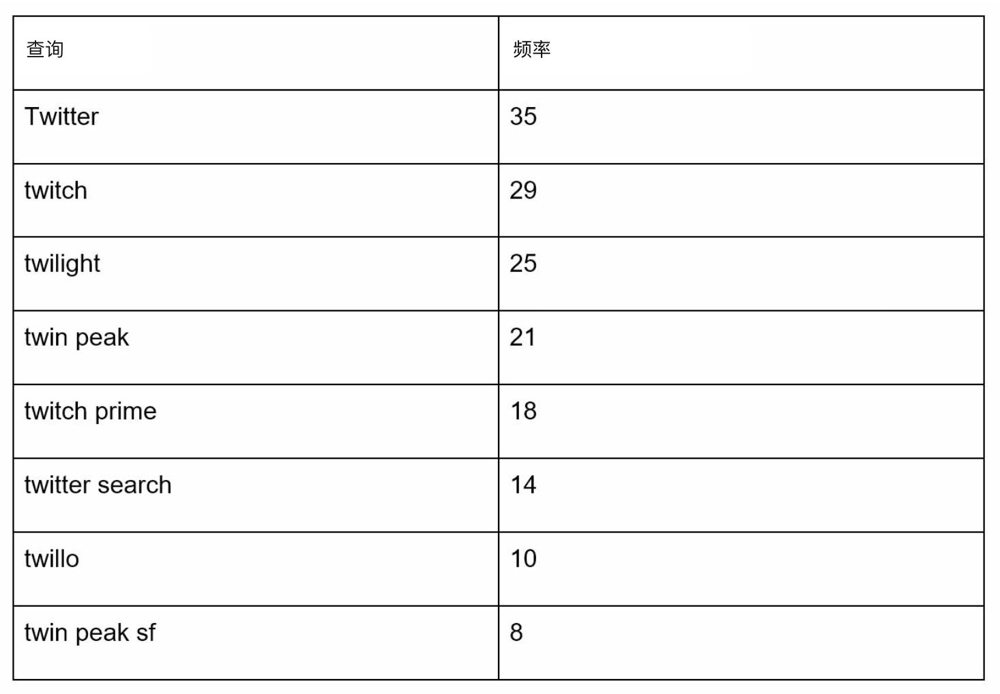
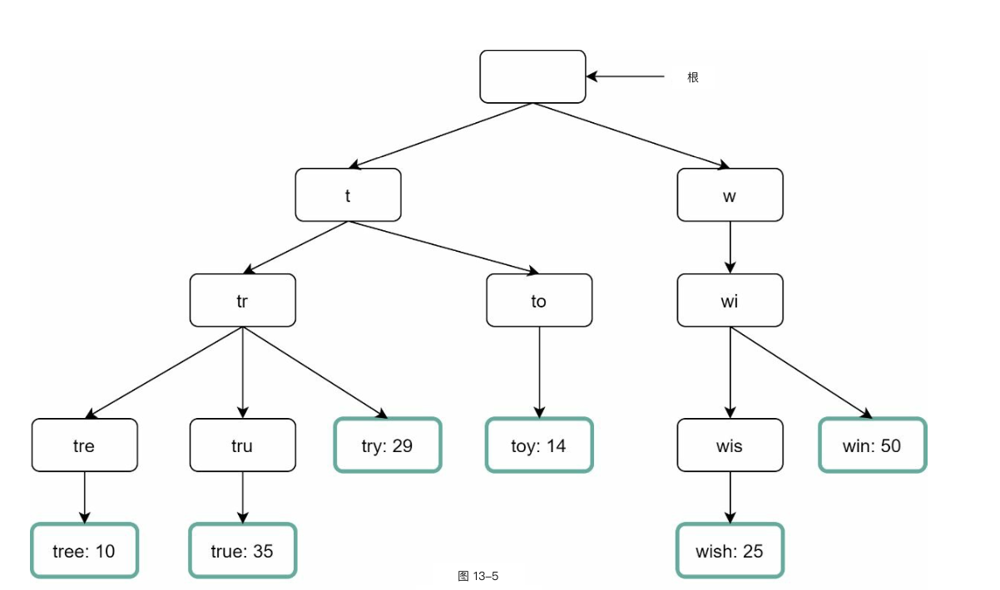
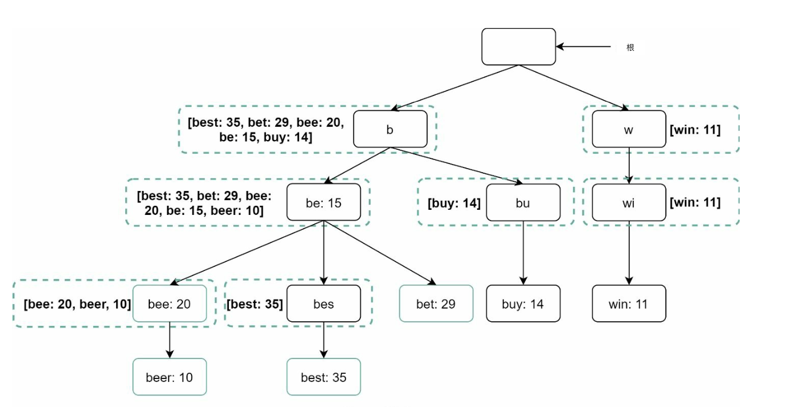
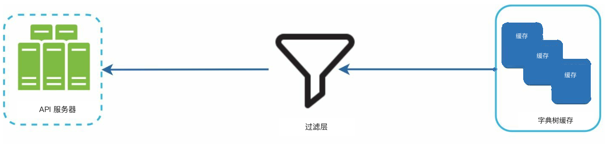
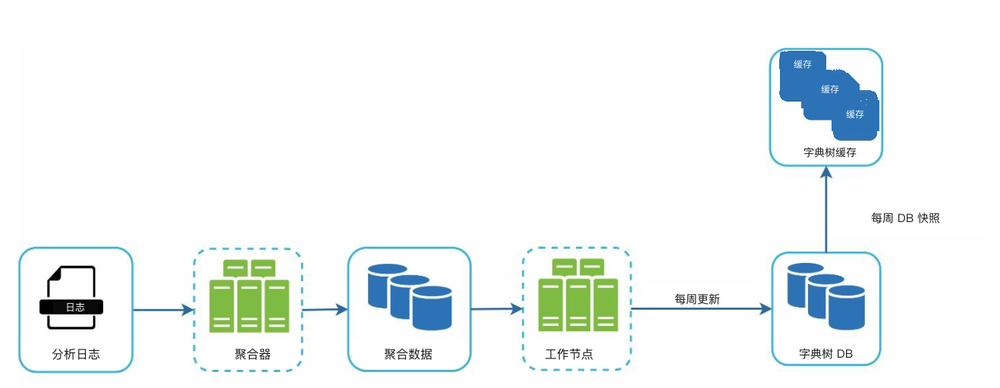
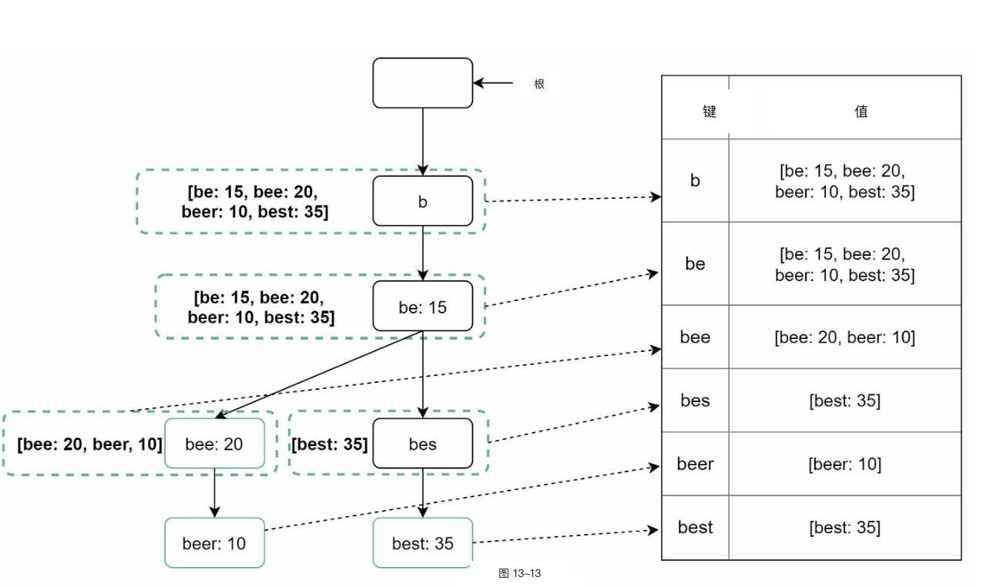
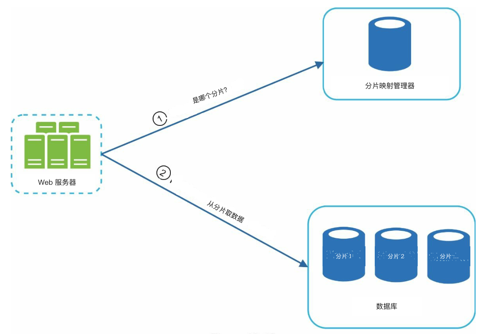

# 第 13 章：设计搜索自动补全

## 简介
自动补全（autocomplete），也叫输入即搜（typeahead）或增量搜索（incremental search），在用户（user）往搜索框里输入时实时给出建议。系统必须根据历史查询数据，高效返回最相关、最热门的 top-k 建议。

### 关键功能
- 最多给出 **5 条自动补全结果**。
- 依据 **查询热度**（频率）。
- 只支持 **小写英文字母**。
- 响应要快（<100 ms），并且可扩展（scalable）。

---

## 步骤 1：理解问题

### 需求
1. **实时建议：** 用户边输入边显示匹配结果。
2. **Top-k 结果：** 最多返回 5 条，按热度排序。
3. **可扩展性：** 支撑 **1000 万日活用户（DAU）**，峰值 QPS **48,000**。
4. **高可用（high availability）：** 出现故障时系统不停机。
5. **数据增长：** 新查询数据每天大约增长 **0.4 GB**。

---

## 步骤 2：高层设计
在高层上，系统拆成两个服务：
1. **数据采集服务：** 
    - 收集用户查询，并实时聚合做频率分析。
    - 对大数据集来说，实时处理并不现实；不过作为起点是合适的。

2. **查询服务：** 根据用户输入给出 top-k 建议。

---

### 数据采集服务

    

- 从分析日志聚合查询数据，并更新频率表。
- 每周处理历史数据，构建一棵 **字典树（trie）**（前缀树）。

### 查询服务

    
    

- 使用数据采集服务产出的频率表。
- 处理用户输入，用字典树从频率表取出 top-k 建议。
- 借助缓存（cache）和高效数据结构做查找优化。
- 例如用户在搜索框输入 “tw” 时，会显示如下 5 条最常搜的查询。

---

## 步骤 3：深入设计

### 字典树
**字典树** 是一种树形数据结构，用来高效存储和检索查询字符串。

#### 关键功能
1. **紧凑存储：** 按前缀分层表示，减少冗余。
2. **频率信息：** 在每个节点上保存查询热度。

4. **取出搜索次数最多的 top k 查询的步骤**
   

      
   

    - 找到前缀
    - 从前缀节点遍历子树，收集所有合法子节点
    - 排序后取 top k 

3. **优化：**
   - 在每个节点缓存 top-k 查询，加快检索，避免遍历整棵字典树。

        

   - 限制前缀长度以缩小搜索空间，因为用户很少会输入很长的搜索查询（例如 50 个字符）。

#### 字典树操作
1. **创建：** 
    - 每周用聚合后的查询数据构建。
    - 数据来源是分析日志 / DB。
2. **更新：** 很少实时更新；每周更新会替换旧数据。
3. **删除：** 
      

         
      

    - 过滤器去掉不想要或有害的建议（例如仇恨言论）。
    - 有一层过滤层，就可以按不同规则灵活去掉结果。
    - 不想要的建议会异步地从数据库里物理删除。
    

---

### 查询处理流程
1. **前缀搜索：**
   - 找到对应用户输入的前缀节点。
   - 遍历子树收集合法建议。
2. **Top-k 排序：**
   - 在每个节点缓存 top-k 建议，减少排序开销。
3. **构造响应：**
   - 用缓存数据构造结果，保证响应够快。

---

### 优化
1. **在每个节点缓存：**
   - 存 top-k 查询，避免重复遍历。
2. **限制前缀长度：**
   - 把前缀长度限制在较小值（例如 50 个字符），加快查找。
3. **AJAX 请求：**
   - 用轻量的异步请求做实时响应。
4. **浏览器缓存：**
   - 把自动补全结果存进浏览器缓存，方便高频搜索词。

---

### 数据采集流水线
在高层设计里，用户每输入一条搜索查询，数据就实时更新。这种做法并不现实。
- 用户每天可能输入数十亿条查询。每条查询都更新字典树不可行。
- 字典树建好之后，热门建议通常不会有太大变化。

#### 更新后的设计

   

1. **分析日志：**
   - 把原始查询数据存成日志，供每周聚合。
   - 日志是只追加的，并且没有索引。
2. **聚合器：**
   - 把日志处理成频率表，供构建字典树。
   - 对 Twitter 这类实时应用，用更短的时间间隔聚合。
   - 其他场景下，聚合可以不那么频繁，例如一周一次就够了。
3. **工作节点（workers）：**
   - 异步服务器重建字典树，并写入持久存储。
4. **存储选项：**
    - **字典树缓存**：字典树缓存是一套分布式缓存，把字典树放在内存里以便快速读取。
    - **字典树 DB** 
        1. **文档存储（例如 MongoDB）**：既然每周都会建一棵新字典树，我们可以定期做快照、序列化，再把序列化数据存进 MongoDB 这类数据库。
        2. **键值存储（key-value store）：** 
            - 把前缀映射到节点数据，便于快速访问。
            - 字典树里的每个前缀映射成哈希表中的一个键。
            - 每个字典树节点上的数据映射成哈希表中的一个值。

                
---

### 可扩展性
1. **分片（sharding）：**
   - 按前缀范围把字典树节点分到不同服务器（例如 `a-m`、`n-z`）。
   - 在前缀内部继续分片，以平衡不均匀分布（例如 `aa-ag`、`ah-an`）。
2. **负载均衡：**
   

      
   

   - 用分片映射管理器把请求路由到对应服务器。

---

## 步骤 4：进阶功能

### 多语言支持
1. **Unicode 字符：** 用 Unicode 支持非英语语言。
2. **按国家划分的字典树：** 为不同国家或地区分别建字典树。

### 热门查询
- 通过动态更新字典树节点，或给最近的查询更高权重，来处理实时事件。
