# 第 14 章：设计 YouTube

## 简介
YouTube 是一个大规模视频流平台，支持视频上传、播放和多种互动。本章重点设计一套可扩展的视频流系统，核心能力包括：
- **快速上传视频**
- **流畅播放**
- **可切换画质**
- **基础设施成本低**
- **高可用（high availability）和可靠性**

### 关键数据（2020）
- **20 亿月活用户**
- **每天观看 50 亿次视频**
- **移动互联网流量的 37% 来自 YouTube**
- 支持 **80 种语言**
- 2019 年广告收入 **151 亿美元**

---

## 步骤 1：理解问题与范围

### 核心功能
1. 上传视频
2. 观看视频

### 支持的平台
- 移动应用、Web 浏览器和智能电视

### 假设
- **日活用户（DAU）：** 500 万
- **平均视频大小：** 300 MB
- **上传限制：** 每个视频最大 1 GB
- **每日存储需求：** 150 TB
- **CDN 成本：** 500 万 * 5 个视频 * 0.3GB * $0.02 = $150,000/天（使用 Amazon CloudFront）

---

## 步骤 2：高层设计

### 组件

    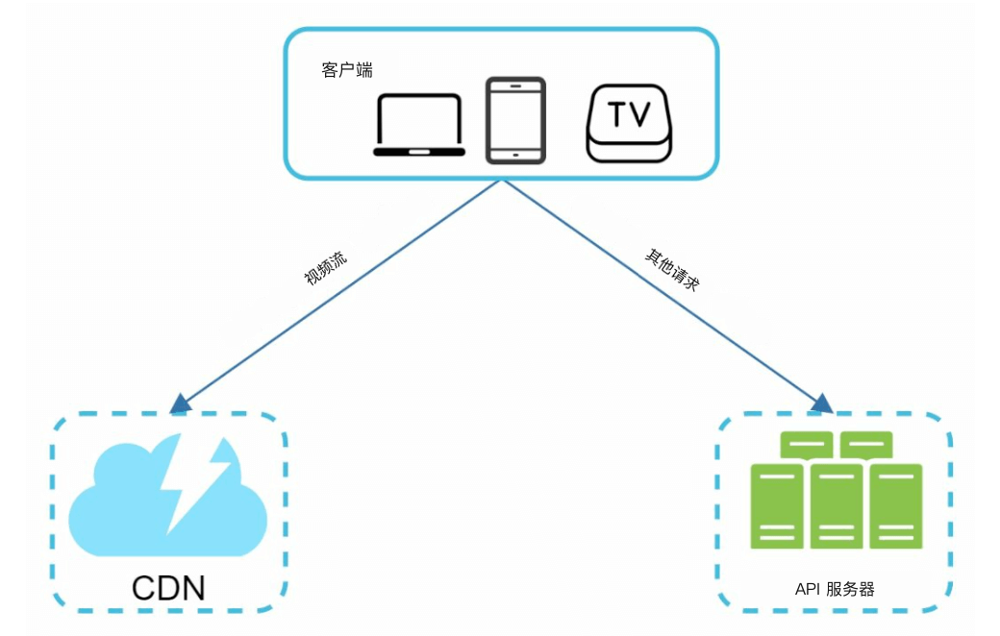

1. **客户端（client）：** 智能手机、电脑、电视等设备。
2. **CDN（Content Delivery Network）：** 存储并流式传输视频。
3. **API 服务器（API servers）：** 处理除视频流以外的所有用户（user）交互（例如上传、更新元数据（metadata））。
4. **元数据数据库：** 存储视频元数据（例如标题、描述、大小）。
5. **原始存储：** 存放上传视频的对象存储（blob storage）。
6. **转码（transcoding）服务器：** 把视频转成多种分辨率和格式。
7. **转码后存储：** 存放转码后视频的对象存储。

---

### 核心流程
#### 1. 视频上传流程
- **并行过程：**
  1. 把视频上传到原始存储。
  2. 在数据库中更新视频元数据。

- **视频上传（步骤）：**

    

        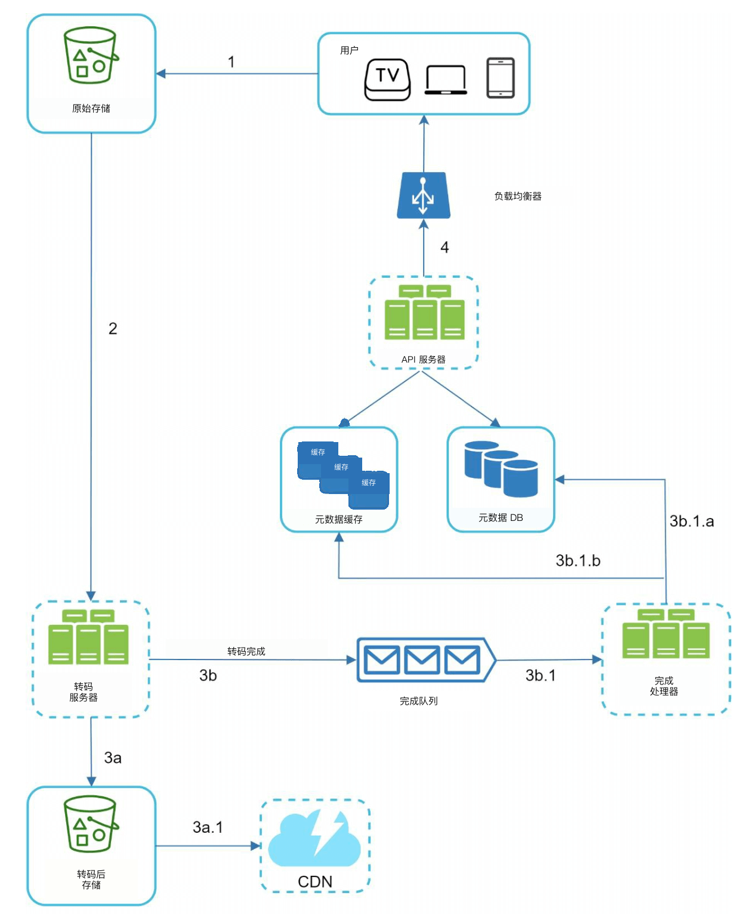
    

    - [1] 视频上传到对象存储。
    - [2] 转码服务器把视频转成多种格式。
    - [3] 转码完成后，下面两步并行执行。
        - [3a] 转码后的视频写入转码后存储。
        - [3b] 转码完成事件进入完成队列（queue）。
    - [3a.1] 视频分发到 CDN。
    - [3b.1] 完成处理器更新元数据并通知用户。

- **元数据上传（步骤）：**

    

        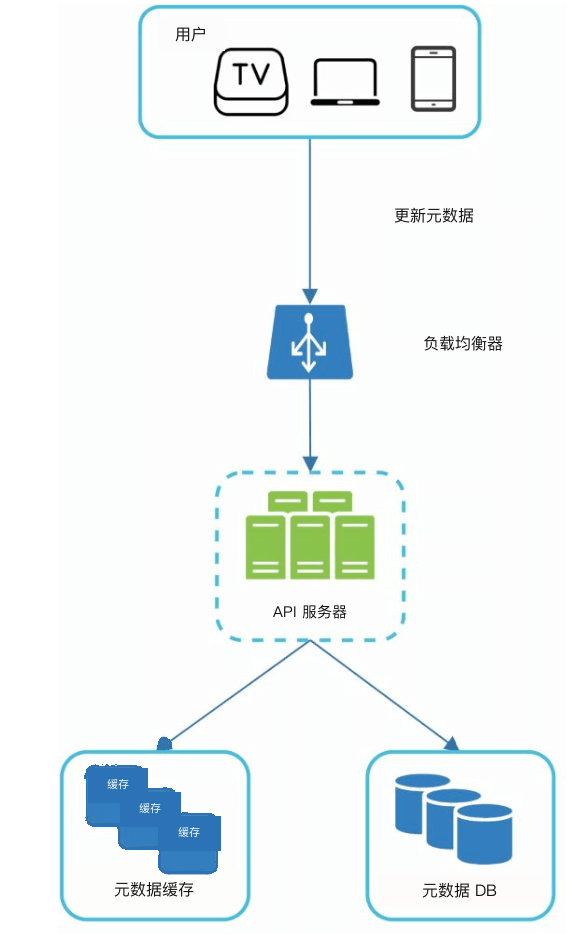
    

    - 客户端并行发送更新视频元数据的请求
    - 请求包含视频元数据，例如文件名、大小、格式等。
    
       

#### 2. 视频播放流程

  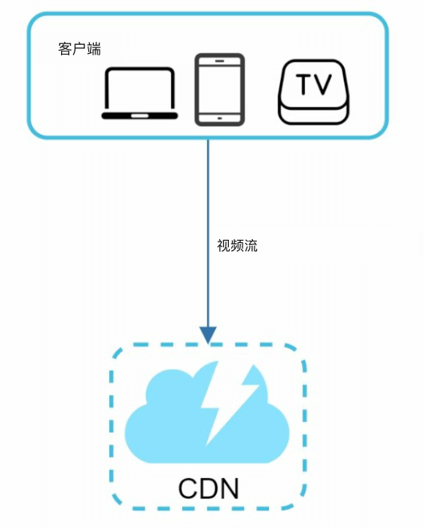

- 视频由 CDN 边缘服务器直接流式传输，以降低延迟。
- 常用流媒体协议有 MPEG_DASH、Apple HLS、Adobe HDS。
-  *不同流媒体协议支持的视频编码和播放器不同。*

---

## 步骤 3：深入设计

### 视频转码
#### 重要性
1. 原始视频占用大量存储空间。转码能减少存储占用。
2. 保证各种设备和浏览器都能播放。
3. 按网络状况适配画质。

#### 组件
- **容器：** 封装视频、音频和元数据（例如 MP4、AVI）。
- **编解码器：** 压缩与解压缩算法（例如 H.264、VP9）。

#### 有向无环图（DAG）模型

    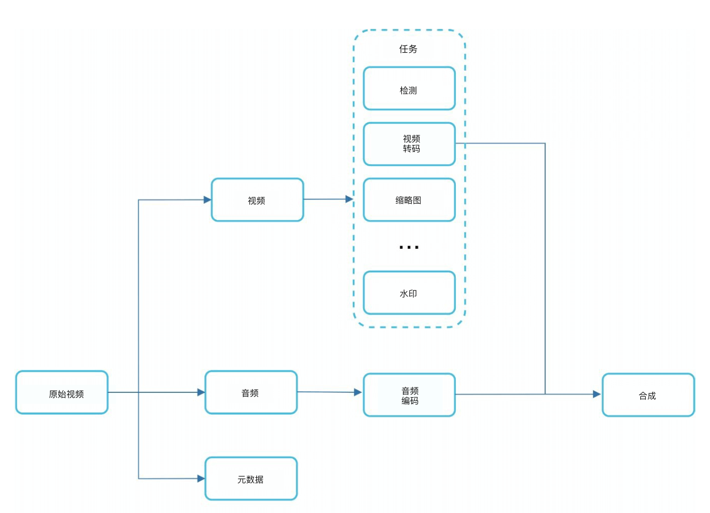

- 视频转码计算量大、耗时长。
- DAG 模型定义编码、生成缩略图、加水印等任务。
- 视频处理可以高度并行。

- 原始视频被拆成视频、音频和元数据。
    - 视频编码：转成不同分辨率、编解码器和码率。
    - 缩略图：可以由用户上传，也可以由系统自动生成。
    - 水印：叠在视频上的图片，包含视频的标识信息。

---

### 转码架构

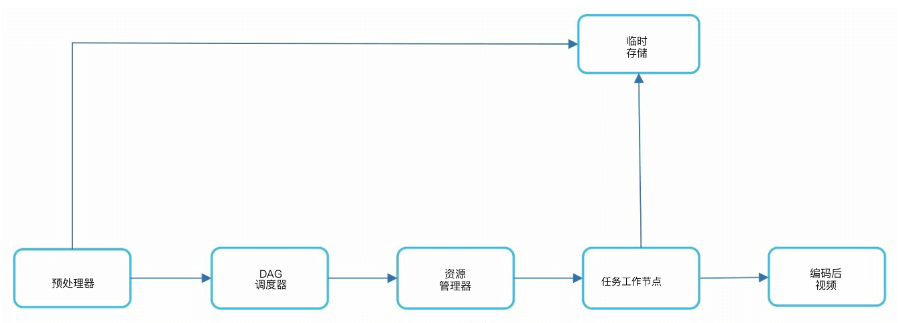

1. **预处理器：** 把视频切成小块（GOP 对齐）。它有 4 项职责。

    

        
    

    - 视频切分：把视频流按画面组（GOP，Group of Pictures）对齐切成更小的片段。
    - 对旧客户端按 GOP 对齐切分视频。
    - 根据客户端程序员编写的配置文件生成 DAG。
    - 把 GOP 和元数据存进临时存储；编码失败时，系统可用持久化数据重试。

2. **DAG 调度器：** 把任务组织成串行或并行的阶段。
    

        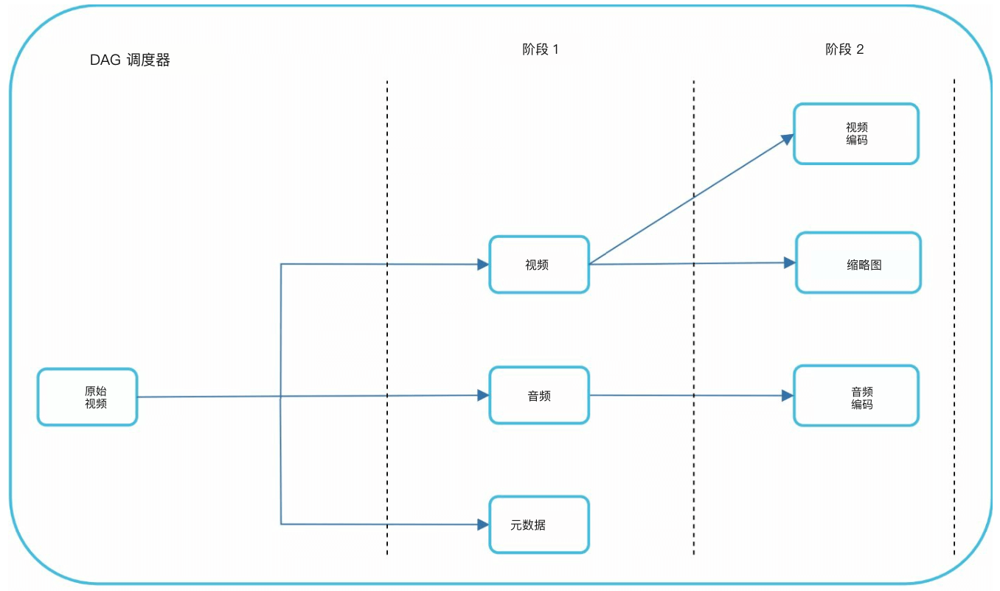
    

    - 把 DAG 图拆成若干任务阶段，放入资源管理器的任务队列。
    - 阶段 1：视频、音频和元数据。
    - 阶段 2 把视频文件再拆成两个任务：视频编码和缩略图。

3. **资源管理器：** 负责高效分配资源。它包含 3 个队列和一个任务调度器。
    

        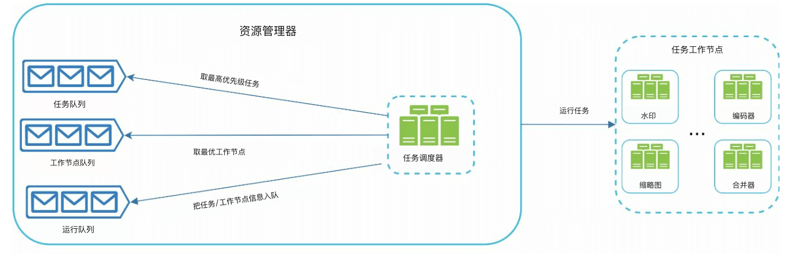
    

    - 任务队列：存放待执行任务的优先队列。
    - 工作节点队列：存放工作节点（workers）利用率信息的优先队列。
    - 运行队列：存放正在运行的任务以及执行这些任务的工作节点。
    - 任务调度器：选出最优的任务/工作节点，并指示选中的任务工作节点执行作业。

4. **任务工作节点：** 执行转码和其他操作。
    

        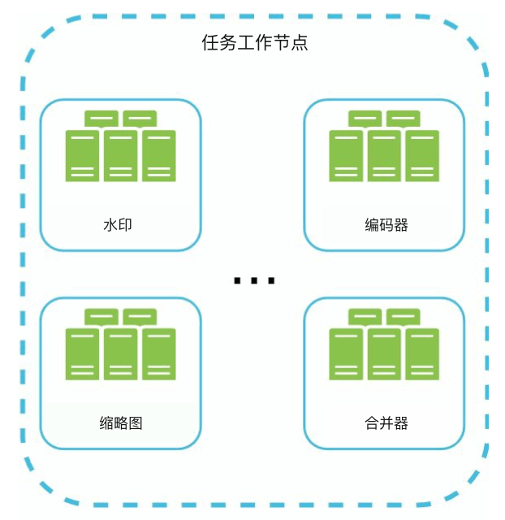
   

    - 不同任务工作节点可以跑不同的任务

5. **临时存储：** 存放中间数据以便重试。
    - 存储系统的选择取决于数据类型、大小、访问频率、生命周期等。
6. **输出：** 已转码、可分发的视频。

---

## 系统优化

### 速度优化
1. **并行上传视频：** 把视频切成小块，上传更快且可续传。

    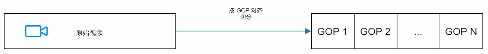

2. **分布式上传中心：** 把靠近用户的 CDN 当作上传节点。
3. **并行处理：** 用消息队列（message queue）解耦模块，提高并行度。

    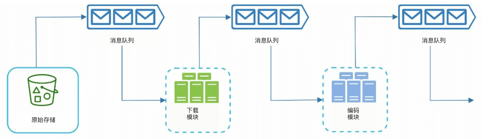
    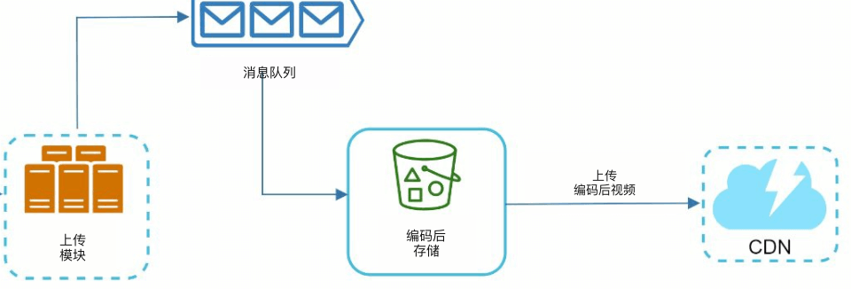

### 安全优化
1. **预签名 URL：** 只允许授权用户上传视频。

    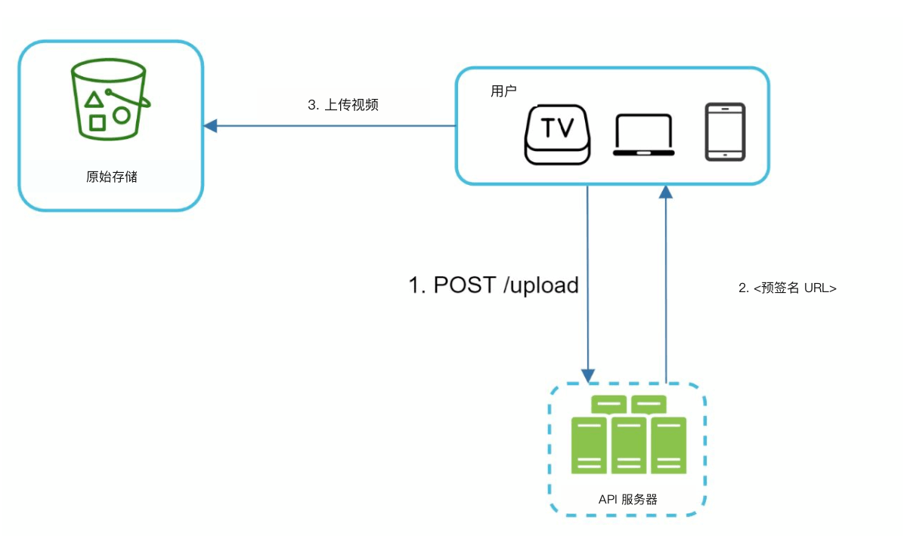

2. **保护视频：**
   - **DRM 系统**（例如 Apple FairPlay、Google Widevine）。
   - **AES 加密。**
   - **水印。**

### 成本优化
1. 热门视频走 CDN；不太热门的由高容量服务器提供。
2. 很少被访问的视频按需编码。
3. 按热度做区域化分发。
4. 自建 CDN，并与 ISP 合作降低带宽成本。

---

## 错误处理
### 可恢复错误
- 重试失败的上传、转码或资源分配任务。

### 不可恢复错误
- 停止处理畸形视频并返回错误码。
