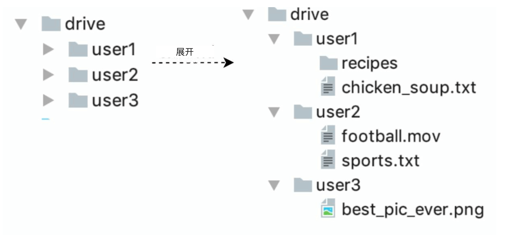
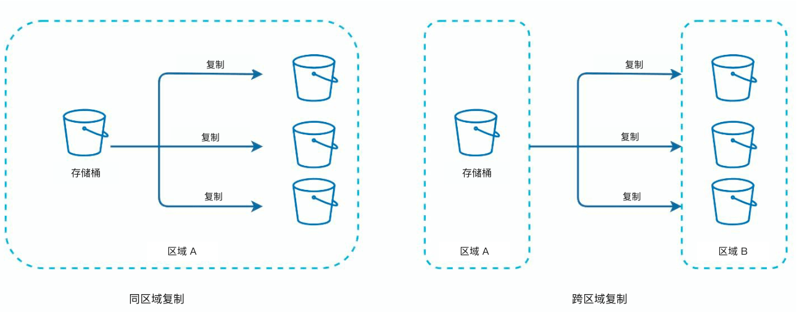
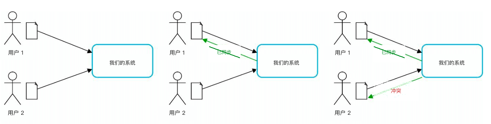
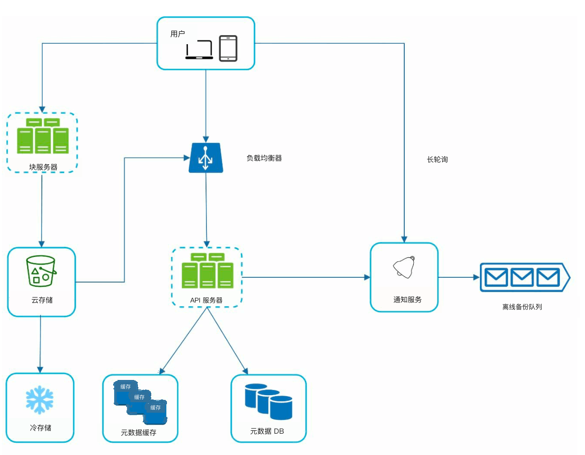
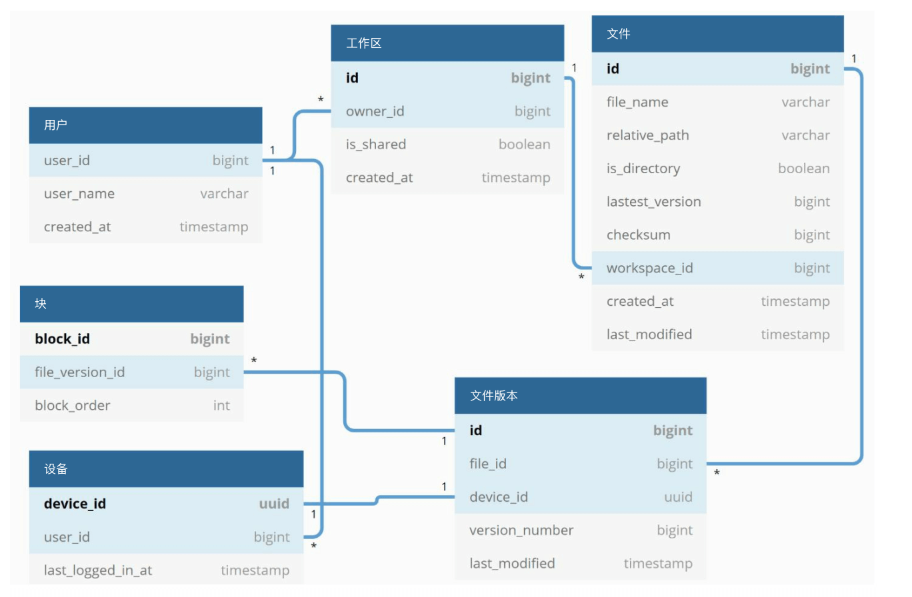
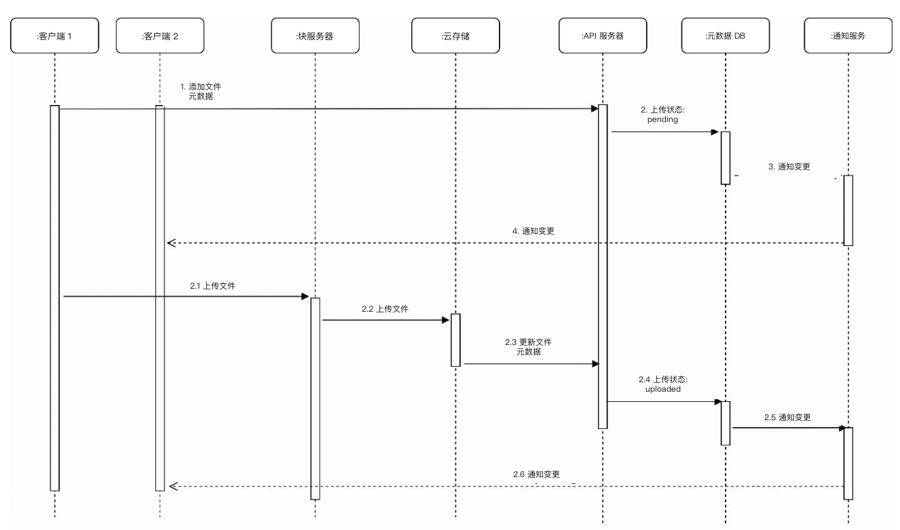
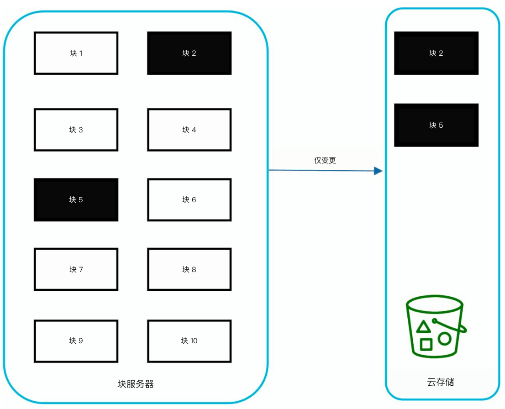
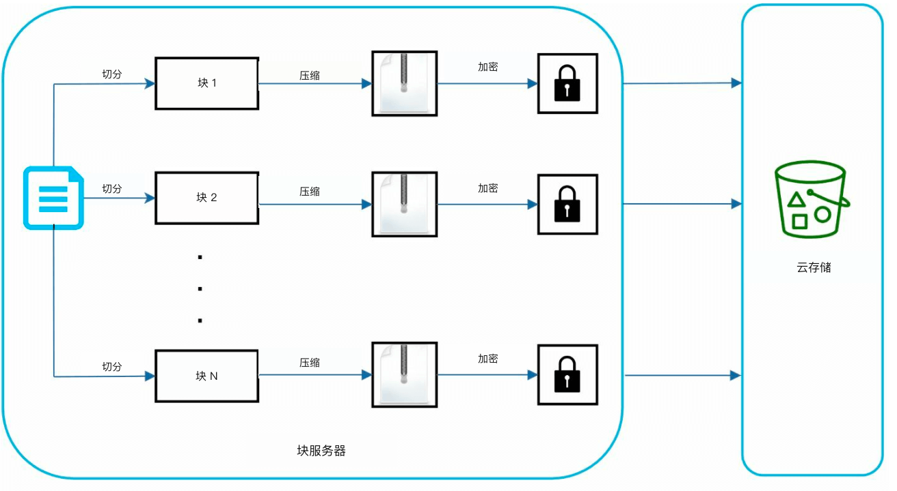
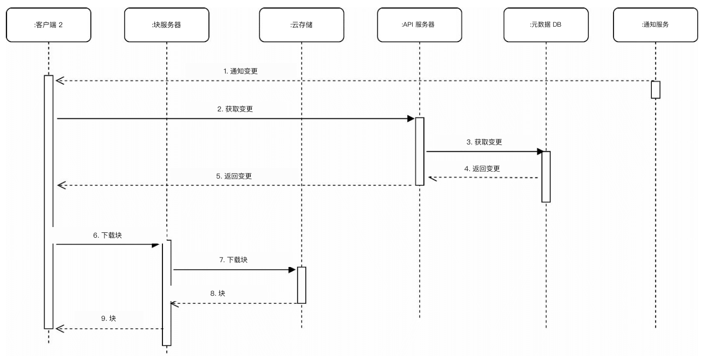

# 第 15 章：设计 Google Drive

## 简介
Google Drive 是一项基于云的文件存储与同步服务，用户（user）可以从多种设备存储、访问和共享文件。本章讨论如何设计一套可扩展系统，具备以下能力：
- **文件上传与下载**
- **跨设备文件同步**
- **文件共享**
- **文件修订历史**
- **编辑、删除和共享时的通知（notification）**

---

## 步骤 1：理解问题

### 关键需求
#### 功能需求：
- 上传和下载文件。
- 在多台设备之间同步文件。
- 保留文件修订。
- 支持带权限的文件共享。
- 在文件编辑、删除和共享时发送通知。

#### 非功能需求：
- **可靠性：** 不能丢数据。
- **同步要快：** 同步延迟会让用户不耐烦。
- **带宽效率：** 尽量少占不必要的流量。
- **可扩展性：** 支撑 1000 万日活用户（DAU）。
- **高可用（high availability）：** 服务器故障或网络出问题时仍能正常工作。

### 约束与假设
- 用户有 **10 GB 免费空间**。
- 最大文件大小：**10 GB**。
- 平均上传文件大小：**500 KB**。
- 上传频率：**每用户每天 2 个文件**。
- 所需总存储：**500 PB**。

---

## 步骤 2：高层设计
### 单机部署
基础部署包括：
1. **Web 服务器（web server）：** 处理上传和下载。
2. **元数据库：** 跟踪用户数据、登录信息、文件信息等元数据（metadata）。
3. **存储目录：** 按命名空间（namespace）存放文件。

    

- 一台 Web 服务器，以及作为根目录的 drive/ 目录，用来存放上传的文件。
- 在 drive/ 目录下，有一组称为命名空间的目录。
- 每个命名空间包含该用户上传的全部文件。
- 每个文件或文件夹可以通过命名空间加上相对路径唯一标识。

这套设计只是起点，不足以扩展。

#### API
1. **把文件上传到 Google Drive：** 支持两种上传
    - 简单上传：文件较小时使用。
    - 可恢复上传：
        - 端点：https://api.example.com/files/upload?uploadType=resumable
        - 先发初始请求拿到可恢复 URL。
        - 上传数据并监控上传状态
        - 如果上传被打断，从断点继续传。
2. **从 Google Drive 下载文件：** 下载文件
    -  端点：https://api.example.com/files/download
3. **获取文件修订：**
    - 端点：https://api.example.com/files/list_revisions

### 走向分布式

#### 改进：
1. **分片（sharding）：** 按 `user_id` 把存储拆到多台服务器。
2. **Amazon S3：** 用 S3 做可扩展、带冗余的文件存储，并做跨区域复制（replication）。

    
     
3. **负载均衡器（load balancer）：** 把流量分到多台 Web 服务器。
4. **元数据库复制：** 通过数据库分片和复制保证可用性。

#### 同步冲突：
像 Google Drive 这样的大型存储系统，同步冲突时不时会发生。
当两个用户同时修改同一个文件或文件夹时，就会发生冲突。

- 例子里用户 1 和用户 2 同时更新同一文件，但用户 1 的文件先被系统处理。
- 用户 1 的更新成功，用户 2 则遇到同步冲突。
- 系统给出同一文件的两份拷贝：用户 2 的本地拷贝，以及服务器上的最新版本。
- 用户 2 可以选择合并两份文件，或用其中一份覆盖另一份。

### 改进后的设计

1. **用户交互：** 用户通过浏览器或移动应用访问。

2. **块服务器：**
   - 文件被切成最大 **4 MB 的块**，并分配唯一哈希值。
   - 块独立存在云存储里（例如 Amazon S3）。
   - 按特定顺序拼接块即可还原文件。

3. **云存储：** 块放在云存储中，以便扩展和冗余。

4. **冷存储：** 不活跃的文件迁到冷存储以降低成本。

5. **负载均衡器：** 把请求均匀分到 API 服务器，保证高效运行。

6. **API 服务器（API servers）：**
   - 处理用户鉴权、资料管理和文件元数据更新。
   - 管理所有非上传工作流。

7. **元数据库与缓存（cache）：**
   - 存储用户、文件、块和版本的元数据。
   - 频繁访问的元数据会缓存，以便更快取出。

8. **通知服务：**
   - 一套 **发布者/订阅者（publisher/subscriber）系统**，在文件变更（新增、编辑、删除）时通知客户端（client）。
   - 确保客户端能拉取最新更新。

9. **离线备份队列（queue）：** 临时存放文件变更信息，等离线客户端重新上线后再同步。

---

## 步骤 3：深入设计

### 元数据库
下面是一份高度简化的版本，只包含最重要的表和字段。
#### 模式设计：
- **用户表：** 存储用户资料和偏好。
- **文件表：** 维护文件元数据（例如大小、名称、路径）。
- **块表：** 跟踪文件块，用于还原文件。
- **文件版本表：** 存储文件修订历史。

---

### 上传流程

1. **文件上传：**
   - 块服务器把文件切成块，再压缩并加密。
   - 块上传到块服务器，再存进 S3。
2. **元数据上传：**
   - 客户端把元数据发给 API 服务器。
   - 元数据写入数据库，状态为 `pending`。
3. **完成：**
   - S3 触发回调，把文件状态更新为 `uploaded`。
   - 通知服务告知相关用户。

---

### 文件同步
1. **增量同步（delta sync）：** 只传输修改过的块，而不是整个文件。

    

    
    

2. **压缩：** 按文件类型选用压缩算法压缩块。
3. **冲突解决：**
   - 先处理的版本获胜。
   - 冲突版本单独保存，交给用户处理。

---

### 下载流程
当文件在别处被新增或编辑时，会触发下载流程。客户端有两种方式得知：
- 若客户端 A 在线、另一个客户端改了文件，通知服务会告知客户端 A。
- 若客户端 A 离线、另一个客户端改了文件，数据会存进缓存。离线客户端重新上线后，再拉取最新变更。

客户端一旦知道文件变了，先通过 API 服务器请求元数据，再下载块来组装文件。

1. **触发：** 通知服务告知客户端文件有更新。
2. **拉取元数据：** 客户端通过 API 获取更新后的元数据。
3. **下载块：** 客户端从块服务器下载更新的块，并还原文件。

---

### 通知服务
1. **目的：** 让客户端及时获知文件变更。
2. **机制：** 用 **长轮询（long polling）** 做异步通知。
3. **示例：** 文件被新增、编辑或删除时，通知会推给所有相关客户端。

---

### 存储优化
1. **去重：** 在账号级别用基于哈希的比较去掉重复块。
2. **版本策略：**
   - 限制保存的修订数量。
   - 对频繁编辑的文件优先保留最近版本。
3. **冷存储：** 把很少访问的文件迁到更便宜的存储（例如 Amazon S3 Glacier）。

---

### 故障处理
1. **负载均衡器故障：** 备用负载均衡器接管。
2. **块服务器故障：** 未完成任务改派给其他服务器。
3. **元数据库故障：**
   - 把从库（slave）提升为主库（master）。
   - 把流量切到剩余副本（replica）。
4. **云存储故障：** 用跨区域复制去取不可用的文件。
5. **通知服务故障：** 客户端改连其他服务器。
