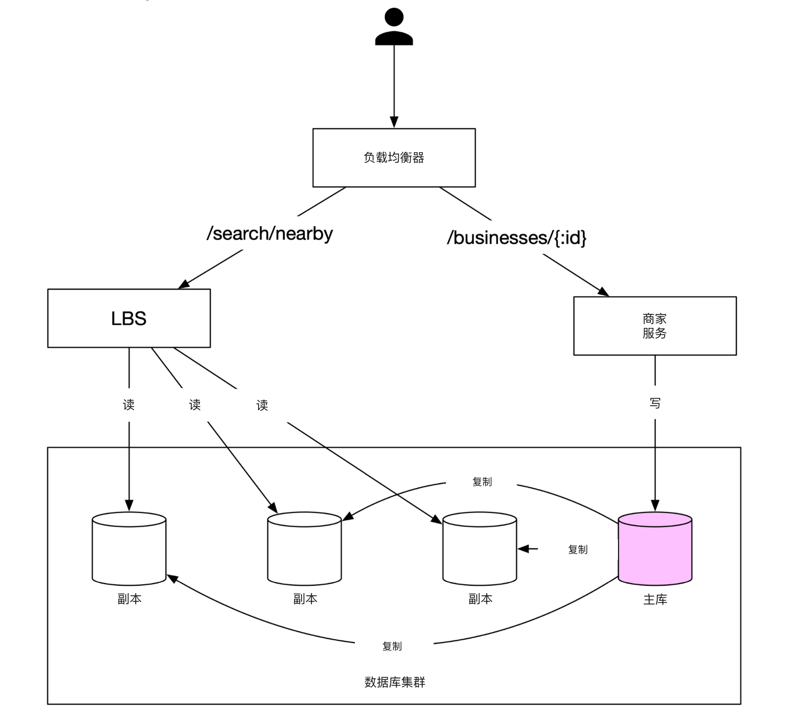
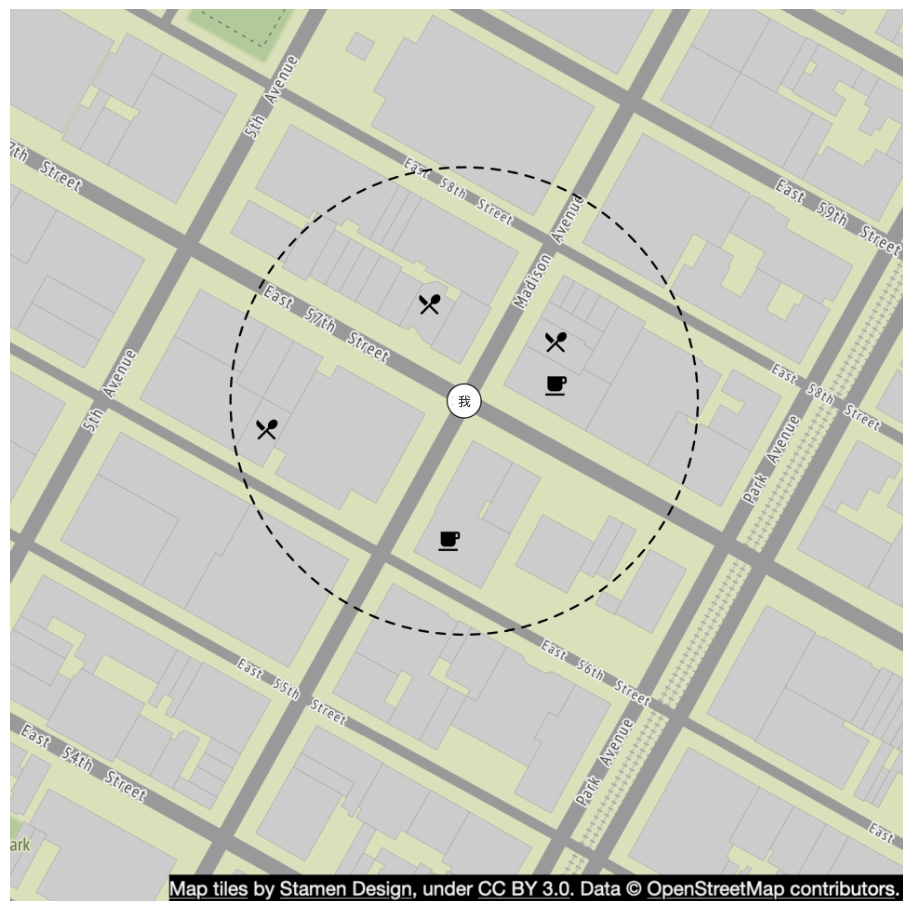
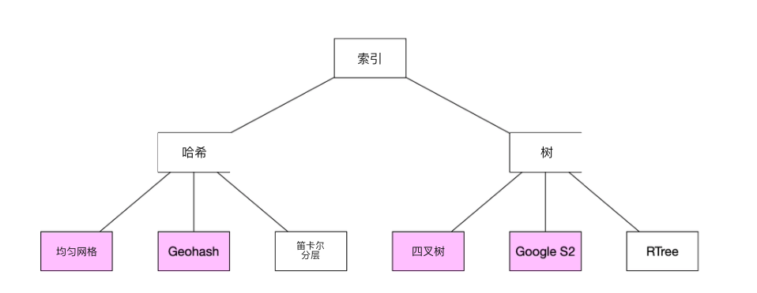
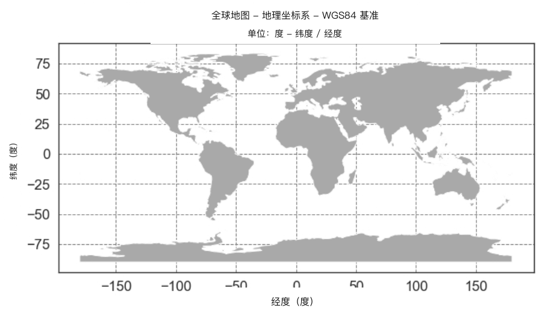
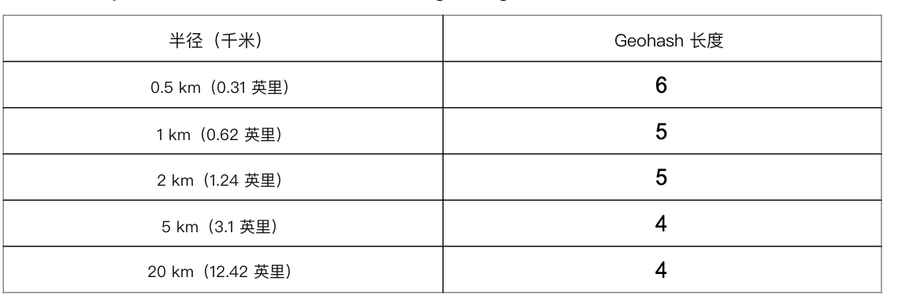
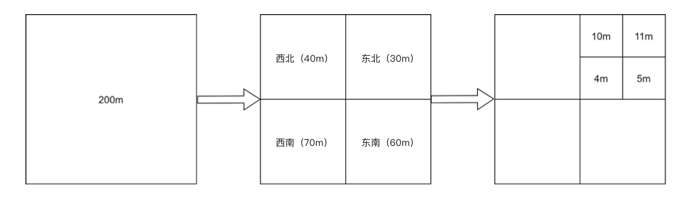
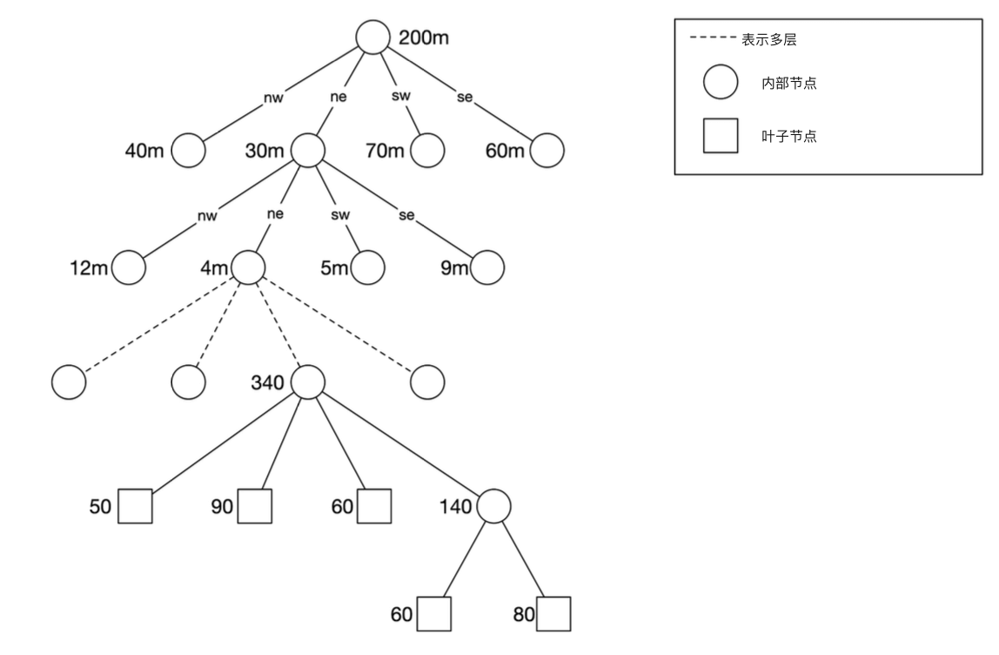
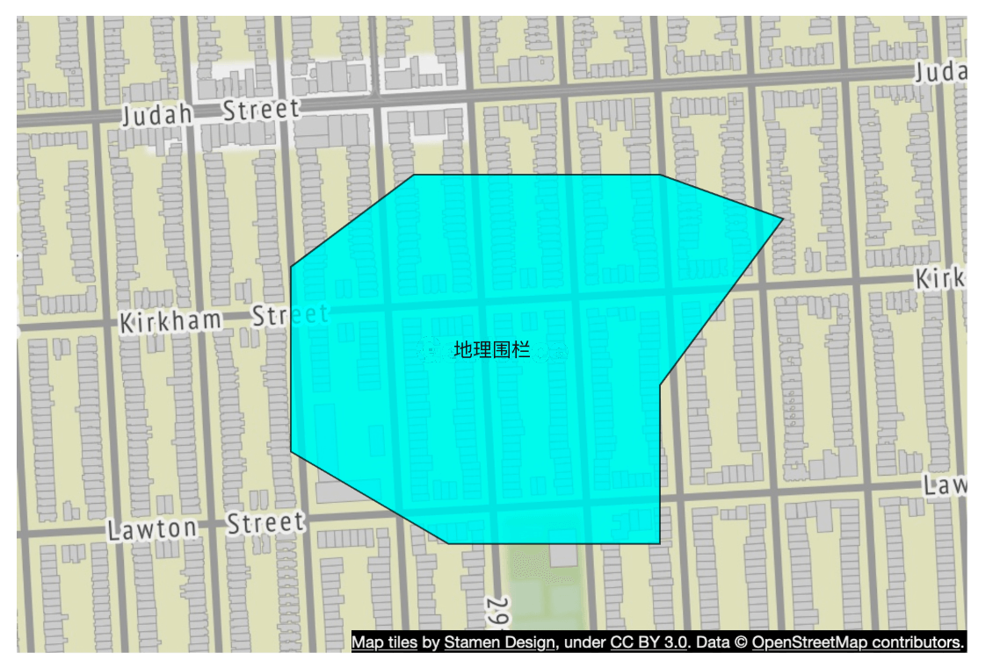
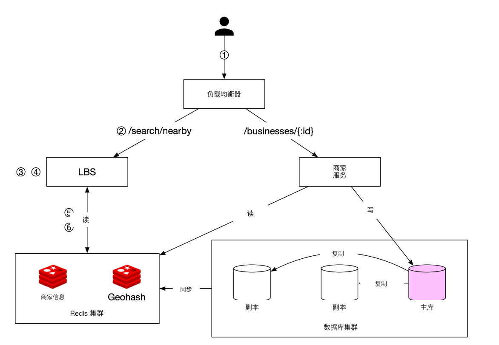

# 第 16 章：设计邻近服务

## 简介
**邻近服务（proximity service）** 用来查找附近的地点，例如餐馆、酒店、加油站和其他商家。Google Maps 和 Yelp 等应用用它来帮用户（user）发现给定半径内的地点。


## 步骤 1：理解问题并确定范围

### **功能需求**
1. **按用户位置搜索商家**：根据用户位置（纬度、经度）和搜索半径。
2. **允许商家所有者**新增、更新或删除商家（非实时）。
3. **按请求提供商家详细信息**。

### **非功能需求**
- **低延迟**：用户应能快速得到响应。
- **数据隐私**：遵守 GDPR 和 CCPA。
- **高可用（high availability）**：应对繁忙地段高峰时段的流量尖峰。

### **粗略估算**
- **1 亿日活用户**。
- 系统中有 **2 亿家商家**。
- **搜索 QPS 计算**：
  - 用户每天搜索 **5 次**。
  - **搜索 QPS** = (100M × 5) / 86,400 ≈ **5,000 QPS**。

---

## 步骤 2：高层设计

### **API 设计**
#### **搜索附近商家**
GET /v1/search/nearby

- **请求参数**：
  - `latitude`：用户位置的纬度。
  - `longitude`：用户位置的经度。
  - `radius`：搜索半径（默认：5000m）。

#### **商家 API**
| API 端点                          | 说明                                             |
|-----------------------------------|--------------------------------------------------|
| `GET /v1/businesses/{id}`         | 获取商家详细信息                                 |
| `POST /v1/businesses`             | 新增一家商家                                     |
| `PUT /v1/businesses/{id}`         | 更新商家详情                                     |
| `DELETE /v1/businesses/{id}`      | 从系统中删除一家商家                             |


### **数据模型**
- 读量很高，因为两个功能非常常用，关系型数据库（例如 MySQL）很合适。
  - 搜索附近商家
  - 查看商家详细信息

### **数据模式**
- 关键数据库表是商家表和地理空间索引（geospatial index）表
- 商家表存放商家的详细信息。

### **高层系统架构**
系统由两部分组成：基于位置的服务（LBS）和商家相关服务。

<div style="margin-left:3rem">
    
</div>

- **基于位置的服务（LBS）**：
  - 处理基于位置的搜索查询。
  - 读多写少，没有写请求。
  - 尤其在密集区域高峰时段 QPS 很高，且系统是无状态（stateless）的。
- **商家服务**：处理两类请求。
  - 商家所有者创建、更新或删除商家。
  - 顾客查看商家详细信息。
- **负载均衡器（load balancer）**：把流量路由到 LBS 和商家服务。
- **数据库集群**：
  - 用 **主库-副本（replica）架构** 应对读多写少的负载。
  - LBS 读到的数据与主库写入的数据之间可能存在差异。
  - 这种不一致不是问题，因为商家信息不是实时更新的。


---

## 步骤 3：获取附近商家的算法

### **方案 1：二维搜索（朴素）**

<div style="margin-left:3rem">
    
</div>

最直观的做法是按预定半径画一个圆，找出圆内的全部商家。

**SQL 查询：**
```
SELECT business_id, latitude, longitude
FROM business
WHERE (latitude BETWEEN :lat - radius AND :lat + radius)
AND (longitude BETWEEN :long - radius AND :long + radius);
```
**问题：**
- **低效**：需要扫描整张表。
- **受一维索引限制**（纬度/经度）。

一种可能的改进是在经度和纬度列上建索引；虽然稍好一些，但仍然非常慢。

### 更好的做法
- 上一方案的问题在于，数据库索引只能在一个维度上加快搜索。
- 更优的做法是用地理空间索引把二维数据表示成一维。
  - 哈希：均匀网格、Geohash
  - 树：四叉树（quadtree）、Google S2、RTree

  <div style="margin-left:3rem">
    
  </div>


### **方案 2：均匀网格**

  <div style="margin-left:3rem">
    
  </div>

- **把世界划成固定大小的网格**。
- **问题**：商家分布不均匀（城市密度高，乡村稀疏）。

### **方案 3：Geohash**
- 沿本初子午线和赤道把地球分成四个象限，再把每个格子分成四个更小的格子。
- 每个格子可以用经度和纬度比特交替表示。
- 重复这一细分过程

  <div style="margin-left:3rem">
    
    
  </div>


- **把纬度和经度编码成一个字母数字字符串**。共有 12 个精度（层级）
- **层级网格结构**便于高效搜索。
- 按表选择能覆盖半径的最短 Geohash 长度作为合适精度。
  <div style="margin-left:3rem">
    
  </div>
- Geohash 保证：两个 Geohash 的共享前缀越长，它们就越近。

- **挑战**：
  <div style="margin-left:3rem">
    
  </div>

  - **边界问题**（靠近格子边缘的商家可能被漏掉）。
    - 两个位置可以非常近，却完全没有共享前缀（可能分处赤道两侧）
    - 两个位置可以有很长的共享前缀，却属于不同的 Geohash。
  - 解决办法：还要搜索相邻格子。


### **方案 4：四叉树**

  四叉树是一种递归地把二维空间分成四个象限的树形数据结构，每个内部节点恰好有四个子节点，分别表示该空间的四个子区域。
  - 四叉树是内存中的数据结构，运行在每台 LBS 服务器上，在服务器启动时构建。

  <div style="margin-left:3rem">
    
  </div>

  - 根节点被递归拆成 4 个象限，直到没有节点包含超过 x 家商家（这里是 100 家）。

  <div style="margin-left:3rem">
    
  </div>

- 四叉树索引占用内存不大（通常是 GB 级），可以轻松放进一台服务器。
- 因为建树的时间复杂度是 nlogn，构建可能要几分钟。
- **适合 k 近邻搜索**（例如找最近的加油站）。

  <div style="margin-left:3rem">
    
  </div>

#### 运维考虑
 - 大约 2 亿家商家时，服务器启动时构建四叉树可能要几分钟。
 - 建树期间无法服务流量，因此新版本应逐步滚动到一部分服务器。
 - 更新或新增商家时，最简单的做法是增量重建四叉树。（会导致大量缓存（cache）失效）
 - 也可以在线更新四叉树，但实现更复杂。（需要锁机制）

### **方案 5：Google S2**
它把球面映射到基于希尔伯特曲线（Hilbert curve）的一维索引。希尔伯特曲线上靠近的两点在一维空间里也靠近。


  <div style="margin-left:3rem">
    
    
  </div>

- **用希尔伯特曲线把地球划分成小单元格**。
- 很适合地理围栏（geofencing），因为它能用不同层级覆盖任意形状的区域。
- 地理围栏还可以圈出感兴趣区域的范围。
- 另一个优点是：不必固定精度层级，可以在 S2 里指定最小、最大层级以及最大单元格数。


## 权衡比较

#### Geohash
- 易用、易实现——不必建树或重建树
- 支持固定半径结果
- 更新索引很容易。
- 不能按人口密度动态调整格子大小。

#### 四叉树
- 实现稍难。
- 支持取 k 近邻商家。
- 可以按人口密度动态调整格子大小。
- 更新索引更复杂，可能需要重建整棵树。

---

## 步骤 4：扩展数据库与缓存策略

### **扩展商家表**
- **按商家 ID 分片（sharding）** 可以让数据分布均匀。
- 表里每个商家一行。

| Geohash | 商家 ID    |
|---------|------------|
| 9q9hvu  | 343        |
| 9q9hvu  | 347        |
| 9q9hvu  | 112        |

### **扩展地理空间索引**
- 对 Geohash 表来说，分片未必合适。这种情况下全部数据能放进单台服务器，没有分片的技术必要。
- 更好的做法是用只读副本来分担读负载。


---

### **缓存策略**
最直观的缓存键是位置坐标，但有几个问题：
 - GPS 给出的位置坐标并不精确。
 - 用户移动会导致位置坐标变化。
 - 更好的键是 Geohash。

| 缓存键         | 缓存值                                      |
|----------------|---------------------------------------------|
| `geohash`      | 该格子内的商家 ID 列表                      |
| `business_id`  | 商家详情（名称、地址、评价等）              |

---

## 步骤 5：部署策略与最终架构

### **区域与可用区**
- 把 LBS 和商家服务 **部署到多个区域**。

### **处理实时更新**
- **商家更新按天批量处理**。

### **最终系统架构**


  <div style="margin-left:3rem">
    
  </div>


最终算法如下：

## 检索附近商家的步骤
1. **用户请求：**
   - 用户搜索 **500 米** 内的餐馆。
   - 客户端（client）把 **纬度（37.776720）、经度（-122.416730）和半径（500m）** 发给 **负载均衡器**。

2. **请求转发：**
   - **负载均衡器（LB）** 把请求转发到 **基于位置的服务（LBS）**。

3. **Geohash 计算：**
   - LBS 确定与半径匹配的 **Geohash 长度**。
   - 查参考表，**500m 对应 Geohash 长度 = 6**。

4. **取相邻 Geohash：**
   - LBS 计算 **相邻 Geohash**，以覆盖附近区域。
   - 结果是一个列表：
     ```
     [my_geohash, neighbor1_geohash, neighbor2_geohash, ..., neighbor8_geohash]
     ```

5. **从 Redis 取商家 ID：**
   - 对列表中每个 Geohash，LBS 查询 **Geohash Redis 服务器** 以获取 **商家 ID**。
   - 用并行查询降低延迟。

6. **取回并排序商家：**
   - LBS 从 **商家信息 Redis 服务器** 取出 **完整商家详情**。
   - 商家按与用户位置的 **距离排序**。
   - **排序后的结果** 返回给客户端。

## 关键优化
- **并行 Redis 调用**：缩短响应时间。
- **Geohash 索引**：保证空间查询高效。
- **缓存**：加快商家数据的查找和读取。

这种方法能以 **低延迟、可扩展** 的方式取回用户附近的商家。

---

### **选择索引方法**
| 索引方法 | 优点 | 缺点 |
|----------------|------|------|
| **Geohash** | 易实现，适合邻近搜索 | 边界问题，格子大小固定 |
| **四叉树** | 可按密度动态调整，支持 k 近邻查询 | 更复杂，需要树再平衡 |
| **Google S2** | 地理围栏能力强，用于 Google Maps | 更难实现 |

---

## 参考文献
1. [Geohash Algorithm](https://www.movable-type.co.uk/scripts/geohash.html)
2. [Quadtree Indexing](https://en.wikipedia.org/wiki/Quadtree)
3. [Google S2 Geometry](https://s2geometry.io/)
