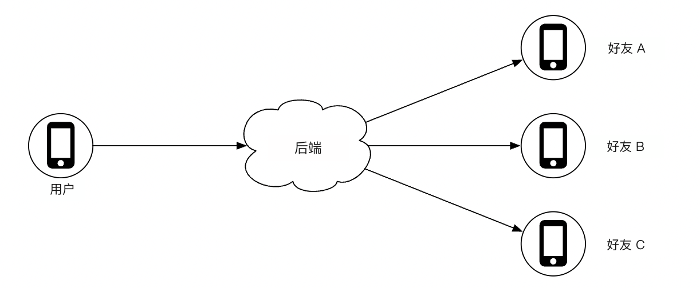
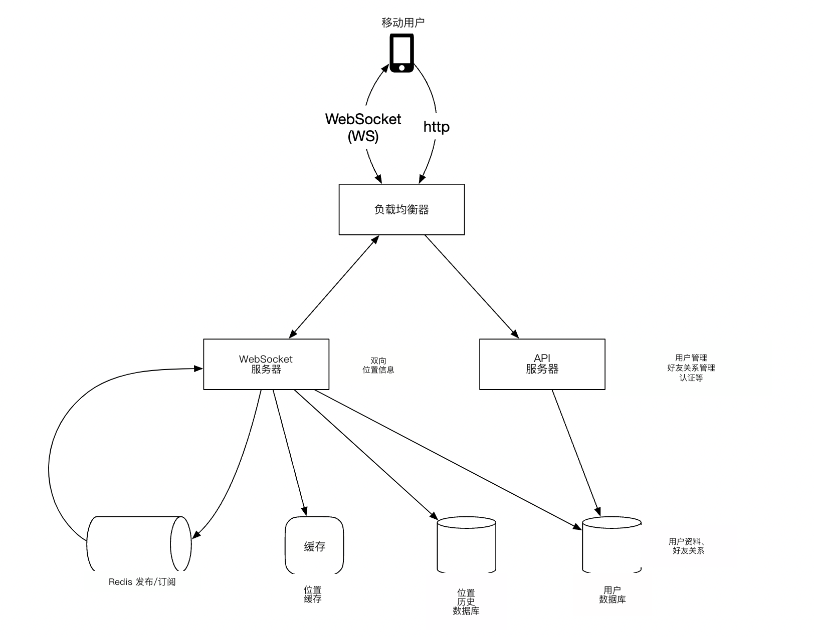
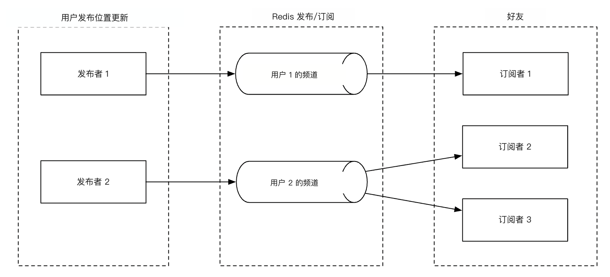
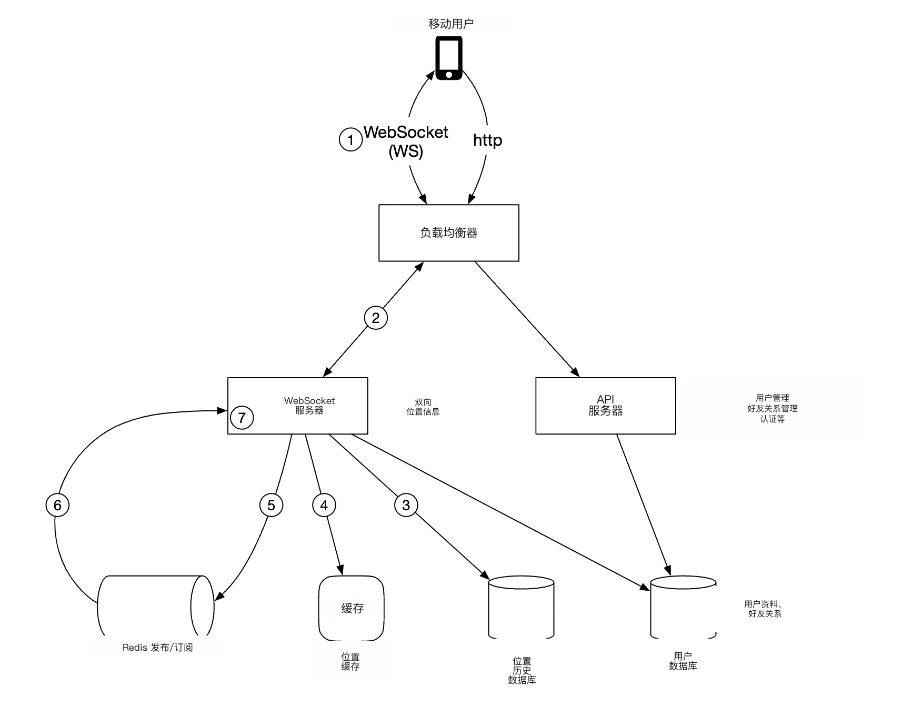
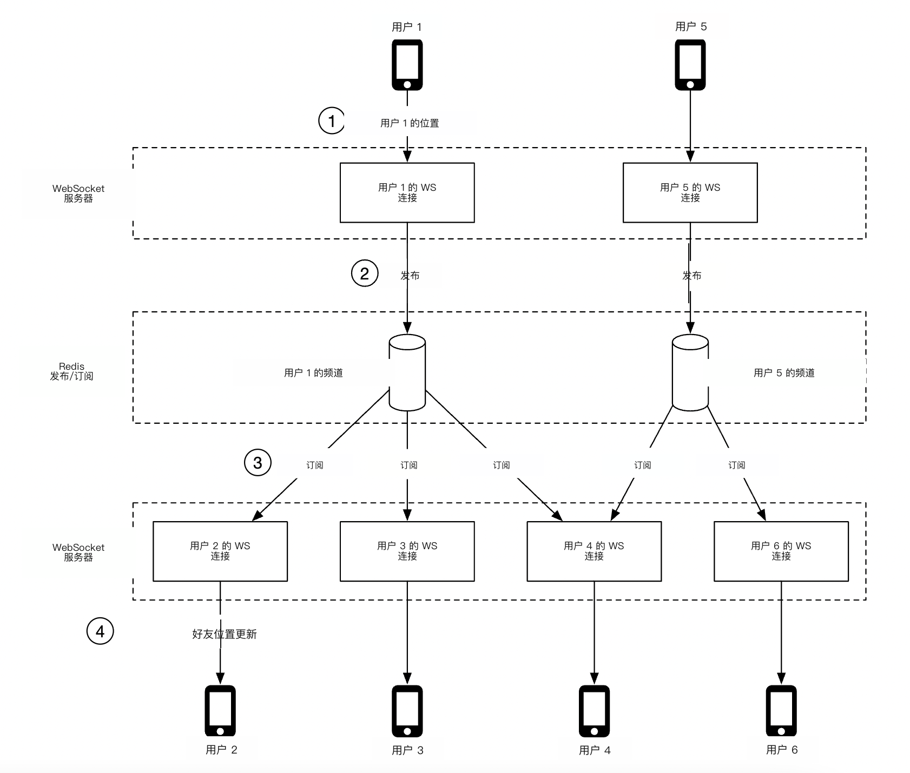
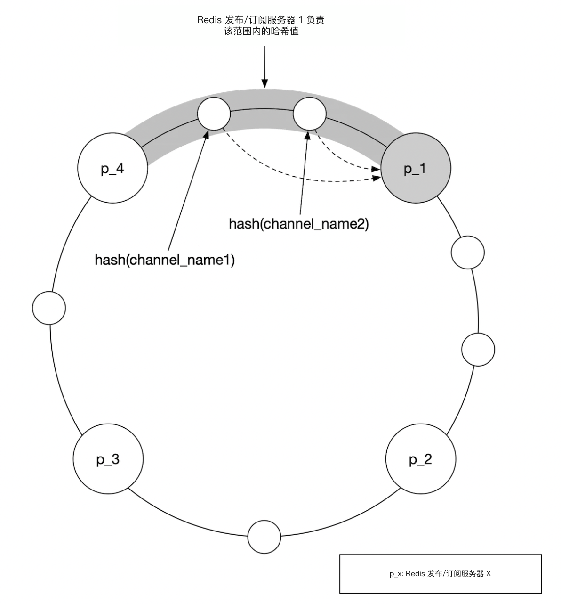
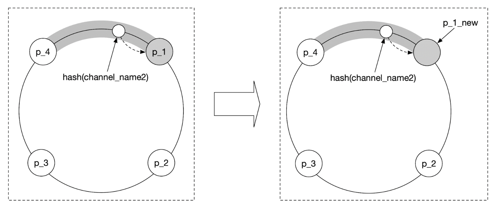
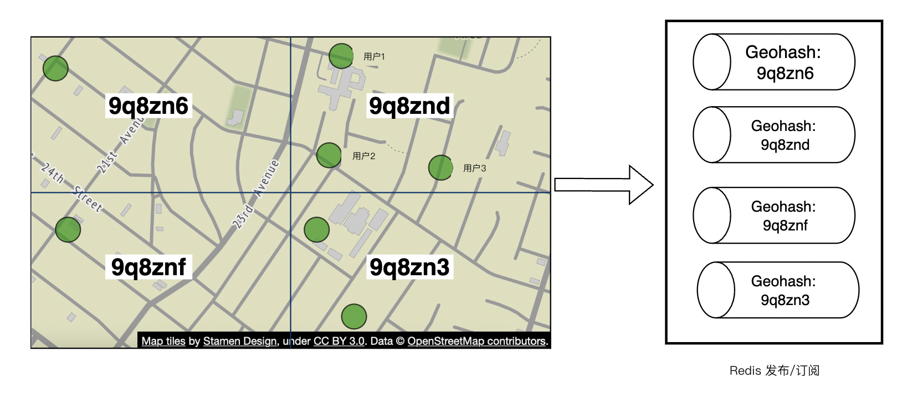
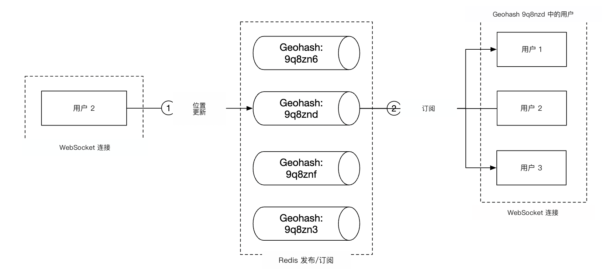

# 第 17 章：设计附近的好友

## 简介

本章重点设计一个可扩展的后端，让用户（user）能分享自己的位置，并发现**附近的**好友。

与邻近服务那一章的主要区别是：本题中**位置会不断变化**，而那一章里商家地址基本不变。

---

## 步骤 1：理解问题并确定设计范围

推动面试的一些问题：
 * 候选人：地理上多近才算「附近」？
 * 面试官：5 英里，这个数字应该可配置
 * 候选人：距离是按直线算，还是要考虑例如好友之间隔着一条河？
 * 面试官：是的，直线距离这个假设合理
 * 候选人：应用有多少用户？
 * 面试官：10 亿用户，其中 10% 使用附近的好友功能
 * 候选人：需要存储位置历史吗？
 * 面试官：需要，例如对机器学习有价值
 * 候选人：能否假设不活跃的好友会在 10 分钟后从该功能中消失？
 * 面试官：可以
 * 候选人：需要考虑 GDPR 等吗？
 * 面试官：为简单起见，不用

### **功能需求**

 * 用户应能在移动应用上看到附近的好友。每位好友有距离和时间戳，表示位置是何时更新的
 * 附近好友列表应每隔几秒更新一次

### **非功能需求**

- **低延迟**：接收位置更新时延迟不能太大
- **可靠性**：偶尔丢失数据点可以接受，但系统应大体可用
- **最终一致性（eventual consistency）**：位置数据存储不需要强一致性（strong consistency）。不同副本（replica）收到位置数据延迟几秒可以接受

### **粗略估算**

用来判断潜在规模的一些估算：
 * 附近的好友是 5 英里半径内的好友
 * 位置刷新间隔是 30 秒。人步行速度慢，因此不必太频繁更新位置。
 * 平均每天有 1 亿用户使用该功能，其中 10% 并发用户，即 1000 万
 * 平均每位用户有 400 个好友，且都使用附近的好友功能
 * 应用每页展示 20 位附近好友
 * **位置更新 QPS** = 1000 万 / 30 == ~334k 次更新每秒

---

## 步骤 2：提出高层设计并达成共识

在探讨 API 和数据模型设计之前，我们先研究通信协议，因为它不像传统的请求-响应通信模型那么常见。

### **高层设计**

高层上，我们希望在对等方之间建立有效的消息传递。这可以用点对点协议完成，但对连接不稳定、功耗约束紧的移动应用来说并不实际。

更实际的做法是用共享后端作为扇出（fan-out）机制，把消息发给你想触达的好友：

    

后端做什么？
 * 接收所有活跃用户的位置更新
 * 对每条位置更新，找出所有应收到它的活跃用户并转发给他们
 * 如果好友之间的距离超出配置阈值，则不转发位置数据

这听起来简单，但挑战在于按我们面对的规模来设计系统。

我们先从一个更简单的设计开始，在深入设计里再讨论更高级的方案：

    

- **负载均衡器（load balancer）**：把流量分到 REST API 服务器以及双向 WebSocket 服务器
- **REST API 服务器（API servers）**：处理辅助任务，例如管理好友、更新资料等
- **WebSocket 服务器**：有状态（stateful）服务器，把位置更新请求转发给相应的客户端（client）。它还负责在初始化时把附近好友的位置灌给移动客户端（后面详细讨论）。
- **Redis 位置缓存（cache）**：用来存储每位活跃用户的最新位置数据。缓存中每条记录设有 TTL。TTL 过期后，用户不再活跃，其数据从缓存中删除。
- **用户数据库**：存储用户和好友关系数据。可以用关系型或 NoSQL 数据库。
- **位置历史数据库**：存储用户位置数据的历史，不一定直接用于附近的好友功能，而是用于分析目的的历史追踪
- **Redis 发布/订阅（pub/sub）**：用作轻量消息总线，为每个用户频道的位置更新提供不同主题（topic）。

    

上例中，WebSocket 服务器订阅连接到它们的用户的频道，一旦收到位置更新就转发给相应的用户。

### **周期性位置更新**

周期性位置更新流程如下：

    

 * 移动客户端把位置更新发给负载均衡器
 * 负载均衡器把位置更新转发到该客户端在 WebSocket 服务器上的持久连接
 * WebSocket 服务器把位置数据写入位置历史数据库
 * 位置数据在位置缓存中更新。WebSocket 服务器还会把位置数据保存在内存中，供该用户后续的距离计算使用
 * WebSocket 服务器通过 Redis 发布/订阅把位置数据发布到该用户的频道
 * Redis 发布/订阅把位置更新广播给该用户频道的所有订阅者（subscriber），即负责该用户好友的服务器
 * 已订阅的 WebSocket 服务器收到位置更新，计算应把更新发给哪些用户并发送

下面是同一流程的更详细版本：

    

平均要转发 40 条位置更新，因为用户平均有 400 个好友，其中 10% 同时在线。

### **API 设计**

需要支持的 WebSocket 例程：
 * 周期性位置更新 - 用户把位置数据发给 WebSocket 服务器
 * 客户端接收位置更新 - 服务器发送好友位置数据和时间戳
 * WebSocket 客户端初始化 - 客户端发送用户位置，服务器回附近好友的位置数据
 * 订阅新好友 - WebSocket 服务器发送移动客户端应跟踪的好友 ID，例如好友第一次上线时
 * 取消订阅好友 - WebSocket 服务器发送一个好友 ID，移动客户端应取消订阅，例如因为好友下线

HTTP API - 辅助职责用传统的请求/响应载荷。

### **数据模型**

 * 位置缓存存储 `user_id` 到 `lat,long,timestamp` 的映射。Redis 很适合做这个缓存，因为我们只关心当前位置，且它支持我们用例所需的 TTL 淘汰。
 * 位置历史表存储同样的数据，但是关系表，包含上述四列。Cassandra 可用于这类数据，因为它针对写密集负载做了优化。

---

## 步骤 3：深入设计

讨论如何扩展高层设计，使其达到我们的目标规模。

### **各组件如何扩展**

- **API 服务器**：可以通过自动扩缩组和复制服务器实例轻松扩展
- **WebSocket 服务器**：我们可以轻松水平扩展（horizontal scaling）WebSocket 服务器，但下线服务器时需要优雅关闭现有连接。例如可以在负载均衡器中把服务器标为「排空」，停止向它发送连接，然后再从服务器池中移除
- **客户端初始化**：客户端第一次连到服务器时，它获取用户的好友，在 Redis 发布/订阅上订阅他们的频道，从缓存获取他们的位置，最后转发给客户端
- **用户数据库**：可以按 user_id 对数据库做分片（sharding）。把用户/好友数据通过专用服务和 API 暴露，并由专门团队管理，可能也说得通
- **位置缓存**：可以通过拉起多台 Redis 节点轻松对缓存做分片。另外，TTL 限制了任意时刻可能占用的最大内存。但我们仍要应对大量写负载
- **Redis 发布/订阅服务器**：我们利用这样一个事实：频道已初始化但未使用时不消耗内存。因此，可以为所有使用附近的好友功能的用户预分配频道，从而避免例如用户上线时再创建新频道并通知活跃的 WebSocket 服务器

### **Redis 发布/订阅组件的扩展深挖**

维护所有发布/订阅频道大约需要 200GB 内存。可以用 2 台各 100GB 的 Redis 服务器来做到。

但鉴于我们需要每秒推送约 1400 万条位置更新，我们至少需要 140 台 Redis 服务器来扛这个负载，假设单台服务器大约能处理每秒 10 万次推送。

因此，我们需要一个分布式 Redis 服务器集群来应对高强度的 CPU 负载。

为了支持分布式 Redis 集群，我们需要利用服务发现（service discovery）组件，例如 ZooKeeper 或 etcd，来跟踪哪些服务器还活着。

需要在服务发现组件中编码的数据如下：

    

WebSocket 服务器用从 ZooKeeper 取出的这些编码数据，来判断某个频道在哪。为了效率，哈希环（hash ring）数据可以缓存在每台 WebSocket 服务器的内存中。

在扩缩集群方面，可以设置每日任务，根据历史流量数据按需扩缩。也可以超额配置集群以应对负载尖峰。

Redis 集群可以当作有状态存储服务器来对待，因为频道维护着一些状态，并且需要与订阅者协调，让它们交接给集群中新配置的节点。

扩缩操作期间要注意一些潜在问题：
 * 由于频道被搬来搬去，WebSocket 服务器会发出大量重新订阅请求
 * 操作期间客户端可能会错过一些位置更新，对本题可以接受，但仍应尽量减少。考虑在一天中流量最低时做这类操作。
 * 可以用一致性哈希（consistent hashing）来尽量减少添加/删除服务器时被搬动的频道数量

    

### **添加/删除好友**

每当添加/删除好友时，负责受影响用户的 WebSocket 服务器需要订阅/取消订阅该好友的频道。

由于「附近的好友」功能是更大应用的一部分，我们可以假设移动客户端侧可以注册回调，在这些事件发生时由客户端向 WebSocket 服务器发消息，执行相应操作。

### **好友很多的用户**

可以对好友总数设上限，例如 Facebook 最多 5000 个好友。

处理「鲸鱼」用户的 WebSocket 服务器负载可能更高，但只要 WebSocket 服务器足够多，就没问题。

### **附近的随机用户**

如果面试官想更新设计，加入一项功能：偶尔在附近好友地图上弹出一个随机的人？

一种做法是按 Geohash 定义一组发布/订阅频道池：

    

该 Geohash 内的任何人订阅相应频道，以接收随机用户的位置更新：

    

我们也可以订阅多个 Geohash，以处理某人很近但位于交界 Geohash 的情况：

    

### **Redis 发布/订阅的替代**

不用 Redis 做发布/订阅的另一种选择是用 Erlang——一门为分布式计算应用优化的通用编程语言。

用它我们可以生成数百万个小型 Erlang 进程，彼此通信。我们可以在分布式 Erlang 应用内同时处理 WebSocket 连接和发布/订阅频道。

不过用 Erlang 的一个挑战是它是小众编程语言，可能很难招到优秀的 Erlang 开发者。

---

## 步骤 4：收尾

我们成功设计了一个支持附近的好友功能的系统。

核心组件：
- **WebSocket 服务器**：客户端与服务器之间的实时通信
- **Redis**：位置数据的快速读写 + 发布/订阅频道

我们还探讨了如何扩展 RESTful API 服务器、WebSocket 服务器、数据层、Redis 发布/订阅服务器，以及 Redis 发布/订阅的替代方案。我们也探讨了「附近的随机用户」功能。
