# 第 18 章：设计 Google Maps

## 简介

我们将设计一个简化版的 **Google Maps**。

关于 Google Maps 的一些事实：
 * 2005 年上线
 * 提供多种服务：卫星影像、街道地图、实时路况、路线规划
 * 到 2021 年已有 10 亿日活用户（DAU），覆盖全球 99% 的地区，每天 2500 万次实时位置信息更新

---

## 步骤 1：理解问题并确定设计范围

候选人与面试官的示例问答：
 * 候选人：我们要应对多少日活用户？
 * 面试官：10 亿 DAU
 * 候选人：应该聚焦哪些功能？
 * 面试官：位置更新、导航、预计到达时间（ETA）、地图渲染
 * 候选人：道路数据有多大？我们能拿到吗？
 * 面试官：道路数据来自多种来源，原始数据有数 TB
 * 候选人：要不要考虑路况？
 * 面试官：要，这样才能给出准确的时间估计
 * 候选人：不同出行方式呢，步行、骑行、驾车？
 * 面试官：这些都要支持
 * 候选人：多途经点导航呢？
 * 面试官：面试范围内先不讨论
 * 候选人：商家地点和照片呢？
 * 面试官：问得好，但不必考虑

我们聚焦三个关键功能：用户（user）位置更新、包含 ETA 的导航服务，以及地图渲染。

### **非功能需求**

- **准确性**：用户不能拿到错误路线
- **流畅导航**：用户应体验流畅的地图渲染
- **流量与耗电**：客户端（client）应尽量少用流量和电量。对移动设备很重要。
- 一般的可用性与可扩展性要求

### **地图基础**

进入设计之前，先了解一些地图相关概念。

#### 定位系统

地球是球体，绕地轴旋转。位置由纬度（南北方向）和经度（东西方向）定义：

<div style="margin-left:3rem">
    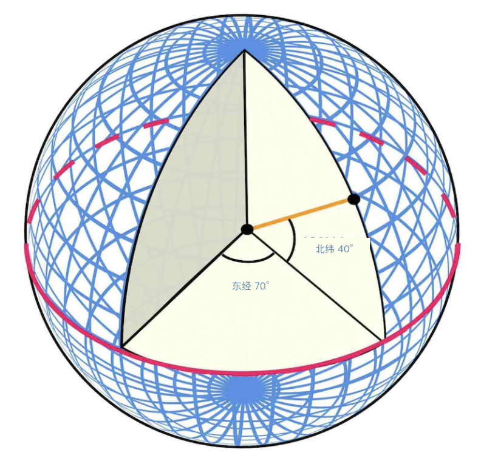
</div>

#### 从 3D 到 2D

把三维点转换到二维平面的过程叫做「地图投影（map projection）」。

做法有多种，各有利弊。几乎所有投影都会扭曲真实几何。

<div style="margin-left:3rem">
    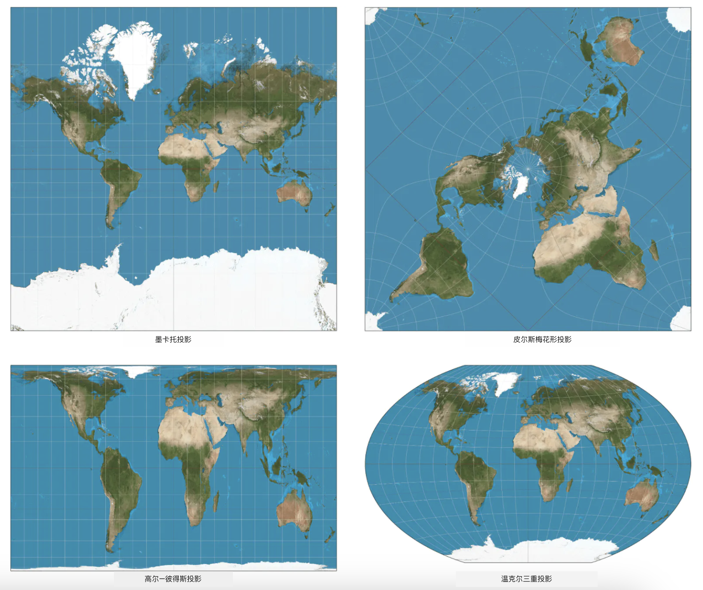
</div>

Google Maps 选用了一种修改过的墨卡托投影，叫做「Web Mercator」。

#### 地理编码

地理编码（geocoding）是把地址转换成地理坐标的过程。

反向过程叫做「逆地理编码（reverse geocoding）」。

一种做法是插值：利用 GIS 等不同来源的数据，把街道网络映射到地理坐标空间。

#### Geohash

Geohash 是一种把地理区域编码成字母和数字串的编码系统。

它把世界看成平面，并递归地四等分：

<div style="margin-left:3rem">
    
</div>

#### 地图渲染

地图渲染通过瓦片化完成。不是把整张地图画成一张巨大的定制图，而是把世界切成更小的瓦片。

客户端只下载相关的地图瓦片（map tile），再像拼马赛克一样渲染。

不同缩放级别有不同瓦片。客户端按当前缩放级别选择合适的瓦片。

例如，缩放到整颗地球时，只会下载一张 256x256 的瓦片来表示全世界。

#### 导航算法的道路数据处理

在大多数路径算法里，交叉口是节点，道路是边：

<div style="margin-left:3rem">
    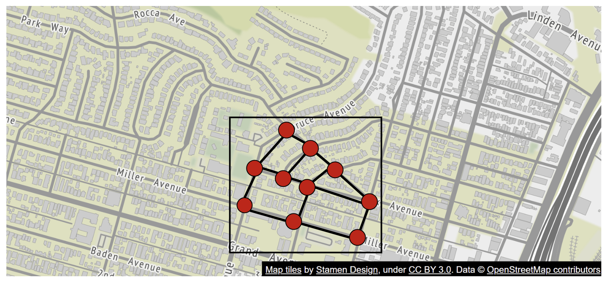
</div>

大多数导航算法使用修改版的 Dijkstra 或 A* 算法。

寻路性能对图的规模很敏感。要在这个规模上工作，不能把整个世界建成一张图再跑算法。

我们用类似瓦片化的技术：把世界切成越来越小的图。

路由瓦片保存对相邻瓦片的引用，算法遍历相互连接的瓦片时，可以把更大的道路图拼接起来：

<div style="margin-left:3rem">
    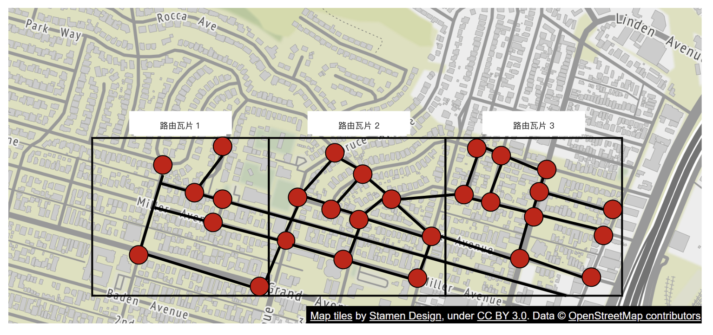
</div>

这项技术能显著降低内存带宽，只加载给定起终点对所需的瓦片。

不过对更长的路线，把小而细的路由瓦片拼起来仍然费时费内存。于是有不同细节层级的路由瓦片，算法按目的地选用合适细节的瓦片：

<div style="margin-left:3rem">
    
</div>

### **粗略估算**

存储方面需要存：
 * 世界地图：按所需全部瓦片估算约 70PB，但要考虑高度相似瓦片（例如广阔沙漠）的压缩
 * 元数据（metadata）：体积可忽略，估算时跳过
 * 道路信息：以路由瓦片形式存储

导航请求的估算 QPS：10 亿 DAU，每周使用 35 分钟 → 每天 50 亿分钟。
假设 GPS 更新请求会批量发送，得到 20 万 QPS，峰值 100 万 QPS

---

## 步骤 2：提出高层设计并达成共识

<div style="margin-left:3rem">
    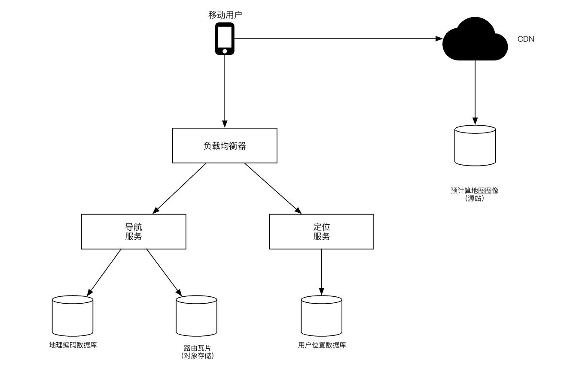
</div>

### **定位服务**

<div style="margin-left:3rem">
    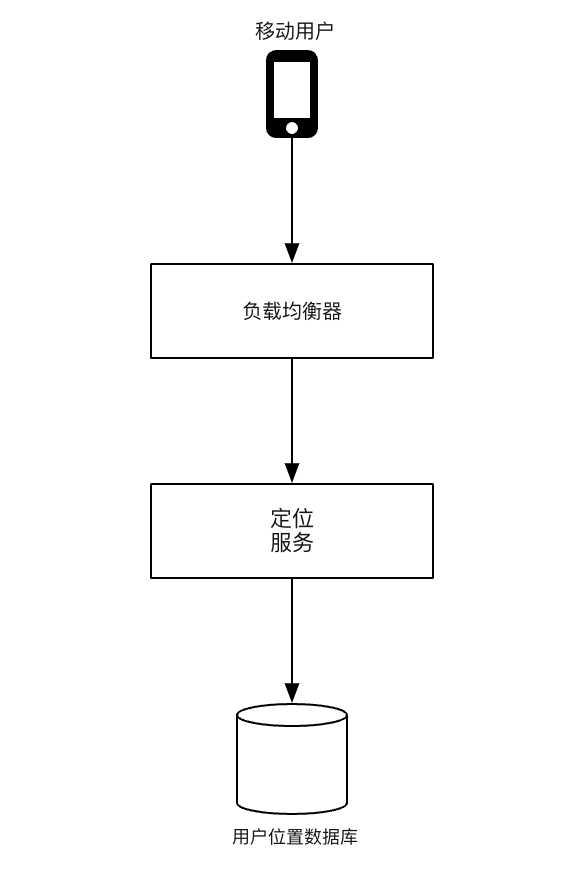
</div>

负责记录用户的位置更新：
 * 位置更新每 `t` 秒发送一次
 * 位置数据流可用于持续改进服务，例如更准确的 ETA、监控路况、检测封路、分析用户行为等

不必一直把位置更新发到服务器，可以在客户端批量收集，再发送批次：

<div style="margin-left:3rem">
    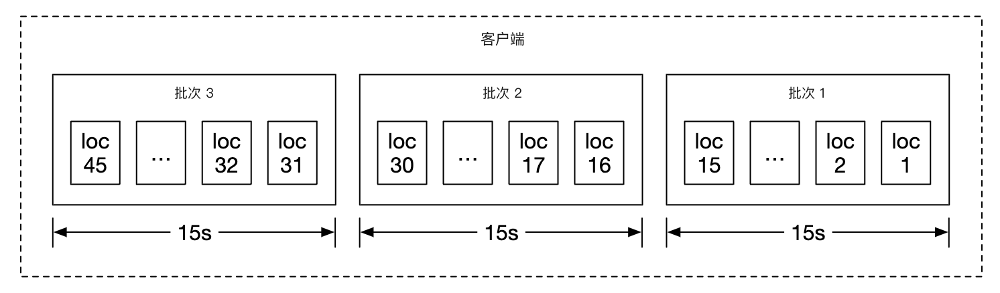
</div>

即便做了这项优化，以 Google Maps 的规模，负载仍然很大。因此可以用为重写入优化的数据库，例如 Cassandra。

还可以用 Kafka 高效地对流式位置更新做后续分析。

位置更新请求 payload 示例：

```
POST /v1/locations
Parameters
  locs: JSON encoded array of (latitude, longitude, timestamp) tuples.
```

### **导航服务**

该组件负责在合理时间内找出 A 到 B 的快速路线（一点延迟可以接受）。路线不必是最快的，但准确性很重要。

请求 payload 示例：

```
GET /v1/nav?origin=1355+market+street,SF&destination=Disneyland
```

响应示例：

```json
{
  "distance": {"text":"0.2 mi", "value": 259},
  "duration": {"text": "1 min", "value": 83},
  "end_location": {"lat": 37.4038943, "Ing": -121.9410454},
  "html_instructions": "Head <b>northeast</b> on <b>Brandon St</b> toward <b>Lumin Way</b><div style=\"font-size:0.9em\">Restricted usage road</div>",
  "polyline": {"points": "_fhcFjbhgVuAwDsCal"},
  "start_location": {"lat": 37.4027165, "lng": -121.9435809},
  "geocoded_waypoints": [
    {
       "geocoder_status" : "OK",
       "partial_match" : true,
       "place_id" : "ChIJwZNMti1fawwRO2aVVVX2yKg",
       "types" : [ "locality", "political" ]
    },
    {
       "geocoder_status" : "OK",
       "partial_match" : true,
       "place_id" : "ChIJ3aPgQGtXawwRLYeiBMUi7bM",
       "types" : [ "locality", "political" ]
    }
  ],
  "travel_mode": "DRIVING"
}
```

路况变化与重新规划暂不考虑，深入设计部分再处理。

### **地图渲染**

客户端存不下整套地图瓦片，体积是 PB 级。

需要按客户端位置和缩放级别按需从服务器拉取。

何时拉取新瓦片：用户放大/缩小时，以及导航中驶向新瓦片时。

地图瓦片如何提供给客户端？
 * 可以动态生成，但这会给服务器带来巨大负载，也难以缓存（cache）
 * 地图瓦片按 Geohash 静态提供，客户端可以自己计算。它们可以静态存放，并由 CDN 提供

<div style="margin-left:3rem">
    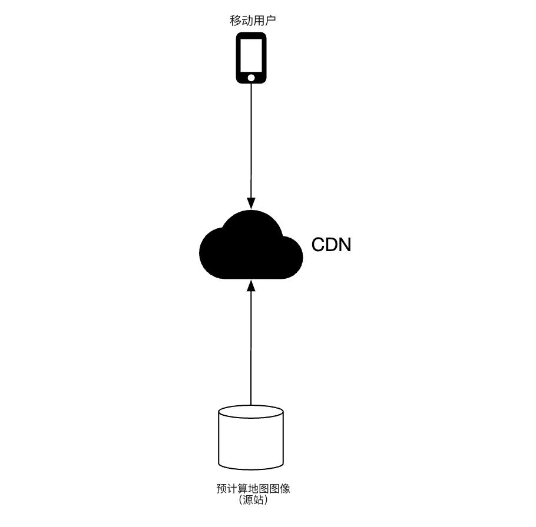
</div>

CDN 让用户从离自己最近的接入点（POP）服务器拉取地图瓦片，以降低延迟：

<div style="margin-left:3rem">
    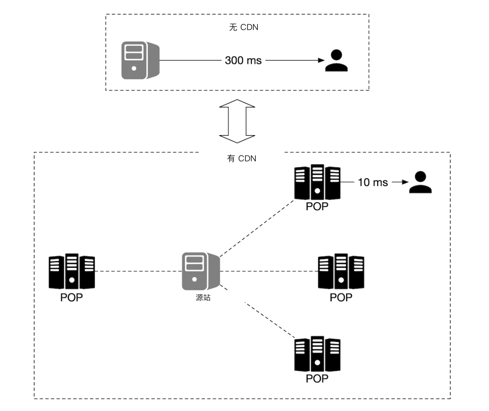
</div>

确定地图瓦片的可选方案：
 * 地图瓦片的 Geohash 可以在客户端计算。若如此，要慎重，因为这种计算方式需要长期承诺，强迫客户端升级很难
 * 或者提供一个简单 API，由服务端替客户端计算地图瓦片 URL，代价是多一次 API 调用

<div style="margin-left:3rem">
    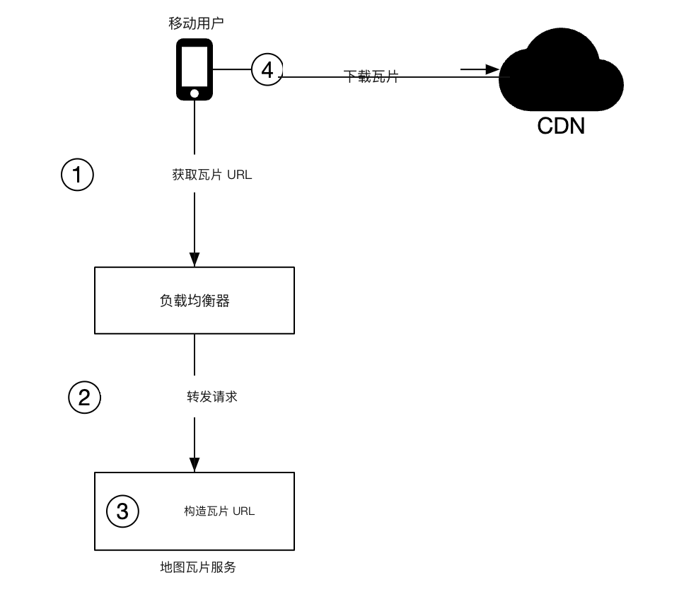
</div>

---

## 步骤 3：深入设计

### **数据模型**

讨论如何存储我们面对的各类数据。

#### 路由瓦片

初始道路数据集来自多种来源。随后根据位置更新数据持续改进。

道路数据是非结构化的。我们有一条周期性离线处理流水线，把原始数据转成应用所需的基于图的路由瓦片。

不必把这些瓦片存进数据库，因为不需要数据库功能。可以存进 S3 对象存储（object storage），并积极缓存。

还可以用库把邻接表高效压缩成二进制文件。

#### 用户位置数据

用户位置数据对更新路况以及做各类分析都很有用。

这类数据写入很重，可以用 Cassandra 存储。

示例行：

<div style="margin-left:3rem">
    
</div>

#### 地理编码数据库

该数据库存储经纬度对与地点的键值对。

读多写少，可以用 Redis，因为它读得很快。

#### 预计算的世界地图图像

如前所述，我们会预计算地图瓦片图像并存在 CDN。

<div style="margin-left:3rem">
    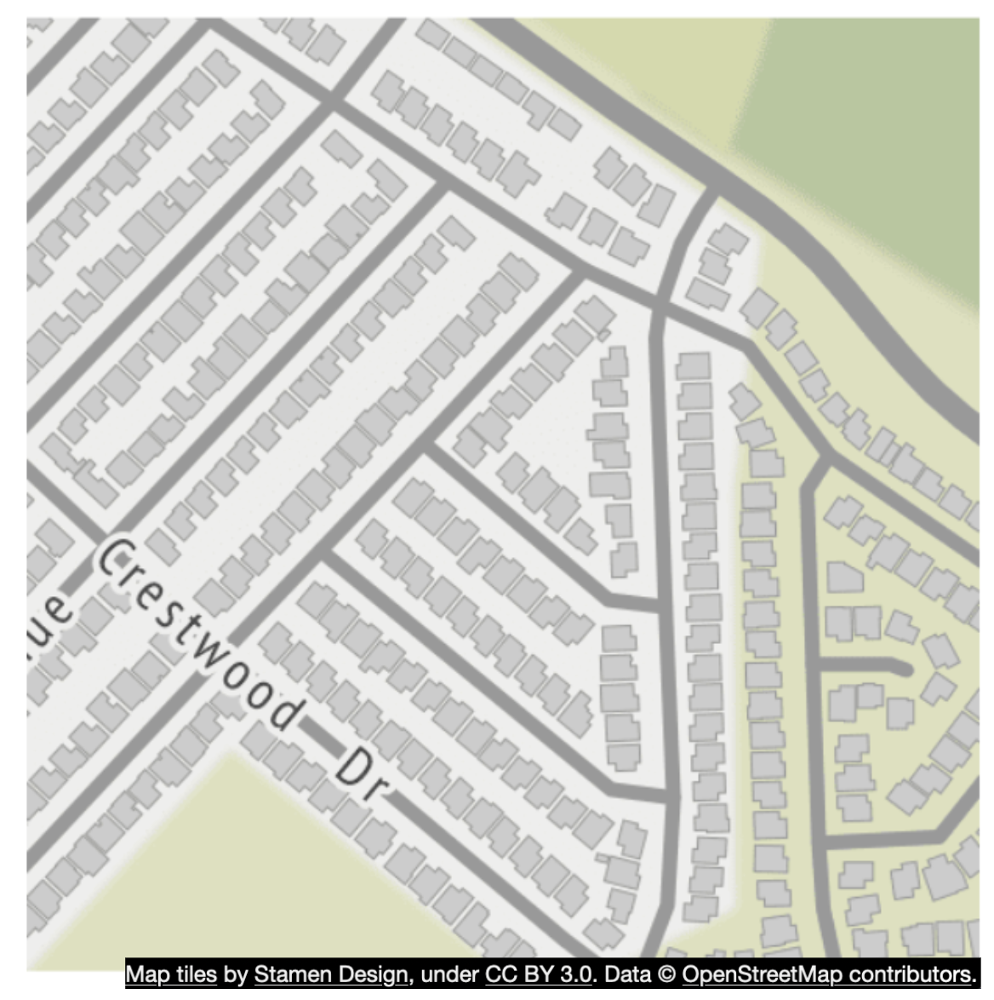
</div>

### **服务**

#### 定位服务

这一节聚焦数据库设计，以及该服务如何详细存储用户位置。

<div style="margin-left:3rem">
    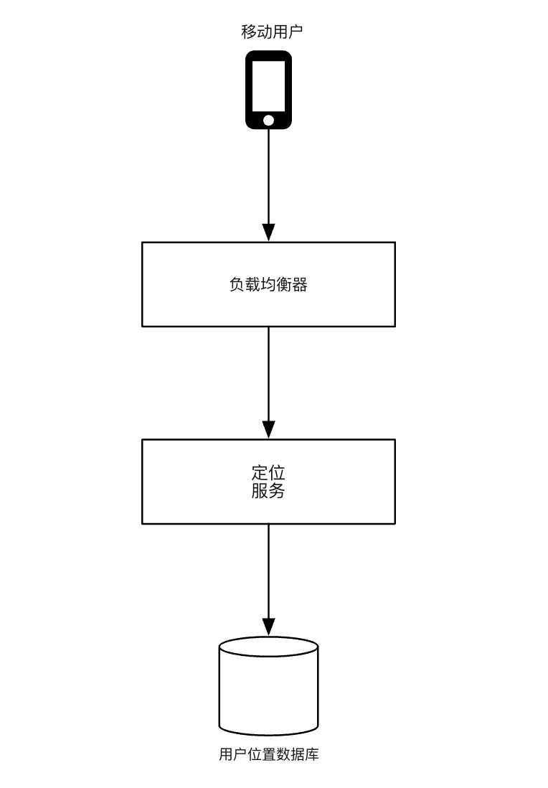
</div>

可以用 NoSQL 数据库来扛位置更新的重写入。我们优先可用性而非一致性，因为用户位置经常变化，新更新一到旧数据就过时。

选择 Cassandra，它很好地满足这些要求。

要存储的示例行：

<div style="margin-left:3rem">
    
</div>

 * `user_id` 是分区键，以便快速取出某用户的全部位置更新
 * `timestamp` 是聚类键，以便按收到位置更新的时间排序存储

我们还用 Kafka 把位置更新流给其他需要这些数据的服务：

<div style="margin-left:3rem">
    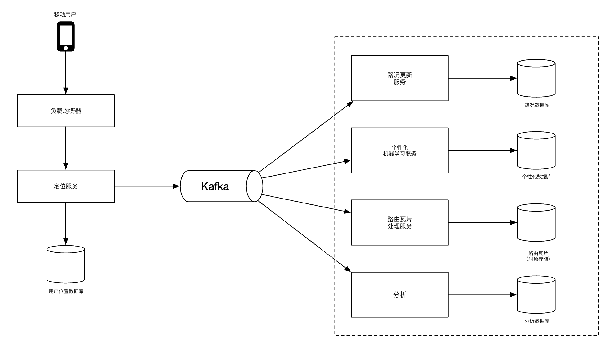
</div>

#### 渲染地图

地图瓦片按不同缩放级别存储。最低缩放级别下，整个世界用一张 256x256 瓦片表示。

缩放级别升高时，瓦片数量变为四倍：

<div style="margin-left:3rem">
    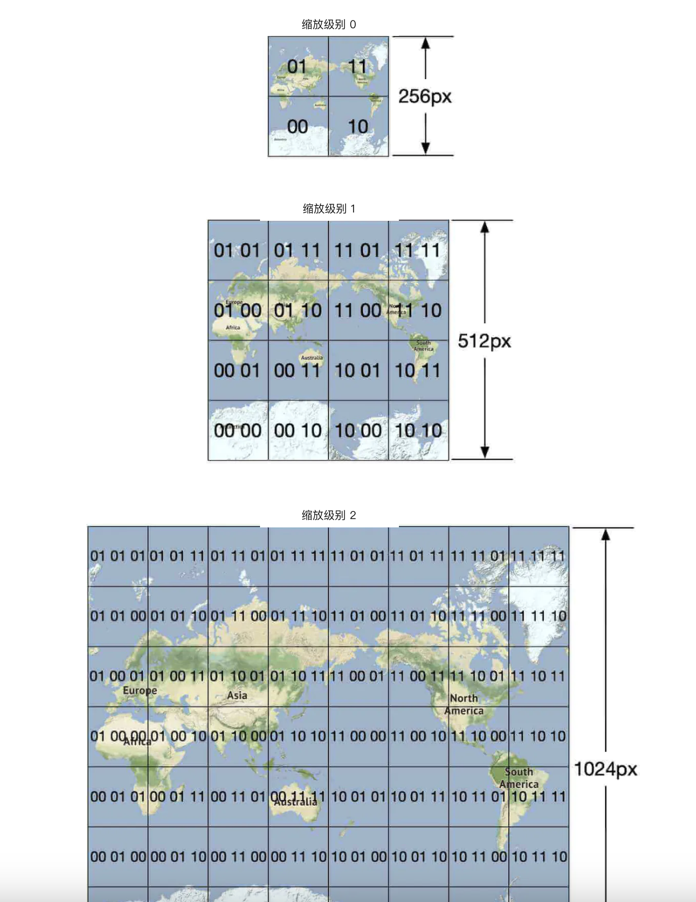
</div>

一项优化是：不在网络上发送完整图像信息，而是把瓦片表示成向量（路径和多边形），让客户端动态渲染。

这会显著节省带宽。

#### 导航服务

该服务负责找最快路线：

<div style="margin-left:3rem">
    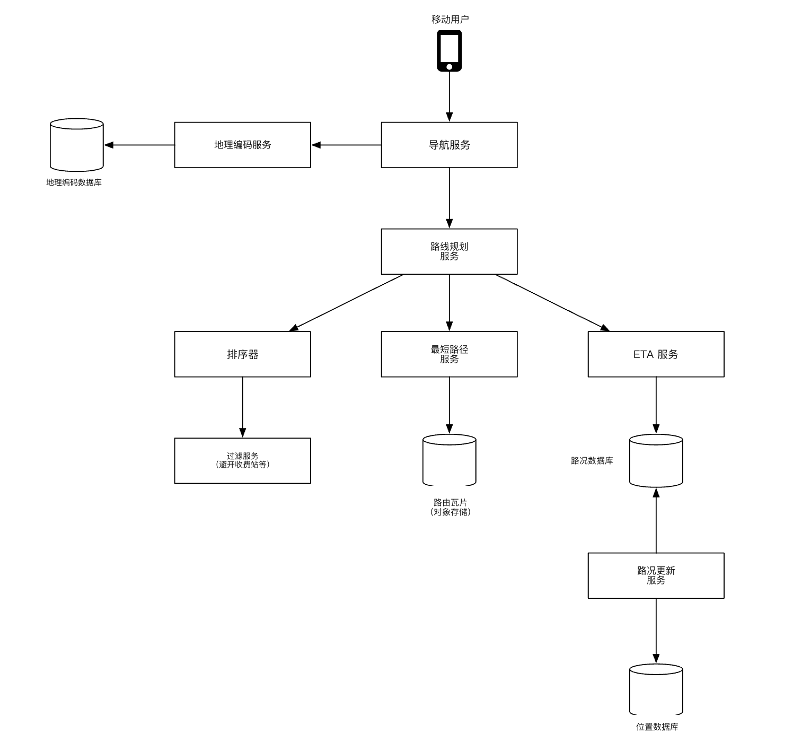
</div>

我们逐个看这个子系统里的组件。

首先是地理编码服务，把地址解析成经纬度对。

请求示例：

```
https://maps.googleapis.com/maps/api/geocode/json?address=1600+Amphitheatre+Parkway,+Mountain+View,+CA
```

响应示例：

```json
{
   "results" : [
      {
         "formatted_address" : "1600 Amphitheatre Parkway, Mountain View, CA 94043, USA",
         "geometry" : {
            "location" : {
               "lat" : 37.4224764,
               "lng" : -122.0842499
            },
            "location_type" : "ROOFTOP",
            "viewport" : {
               "northeast" : {
                  "lat" : 37.4238253802915,
                  "lng" : -122.0829009197085
               },
               "southwest" : {
                  "lat" : 37.4211274197085,
                  "lng" : -122.0855988802915
               }
            }
         },
         "place_id" : "ChIJ2eUgeAK6j4ARbn5u_wAGqWA",
         "plus_code": {
            "compound_code": "CWC8+W5 Mountain View, California, United States",
            "global_code": "849VCWC8+W5"
         },
         "types" : [ "street_address" ]
      }
   ],
   "status" : "OK"
}
```

路线规划服务根据当前路况计算建议路线，按出行时间优化。

最短路径服务对对象存储中的路由瓦片跑变种 A* 算法，算出最优路径：
 * 它接收起终点对，转成经纬度，再从经纬度得到 Geohash，从而得到路由瓦片
 * 算法从起始路由瓦片开始遍历，直到找到足够好的通往目的地瓦片的路径

<div style="margin-left:3rem">
    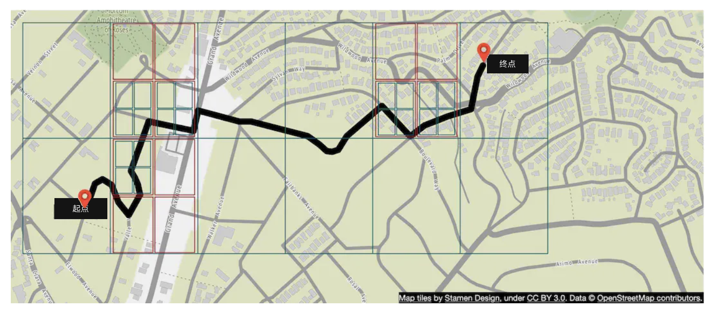
</div>

ETA 服务由路线规划器调用，用机器学习算法根据路况数据预测 ETA。

排序服务根据用户传入的过滤条件给不同路径排序，例如避开收费站或高速公路的标志。

更新服务异步更新一些重要数据库，保持它们最新。

#### 改进：自适应 ETA 与重新规划

一项改进是根据新到的路况数据，自适应更新进行中的路线。

一种实现是：把正在导航的用户存进数据库，记下他们将经过的全部瓦片。

数据可能像这样：

```
user_1: r_1, r_2, r_3, …, r_k
user_2: r_4, r_6, r_9, …, r_n
user_3: r_2, r_8, r_9, …, r_m
...
user_n: r_2, r_10, r21, ..., r_l
```

如果某块瓦片上发生交通事故，我们可以找出路径经过该瓦片的所有用户并重新规划。

为减少数据库中存储的瓦片数量，可以只存起点路由瓦片，以及若干不同分辨率层级的路由瓦片，直到把目的地瓦片也包含进来：

```
user_1, r_1, super(r_1), super(super(r_1)), ...
```

<div style="margin-left:3rem">
    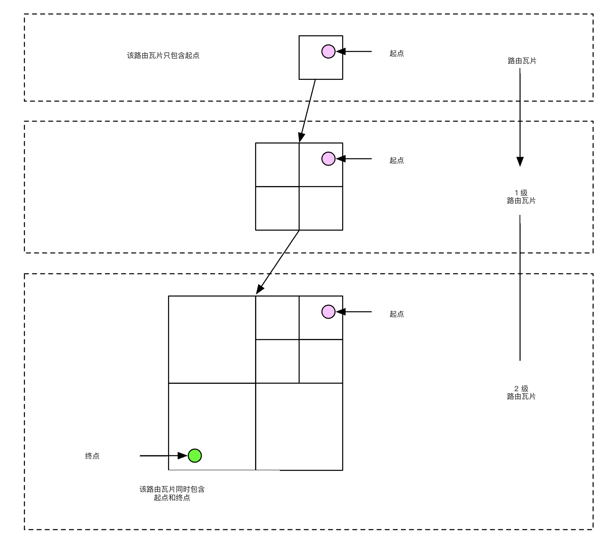
</div>

这样，只需检查用户的最终瓦片是否包含事故瓦片，就能判断该用户是否受影响。

还可以跟踪导航用户的所有可能路线，若有更快的改道则通知他们。

#### 投递协议

有几种选项可以让服务器主动把数据推给客户端：
 * 移动推送通知不行，因为 payload 有限，而且 Web 应用不可用
 * WebSocket 通常比长轮询（long polling）更好，因为对服务器的计算占用更少
 * 也可以用服务端推送事件（SSE），但我们更倾向 WebSocket，因为它支持双向通信，例如最后一公里配送功能会用得上

---

## 步骤 4：收尾

这是最终设计：

<div style="margin-left:3rem">
    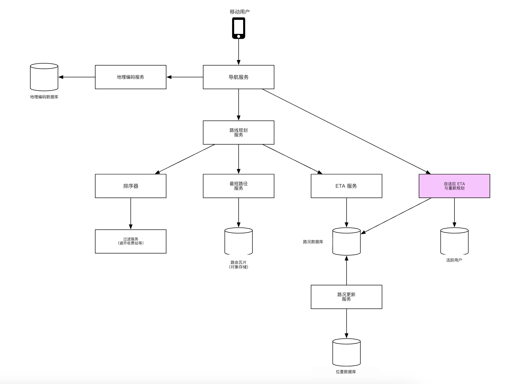
</div>

还可以提供多途经点导航，卖给 Uber 或 Lyft 等企业客户，用来为访问一组地点确定最优路径。
