# 第 19 章：设计分布式消息队列

## 简介

本章将设计一个**分布式消息队列（distributed message queue）**。

消息队列的好处：
- **解耦**：消除组件之间的紧耦合，让它们可以分别更新。
- **提升可扩展性**：生产者（producer）和消费者（consumer）可以按流量独立扩展。
- **提高可用性**：系统一部分宕机时，其他部分仍可继续与队列（queue）交互。
- **更好的性能**：生产者可以发消息而不必等待消费者确认。

一些常见的消息队列实现：Kafka、RabbitMQ、RocketMQ、Apache Pulsar、ActiveMQ、ZeroMQ。

严格来说，Kafka 和 Pulsar 并不是消息队列，而是事件流平台。
不过功能在趋同，消息队列和事件流平台之间的界限已经变模糊。

本章会做一个支持更进阶功能的消息队列，例如长时间数据保留、消息重复消费等。

---

## 步骤 1：理解问题并确定设计范围

消息队列至少要支持一些基本功能：生产者生产消息，消费者消费消息。
不过在性能、消息投递、数据保留等方面，还有不同的考量。

候选人与面试官的示例问答：
 * 候选人：消息的格式和平均大小是怎样的？是不是只有文本？
 * 面试官：消息只有文本，通常几 KB
 * 候选人：消息能否被重复消费？
 * 面试官：可以，不同消费者可以重复消费同一条消息。这是额外需求，传统消息队列不支持。
 * 候选人：消息是否按生产时的顺序消费？
 * 面试官：是，要保证顺序。这也是额外需求，传统消息队列不支持。
 * 候选人：数据保留有什么要求？
 * 面试官：消息需要保留两周。这也是额外需求。
 * 候选人：要支持多少生产者和消费者？
 * 面试官：越多越好。
 * 候选人：要支持哪种投递语义？至多一次（at-most-once）、至少一次（at-least-once）、精确一次（exactly-once）？
 * 面试官：至少一次是必须的。理想情况是三种都支持，并且可配置。
 * 候选人：端到端延迟对应的目标吞吐量是多少？
 * 面试官：要能支撑日志聚合这类高吞吐场景，也要能支撑更传统的低吞吐场景。

### **功能需求**

 * 生产者把消息发到消息队列
 * 消费者从队列消费消息
 * 消息可以消费一次，也可以重复消费
 * 历史数据可以被截断
 * 消息大小在 KB 量级
 * 需要保持消息顺序
 * 投递语义可配置：至多一次 / 至少一次 / 精确一次。

### **非功能需求**

- **高吞吐或低延迟**：按用例可配置
- **可扩展**：系统应是分布式的，并能应对消息量突然激增
- **持久且耐用**：数据应落盘，并在节点之间复制

传统消息队列通常不支持数据保留，也不保证顺序。这会大大简化设计，我们后面会讨论。

---

## 步骤 2：提出高层设计并达成共识

消息队列的关键组件：

    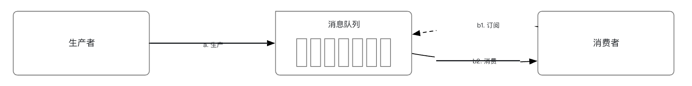

 * 生产者把消息发到队列
 * 消费者订阅队列，并消费已订阅的消息
 * 消息队列是中间的服务，把生产者和消费者解耦，让它们可以独立扩展。
 * 生产者和消费者都是客户端（client），消息队列是服务端。

### **消息模型**

第一种消息模型是点对点，常见于传统消息队列：

    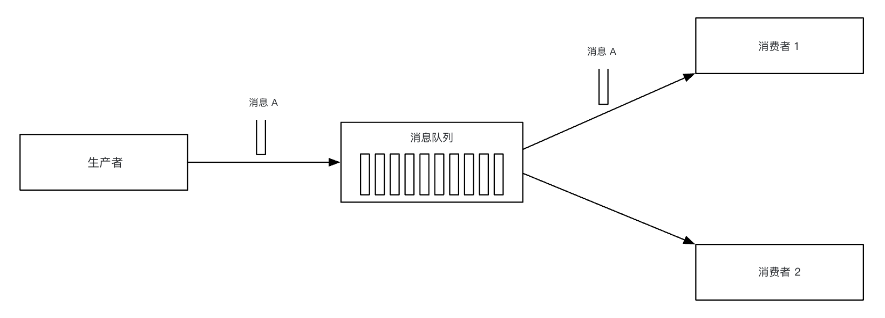

 * 消息发到队列后，恰好被一个消费者消费。
 * 可以有多个消费者，但一条消息只会被消费一次。
 * 消息被确认为已消费后，就从队列中删除。
 * 点对点模型没有数据保留，但我们的设计会有。

另一方面，发布/订阅（pub/sub）模型在事件流平台里更常见：

    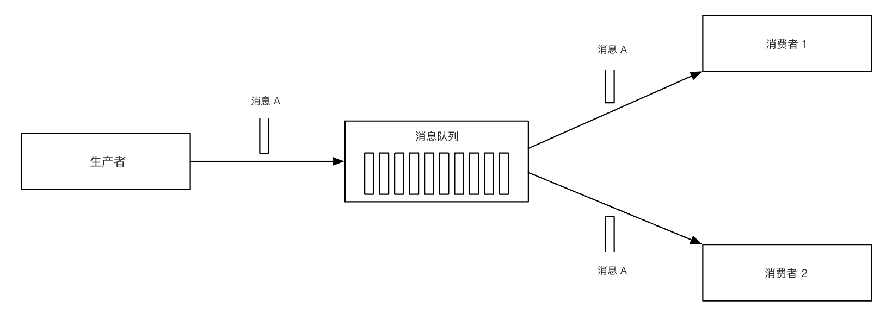

 * 在这个模型里，消息关联到一个主题（topic）。
 * 消费者订阅某个主题，并接收发到该主题的全部消息。

### **主题、分区与 Broker**

如果一个主题的数据量太大怎么办？一种扩展方式是把主题拆成分区（partition）（也就是分片（sharding））：

    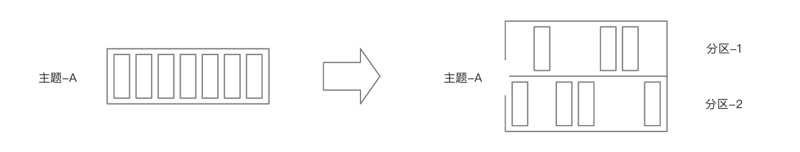

 * 发到主题的消息会均匀分布到各个分区
 * 托管分区的服务器叫做 Broker
 * 每个主题都像队列一样用 FIFO 处理消息。分区内保持消息顺序。
 * 消息在分区中的位置叫做**偏移量（offset）**。
 * 每条生产出来的消息都会发到某个具体分区。分区键指定消息落到哪个分区。
   * 例如可以用 `user_id` 做分区键，保证同一用户的消息顺序。
 * 每个消费者订阅一个或多个分区。多个消费者消费同一批消息时，组成一个消费者组（consumer group）。

### **消费者组**

消费者组是一组一起从某个主题消费消息的消费者：

    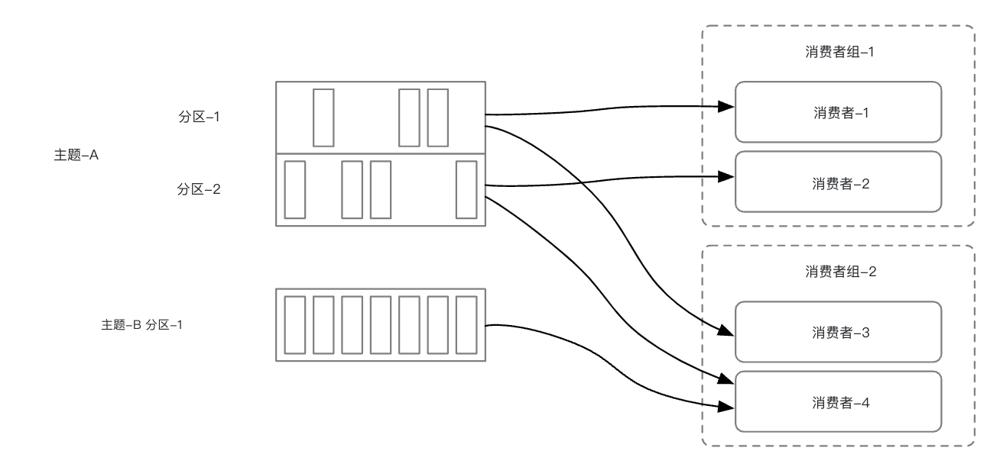

 * 消息按消费者组复制（而不是按消费者）。
 * 每个消费者组维护自己的偏移量。
 * 消费者组并行读消息能提高吞吐，但会削弱顺序保证。
 * 缓解办法是：同一组内只允许一个消费者订阅某个分区。
 * 这意味着组内消费者数不能超过分区数。

### **高层架构**

    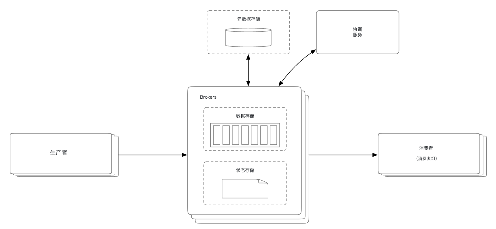

- **客户端**：生产者和消费者。生产者把消息推到指定主题。消费者组订阅某个主题的消息。
- **Broker**：持有多个分区。一个分区保存某个主题的一部分消息。
- **数据存储**：把消息存在分区里。
- **状态存储**：保存消费者状态。
- **元数据（metadata）存储**：保存配置和主题属性
- **协调服务**：负责服务发现（service discovery）（哪些 Broker 还活着）以及领导者选举（哪个 Broker 是领导者，负责分配分区）。

---

## 步骤 3：深入设计

为了达到高吞吐，并满足长时间数据保留，我们做了几项重要设计选择：
 * 选用一种磁盘上的数据结构，利用现代 HDD 的特性和现代操作系统的磁盘缓存（cache）策略。
 * 消息数据结构是不可变的，避免额外拷贝——在高流量系统里我们不想做拷贝。
 * 写入围绕批处理来设计，因为小 I/O 是高吞吐的敌人。

### **数据存储**

要为消息找到最合适的存储，必须先看消息的特性：
 * 写多、读多
 * 没有更新/删除操作。传统消息队列里有「删除」，因为消息不保留。
 * 主要是顺序读写。

有哪些选项：
- **数据库**：不理想，因为典型数据库很难同时把读写都做得很好。
- **WAL（write-ahead log）**：纯文本文件，只支持追加，对 HDD 非常友好。
  * 我们把分区拆成段，避免维护一个巨大文件。
  * 旧段只读。只有最新段接受写入。

    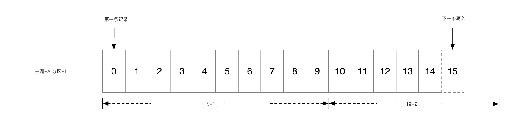

WAL 文件配传统 HDD 时效率极高。

有一种误解是 HDD 访问很慢，但这很大程度上取决于访问模式。
访问模式是顺序的时候（也就是我们的情况），HDD 可以达到每秒数 MB 的读写速度，对我们来说足够。
我们还顺便利用操作系统会积极把磁盘数据缓存在内存里这一点。

### **消息数据结构**

消息模式在生产者、队列和消费者之间保持一致很重要，这样可以避免额外拷贝，处理会高效得多。

消息结构示例：

    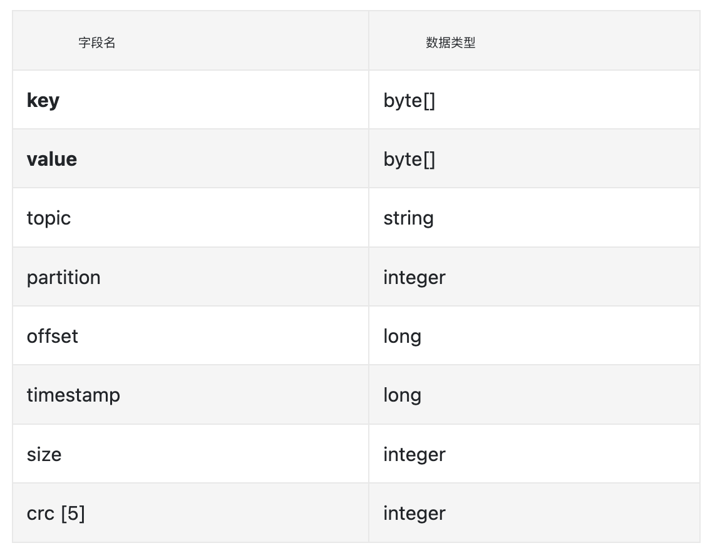

消息的 key 指定它属于哪个分区。一种映射例子是 `hash(key) % numPartitions`。
为了更灵活，生产者可以覆盖默认 key，从而控制消息如何分布到分区。

消息的 value 是载荷。可以是明文，也可以是压缩过的二进制块。

**注意：** 和传统键值存储（key-value store）不同，消息的 key 不必唯一。可以有重复 key，甚至可以缺失。

其他消息字段：
- **Topic**：消息所属主题
- **Partition**：消息所属分区的 ID
- **Offset**：消息在分区中的位置。一条消息可以通过 `topic`、`partition`、`offset` 定位。
- **Timestamp**：消息被存储的时间
- **Size**：这条消息的大小
- **CRC**：校验和，用于保证消息完整性

加上额外字段，还可以支持过滤等功能。

### **批处理**

批处理对本系统的性能至关重要。我们在生产者、消费者和消息队列上都使用它。

之所以关键，是因为：
 * 它让操作系统把消息打成组，摊薄昂贵的网络往返成本
 * 消息按组顺序写入 WAL，带来大量顺序写和磁盘缓存。

延迟和吞吐之间有权衡：
 * 批越大，吞吐越高、延迟也越高。
 * 批越小，吞吐越低、延迟也越低。

如果系统按传统消息队列部署、需要更低延迟，可以把批大小调小。

如果按吞吐调优，可能需要给每个主题配更多分区，以弥补顺序磁盘写吞吐变慢。

### **生产者流程**

如果生产者要把消息发到某个分区，它该连哪台 Broker？

一种做法是引入路由层，把消息路由到正确的 Broker。如果开启了复制，正确的 Broker 就是领导者副本（replica）：

    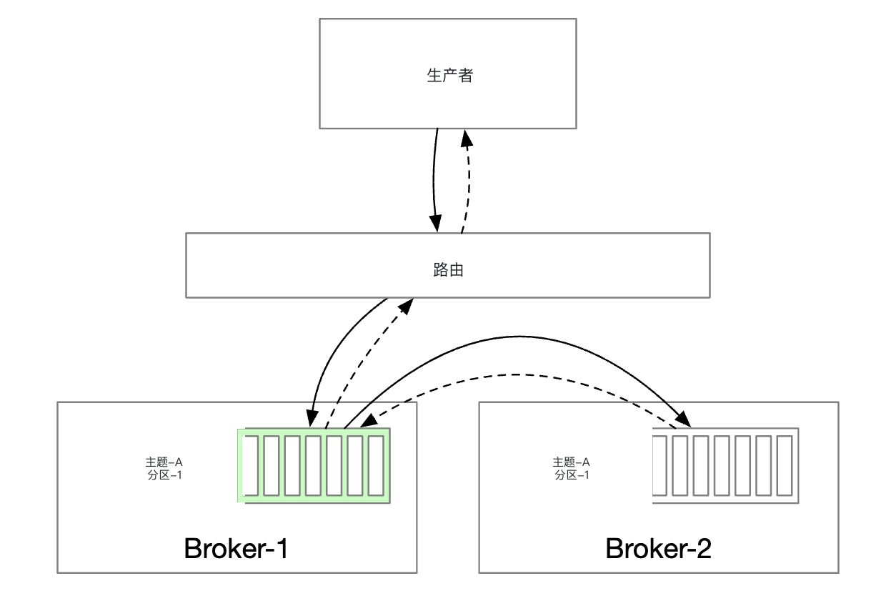

 * 路由层从元数据存储读取复制计划，并缓存在本地。
 * 生产者把消息发给路由层。
 * 消息被转发到 Broker 1，它是该分区的领导者
 * 跟随者副本从领导者拉取新消息。收到足够确认后，领导者提交数据并响应生产者。

做副本是为了容错。

这种做法能工作，但有一些缺点：
 * 多了一个组件，多了网络跳数
 * 这个设计没法把消息做批处理

为了缓解这些问题，可以把路由层嵌进生产者：

    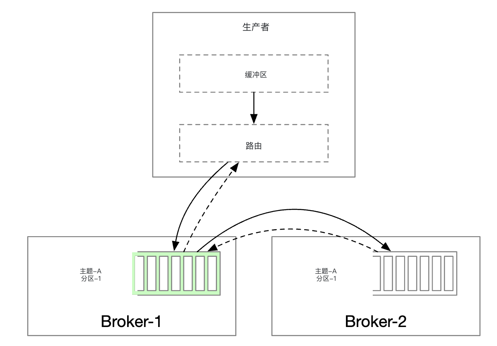

 * 更少的网络跳数带来更低延迟
 * 生产者可以控制消息路由到哪个分区
 * 缓冲区让我们可以在内存里攒批，再一次请求发出更大的批次，从而提高吞吐。

批大小的选择是吞吐和延迟之间的经典权衡。

    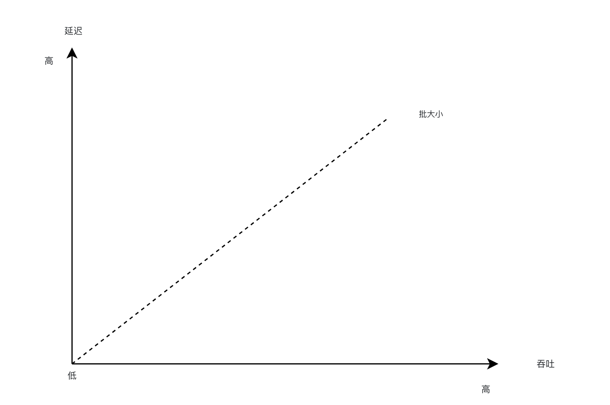

 * 批越大，提交前等待越久。
 * 批越小，请求更快发出、延迟更低，但吞吐也更低。

### **消费者流程**

消费者指定它在某个分区中的偏移量，并从该偏移量开始收到一块消息：

    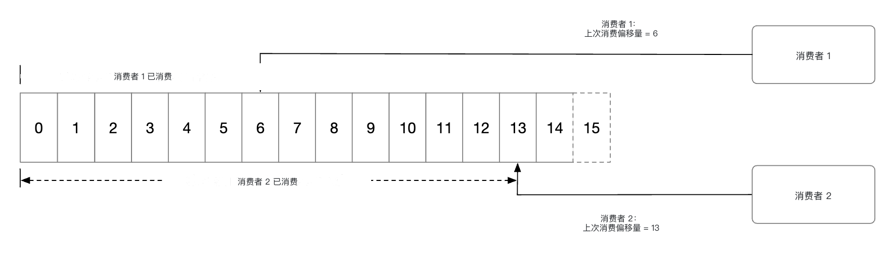

设计消费者时，一个重要考量是用推送还是拉取模型：
- **推送模型**：延迟更低，因为 Broker 一收到消息就推给消费者。
  * 但如果消费速率跟不上生产速率，消费者可能被压垮。
  * 消费者处理能力各不相同，而消费速率由 Broker 控制，处理起来很棘手。
- **拉取模型**：由消费者控制消费速率。
  * 如果消费慢，消费者不会被压垮，我们可以扩容来追上。
  * 拉取模型更适合批处理，因为推送模型下 Broker 不知道消费者能处理多少消息。
  * 另一方面，拉取模型里消费者可以积极拉取大批消息。
  * 缺点是延迟更高，而且没有新消息时会有额外网络调用。后者可以用长轮询（long polling）缓解。

因此，大多数消息队列（以及我们）选择拉取模型。

    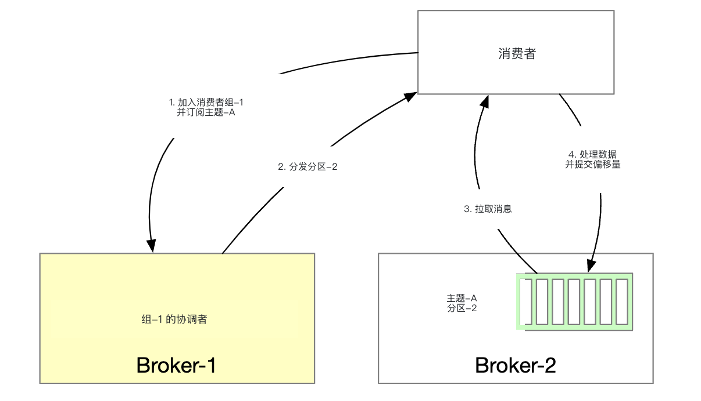

 * 新消费者订阅主题 A，并加入组 1。
 * 正确的 Broker 节点通过对组名做哈希找到。这样，同一组的所有消费者都连到同一台 Broker。
 * 注意这个消费者组协调者（coordinator）不同于协调服务（ZooKeeper）。
 * 协调者确认该消费者已加入组，并把分区 2 分配给它。
 * 分区分配策略有多种：轮询、范围等。
 * 消费者从上次偏移量拉取最新消息。状态存储保存消费者偏移量。
 * 消费者处理消息，并把偏移量提交给 Broker。这两步的顺序会影响投递语义。

### **消费者再均衡**

消费者再均衡负责决定哪些消费者负责哪些分区。

这个过程发生在消费者加入/离开，或分区增加/删除时。

作为协调者的 Broker 在编排再均衡工作流中扮演重要角色。

    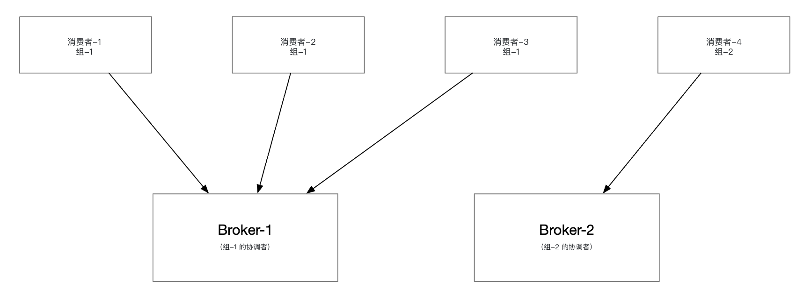

 * 同一组的所有消费者都连到同一个协调者。协调者通过对组名做哈希找到。
 * 当消费者列表变化时，协调者选出该组的新领导者。
 * 组领导者算出新的分区分发计划，回报给协调者，再由协调者广播给其他消费者。

当协调者不再收到组内消费者的心跳（heartbeat）时，会触发再均衡：

    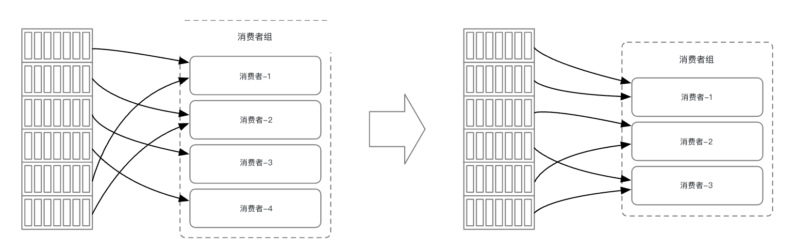

来看消费者加入组时会发生什么：

    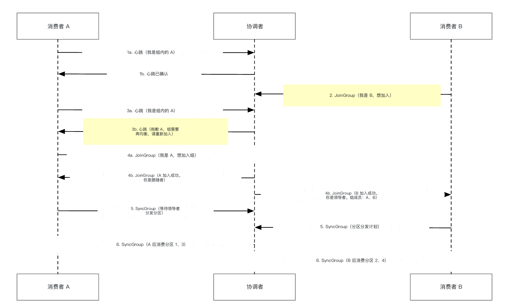

 * 一开始组里只有消费者 A，它消费全部分区。
 * 消费者 B 发请求加入组。
 * 协调者被动通知所有组成员该再均衡了——作为心跳的响应。
 * 所有消费者重新加入组后，协调者选出领导者，并把选举结果通知其他人。
 * 领导者生成分区分发计划并发给协调者。其他人等待分发计划。
 * 消费者开始从新分配的分区消费。

消费者离开组时会发生这些：

    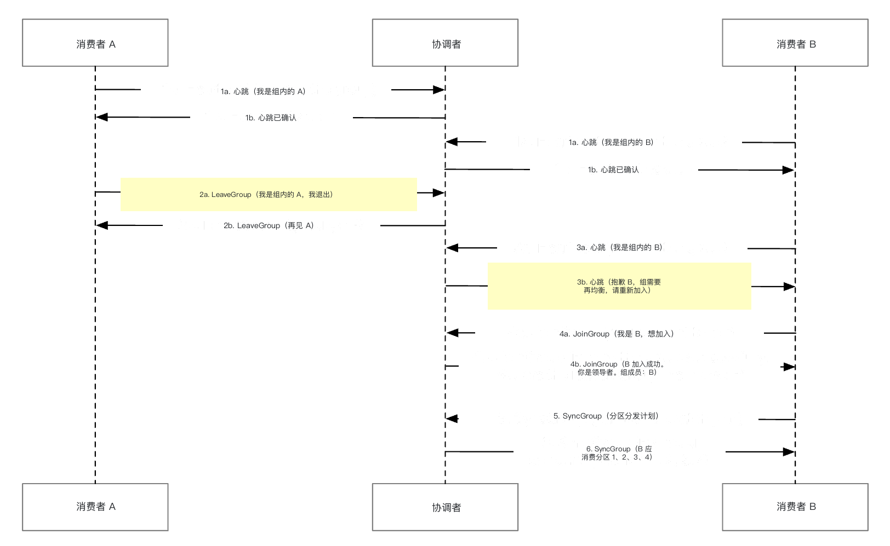

 * 消费者 A 和 B 在同一组
 * 消费者 B 请求离开组
 * 协调者收到 A 的心跳时，告知该再均衡了。
 * 其余步骤相同。

消费者很长时间不发心跳时，过程类似：

    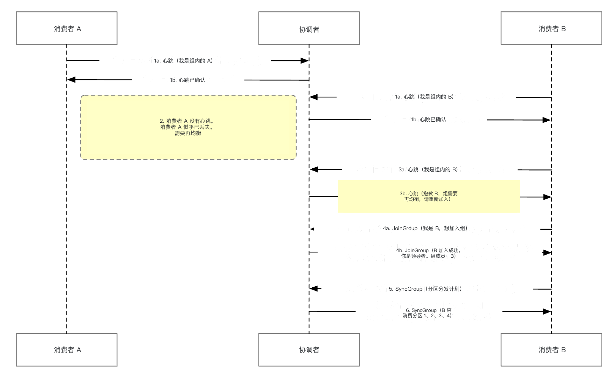

### **状态存储**

状态存储保存分区与消费者的映射，以及某个分区上次消费的偏移量。

    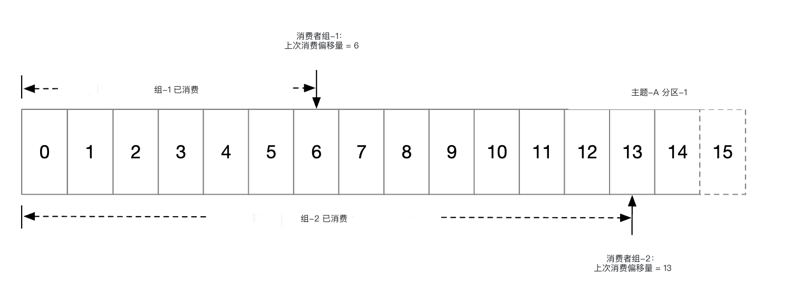

组 1 的偏移量在 6，表示之前的消息都已消费。如果消费者崩溃，新消费者会从那条消息继续。

消费者状态的数据访问模式：
 * 读写频繁，但数据量小
 * 数据更新频繁，很少删除
 * 随机读写
 * 数据一致性很重要

鉴于这些需求，像 ZooKeeper 这样的快速 KV 存储很合适。

### **元数据存储**

元数据存储保存配置和主题属性：分区数、保留期、副本分布。

元数据不常变，量也小，但对一致性要求高。
ZooKeeper 是这个存储的好选择。

### **ZooKeeper**

ZooKeeper 对构建分布式消息队列至关重要。

它是分层键值存储，常用于分布式配置、同步服务和命名注册表（也就是服务发现）。

    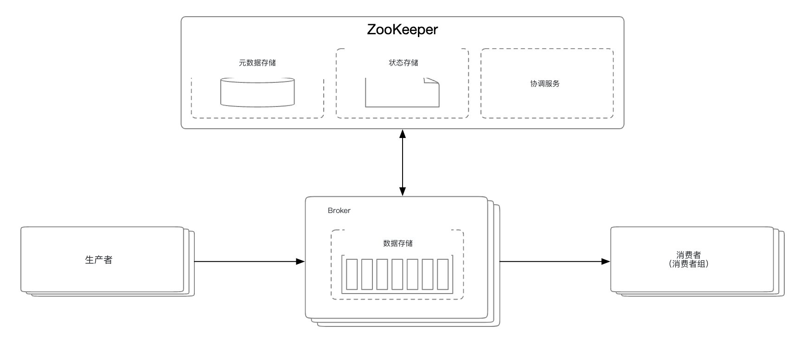

有了这一层，Broker 只需要维护消息数据。元数据和状态存储放在 ZooKeeper。

ZooKeeper 也帮助做 Broker 副本的领导者选举。

### **复制**

在分布式系统里，硬件问题不可避免。我们可以通过复制来实现高可用（high availability）。

    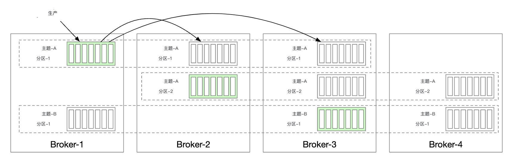

 * 每个分区在多台 Broker 上复制，但只有一个领导者副本。
 * 生产者把消息发给领导者副本
 * 跟随者从领导者拉取复制的消息
 * 足够多的副本同步后，领导者向生产者返回确认
 * 每个分区的副本分布叫做副本分布计划。
 * 给定分区的领导者创建副本分布计划，并保存在 ZooKeeper

### **同步副本**

一个需要解决的问题是：让某个分区的领导者和跟随者之间的消息保持同步。

同步副本（ISR）是与领导者保持同步的分区副本。

`replica.lag.max.messages` 定义副本可以落后领导者多少条消息，仍被视为同步。

    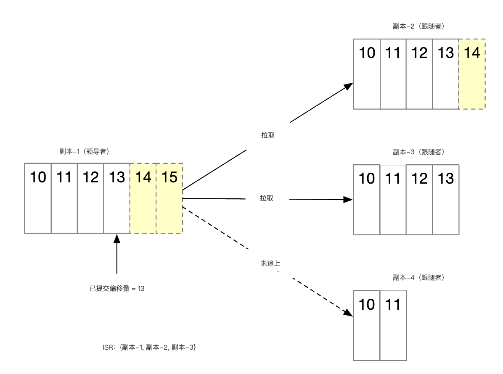

 * 已提交偏移量是 13
 * 两条新消息已写入领导者，但尚未提交。
 * 一条消息在 ISR 中的所有副本都同步后才提交
 * 副本 2 和 3 已经完全追上领导者，因此它们在 ISR 中
 * 副本 4 落后了，因此暂时从 ISR 中移除

ISR 体现了性能和耐久性之间的权衡。
 * 为了让生产者不丢消息，应在所有副本同步后再发确认
 * 但一个慢副本会导致整个分区不可用

确认处理是可配置的。

`ACK=all` 表示 ISR 中的所有副本都必须同步这条消息。发送慢，但消息耐久性最高。

    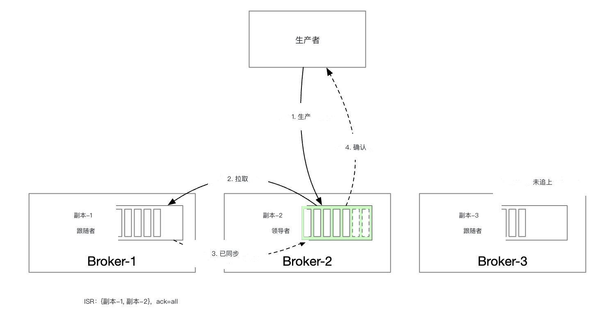

`ACK=1` 表示领导者收到消息后，生产者就收到确认。发送快，但消息耐久性低。

    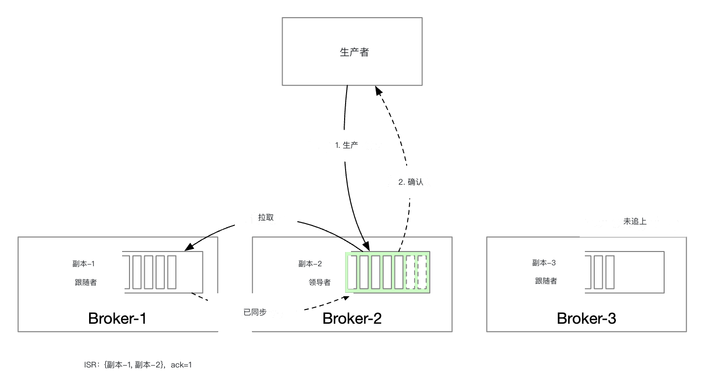

`ACK=0` 表示生产者发消息时不等待领导者的任何确认。发送最快，消息耐久性最低。

    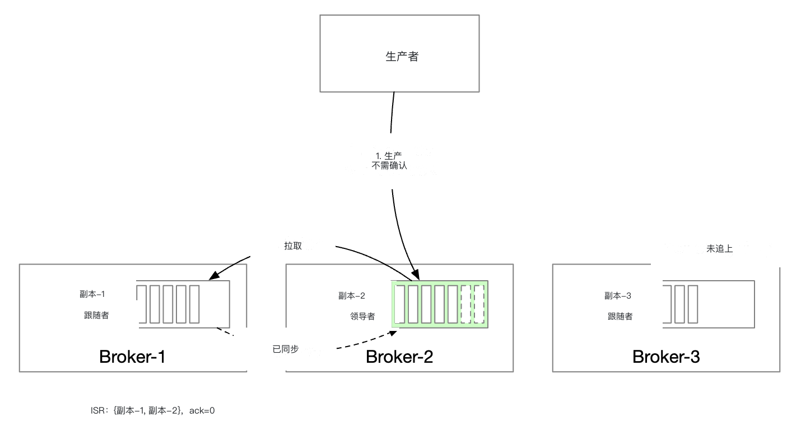

在消费者侧，我们可以让所有消费者都连到某个分区的领导者，从它读消息：
 * 这是最简单的设计，也最好运维
 * 分区里的消息只发给组内一个消费者，这限制了连到领导者副本的连接数
 * 只要主题不是特别热，连到领导者副本的连接数通常不高
 * 热主题可以通过增加分区数和消费者数来扩展
 * 某些场景下，让消费者从 ISR 读可能更合理，例如它们位于另一个数据中心（data center）

ISR 列表由领导者维护，它跟踪自己与每个副本之间的落后量。

### **可扩展性**

来评估如何扩展系统的不同部分。

#### 生产者

生产者比消费者小得多。它的可扩展性很容易通过增减生产者实例来实现。

#### 消费者

消费者组彼此隔离。随时增减消费者组都很容易。

再均衡帮助在组内增减消费者时优雅处理。

消费者组和再均衡帮助我们实现可扩展性和容错。

#### Broker

Broker 如何处理故障？

    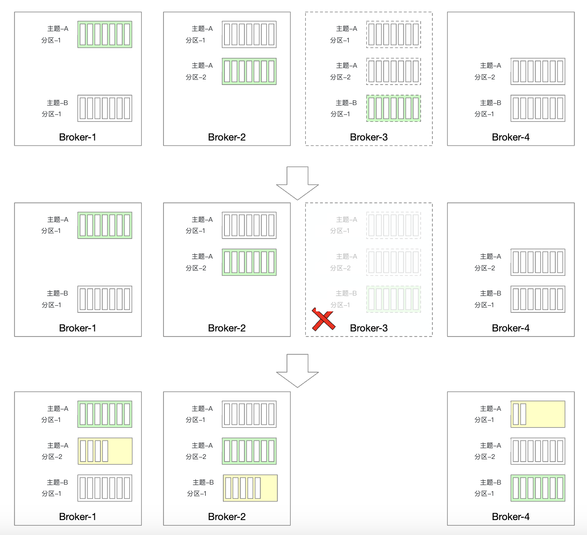

 * Broker 故障后，仍有足够副本，避免分区数据丢失
 * 选出新的领导者，Broker 协调者把故障 Broker 上的分区重新分配给现有副本
 * 现有副本接手新分区，先作为跟随者，直到追上领导者并成为 ISR

让 Broker 更容错的额外考量：
 * ISR 的最小数量在延迟和安全性之间权衡。可以按需求微调。
 * 如果一个分区的所有副本都在同一节点上，那就是浪费资源。副本应跨不同 Broker。
 * 如果一个分区的所有副本都崩溃，数据就永远丢了。把副本分散到不同数据中心有帮助，但会增加很多延迟。一种变通是用[数据镜像](https://cwiki.apache.org/confluence/pages/viewpage.action?pageId=27846330)。

新增 Broker 时，如何处理副本再分布？

    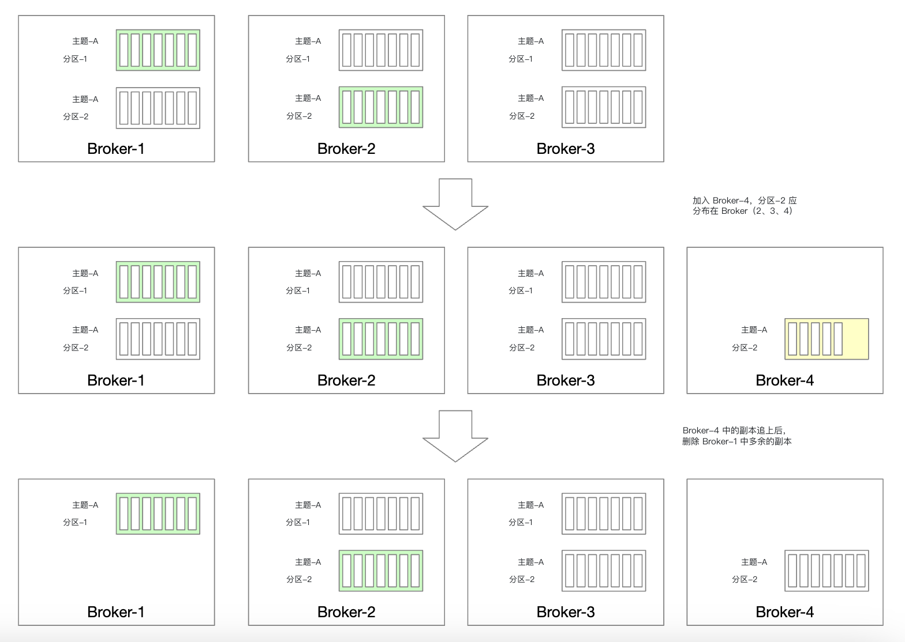

 * 可以暂时允许副本数超过配置，直到新 Broker 追上
 * 追上之后，再删掉不再需要的分区副本

#### 分区

每当新增分区，会通知生产者，并触发消费者再均衡。

在数据存储上，我们可以只把新消息写到新分区，而不是去拷贝所有旧消息：

    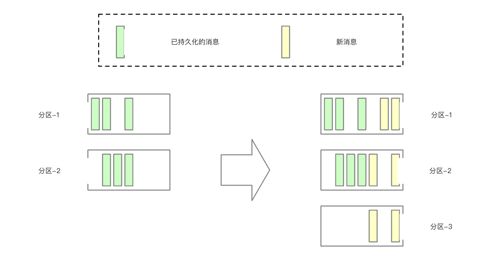

减少分区数更麻烦：

    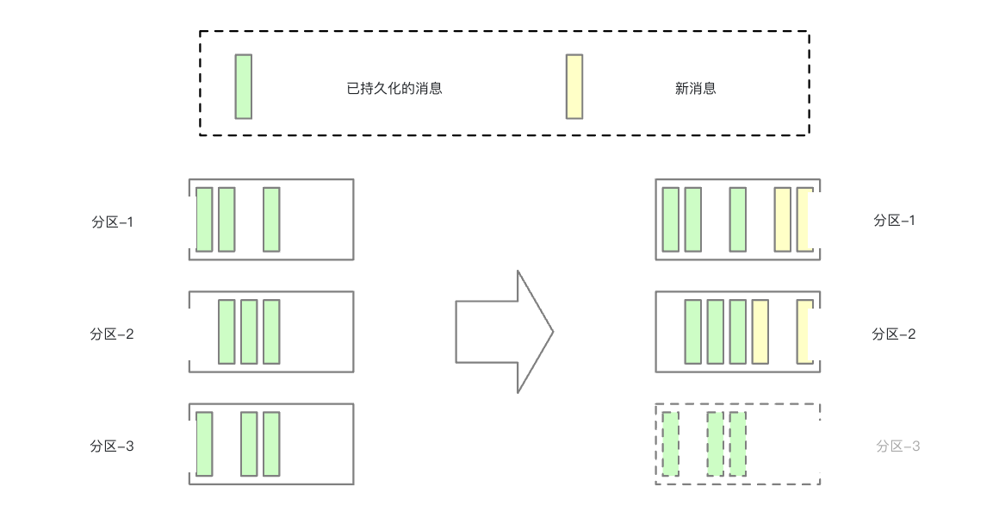

 * 分区下线后，新消息只由剩余分区接收
 * 下线的分区不会立刻删除，因为还可以从中消费消息
 * 预配置的保留期过后再截断数据，释放存储空间
 * 过渡期间，生产者只向活跃分区发消息，但消费者从所有分区读
 * 保留期到期后，消费者再均衡

### **投递语义**

来讨论不同的投递语义。

#### 至多一次

这种保证下，消息投递不超过一次，也可能完全不投递。

    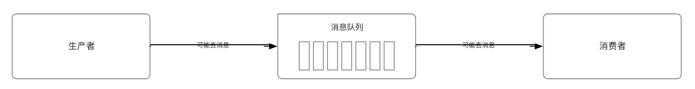

 * 生产者异步把消息发到主题。如果投递失败，不重试。
 * 消费者拉取消息后立刻提交偏移量。如果消费者在处理消息前崩溃，这条消息就不会被处理。

#### 至少一次

一条消息可以被发送多次，且不应有消息未被处理。

    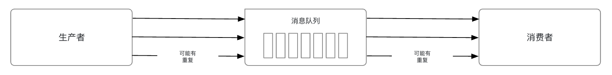

 * 生产者用 `ack=1` 或 `ack=all` 发消息。有任何问题都会持续重试。
 * 消费者拉取消息，处理完成后再提交偏移量。
 * 例如消费者处理完但提交偏移量之前崩溃，消息就可能被投递多次。
 * 因此，这适合可以接受数据重复、或可以去重的用例。

#### 精确一次

对系统来说实现成本极高，但对用户最友好：

    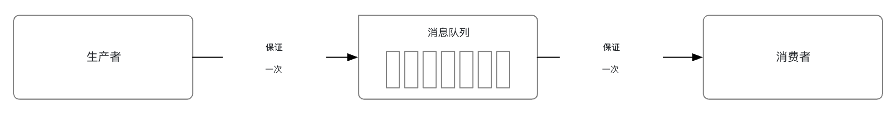

### **进阶功能**

来讨论面试里可能谈到的一些进阶功能。

#### 消息过滤

有些消费者可能只想消费分区内某一类消息。

可以为每类消息子集建单独主题，但如果系统用例太多，成本会很高。
 * 把同一条消息存在不同主题上是浪费资源
 * 生产者现在和消费者紧耦合，因为每个新的消费者需求都会改生产者

可以用消息过滤来解决。
 * 朴素做法是在消费者侧过滤，但这会引入不必要的消费者流量
 * 另一种做法是给消息打标签，消费者指定自己订阅哪些标签
 * 也可以按消息载荷过滤，但对加密/序列化的消息来说既难又不安全
 * 更复杂的数学公式，Broker 可以实现语法解析器或脚本执行器，但对消息队列来说可能太重

    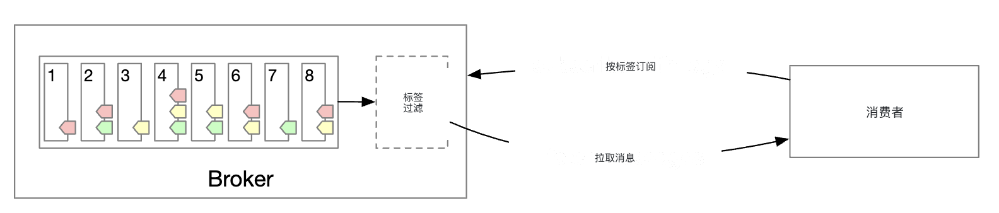

#### 延迟消息与定时消息

有些用例下，我们可能想延迟或定时投递消息。
例如，可以提交一个 30 分钟后的支付校验，到时触发消费者检查支付是否成功。

做法是把消息先发到 Broker 里的临时存储，到点再挪到分区：

    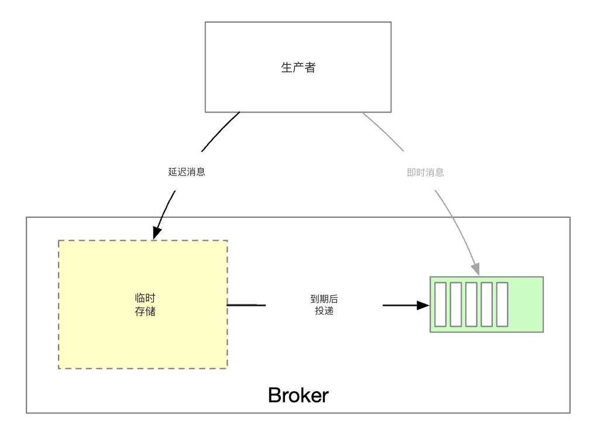

 * 临时存储可以是一个或多个特殊消息主题
 * 定时功能可以用专用延迟队列，或[分层时间轮](http://www.cs.columbia.edu/~nahum/w6998/papers/sosp87-timing-wheels.pdf)

---

## 步骤 4：收尾

额外可以聊的点：
- **通信协议**：重要考量——支持全部用例和高数据量，以及校验消息完整性。常见协议：AMQP 和 Kafka 协议。
- **重试消费**：如果没法立刻处理某条消息，可以把它发到专用重试主题，稍后再试。
- **历史数据归档**：旧消息可以备份到大容量存储，例如 HDFS 或对象存储（object storage）（例如 S3）。
