# 第 20 章：设计指标监控与告警系统

## 简介
本章聚焦于设计一个可高度扩展的**指标监控与告警系统（metrics monitoring and alerting system）**，这对保证高可用（high availability）和可靠性至关重要。

---

## 步骤 1：理解问题并确定设计范围
「指标监控系统」可以指很多不同的东西——例如面试官只关心基础设施指标时，你却去设计日志聚合系统。

先把问题问清楚：
 - 候选人：系统是给谁用的？大厂内部监控，还是 DataDog 这类 SaaS？
 - 面试官：只做内部使用。
 - 候选人：要采集哪些指标（metrics）？
 - 面试官：运维系统指标——CPU 负载、内存、数据盘空间。也包括每秒请求数这类高层指标。业务指标不在范围内。
 - 候选人：被监控的基础设施规模有多大？
 - 面试官：1 亿日活用户（DAU），1000 个服务器池，每池 100 台机器
 - 候选人：数据要保留多久？
 - 面试官：假设保留 1 年。
 - 候选人：长期存储能否降低指标数据分辨率？
 - 面试官：新收到的指标保留 7 天。随后 30 天汇总到 1 分钟分辨率。30 天后再汇总到 1 小时分辨率。
 - 候选人：支持哪些告警渠道？
 - 面试官：邮件、电话、PagerDuty 或 webhook。
 - 候选人：要不要采集错误日志、访问日志这类日志？
 - 面试官：不要
 - 候选人：要不要支持分布式系统追踪？
 - 面试官：不要

### **高层需求与假设**
被监控的基础设施是大规模的：
 - 1 亿 DAU
 - 1000 个服务器池 × 100 台机器 × 每台约 100 个指标 → 约 1000 万个指标
 - 数据保留 1 年
 - 保留策略——原始数据 7 天，1 分钟分辨率 30 天，1 小时分辨率 1 年

可以监控的指标多种多样：
 - CPU 负载
 - 请求数
 - 内存用量
 - 消息队列（message queue）中的消息数

### **非功能需求**
 - **可扩展性（scalability）**：系统应能扩展，以容纳更多指标和告警
 - **低延迟**：仪表盘和告警的查询延迟要低
 - **可靠性**：系统必须高度可靠，以免漏掉关键告警
 - **灵活性**：系统应能方便地接入未来的新技术

哪些需求不在范围内？
 - **日志监控**：这个场景里 ELK 技术栈非常流行
 - **分布式系统追踪**：指请求在系统内多个服务间流转时，采集其生命周期数据

---

## 步骤 2：提出高层设计并达成共识

### **基础**
指标监控与告警系统有五个核心组件：

<div style="margin-left:3rem">
    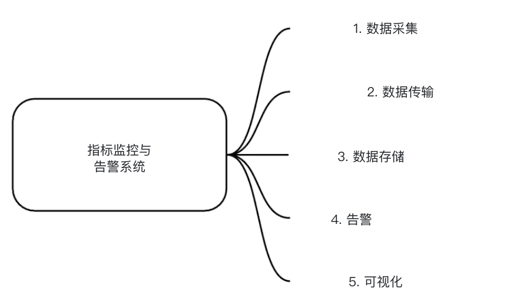
</div>

 - **数据采集（data collection）**：从不同来源采集指标数据
 - **数据传输（data transmission）**：把数据从源传输到指标监控系统
 - **数据存储（data storage）**：组织并存储流入的数据
 - **告警（alerting）**：分析流入数据，检测异常并生成告警
 - **可视化（visualization）**：用图、表等形式展示数据

### **数据模型**
指标数据通常记成时间序列（time-series），即一组带时间戳的值。
序列可以用名称和一组可选标签（tag）来标识。

示例 1 —— 生产服务器实例 i631 在 20:00 的 CPU 负载是多少？

<div style="margin-left:3rem">
    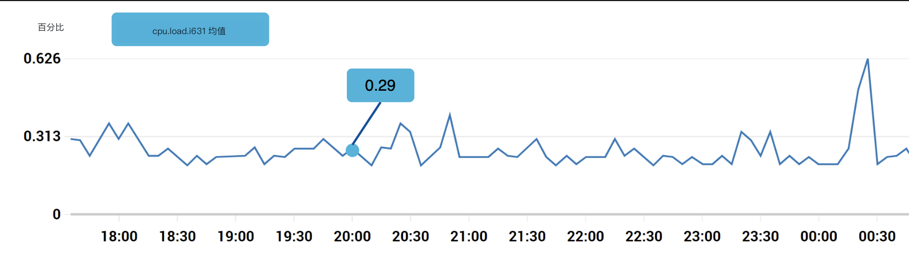
</div>

数据可以用下面这张表标识：

<div style="margin-left:3rem">
    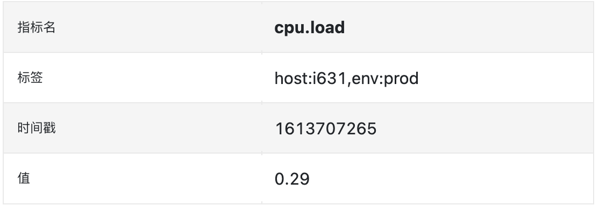
</div>

时间序列由指标名、标签以及某一时刻的一个点来标识。

示例 2 —— us-west 区域所有 Web 服务器在过去 10 分钟的平均 CPU 负载是多少？

```
CPU.load host=webserver01,region=us-west 1613707265 50

CPU.load host=webserver01,region=us-west 1613707265 62

CPU.load host=webserver02,region=us-west 1613707265 43

CPU.load host=webserver02,region=us-west 1613707265 53

...

CPU.load host=webserver01,region=us-west 1613707265 76

CPU.load host=webserver01,region=us-west 1613707265 83
```

这是为了回答该问题，可能从存储里取出的示例数据。
平均 CPU 负载可以把各行最后一列的值取平均得到。

上面这种格式叫行协议（line protocol），市面上很多主流监控软件都在用，例如 Prometheus、OpenTSDB。

每条时间序列包含什么：

<div style="margin-left:3rem">
    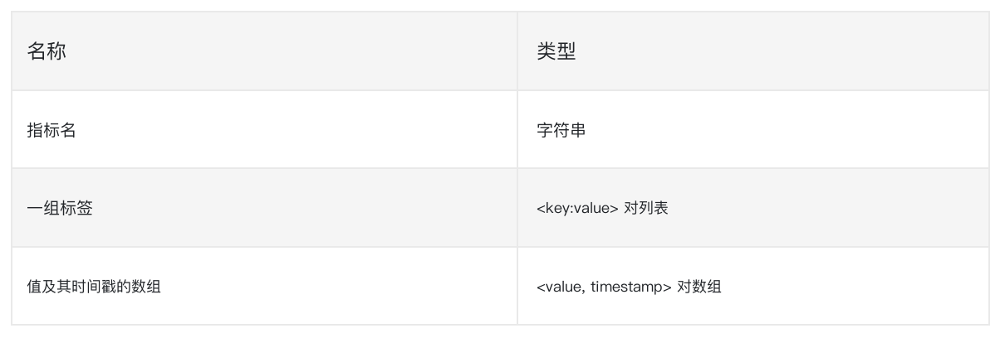
</div>

数据长什么样，可以这样可视化：

<div style="margin-left:3rem">
    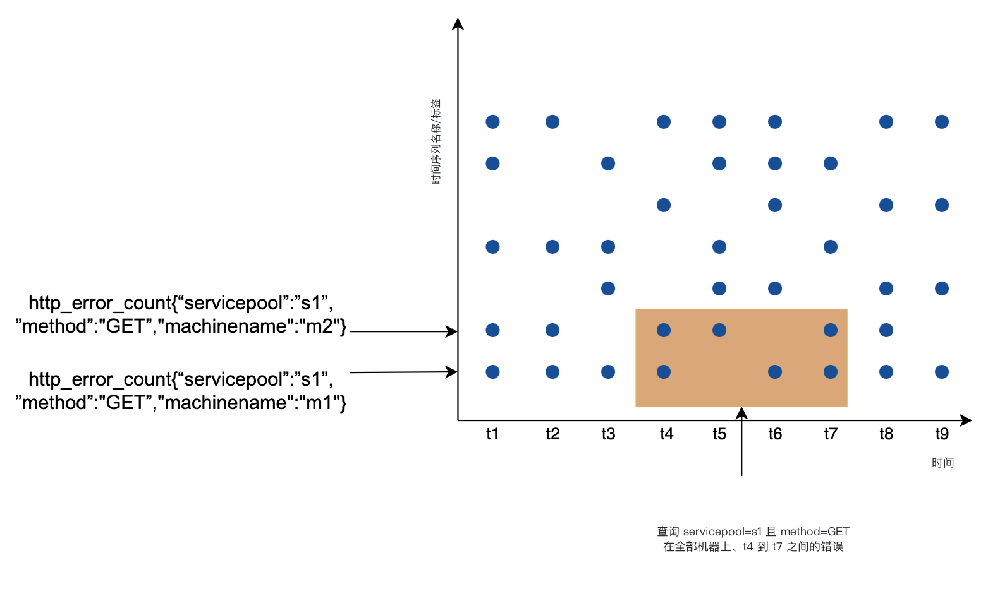
</div>

 - x 轴是时间
 - y 轴是你在查询的维度，例如指标名、标签等。

数据访问模式是写多、读呈尖峰：我们采集大量指标，但访问不频繁，只有事故进行中才会突发读取。

数据存储系统是这个设计的核心。
 - 不建议用通用数据库来做这件事，虽然靠专家级调优也能做到很大规模。
 - 理论上可以用 NoSQL 数据库，但很难设计出既可扩展、又能高效存储和查询时间序列数据的模式。

有很多专门为存储时间序列数据打造的数据库。其中不少提供自定义查询接口，便于高效查询时间序列。
 - OpenTSDB 是分布式时间序列数据库，但基于 Hadoop 和 HBase。如果没有这套基础设施，会很难用。
 - Twitter 用 MetricsDB，Amazon 提供 Timestream。
 - 最流行的两款时间序列数据库是 InfluxDB 和 Prometheus。
 - 它们被设计来存储海量时间序列数据。两者都基于内存缓存（cache）+ 磁盘存储。

InfluxDB 的规模示例——配置 8 核、32GB RAM 时，每秒可写超过 25 万次：

<div style="margin-left:3rem">
    
</div>

面试并不要求你懂指标数据库的内部实现，这是偏门知识。只有简历上写过，才可能被追问。

面试里，理解指标是时间序列数据，并知道 InfluxDB 这类流行的时间序列数据库就够了。

时间序列数据库的一个优点，是能按标签高效聚合和分析大量时间序列数据。
以 InfluxDB 为例，它会为每个标签建索引。

但关键是，标签的基数（cardinality）必须保持较低，也就是不要用太多唯一标签。

### **高层设计**

<div style="margin-left:3rem">
    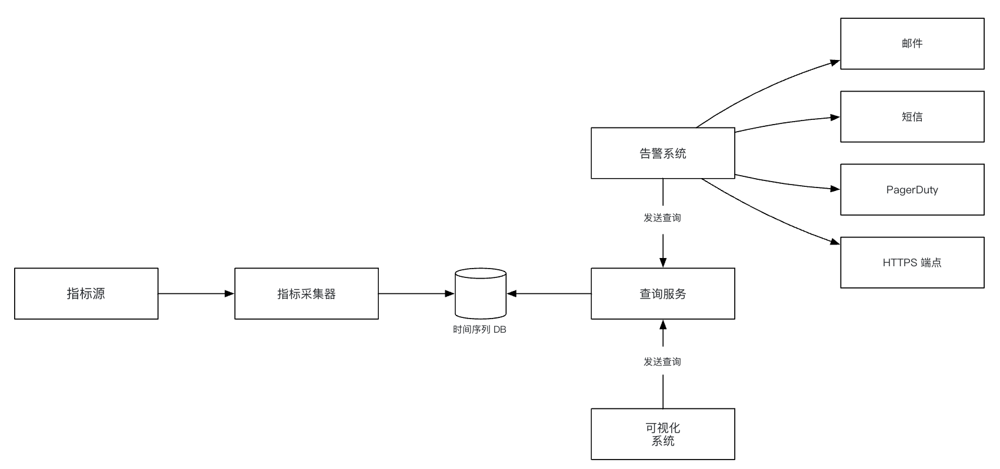
</div>

 - **指标源（metrics source）**：可以是应用服务器、SQL 数据库、消息队列等。
 - **指标采集器（metrics collector）**：收集指标数据并写入时间序列数据库
 - **时间序列数据库（time-series database）**：把指标存成时间序列。提供自定义查询接口，用于分析大量指标。
 - **查询服务（query service）**：方便查询并取出时间序列数据库中的数据。如果数据库自身接口已经足够强，也可以完全由它替代。
 - **告警系统**：把告警通知发到各种告警目的地。
 - **可视化系统**：用图/表展示指标。

---

## 步骤 3：深入设计
下面深入系统里几个更有意思的部分。

### **指标采集**
对指标采集来说，偶尔丢一点数据并不致命。客户端（client）可以发出即忘。

<div style="margin-left:3rem">
    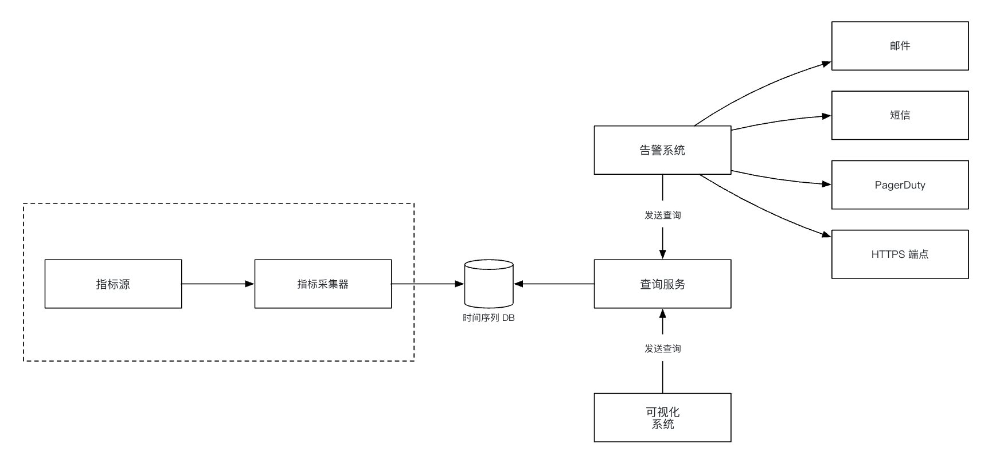
</div>

实现指标采集有两种方式：拉取（pull）或推送（push）。

拉取模型大概长这样：

<div style="margin-left:3rem">
    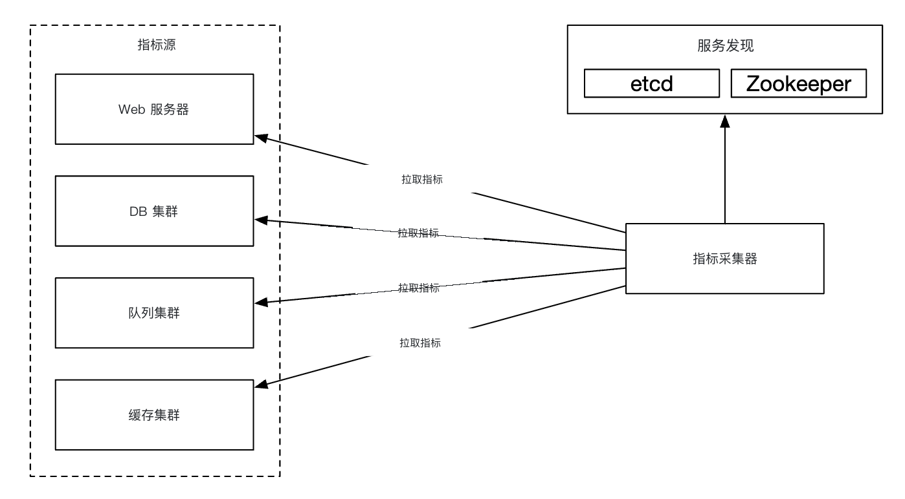
</div>

这种方案里，指标采集器需要维护一份最新的服务和指标端点列表。
可以用 ZooKeeper 或 etcd 来做——服务发现（service discovery）。

服务发现里包含何时、从何处采集指标的配置规则：

<div style="margin-left:3rem">
    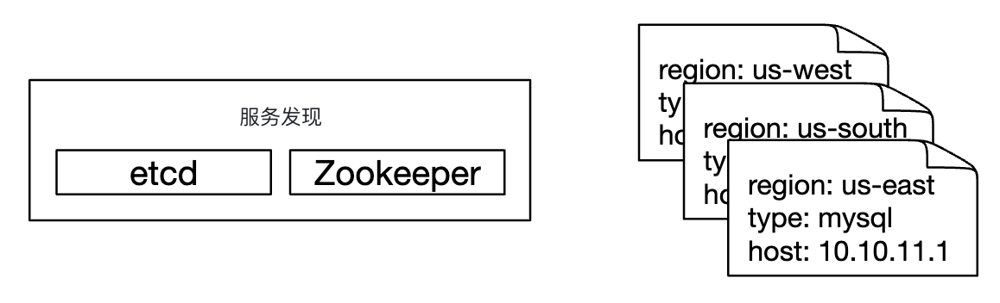
</div>

指标采集流程的详细说明：

<div style="margin-left:3rem">
    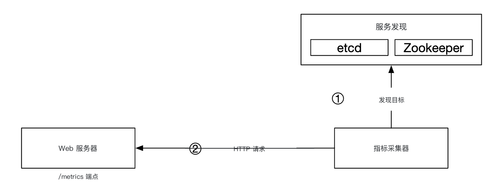
</div>

 - 指标采集器从服务发现拉取配置元数据（metadata）。包括拉取间隔、IP 地址、超时和重试参数。
 - 指标采集器通过预先定义的 HTTP 端点（例如 `/metrics`）拉取指标数据。通常由客户端库完成。
 - 另一种做法是，指标采集器向服务发现注册变更事件通知，端点变化时收到通知。
 - 还可以让指标采集器定期轮询（polling）指标端点配置是否变化。

在我们这个规模下，单个指标采集器不够用，必须有多个实例。
但它们之间也要有某种同步，以免两个采集器采集同一份指标两次。

一种办法是把采集器和服务器放到一致性哈希环（consistent hash ring）上，让一组服务器只对应一个采集器：

<div style="margin-left:3rem">
    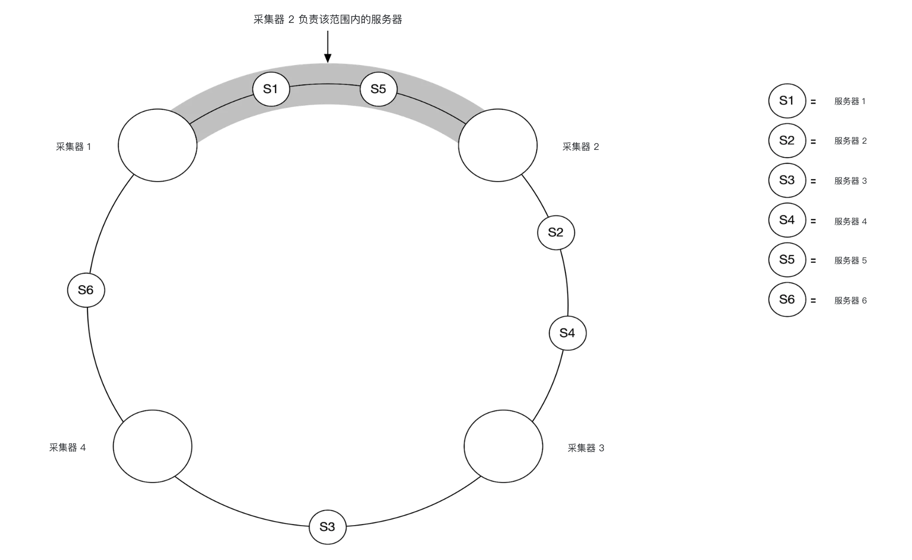
</div>

推送模型则相反，服务会主动把指标推给指标采集器：

<div style="margin-left:3rem">
    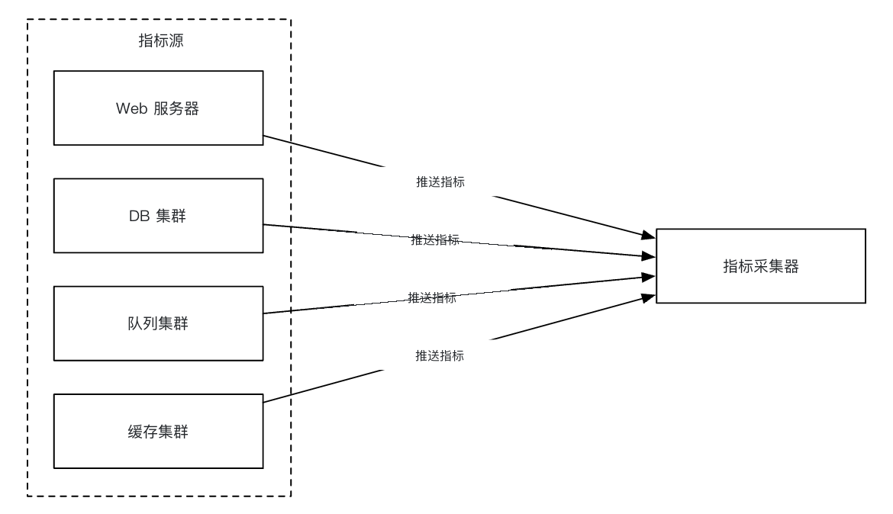
</div>

这种方式通常会在服务实例旁安装采集代理（collection agent）。
代理从服务器采集指标，再推给指标采集器。

<div style="margin-left:3rem">
    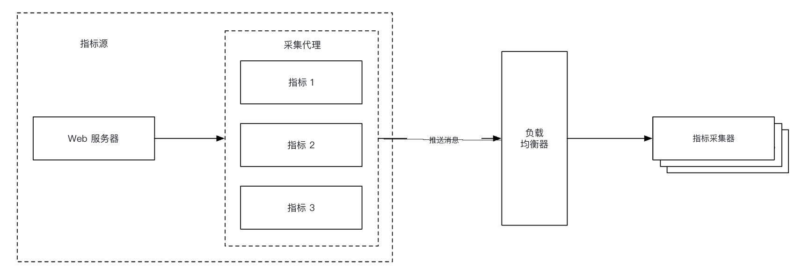
</div>

用这种模型，可以在发给采集器之前先聚合指标，从而降低采集器处理的数据量。

另一方面，采集器负载过高时可以拒绝推送请求。
因此，要把采集器放到负载均衡器（load balancer）后面的自动扩缩组里。

那哪种更好？两种做法各有权衡，不同系统选择不同：
 - Prometheus 用拉取架构
 - Amazon CloudWatch 和 Graphite 用推送架构

拉取和推送的主要差异如下：
|                                        | 拉取                                                                                                                                                                                                    | 推送                                                                                                                                                                                                                                    |
|----------------------------------------|---------------------------------------------------------------------------------------------------------------------------------------------------------------------------------------------------------|-----------------------------------------------------------------------------------------------------------------------------------------------------------------------------------------------------------------------------------------|
| 易于调试                         | 应用服务器上用于拉取指标的 `/metrics` 端点可以随时查看指标，甚至可以在自己的笔记本上做。拉取胜出。                                          | 如果指标采集器没收到指标，问题可能出在网络。                                                                                                                                        |
| 健康检查                           | 如果应用服务器不响应拉取，可以很快判断它是否宕机。拉取胜出。                                                                           | 如果指标采集器没收到指标，问题可能出在网络。                                                                                                                                        |
| 短生命周期任务                       |                                                                                                                                                                                                         | 有些批处理任务生命周期很短，还没被拉取就已经结束。推送胜出。拉取模型可通过引入推送网关来补救 [22]。                                                                 |
| 防火墙或复杂网络 | 由服务器去拉指标，要求所有指标端点可达。多数据中心（data center）部署可能有问题，网络基础设施会更复杂。 | 如果指标采集器放在负载均衡器和自动扩缩组后面，可以从任何地方收数据。推送胜出。                                                                                             |
| 性能                            | 拉取通常用 TCP。                                                                                                                                                                         | 推送通常用 UDP，因此传输延迟更低。反方观点是：建立 TCP 连接的开销相对发送指标载荷来说很小。 |
| 数据真实性                      | 要采集的应用服务器事先写在配置文件里，从这些服务器拿到的指标可以保证真实。                                                 | 任何客户端都可以向指标采集器推指标。可通过白名单或要求鉴权来补救。                                                                   |

没有明确赢家。大型组织多半两种都要支持。有时根本没办法安装推送代理。

### **扩展指标传输管道**

<div style="margin-left:3rem">
    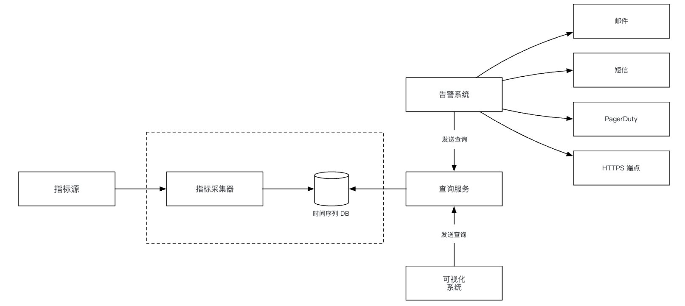
</div>

无论用推送还是拉取，指标采集器都部署在自动扩缩组里。

不过时间序列数据库宕机时仍可能丢数据。为缓解这一点，我们加一套排队机制：

<div style="margin-left:3rem">
    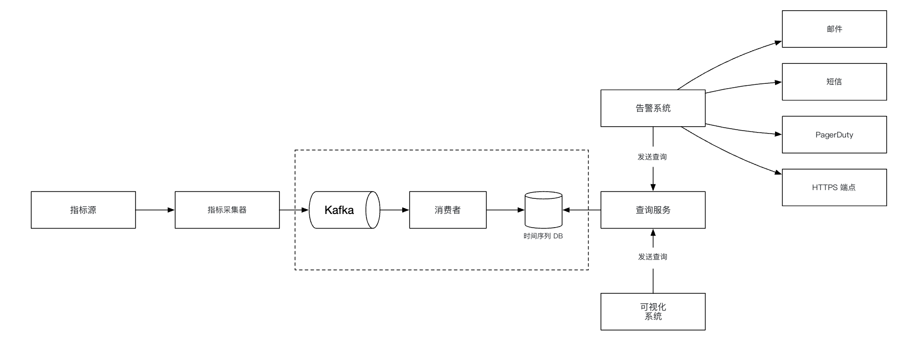
</div>

 - 指标采集器把指标数据推进 Kafka
 - 消费者（consumer）或 Apache Storm、Flink、Spark 这类流处理服务处理数据，再写入时间序列数据库

这种做法有几个优点：
 - Kafka 用作高可靠、可扩展的分布式消息平台
 - 把数据采集和数据处理解耦
 - 数据留在 Kafka 里，可以防止丢失

Kafka 可以按指标名配置一个分区（partition），这样消费者就能按指标名聚合数据。
要继续扩展，可以再按标签分区，并对指标分类/排优先级，先采集重要的。

<div style="margin-left:3rem">
    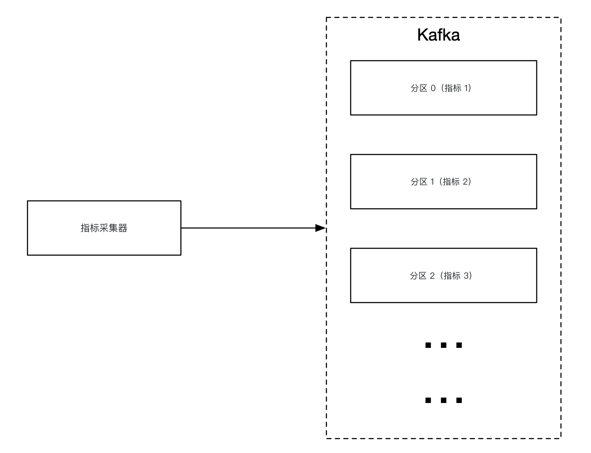
</div>

用 Kafka 做这件事的主要缺点是运维开销。
替代方案是用 [Gorilla](https://www.vldb.org/pvldb/vol8/p1816-teller.pdf) 这类大规模摄入系统。
可以认为它的可扩展性不亚于用 Kafka 做排队。

### **聚合可以发生在哪里**
指标可以在多个地方聚合。不同选择有不同权衡：
 - **采集代理**：客户端侧的采集代理只支持简单聚合逻辑。例如按 1 分钟收集计数器，再发给指标采集器。
 - **摄入管道**：要在写入数据库前聚合，需要 Flink 这类流处理引擎。这能降低写入量，但因为不存原始数据，会损失精度。
 - **查询侧**：可以在可视化系统跑查询时再聚合。没有数据损失，但要处理的数据很多，查询可能变慢。

### **查询服务**
把查询服务从时间序列数据库里拆出来，能让可视化和告警系统与数据库解耦，从而把数据库和客户端解耦，并可以随时更换数据库。

这里可以加一层缓存，降低时间序列数据库的负载：

<div style="margin-left:3rem">
    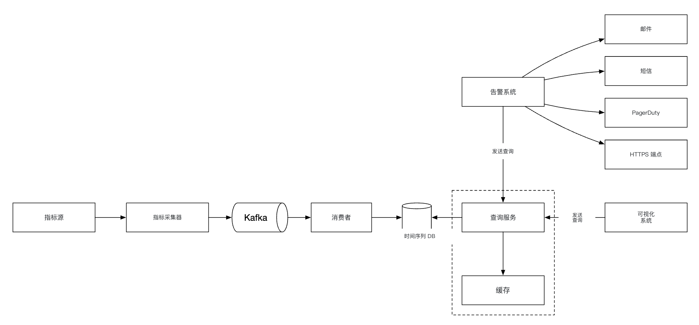
</div>

也可以干脆不加查询服务，因为大多数可视化和告警系统都有强大的插件，能对接绝大多数时间序列数据库。
如果时间序列数据库选得好，也可能不必自己做缓存层。

大多数时间序列数据库不支持 SQL，只是因为它查询时间序列并不高效。下面是计算指数移动平均的示例 SQL：

```
select id,
       temp,
       avg(temp) over (partition by group_nr order by time_read) as rolling_avg
from (
  select id,
         temp,
         time_read,
         interval_group,
         id - row_number() over (partition by interval_group order by time_read) as group_nr
  from (
    select id,
    time_read,
    "epoch"::timestamp + "900 seconds"::interval * (extract(epoch from time_read)::int4 / 900) as interval_group,
    temp
    from readings
  ) t1
) t2
order by time_read;
```

同一查询用 Flux（InfluxDB 使用的查询语言）来写：

```
from(db:"telegraf")
  |> range(start:-1h)
  |> filter(fn: (r) => r._measurement == "foo")
  |> exponentialMovingAverage(size:-10s)
```

### **存储层**
时间序列数据库必须仔细选。

根据 Facebook 发表的研究，运维存储约 85% 的查询针对过去 26 小时的数据。

如果所选数据库能利用这一特性，对系统性能会有显著影响。InfluxDB 就是这样的选项。

无论选哪款数据库，都可以做一些优化。

数据编码与压缩能显著减小数据体积。好的时间序列数据库通常内置这些能力。

<div style="margin-left:3rem">
    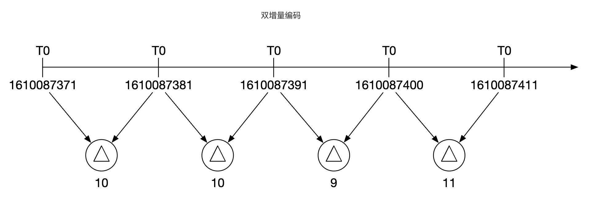
</div>

上例中，我们可以存时间戳增量，而不是完整时间戳。

另一种可用的技术是降采样（down-sampling）——把高分辨率数据转成低分辨率，以减少磁盘占用。

可以对旧数据这样做，并让规则可由数据科学家配置，例如：
 - 7 天——不降采样
 - 30 天——降采样到 1 分钟
 - 1 年——降采样到 1 小时

例如，下面是 10 秒分辨率的指标表：
| 指标 | 时间戳            | 主机名 | 指标值 |
|--------|----------------------|----------|--------------|
| cpu    | 2021-10-24T19:00:00Z | host-a   | 10           |
| cpu    | 2021-10-24T19:00:10Z | host-a   | 16           |
| cpu    | 2021-10-24T19:00:20Z | host-a   | 20           |
| cpu    | 2021-10-24T19:00:30Z | host-a   | 30           |
| cpu    | 2021-10-24T19:00:40Z | host-a   | 20           |
| cpu    | 2021-10-24T19:00:50Z | host-a   | 30           |

降采样到 30 秒分辨率：
| 指标 | 时间戳            | 主机名 | 指标值（平均） |
|--------|----------------------|----------|--------------------|
| cpu    | 2021-10-24T19:00:00Z | host-a   | 19                 |
| cpu    | 2021-10-24T19:00:30Z | host-a   | 25                 |

最后，还可以用冷存储（cold storage）存放已经不再使用的旧数据。冷存储的费用低得多。

### **告警系统**

<div style="margin-left:3rem">
    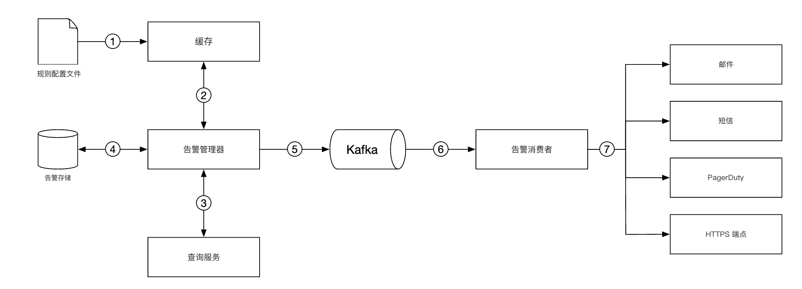
</div>

配置会加载到缓存服务器。规则通常用 YAML 定义。示例如下：

```
- name: instance_down
  rules:

  # Alert for any instance that is unreachable for >5 minutes.
  - alert: instance_down
    expr: up == 0
    for: 5m
    labels:
      severity: page
```

告警管理器（alert manager）从缓存拉取告警配置。它还会按配置规则，以预定间隔调用查询服务。
如果某条规则被满足，就创建一条告警事件。

告警管理器的其他职责包括：
 - 过滤、合并和去重告警。例如同一实例的告警被触发多次，只生成一条告警事件。
 - 访问控制——告警管理操作必须限制给特定人员
 - 重试——管理器确保告警至少投递一次。

告警存储是键值存储（key-value store），例如 Cassandra，保存所有告警的状态。它保证通知至少发送一次（at-least-once）。
告警触发后，会被发布到 Kafka。

最后，告警消费者从 Kafka 拉取告警数据，并通过不同渠道发送通知——邮件、短信、PagerDuty、webhook。

现实中告警系统有很多现成方案。很难证明值得自己从零做一套内部系统。

### **可视化系统**
可视化系统按时间段展示指标和告警。下面是用 Grafana 搭的仪表盘：

<div style="margin-left:3rem">
    
</div>

高质量可视化系统非常难做。很难证明不该直接用 Grafana 这类现成方案。

---

## 步骤 4：收尾
这是最终设计：

<div style="margin-left:3rem">
    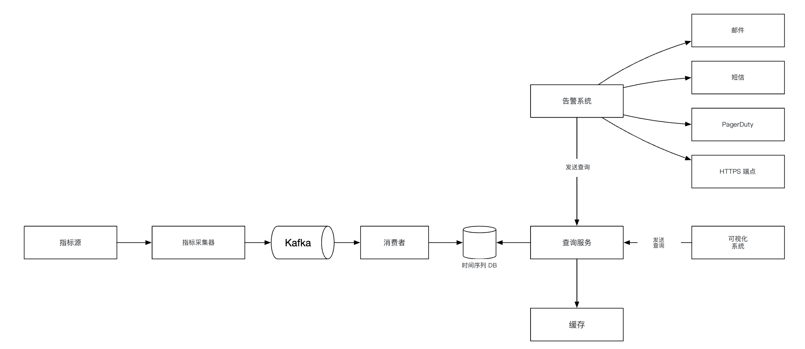
</div>
