# 第 21 章：设计广告点击事件聚合

## 简介
随着 Facebook、YouTube、TikTok 等平台崛起，**数字广告（digital advertising）** 已是一个庞大的行业。

因此，跟踪广告点击事件很重要。本章讨论如何设计 Facebook/Google 规模的**广告点击事件聚合（ad click event aggregation）**系统。

数字广告有一个叫**实时竞价（RTB，real-time bidding）**的流程，数字广告库存在其中被买卖：

<div style="margin-left:3rem">
    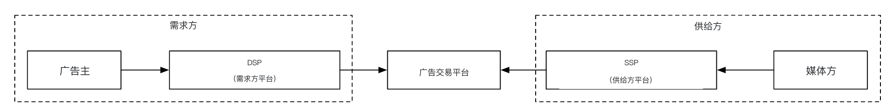
</div>

RTB 的速度很关键，通常要在一秒内完成。
数据准确性也很重要，因为它直接影响广告主付多少钱。

基于广告点击事件聚合，广告主可以做决策，例如调整目标受众和关键词。

---

## 步骤 1：理解问题并确定设计范围
 - 候选人：输入数据的格式是怎样的？
 - 面试官：每天 10 亿次广告点击，一共 200 万条广告。广告点击事件量每年增长 30%。
 - 候选人：系统需要支持的最重要查询有哪些？
 - 面试官：要重点考虑的查询：
   - 返回广告 X 在过去 Y 分钟内的点击事件数
   - 返回过去 1 分钟内点击最多的 100 条广告。两个参数都应可配置。聚合每分钟发生一次。
   - 上述查询要支持按 `ip`、`user_id`、`country` 过滤数据
 - 候选人：要不要考虑边界情况？我能想到的有：
   - 可能有事件晚于预期到达
   - 可能有重复事件
   - 系统的不同部分可能宕机，所以要考虑系统恢复
 - 面试官：这份清单不错，把这些都考虑进去
 - 候选人：延迟要求是什么？
 - 面试官：广告点击聚合的端到端延迟是几分钟。RTB 则要小于一秒。广告点击聚合可以接受这个延迟，因为通常用于计费和报表。

### **功能需求**
 - 聚合 `ad_id` 在过去 Y 分钟内的点击次数
 - 每分钟返回点击最多的 100 个 `ad_id`
 - 支持按不同属性过滤聚合
 - 数据量达到 Facebook 或 Google 的规模

### **非功能需求**
 - 聚合结果的正确性很重要，因为它用于 RTB 和广告计费
 - 妥善处理延迟或重复事件
 - 稳健性——系统应能承受部分故障
 - 延迟——端到端延迟最多几分钟

### **粗略估算**
 - 10 亿 DAU
 - 假设用户每天点 1 条广告 → 每天 10 亿次广告点击
 - 广告点击 QPS = 10,000
 - 峰值 QPS 是这个数的 5 倍 = 50,000
 - 单次广告点击占用 0.1KB 存储。每天存储需求是 100GB
 - 每月存储 = 3TB

---

## 步骤 2：提出高层设计并达成共识
本节讨论查询 API 设计、数据模型和高层设计。

### **查询 API 设计**
API 是客户端（client）和服务器之间的契约。在我们这个场景里，客户端是仪表盘用户——数据科学家/分析师、广告主等。

功能需求如下：
 - 聚合 `ad_id` 在过去 Y 分钟内的点击次数
 - 返回过去 M 分钟内点击最多的 N 个 `ad_id`
 - 支持按不同属性过滤聚合

我们需要两个端点来满足这些需求。过滤可以通过其中一个端点上的查询参数完成。

**聚合 ad_id 在过去 M 分钟内的点击次数**：

```
GET /v1/ads/{:ad_id}/aggregated_count
```

查询参数：
 - from - 起始分钟。默认是 now - 1 min
 - to - 结束分钟。默认是 now
 - filter - 不同过滤策略的标识。例如 001 表示「非美国点击」。

响应：
 - ad_id - 广告标识
 - count - 起止分钟之间的聚合计数

**返回过去 M 分钟内点击最多的 N 个 ad_id**

```
GET /v1/ads/popular_ads
```

查询参数：
 - count - 点击最多的 N 条广告
 - window - 聚合窗口大小，单位为分钟
 - filter - 不同过滤策略的标识

响应：
 - ad_id 列表

### **数据模型**
系统里既有原始数据，也有聚合数据。

原始数据看起来像这样：

```
[AdClickEvent] ad001, 2021-01-01 00:00:01, user 1, 207.148.22.22, USA
```

结构化格式的例子：
| ad_id | click_timestamp     | user  | ip            | country |
|-------|---------------------|-------|---------------|---------|
| ad001 | 2021-01-01 00:00:01 | user1 | 207.148.22.22 | USA     |
| ad001 | 2021-01-01 00:00:02 | user1 | 207.148.22.22 | USA     |
| ad002 | 2021-01-01 00:00:02 | user2 | 209.153.56.11 | USA     |

聚合后的版本：
| ad_id | click_minute | filter_id | count |
|-------|--------------|-----------|-------|
| ad001 | 202101010000 | 0012      | 2     |
| ad001 | 202101010000 | 0023      | 3     |
| ad001 | 202101010001 | 0012      | 1     |
| ad001 | 202101010001 | 0023      | 6     |

`filter_id` 用来满足过滤需求。
| filter_id | region | IP        | user_id |
|-----------|--------|-----------|---------|
| 0012      | US     | *         | *       |
| 0013      | *      | 123.1.2.3 | *       |

为了快速返回过去 M 分钟内点击最多的 N 条广告，我们还会维护这种结构：
| most_clicked_ads   |           |                                                  |
|--------------------|-----------|--------------------------------------------------|
| window_size        | integer   | 聚合窗口大小（M），单位为分钟                    |
| update_time_minute | timestamp | 上次更新时间戳（1 分钟粒度）                     |
| most_clicked_ads   | array     | 广告 ID 列表，JSON 格式。                        |

存原始数据和存聚合数据各有什么优缺点？
 - 原始数据可以使用完整数据集，并支持数据过滤和重算
 - 另一方面，聚合数据让数据集更小、查询更快
 - 原始数据意味着更大的数据存储和更慢的查询
 - 聚合数据则是派生数据，因此会有一些信息损失。

我们的设计会两种做法结合：
 - 保留原始数据便于调试。如果聚合有 bug，可以发现并回填。
 - 聚合数据也应存储，以获得更快的查询性能。
 - 原始数据可以放到冷存储（cold storage），避免额外存储成本。

选数据库时，有几个因素要考虑：
 - 数据长什么样？是关系型、文档还是 blob？
 - 工作负载是读多、写多，还是两者都重？
 - 需不需要事务？
 - 查询是否依赖 SUM、COUNT 这类 OLAP 函数？

对原始数据来说，平均 QPS 是 1 万、峰值 QPS 是 5 万，所以系统是写多。
另一方面，读流量很低，因为原始数据主要在出问题时当备份用。

关系型数据库能做这件事，但扩展写入会比较难。
也可以用 Cassandra 或 InfluxDB，它们对写多负载有更好的原生支持。

另一个选项是用 Amazon S3，配上 ORC、Parquet 或 AVRO 这类列式数据格式。这种组合不太熟，我们还是用 Cassandra。

对聚合数据来说，工作负载读写都重，因为仪表盘和告警会不断查询聚合数据。
它也是写多的，因为聚合服务每分钟都会聚合并写入数据。
因此，这里也用同一套数据存储（Cassandra）。

### **高层设计**
系统看起来像这样：

<div style="margin-left:3rem">
    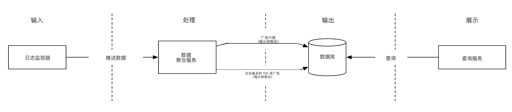
</div>

数据在输入和输出两侧都作为无界数据流流动。

为了避免同步汇点——消费者（consumer）崩溃会让整个系统卡住——
我们用消息队列（message queue）（Kafka）做异步处理，把消费者和生产者（producer）解耦。

<div style="margin-left:3rem">
    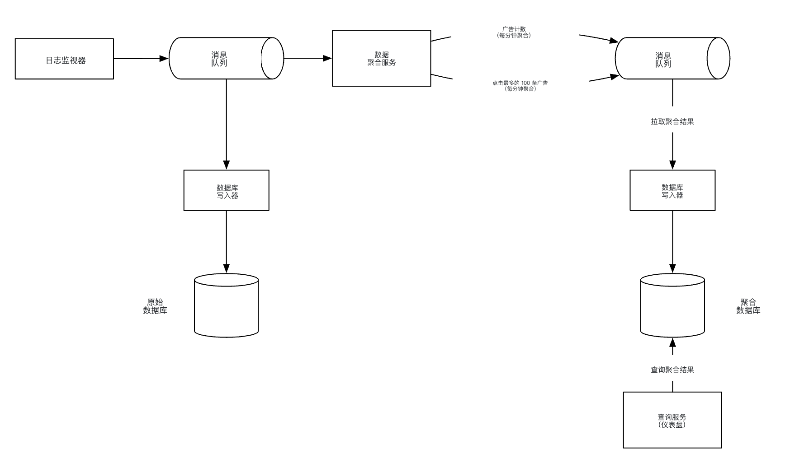
</div>

第一条消息队列存储广告点击事件数据：
| ad_id | click_timestamp | user_id | ip | country |
|-------|-----------------|---------|----|---------|

第二条消息队列包含按分钟聚合的广告点击计数：
| ad_id | click_minute | count |
|-------|--------------|-------|

以及按分钟聚合的点击最多的 N 条广告：
| update_time_minute | most_clicked_ads |
|--------------------|------------------|

第二条消息队列是为了实现端到端精确一次（exactly-once）原子提交语义：

<div style="margin-left:3rem">
    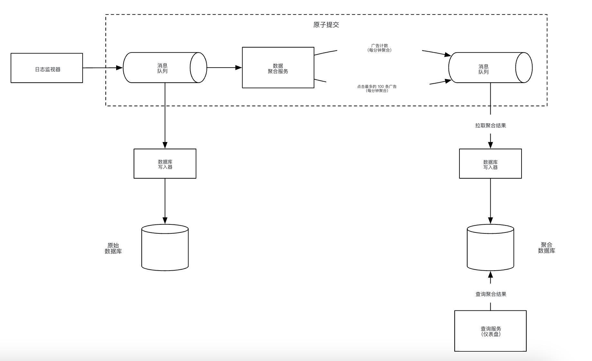
</div>

对聚合服务来说，用 MapReduce 框架是个不错的选择：

<div style="margin-left:3rem">
    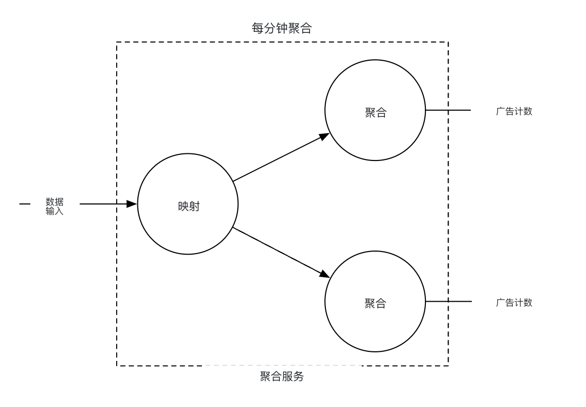
</div>

<div style="margin-left:3rem">
    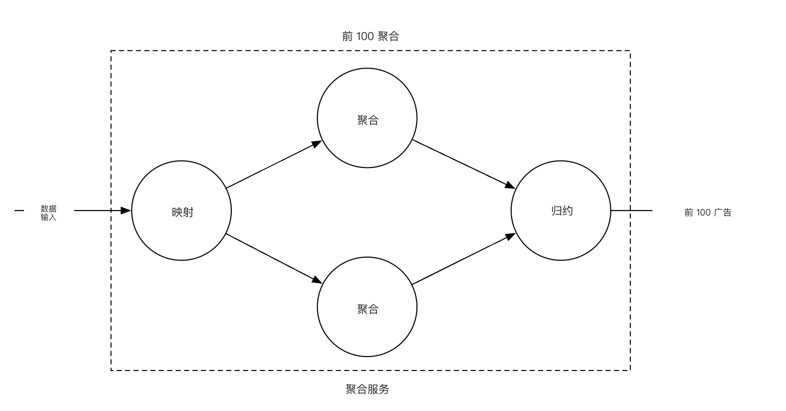
</div>

每个节点只负责一项任务，并把处理结果发给下游节点。

映射（map）节点负责从数据源读取，然后过滤和转换数据。

例如，映射节点可以按 `ad_id` 把数据分配到不同的聚合节点：

<div style="margin-left:3rem">
    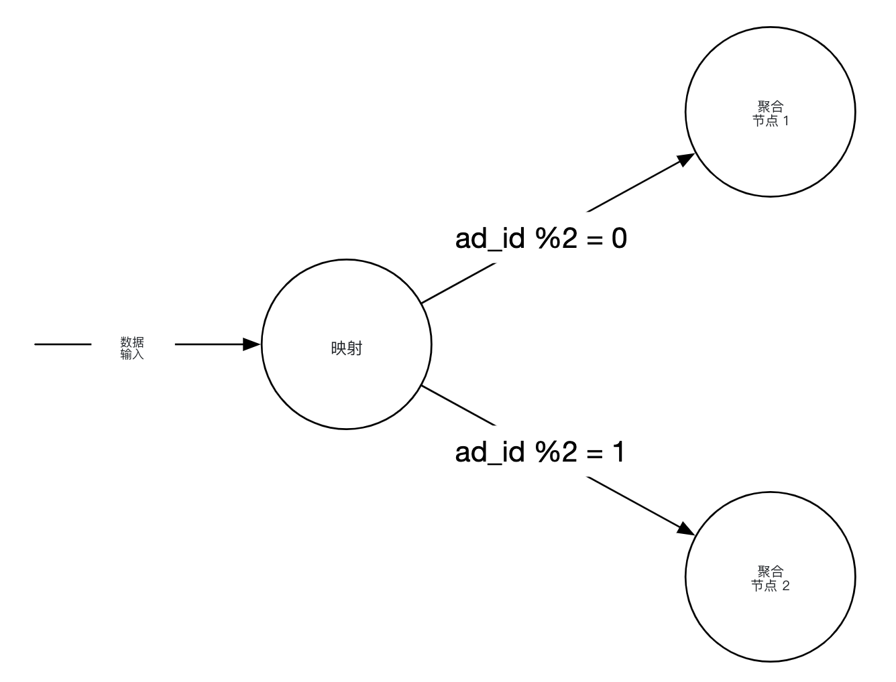
</div>

另一种做法是把广告分布到 Kafka 分区（partition），让聚合节点在一个消费者组（consumer group）内直接订阅。
不过，映射节点让我们可以在后续处理之前清洗或转换数据。

另一个原因可能是我们控制不了数据怎么生产，
所以同一个 `ad_id` 相关的事件可能落到不同分区。

聚合节点每分钟在内存里按 `ad_id` 统计广告点击事件。

归约（reduce）节点收集聚合节点的聚合结果，并产出最终结果：

<div style="margin-left:3rem">
    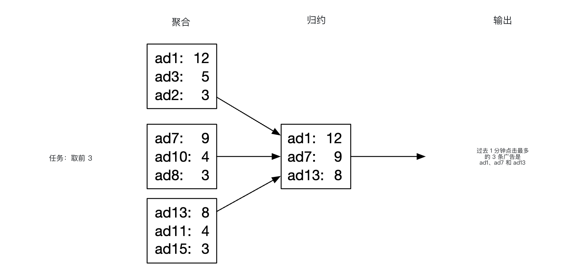
</div>

这个 DAG 模型使用 MapReduce 范式。它处理大数据，借助并行分布式计算，把数据变成常规规模。

在 DAG 模型里，中间数据存在内存中，不同节点用 TCP 或共享内存互相通信。

下面看看这个模型如何帮我们实现各种用例。

**用例 1 - 聚合点击次数**：

<div style="margin-left:3rem">
    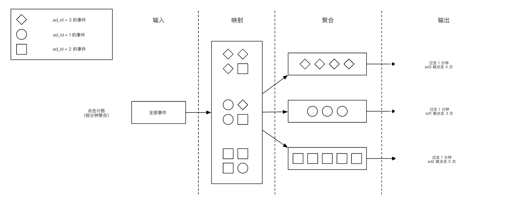
</div>

 - 广告用 `ad_id % 3` 分区

**用例 2 - 返回点击最多的 N 条广告**：

<div style="margin-left:3rem">
    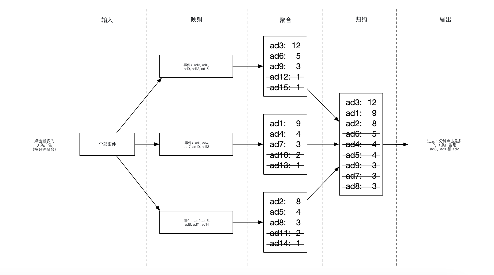
</div>

 - 这个例子聚合的是前 3 条广告，但很容易扩展到前 N 条
 - 每个节点维护一个堆数据结构，以便快速取出前 N 条广告

**用例 3 - 数据过滤**：
为了支持快速数据过滤，可以预定义过滤条件并据此预聚合：
| ad_id | click_minute | country | count |
|-------|--------------|---------|-------|
| ad001 | 202101010001 | USA     | 100   |
| ad001 | 202101010001 | GPB     | 200   |
| ad001 | 202101010001 | others  | 3000  |
| ad002 | 202101010001 | USA     | 10    |
| ad002 | 202101010001 | GPB     | 25    |
| ad002 | 202101010001 | others  | 12    |

这种技术叫**星型模式（star schema）**，在数据仓库里用得很广。
过滤字段叫做**维度（dimension）**。

这种做法有以下好处：
 - 简单，好理解和搭建
 - 现有聚合服务可以复用，用来在星型模式里创建更多维度。
 - 按过滤条件访问数据很快，因为结果是预先算好的

局限是会多出很多桶和记录，尤其是过滤条件很多的时候。

---

## 步骤 3：深入设计
下面深入几个更有意思的话题。

### **流式与批处理**
我们提出的高层架构是一种流处理系统。
下面比较三类系统：
|                         | 服务（在线系统）              | 批处理系统（离线系统）                                 | 流式系统（近实时系统）                       |
|-------------------------|-------------------------------|--------------------------------------------------------|----------------------------------------------|
| 响应性                  | 快速响应客户端                | 不需要响应客户端                                       | 不需要响应客户端                             |
| 输入                    | 用户请求                      | 有界、有限大小的输入。数据量很大                       | 输入没有边界（无限流）                       |
| 输出                    | 给客户端的响应                | 物化视图、聚合指标等                                   | 物化视图、聚合指标等                         |
| 性能度量                | 可用性、延迟                  | 吞吐量                                                 | 吞吐量、延迟                                 |
| 例子                    | 在线购物                      | MapReduce                                              | Flink [13]                                   |

我们的设计混合了批处理和流式处理。

我们用流式处理在数据到达时处理，并近实时生成聚合结果。
另一方面，用批处理做历史数据备份。

一个系统同时包含两条处理路径——批处理和流式——这种架构叫 Lambda。
缺点是要维护两条处理路径、两套不同代码。

Kappa 是另一种架构，把批处理和流处理合到一条处理路径里。
核心想法是只用一个流处理引擎。

Lambda 架构：

<div style="margin-left:3rem">
    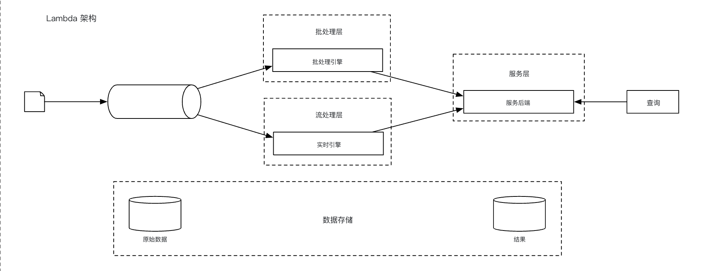
</div>

Kappa 架构：

<div style="margin-left:3rem">
    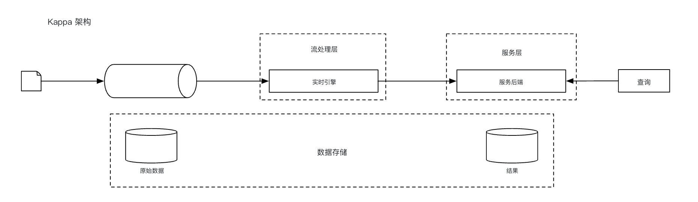
</div>

我们的高层设计用的是 Kappa 架构，因为历史数据的再处理也走聚合服务。

每当因为例如聚合逻辑有重大 bug 而必须重算聚合数据时，可以从我们存储的原始数据重新聚合。
 - 重算服务从原始存储取数据。这是一个批处理作业。
 - 取出的数据发给专用的聚合服务，以免影响实时处理的聚合服务。
 - 聚合结果发到第二条消息队列，随后更新聚合数据库里的结果。

<div style="margin-left:3rem">
    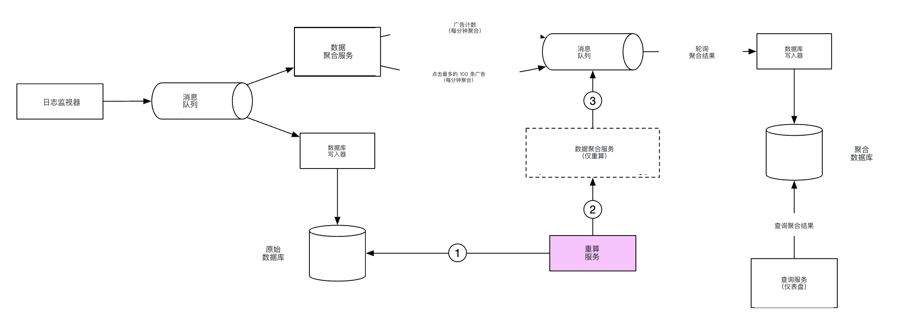
</div>

### **时间**
做聚合需要时间戳。它可以在两个地方生成：
 - 事件时间（event time）——广告点击发生时
 - 处理时间（processing time）——服务器处理该事件时的系统时间

由于使用异步处理（消息队列）以及网络延迟，事件时间和处理时间之间可能差很多。
 - 如果用处理时间，聚合结果可能不准确
 - 如果用事件时间，就要处理延迟事件

没有完美方案，需要权衡：
|                 | 优点                                  | 缺点                                                                                 |
|-----------------|---------------------------------------|--------------------------------------------------------------------------------------|
| 事件时间        | 聚合结果更准确                        | 客户端时钟可能不对，或时间戳可能由恶意用户生成                                       |
| 处理时间        | 服务器时间戳更可靠                    | 事件迟到时时间戳不准确                                                               |

因为数据准确性重要，我们用事件时间做聚合。

为缓解延迟事件，可以用一种叫「水位线（watermark）」的技术。

下面的例子里，事件 2 错过了它本该被聚合的窗口：

<div style="margin-left:3rem">
    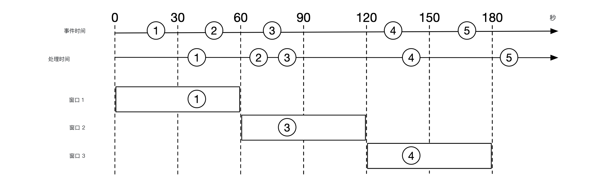
</div>

不过，如果我们有意延长聚合窗口，就可以降低漏掉事件的可能性。
窗口被延长的那部分叫做「水位线」：

<div style="margin-left:3rem">
    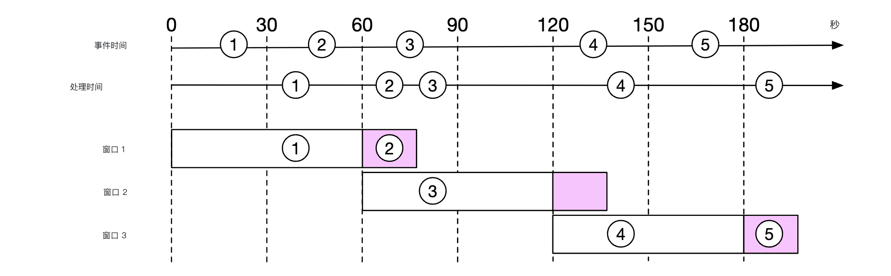
</div>

 - 短水位线更容易漏事件，但延迟更低
 - 长水位线更不容易漏事件，但延迟更高

无论水位线多长，都仍有漏事件的可能。但为这种低概率事件做优化没有意义。

这类不一致可以改用日终对账（reconciliation）来解决。

### **聚合窗口**
窗口函数有四种：
 - 滚动（固定）窗口（tumbling window）
 - 跳跃窗口（hopping window）
 - 滑动窗口（sliding window）
 - 会话窗口（session window）

我们的设计用滚动窗口做广告点击聚合：

<div style="margin-left:3rem">
    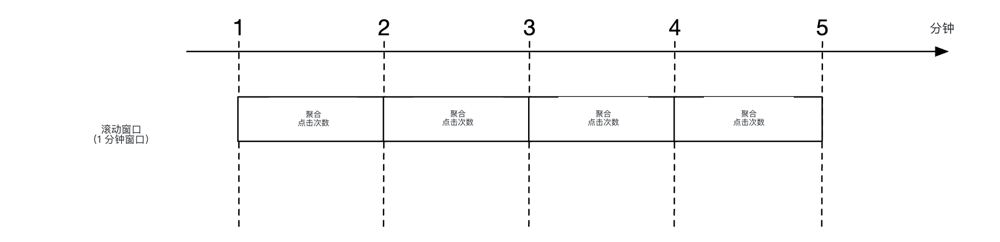
</div>

以及用滑动窗口做 M 分钟内点击最多的 N 条广告聚合：

<div style="margin-left:3rem">
    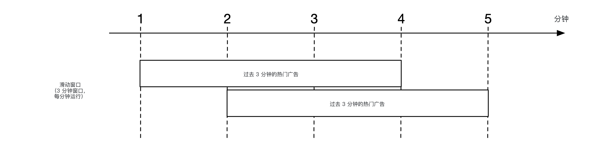
</div>

### **投递保证**
我们聚合的数据会用于计费，所以数据准确性是优先事项。

因此需要讨论：
 - 如何避免处理重复事件
 - 如何确保所有事件都被处理

可以使用三种投递保证——至多一次（at-most-once）、至少一次（at-least-once）和精确一次。

大多数情况下，少量重复可以接受时，至少一次就够了。
我们的系统不是这样：很小百分比的差异都可能导致数百万美元的偏差。
因此，我们需要使用精确一次投递语义。

### **数据去重**
最常见的数据质量问题之一就是重复数据。

来源可以很广：
 - 客户端侧——客户端可能多次重发同一事件。恶意发送的重复事件最好由风控引擎处理。
 - 服务器宕机——聚合服务节点在聚合中途宕机，上游服务没收到确认，于是事件被重发。

下面是最后一跳没能确认事件而导致数据重复的例子：

<div style="margin-left:3rem">
    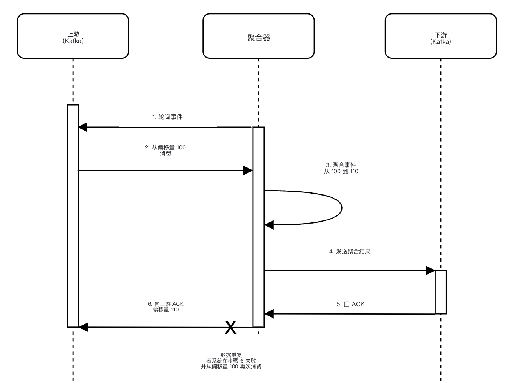
</div>

这个例子里，偏移量（offset）100 会被处理并多次发到下游。

一种缓解办法是把上次见到的偏移量存到 HDFS/S3，但这有结果永远到不了下游的风险：

<div style="margin-left:3rem">
    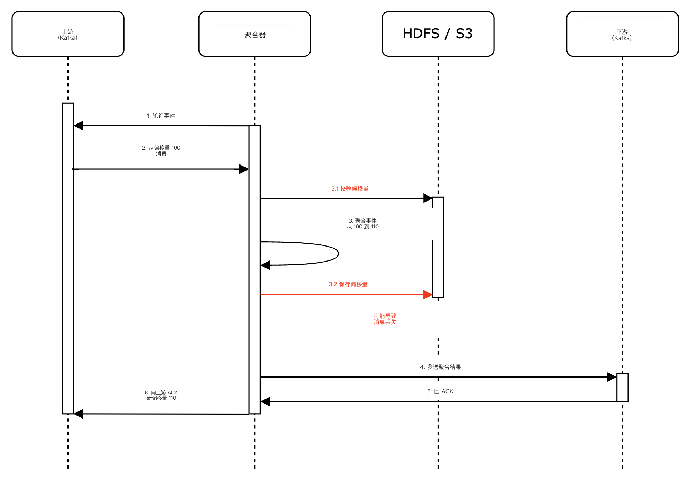
</div>

最后，我们可以在与下游交互时原子地存储偏移量。要做到这一点，需要实现分布式事务：

<div style="margin-left:3rem">
    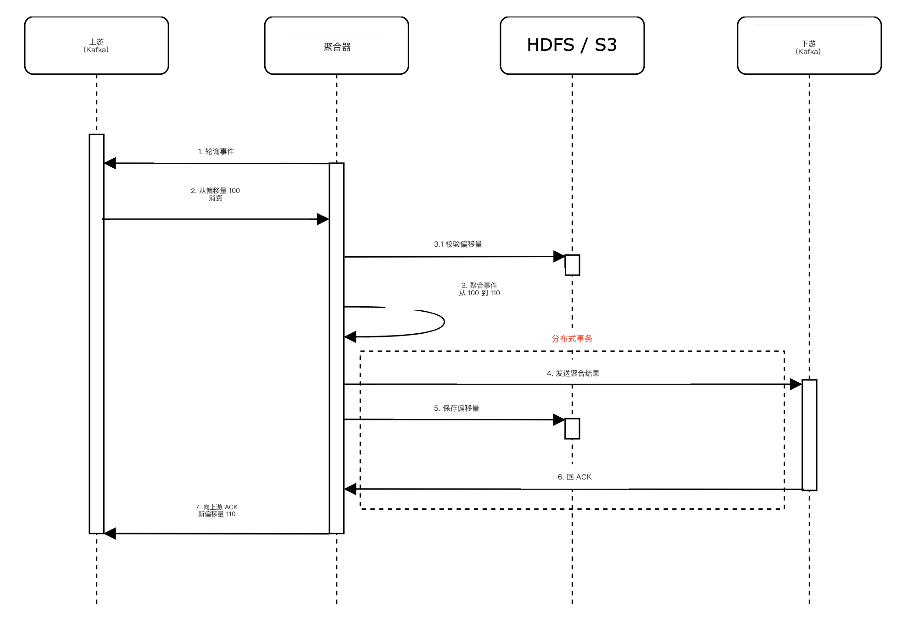
</div>

**个人旁注**：另一种做法是，如果下游系统对聚合结果做幂等（idempotency）处理，就不需要分布式事务。

### **扩展系统**
下面讨论系统变大时怎么扩展。

我们有三个独立组件——消息队列、聚合服务和数据库。
因为它们是解耦的，可以分别扩展。

如何扩展消息队列：
 - 不对生产者设限，所以生产者很容易扩展
 - 消费者可以通过加入消费者组并增加消费者数量来扩展。
 - 要做到这一点，还需要预先创建足够的分区
 - 另外，消费者再均衡在有数千个消费者时可能较久，建议在非高峰时段做
 - 也可以考虑按地理给主题（topic）分区，例如 `topic_na`、`topic_eu` 等。

<div style="margin-left:3rem">
    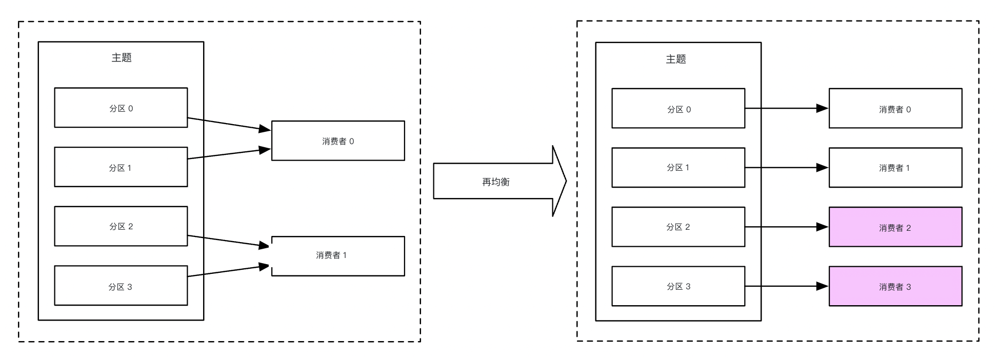
</div>

如何扩展聚合服务：

<div style="margin-left:3rem">
    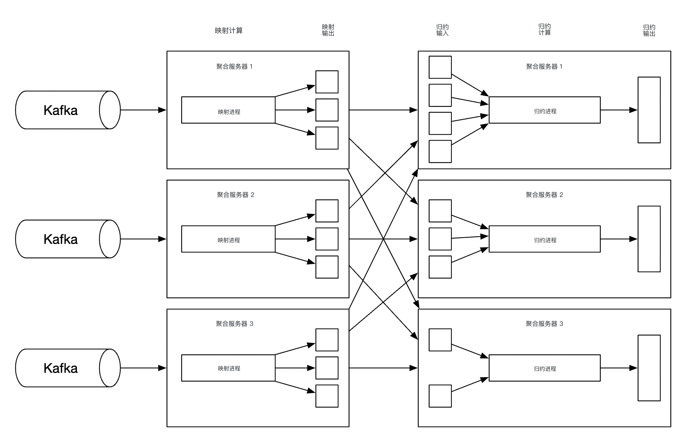
</div>

 - MapReduce 节点很容易通过加节点来扩展
 - 聚合服务的吞吐量可以通过多线程来扩展
 - 也可以借助 Apache YARN 这类资源提供者来做多进程
 - 方案 1 更简单，但方案 2 在实践中用得更广，因为它更可扩展
 - 下面是多线程的例子：

<div style="margin-left:3rem">
    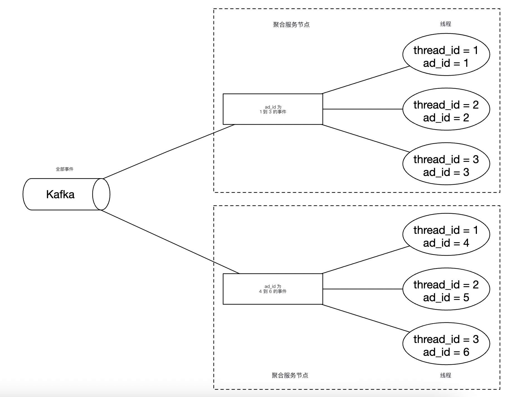
</div>

如何扩展数据库：
 - 如果用 Cassandra，它原生支持用一致性哈希（consistent hashing）做水平扩展
 - 如果向集群加新节点，数据会自动在所有（虚拟）节点之间再均衡
 - 用这种方式，不需要手工（再）分片（sharding）

<div style="margin-left:3rem">
    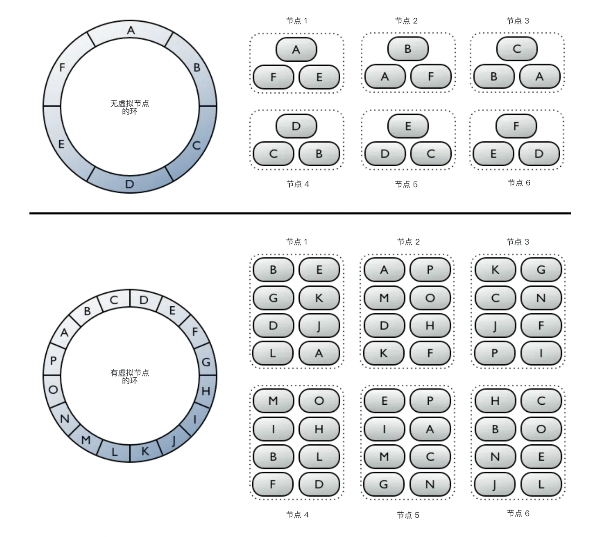
</div>

另一个要考虑的扩展问题是热点（hotspot）问题——如果某条广告更受欢迎、比其他广告得到更多关注怎么办？

<div style="margin-left:3rem">
    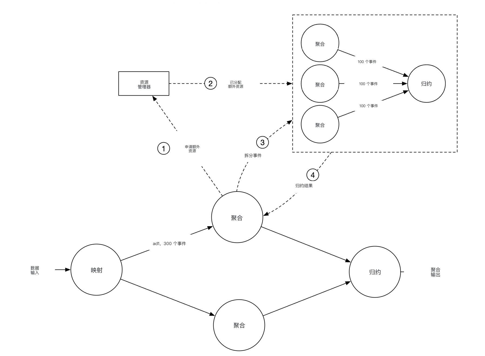
</div>

 - 上面的例子里，聚合服务节点可以通过资源管理器申请额外资源
 - 资源管理器分配更多资源，这样原节点就不会过载
 - 原节点把事件拆成 3 组，每个聚合节点处理 100 个事件
 - 结果写回原来的聚合节点

处理热点问题还有更复杂的办法：
 - 全局-局部聚合（Global-Local Aggregation）
 - 拆分去重聚合（Split Distinct Aggregation）

### **容错**
在聚合节点内部，我们在内存里处理数据。如果节点宕机，已处理的数据就丢了。

可以借助 Kafka 里的消费者偏移量，在另一个节点接手后从中断处继续。
不过还有额外的中间状态要维护，因为我们在聚合 M 分钟内点击最多的 N 条广告。

可以在某一分钟为正在进行的聚合做快照：

<div style="margin-left:3rem">
    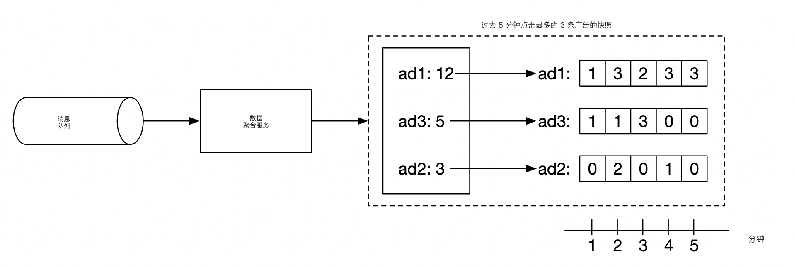
</div>

如果节点宕机，新节点可以读取最近提交的消费者偏移量，以及最近的快照来继续工作：

<div style="margin-left:3rem">
    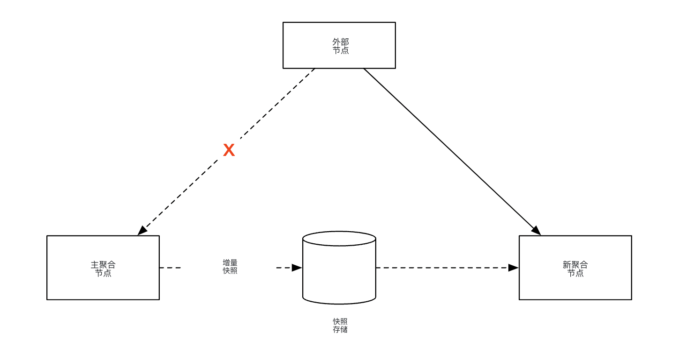
</div>

### **数据监控与正确性**
我们聚合的数据对计费至关重要，因此必须有严格的监控来保证正确性。

可能要监控的一些指标：
 - **延迟**：可以跟踪不同事件的时间戳，以了解系统的端到端延迟
 - **消息队列大小**：如果队列（queue）大小突然增加，需要加更多聚合节点。因为 Kafka 是用分布式提交日志（commit log）实现的，我们需要跟踪 records-lag 指标，而不是队列大小。
 - **聚合节点上的系统资源**：CPU、磁盘、JVM 等。

还需要实现一个对账流程，它是日终运行的批处理作业。
它从原始数据计算聚合结果，并与聚合数据库里实际存储的数据比较：

<div style="margin-left:3rem">
    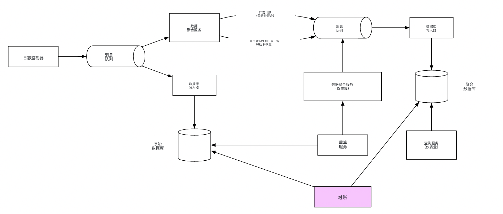
</div>

### **替代设计**
在通才型系统设计面试里，并不要求你了解大数据处理里专用软件的内部实现。

讲清思路、讨论权衡，比知道具体工具更重要，所以本章讲的是通用方案。

一种替代设计是用现成工具：把广告点击数据存进 Hive，上面再加一层 ElasticSearch 来加快查询。

聚合通常在 ClickHouse 或 Druid 这类 OLAP 数据库里做。

<div style="margin-left:3rem">
    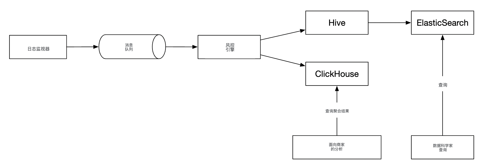
</div>

---

## 步骤 4：收尾
我们覆盖了：
 - 数据模型和 API 设计
 - 用 MapReduce 聚合广告点击事件
 - 扩展消息队列、聚合服务和数据库
 - 缓解热点问题
 - 持续监控系统
 - 用对账保证正确性
 - 容错

广告点击事件聚合是典型的大数据处理系统。

如果事先了解相关技术，会更容易理解和设计：
 - Apache Kafka
 - Apache Spark
 - Apache Flink
