# 第 22 章：设计酒店预订系统

## 简介
本章设计一个**酒店预订系统（hotel reservation system）**，类似 Marriott International。

也适用于其他类型的系统——Airbnb、机票预订、电影票预订。

---

## 步骤 1：理解问题并确定设计范围
动手设计之前，应向面试官提问以澄清范围：
 - 候选人：系统规模有多大？
 - 面试官：我们在做一个连锁酒店网站，有 5000 家酒店、100 万间客房
 - 候选人：顾客是预订时付款，还是到店再付？
 - 面试官：预订时全额付款。
 - 候选人：顾客只能通过网站订房吗？要不要支持电话预订等其他渠道？
 - 面试官：只通过网站或 App 预订。
 - 候选人：顾客能取消预订吗？
 - 面试官：能
 - 候选人：还有什么要考虑的？
 - 面试官：要考虑，我们允许超售（overbooking）10%。酒店会卖出比实际库存（inventory）更多的房间。酒店这么做是预期会有客人取消预订。
 - 候选人：时间不多，我们聚焦：展示酒店相关页面、客房详情页、预订房间、管理后台、支持超售。
 - 面试官：可以。
 - 面试官：还有一件事——酒店价格经常变。假设客房价格每天都会变。
 - 候选人：好。

### **非功能需求**
 - 支持高并发——旺季可能有很多用户（user）抢订同一家酒店。
 - 中等延迟——用户预订时最好低延迟，但系统花几秒处理也可以接受。

### **粗略估算**
 - 一共 5000 家酒店、100 万间客房
 - 假设 70% 的房间被占用，平均入住 3 天
 - 预估每日预订量：100 万 * 0.7 / 3 = 约 24 万次预订/天
 - 每秒预订数：24 万 / 一天约 10^5 秒 = 约 3。平均预订 TPS 很低。

来估算 QPS。假设到达预订页要三步，每页转化率 10%，可以估：如果有 3 次预订，预订页浏览量就是 30，客房详情页浏览量就是 300。

<div style="margin-left:3rem">
    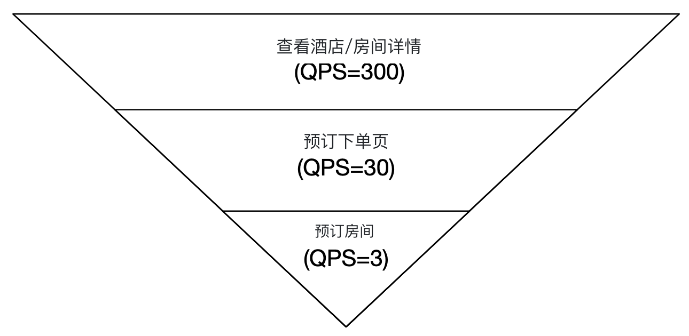
</div>

---

## 步骤 2：提出高层设计并达成共识
我们将讨论：API 设计、数据模型、高层设计。

### **API 设计**
本节 API 设计聚焦支持酒店预订系统所需的核心端点（采用 RESTful 实践）。

完整系统会需要更丰富的 API，例如按多种条件搜房，但本节不展开。原因是它们技术上不算难，所以不在范围内。

**酒店相关 API**
 - `GET /v1/hotels/{id}` - 获取酒店详细信息
 - `POST /v1/hotels` - 新增酒店。仅运维可用
 - `PUT /v1/hotels/{id}` - 更新酒店信息。仅运维可用
 - `DELETE /v1/hotels/{id}` - 删除酒店。仅运维可用

**房间相关 API**
 - `GET /v1/hotels/{id}/rooms/{id}` - 获取房间详细信息
 - `POST /v1/hotels/{id}/rooms` - 新增房间。仅运维可用
 - `PUT /v1/hotels/{id}/rooms/{id}` - 更新房间信息。仅运维可用
 - `DELETE /v1/hotels/{id}/rooms/{id}` - 删除房间。仅运维可用

**预订相关 API**
 - `GET /v1/reservations` - 获取当前用户的预订历史
 - `GET /v1/reservations/{id}` - 获取某次预订的详细信息
 - `POST /v1/reservations` - 新建预订
 - `DELETE /v1/reservations/{id}` - 取消预订

下面是一次预订请求的例子：

```
{
  "startDate":"2021-04-28",
  "endDate":"2021-04-30",
  "hotelID":"245",
  "roomID":"U12354673389",
  "reservationID":"13422445"
}
```

注意 `reservationID` 是幂等（idempotency）键，用来避免重复预订。细节在[并发问题](#并发问题)一节说明。

### **数据模型**
选择数据库之前，先看访问模式。

需要支持这些查询：
 - 查看酒店详细信息
 - 给定日期范围，查找可用房型（room type）
 - 记录预订
 - 查找某次预订或历史预订

从估算可知系统规模不大，但要为流量突增做准备。

因此选择关系型数据库，因为：
 - 关系型数据库适合读多写少的系统。
 - NoSQL 数据库通常针对写优化，但我们知道只有一小部分访问网站的用户会真正预订。
 - 关系型数据库提供 ACID 保证。对本系统很重要，否则无法防止负余额、重复扣款等问题。
 - 关系型数据库很容易建模，因为结构很清晰。

下面是 schema 设计：

<div style="margin-left:3rem">
    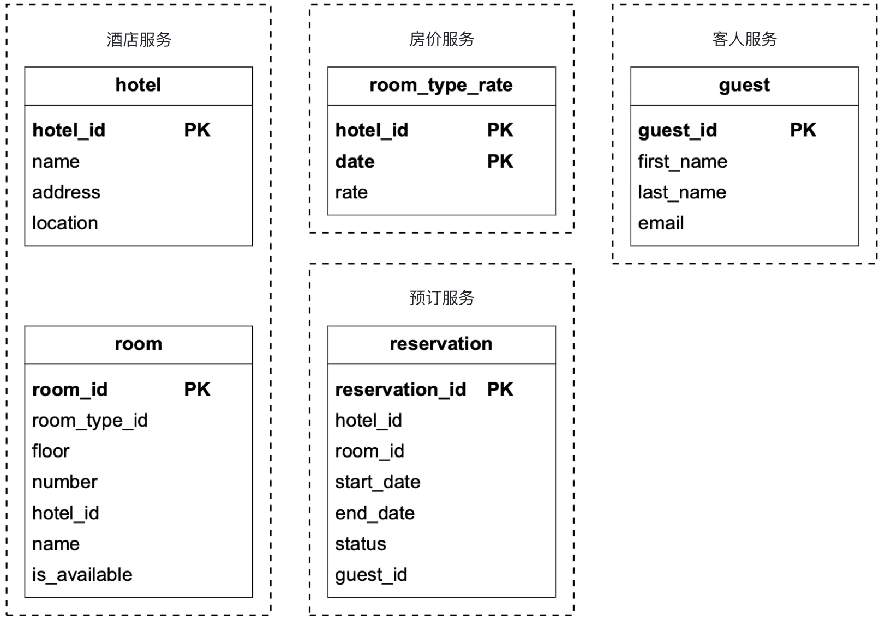
</div>

多数字段一目了然。唯一值得一提的是 `status` 字段，它表示某个房间的状态机：

<div style="margin-left:3rem">
    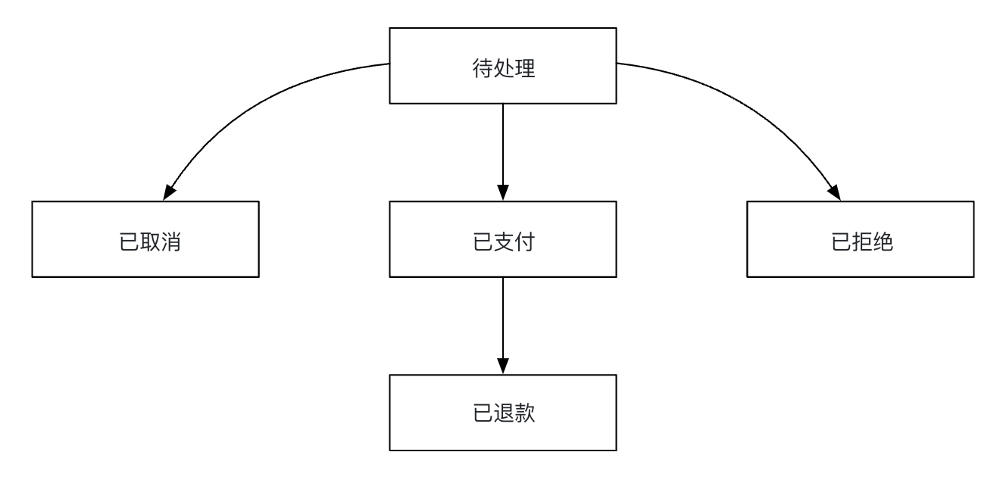
</div>

这个数据模型适合 Airbnb 这类系统，但不适合酒店：用户预订的不是某间具体房间，而是一种房型。他们预订的是房型，房间号在预订时选定。

这一不足会在[改进后的数据模型](#改进后的数据模型)一节处理。

### **高层设计**
我们为本设计选择了微服务（microservice）架构。近几年它很流行：

<div style="margin-left:3rem">
    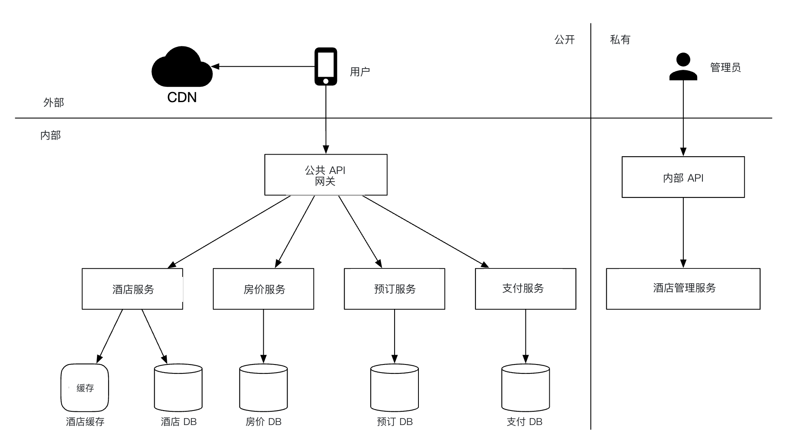
</div>

 - **用户**：用手机或电脑订房
 - **管理员（Admin）**：执行退款/取消支付等管理操作
 - **CDN**：缓存（cache）JS 包、图片、视频等静态资源
 - **公共 API 网关（Public API Gateway）**：全托管服务，支持限流、认证等。
 - **内部 API**：仅授权人员可见。通常用 VPN 保护。
 - **酒店服务**：提供酒店和房间的详细信息。酒店和房间数据是静态的，可以积极缓存。
 - **房价服务（Rate service）**：提供未来不同日期的房价。这个领域有个有趣的点：价格取决于当天酒店有多满。
 - **预订服务**：接收预订请求并预订客房。同时在预订/取消时跟踪房间库存。
 - **支付服务**：处理支付，成功后更新预订状态。
 - **酒店管理服务**：仅授权人员可用。提供管理、查看预订和酒店等管理功能。

服务间通信可用 RPC 框架，例如 gRPC。

---

## 步骤 3：深入设计
深入讨论：
 - 改进后的数据模型
 - 并发问题
 - 可扩展性
 - 解决微服务中的数据不一致

### **改进后的数据模型**
如前所述，需要改 API 和 schema，以便按房型预订，而不是预订某一间具体房间。

预订 API 不再预订 `roomID`，而是预订 `roomTypeID`：

```
POST /v1/reservations
{
  "startDate":"2021-04-28",
  "endDate":"2021-04-30",
  "hotelID":"245",
  "roomTypeID":"12354673389",
  "roomCount":"3",
  "reservationID":"13422445"
}
```

下面是更新后的 schema：

<div style="margin-left:3rem">
    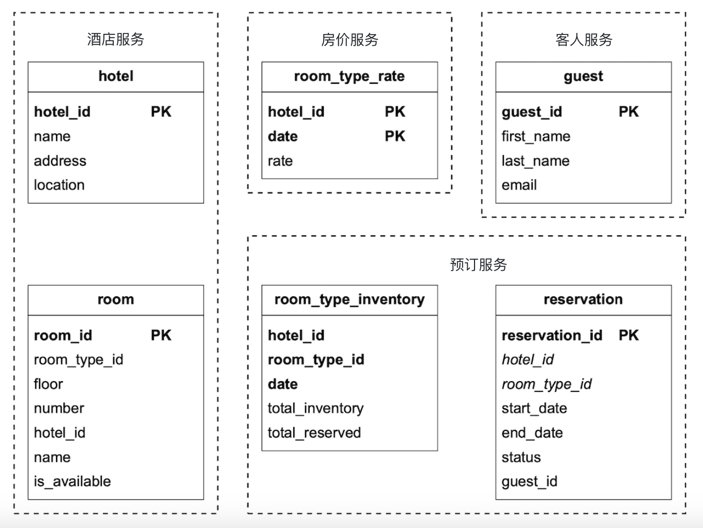
</div>

 - **room**：房间信息
 - **room_type_rate**：某房型的价格信息
 - **reservation**：记录客人预订数据
 - **room_type_inventory**：存储酒店房间库存数据。

看一下 `room_type_inventory` 的列，这张表更有意思：
 - **hotel_id**：酒店 id
 - **room_type_id**：房型 id
 - **date**：单个日期
 - **total_inventory**：房间总数减去暂时从库存中拿掉的房间。
 - **total_reserved**：给定 (hotel_id, room_type_id, date) 已预订的房间总数

还有其他设计这张表的方式，但每个 (hotel_id, room_type_id, date) 一行，预订管理和查询都更简单。

表中的行由每日 CRON 任务预填。

示例数据：
| hotel_id | room_type_id | date       | total_inventory | total_reserved |
|----------|--------------|------------|-----------------|----------------|
| 211      | 1001         | 2021-06-01 | 100             | 80             |
| 211      | 1001         | 2021-06-02 | 100             | 82             |
| 211      | 1001         | 2021-06-03 | 100             | 86             |
| 211      | 1001         | ...        | ...             |                |
| 211      | 1001         | 2023-05-31 | 100             | 0              |
| 211      | 1002         | 2021-06-01 | 200             | 16             |
| 2210     | 101          | 2021-06-01 | 30              | 23             |
| 2210     | 101          | 2021-06-02 | 30              | 25             |

检查某房型是否可用的示例 SQL 查询：

```
SELECT date, total_inventory, total_reserved
FROM room_type_inventory
WHERE room_type_id = ${roomTypeId} AND hotel_id = ${hotelId}
AND date between ${startDate} and ${endDate}
```

如何用这些数据检查指定数量的房间是否可用（注意我们支持超售）：

```
if (total_reserved + ${numberOfRoomsToReserve}) <= 110% * total_inventory
```

现在估算一下存储量。
 - 有 5000 家酒店。
 - 每家酒店有 20 种房型。
 - 5000 * 20 * 2（年）* 365（天）= 7300 万行

7300 万行数据量不大，单台数据库服务器就能扛。不过设置读复制（可能跨可用区）以实现高可用（high availability）是合理的。

后续问题——如果预订数据对单库太大，怎么办？
 - 只存当前和未来的预订数据。历史预订可迁到冷存储（cold storage）。
 - 数据库分片（sharding）——可按 `hash(hotel_id) % servers_cnt` 分片，因为查询总会带上 `hotel_id`。

### **并发问题**
另一个要解决的重要问题是重复预订。

有两个问题：
 - 同一用户点了两次「预订」
 - 多个用户同时预订同一间房

第一种问题的示意：

<div style="margin-left:3rem">
    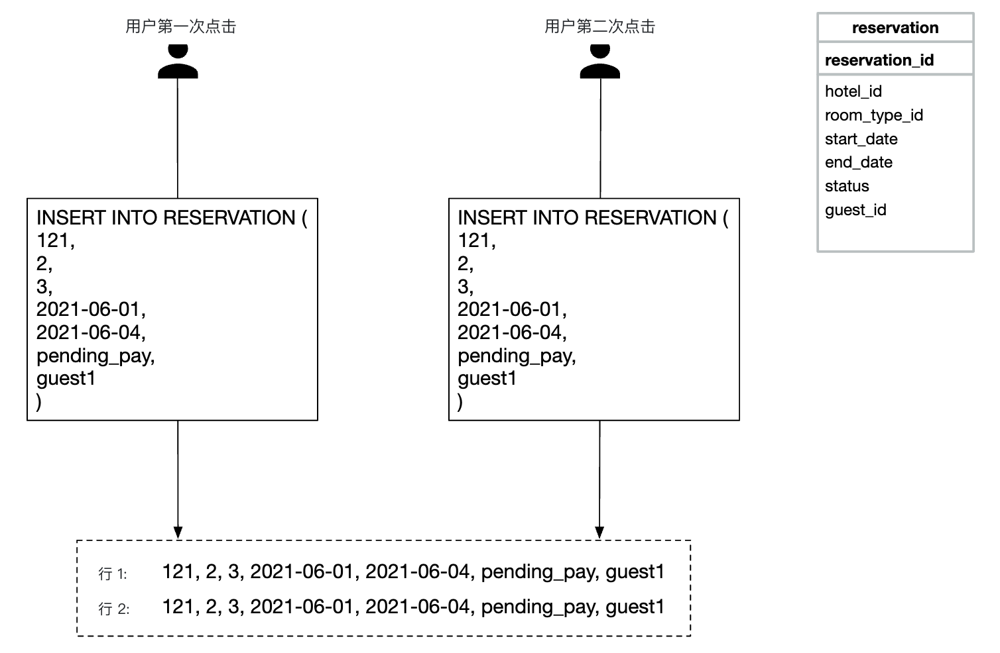
</div>

有两种解决办法：
 - 客户端（client）处理——前端点击后禁用预订按钮。但如果用户禁用了 javascript，就看不到按钮变灰。
 - 幂等 API——给 API 加幂等键，无论端点被调用多少次，用户只能执行一次该操作：

<div style="margin-left:3rem">
    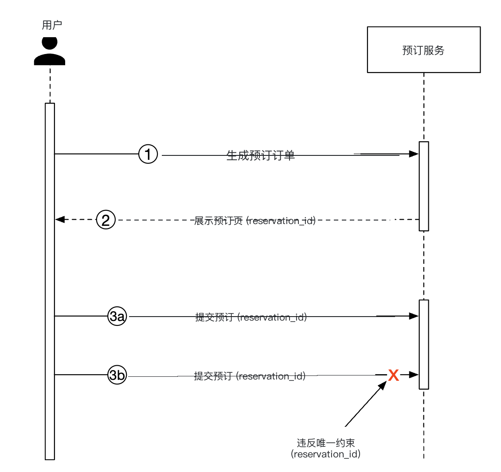
</div>

流程如下：
 - 填写资料、下单过程中会生成预订订单。预订订单用全局唯一标识符生成。
 - 用上一步生成的 `reservation_id` 提交预订 1。
 - 如果再次点击「完成预订」，会发送同一个 `reservation_id`，后端发现这是重复预订。
 - 通过给 `reservation_id` 列加唯一约束（unique constraint），阻止 DB 中存多条相同 id 的记录，从而避免重复。

<div style="margin-left:3rem">
    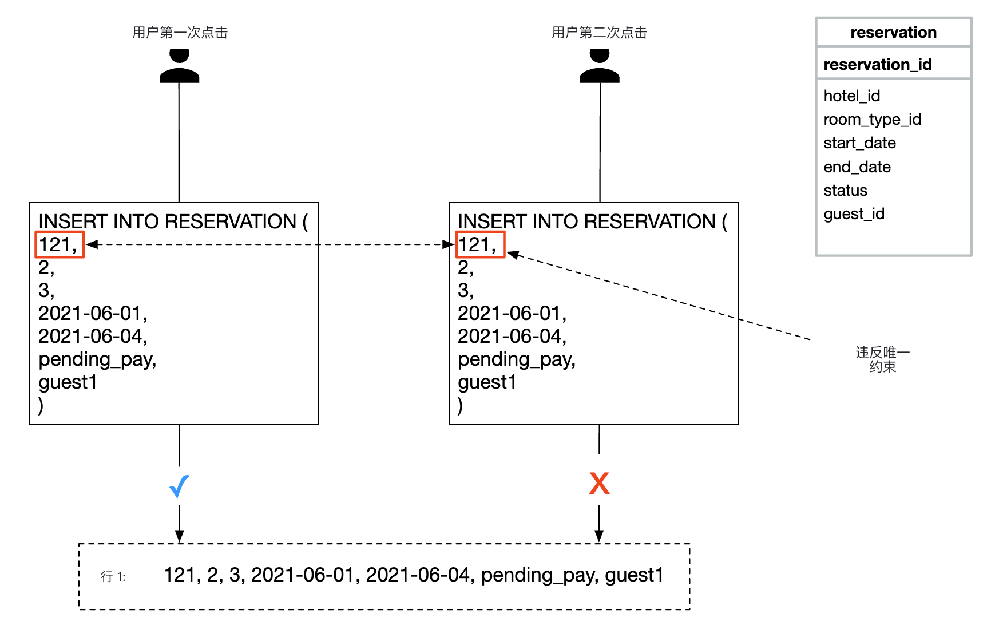
</div>

如果多个用户做同一预订呢？

<div style="margin-left:3rem">
    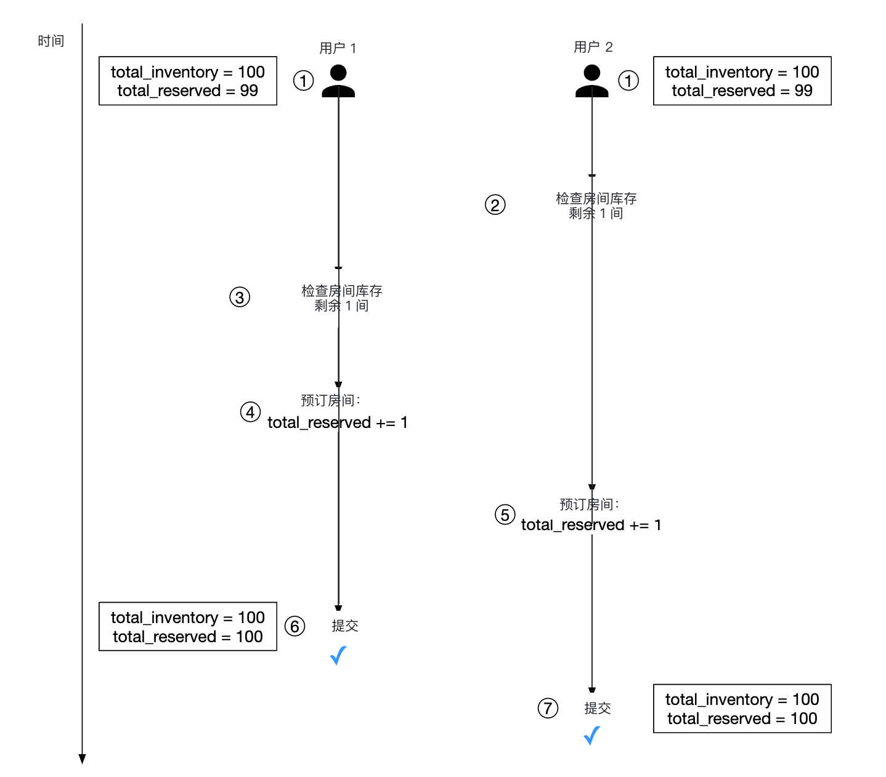
</div>

 - 假设事务隔离级别不是 serializable
 - 用户 1 和用户 2 同时预订同一间房。
 - 事务 1 检查房间是否足够——足够
 - 事务 2 检查房间是否足够——足够
 - 事务 2 预订房间并更新库存
 - 事务 1 也预订了房间，因为它仍看到 100 间里 `total_reserved` 是 99。
 - 两个事务都成功提交更改

可用某种锁机制解决：
 - 悲观锁（pessimistic locking）
 - 乐观锁（optimistic locking）
 - 数据库约束（database constraint）

预订房间用的 SQL：

```sql
# 步骤 1：检查房间库存
SELECT date, total_inventory, total_reserved
FROM room_type_inventory
WHERE room_type_id = ${roomTypeId} AND hotel_id = ${hotelId}
AND date between ${startDate} and ${endDate}

# 对步骤 1 返回的每一行
if((total_reserved + ${numberOfRoomsToReserve}) > 110% * total_inventory) {
  Rollback
}

# 步骤 2：预订房间
UPDATE room_type_inventory
SET total_reserved = total_reserved + ${numberOfRoomsToReserve}
WHERE room_type_id = ${roomTypeId}
AND date between ${startDate} and ${endDate}

Commit
```

#### 方案 1：悲观锁
悲观锁在更新记录时给记录加锁，防止同时更新。

MySQL 可用 `SELECT... FOR UPDATE` 查询做到这一点，它会锁住查询选中的行，直到事务提交。

<div style="margin-left:3rem">
    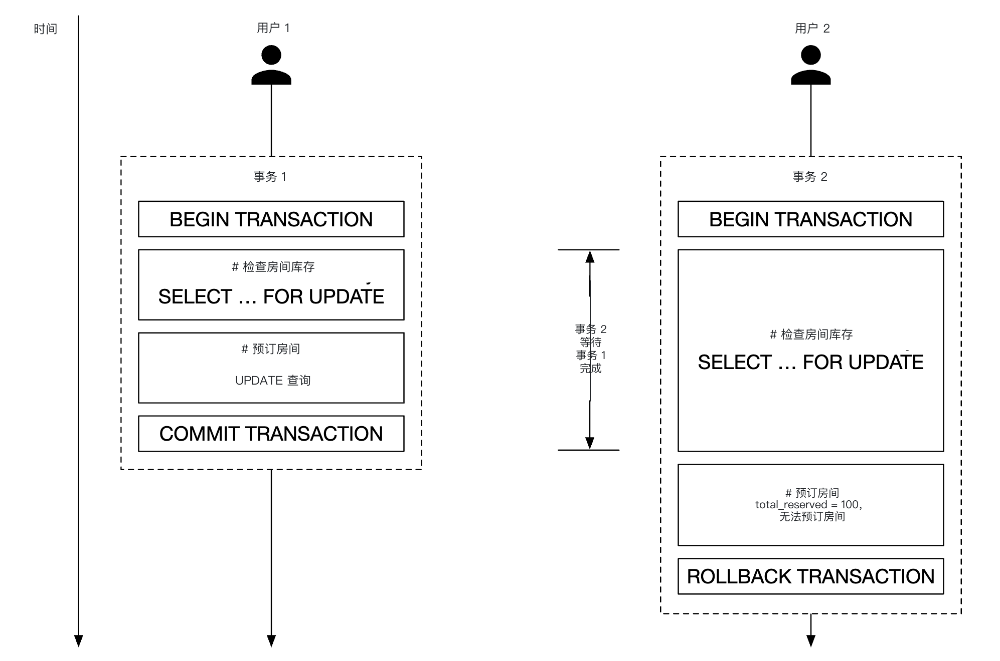
</div>

优点：
 - 防止应用更新正在被改的数据
 - 实现简单，通过串行化更新避免冲突。数据争用严重时有用。

缺点：
 - 锁定多个资源时可能死锁。
 - 这种方法不可扩展——如果事务锁太久，会影响所有试图访问该资源的其他事务。
 - 查询选中大量资源且事务寿命很长时，影响很严重。

作者不推荐这种方法，因为可扩展性有问题。

#### 方案 2：乐观锁
乐观锁允许多个用户同时尝试更新一条记录。

两种常见实现——版本号和时间戳。推荐版本号，因为服务器时钟可能不准。

<div style="margin-left:3rem">
    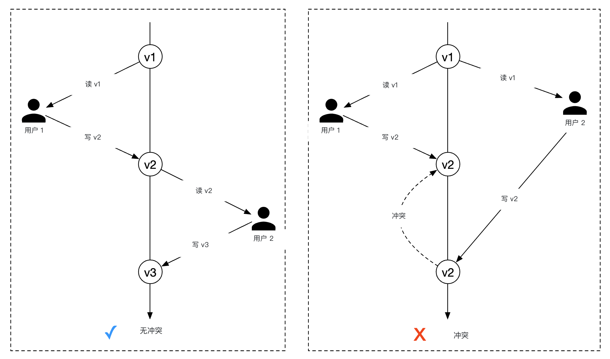
</div>

 - 给数据库表加一列 `version`
 - 用户修改一行之前，先读版本号
 - 用户更新该行时，版本号加 1 再写回数据库
 - 如果新版本号没有超过旧版本号，数据库校验会阻止这次写入

乐观锁通常比悲观锁快，因为我们不锁数据库。
但并发高时性能会下降，因为会导致大量回滚。

优点：
 - 防止应用编辑过期数据
 - 不需要在数据库里加锁
 - 数据争用低（即很少发生更新冲突）时是首选

缺点：
 - 数据争用高时性能差

对本系统，乐观锁是好选择，因为预订 QPS 不是特别高。

#### 方案 3：数据库约束
这种方法和乐观锁很像，但护栏用数据库约束实现：

```
CONSTRAINT `check_room_count` CHECK((`total_inventory - total_reserved` >= 0))
```

<div style="margin-left:3rem">
    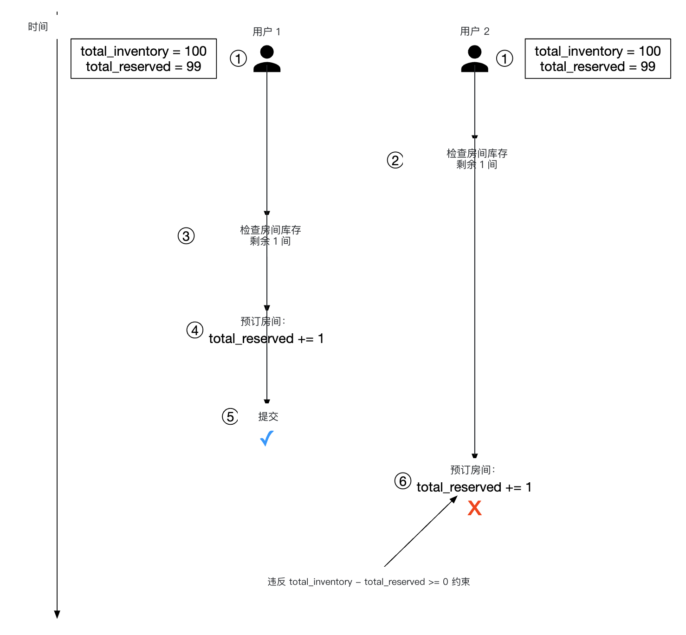
</div>

优点：
 - 实现简单
 - 数据争用小时效果好

缺点：
 - 和乐观锁类似，数据争用高时性能差
 - 数据库约束不像应用代码那样容易做版本控制
 - 不是所有数据库都支持约束

由于实现简单，这也是酒店预订系统的好选择。

### **可扩展性**
通常酒店预订系统的负载并不高。

但面试官可能问：如果系统用在 booking.com 这类更大、更热门的旅游网站上怎么办？那时 QPS 可能大 1000 倍。

遇到这种情况，重要的是搞清瓶颈在哪。所有服务都是无状态（stateless）的，所以很容易通过复制来扩展。

数据库则是有状态（stateful）的，如何扩展没那么显而易见。

一种扩展方式是做数据库分片——把数据拆到多个数据库，每个库保存一部分数据。

可以按 `hotel_id` 分片，因为所有查询都按它过滤。
假设 QPS 是 30,000，把数据库分成 16 个分片后，每个分片处理 1875 QPS，这在单个 MySQL 集群的负载能力之内。

<div style="margin-left:3rem">
    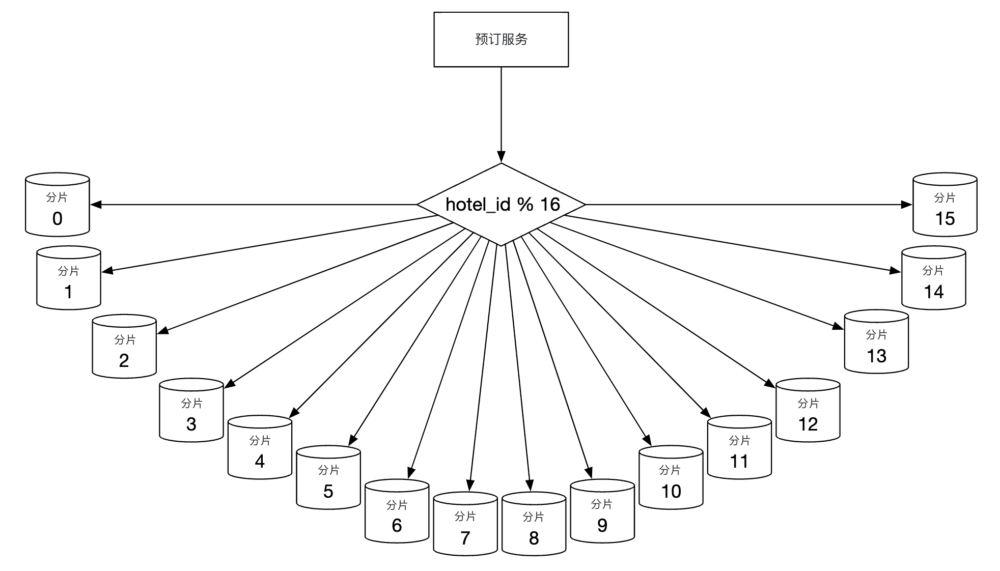
</div>

还可以用 Redis 缓存房间库存和预订。可以设 TTL，让已经过去的日期的旧数据过期。

<div style="margin-left:3rem">
    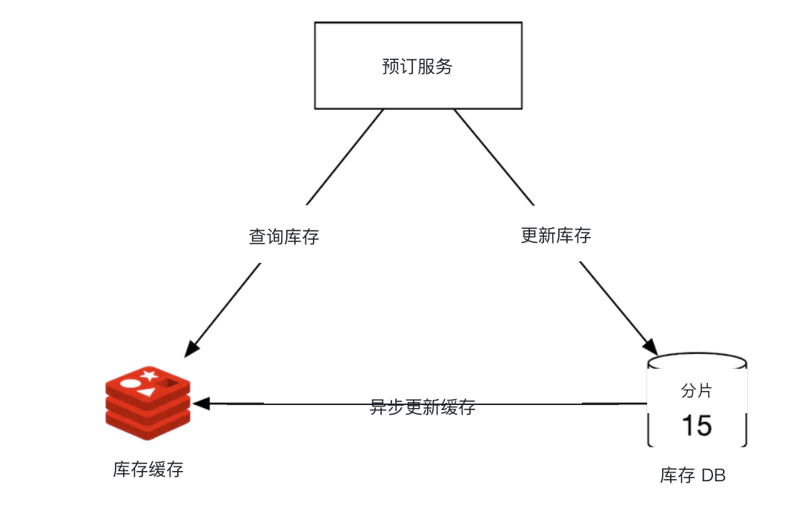
</div>

库存按 `hotel_id`、`room_type_id` 和 `date` 存储：

```
key: hotelID_roomTypeID_{date}
value: 给定酒店 ID、房型和日期的可用房间数。
```

数据一致性是异步发生的，用 CDC 流机制管理——读取数据库变更并应用到另一个系统。
Debezium 是把数据库变更同步到 Redis 的常用选择。

用这种机制，缓存和数据库有一段时间可能不一致。
对我们来说没问题，因为数据库会阻止无效预订。

这会给 UI 带来一点问题：用户可能要刷新页面才能看到「没有房间了」，
但如果有人预订前犹豫很久，即使没有这个问题也可能发生这种情况。

缓存优点：
 - 降低数据库负载
 - 高性能，因为 Redis 在内存中管理数据

缓存缺点：
 - 维持缓存和 DB 之间的数据一致性很难。需要考虑不一致如何影响用户体验。

### **服务间数据一致性**
单体（monolith）应用可以用共享关系型数据库来保证数据一致性。

在我们的微服务设计里，采用了混合方案：部分服务是分开的，
但预订和库存 API 由同一服务处理。

这样做是因为我们想利用关系型数据库的 ACID 保证来确保一致性。

但面试官可能挑战这种做法，因为它不是纯微服务架构（每个服务有独立数据库）：

<div style="margin-left:3rem">
    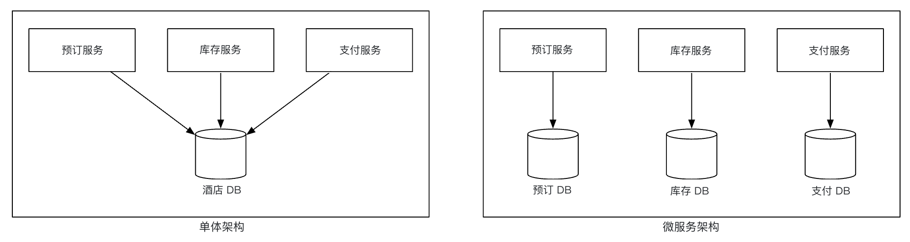
</div>

这会导致一致性问题。在单体服务器里，可以利用关系型数据库的事务能力实现原子性（atomicity）操作：

<div style="margin-left:3rem">
    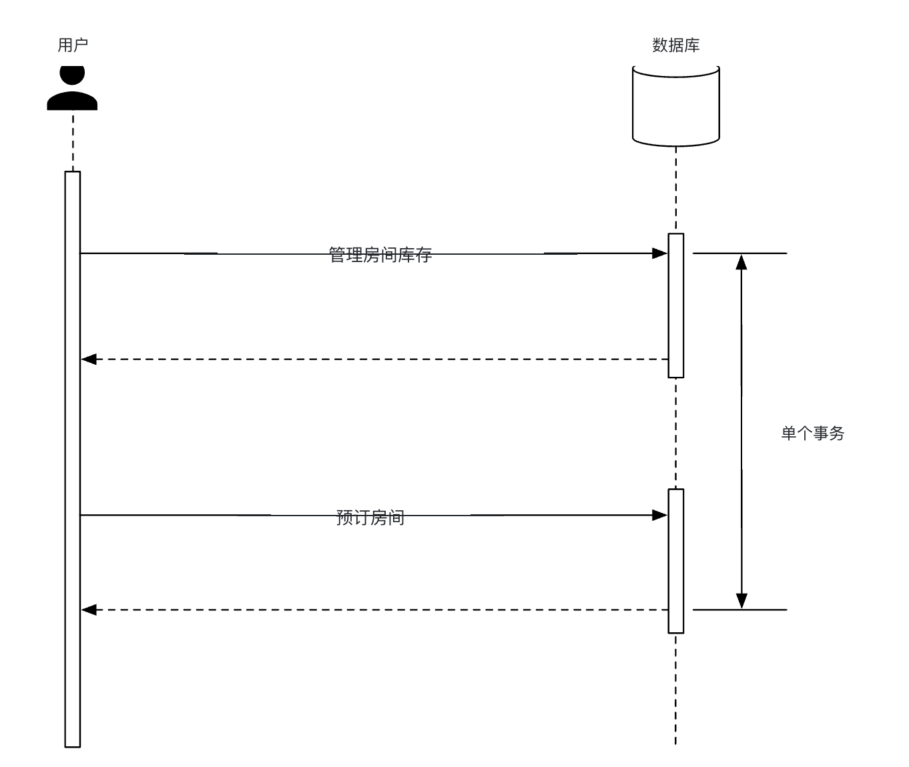
</div>

当操作跨越多个服务时，保证这种原子性就更难：

<div style="margin-left:3rem">
    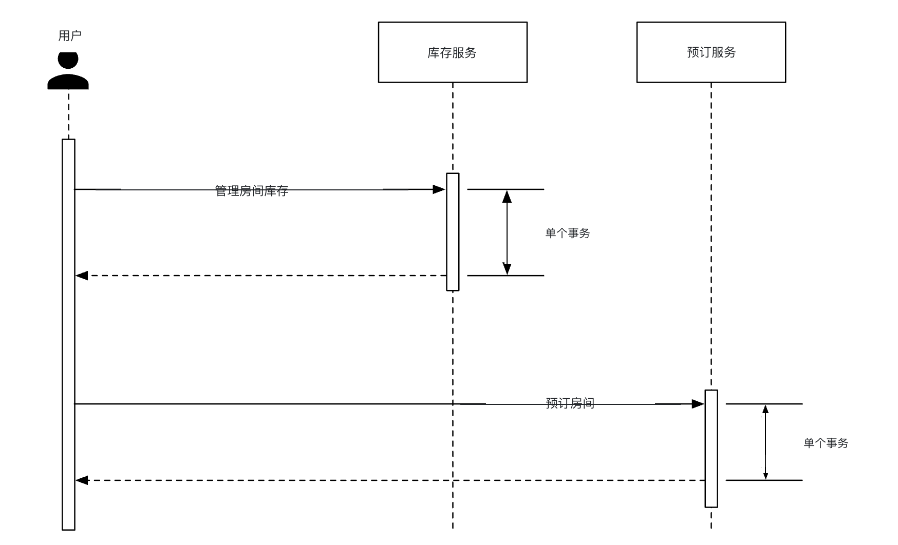
</div>

有一些处理这些数据不一致的知名技术：
 - **两阶段提交（Two-phase commit）**：一种数据库协议，保证跨多个节点的原子事务提交。
   但性能不好，因为单个节点延迟会导致所有节点阻塞操作。
 - **Saga**：一系列本地事务，工作流中任一步失败就触发补偿事务（compensating transaction）。这是最终一致性（eventual consistency）方案。

值得注意的是，解决微服务间数据不一致是个难题，会提高系统复杂度。
鉴于我们更务实的做法是把相互依赖的操作封装在同一个关系型数据库里，应该考虑这笔成本是否值得。

---

## 步骤 4：收尾
我们给出了酒店预订系统的设计。

走过这些步骤：
 - 收集需求并做粗略估算，理解系统规模
 - 在高层设计中给出了 API 设计、数据模型和系统架构
 - 深入设计中，随着需求变化探索了替代的数据库 schema 设计
 - 讨论了竞态条件（race condition）并提出解决方案——悲观锁/乐观锁、数据库约束
 - 通过数据库分片和缓存来扩展系统
 - 最后讨论了如何处理多个微服务间的数据一致性问题
