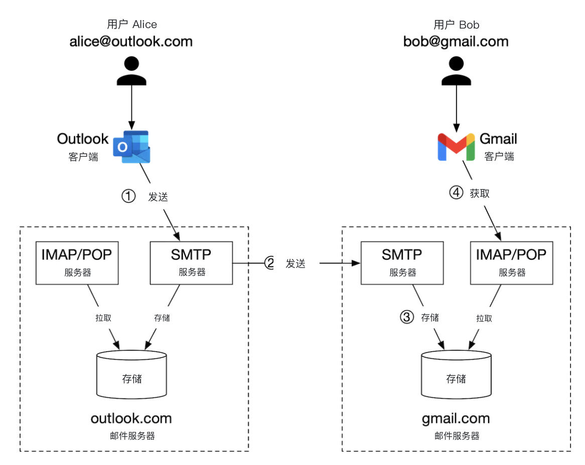
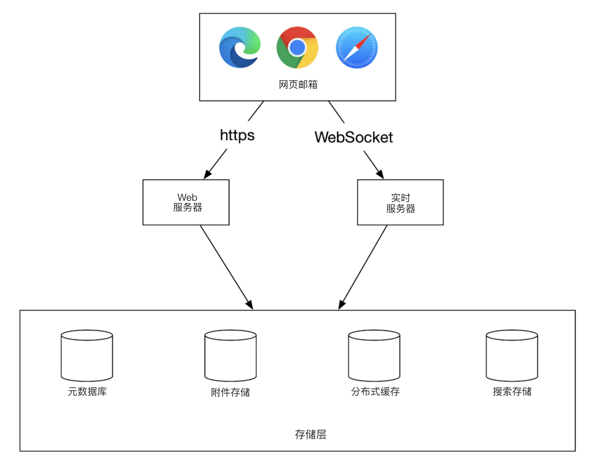
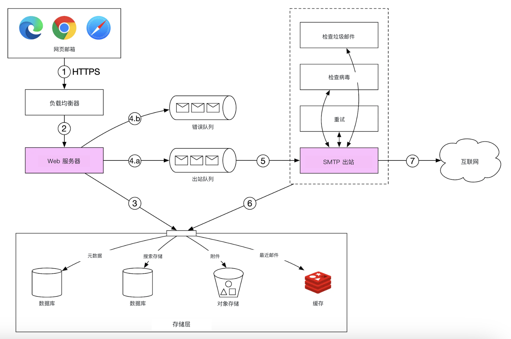
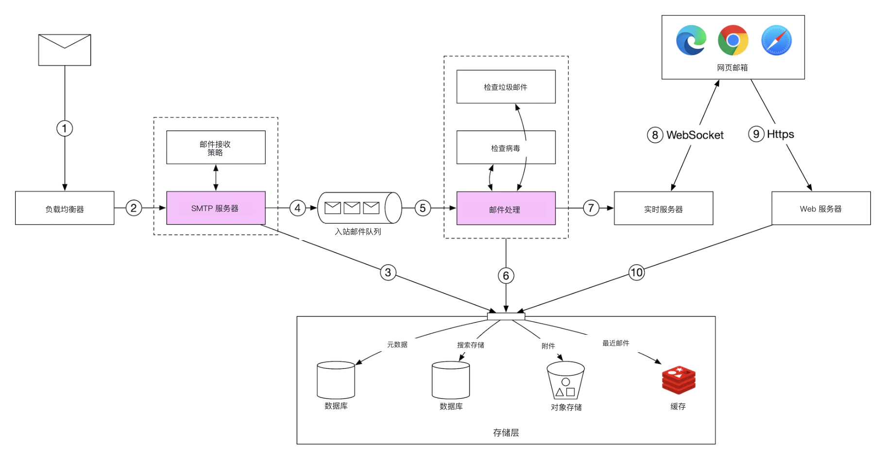
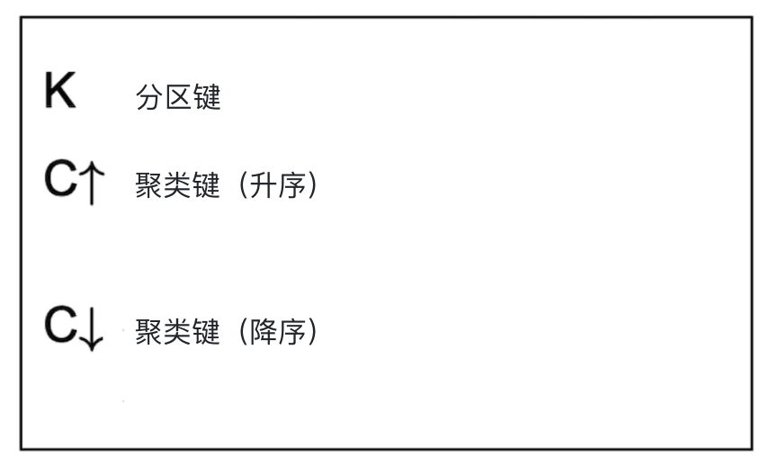
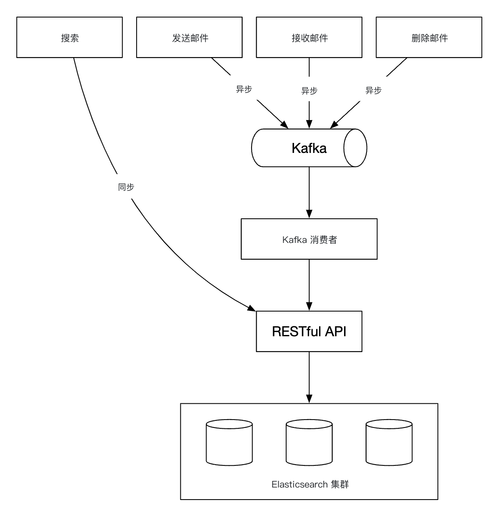
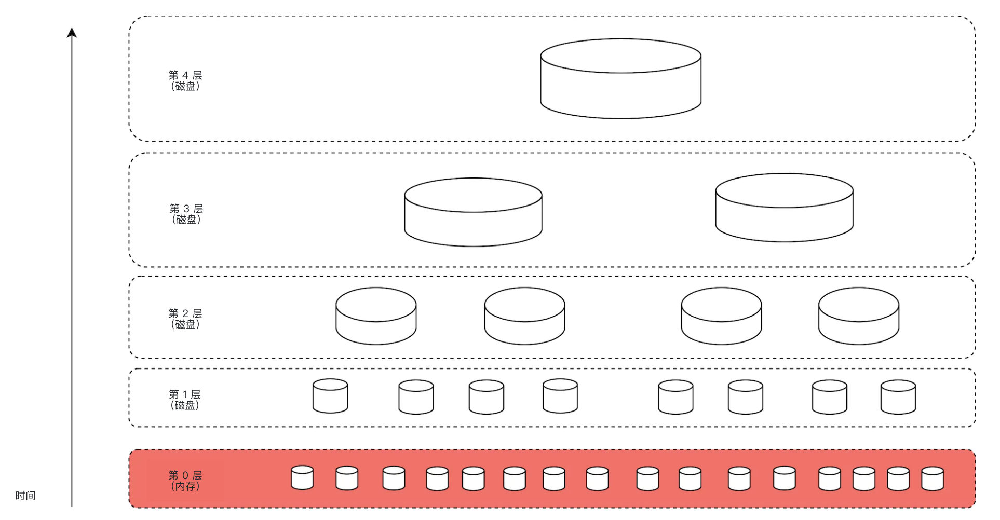
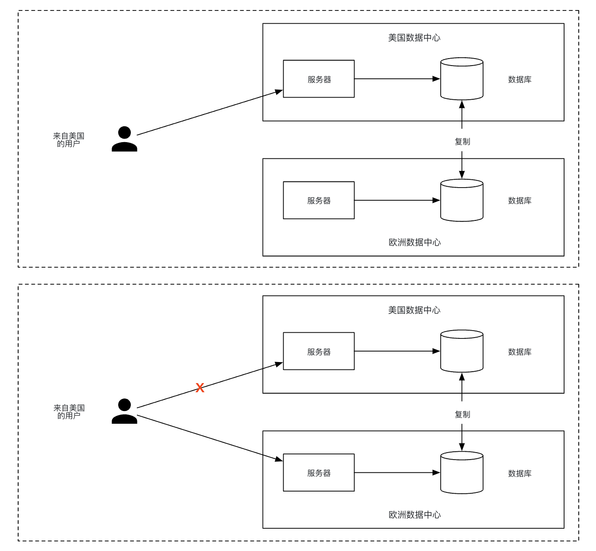

# 第 23 章：设计分布式邮件服务

## 简介

本章设计一套类似 **Gmail** 的**分布式邮件服务（distributed email service）**。

2020 年，**Gmail** 有 18 亿活跃用户（user），**Outlook** 在全球有 4 亿用户。

---

## 步骤 1：理解问题并确定设计范围

- 候选人：系统有多少用户？
- 面试官：10 亿用户
- 候选人：我觉得这些功能很重要——认证（auth）、发送/接收邮件、拉取邮件、过滤邮件、搜索邮件、反垃圾邮件（spam）保护。
- 面试官：清单不错。先不用考虑认证。
- 候选人：用户怎么连上邮件服务器？
- 面试官：邮件客户端（client）一般走 SMTP、POP、IMAP，但这道题我们用 HTTP。
- 候选人：邮件可以带附件（attachments）吗？
- 面试官：可以

### **非功能需求**

- **可靠性（reliability）** - 不能丢数据
- **可用性（availability）** - 用复制（replication）避免单点故障（SPOF）。也要能容忍部分系统故障。
- **可扩展性（scalability）** - 用户规模增长时，系统仍能扛住。
- **灵活性与可扩展性（flexibility and extensibility）** - 系统应灵活，便于加新功能。这也是我们选 HTTP 而不是 SMTP/其他邮件协议的原因之一。

### **粗略估算**

- **10 亿用户**
- 假设每人每天发 10 封邮件 -> **每秒 10 万封邮件**。
- 假设每人每天收 40 封邮件，每封平均 50 KB 元数据（metadata） -> **每年 730 PB 存储**。
- 假设 20% 的邮件带存储附件，平均大小 500 KB -> **每年 1,460 PB**。

---

## 步骤 2：提出高层设计并达成共识

### **邮件基础**

收发邮件会用到多种协议：
- **SMTP** - 服务器之间发送邮件的标准协议。
- **POP** - 从远程邮件服务器接收并下载邮件到本地客户端的标准协议。取回后，远程服务器上的邮件会被删除。
- **IMAP** - 与 POP 类似，也用于从远程服务器接收并下载邮件，但邮件会留在服务器上。
- **HTTPS** - 严格来说不是邮件协议，但可用于基于网页的邮件客户端。

除邮件协议外，邮件服务器还要配置一些 DNS 记录——MX 记录：

<div style="margin-left:3rem">
    
</div>

邮件附件以 base64 编码发送，大多数邮件服务通常有 25 MB 的大小上限。
该上限可配置，个人账号与企业账号会不一样。

### **传统邮件服务器**

用户不多、都连同一台服务器时，传统邮件服务器够用。

<div style="margin-left:3rem">
    
</div>

- Alice 登录 Outlook 邮箱并点「发送」。邮件发到 Outlook 邮件服务器。通信走 SMTP。
- Outlook 服务器查询 DNS，找到 gmail.com 的 MX 记录，再把邮件转到对方服务器。通信走 SMTP。
- Bob 通过 IMAP/POP 从他的 Gmail 服务器拉取邮件。

传统邮件服务器把邮件存在本地文件系统上。每封邮件一个文件。

<div style="margin-left:3rem">
    
</div>

规模变大后，磁盘 I/O 成了瓶颈。而且这也不满足高可用（high availability）和可靠性要求。
磁盘可能损坏，服务器也可能宕机。

### **分布式邮件服务器**

分布式邮件服务器面向现代用例，并解决现代可扩展性问题。

这些服务器仍可为原生邮件客户端提供 IMAP/POP，并在服务器之间用 SMTP 交换邮件。

但对功能丰富的网页邮件客户端，通常会在 HTTP 上提供 RESTful API。

示例 API：
- `POST /v1/messages` - 向 To、Cc、Bcc 头里的收件人发送消息。
- `GET /v1/folders` - 返回某个邮件账号的全部文件夹

示例响应：

```
[{id: string        文件夹的唯一标识。
  name: string      文件夹名称。
                    按 RFC6154 [9]，默认文件夹可以是下列之一：
                    All、Archive、Drafts、Flagged、Junk、Sent、
                    以及 Trash。
  user_id: string   指向账号所有者
}]
```

- `GET /v1/folders/{:folder_id}/messages` - 返回某文件夹下的全部消息，带分页
- `GET /v1/messages/{:message_id}` - 获取某封邮件的全部信息

示例响应：

```
{
  user_id: string                      // 指向账号所有者。
  from: {name: string, email: string}  // 发件人的 <name, email> 对。
  to: [{name: string, email: string}]  // <name, email> 对的列表
  subject: string                      // 邮件主题
  body: string                         //  邮件正文
  is_read: boolean                     //  标记邮件是否已读。
}
```

下面是分布式邮件服务器的高层设计：

<div style="margin-left:3rem">
    
</div>

- **网页邮箱（webmail）** - 用户用浏览器收发邮件
- **Web 服务器（web server）** - 面向公网的请求/响应服务，用于登录、注册、用户资料等。
- **实时服务器（real-time servers）** - 向客户端实时推送新邮件更新。实时通信用 WebSocket，不支持的旧浏览器回退到长轮询（long polling）。
- **元数据库** - 存储邮件元数据，例如主题、正文、from、to 等。
- **附件存储** - 对象存储（object storage），例如 Amazon S3，适合存大文件。
- **分布式缓存（distributed cache）** - 可以把最近的邮件缓存在 Redis 里，改善用户体验。
- **搜索存储** - 分布式文档存储，用来支持全文搜索（full-text search）。

发信流程如下：

<div style="margin-left:3rem">
    
</div>

- 用户写好邮件并点「发送」。邮件发到负载均衡器（load balancer）。
- 负载均衡器对过量发信做限流（rate limiting），并路由到其中一台 Web 服务器。
- Web 服务器做基本邮件校验（例如邮件大小）；若收件人域名与发件人相同，则短路出站流程。但会先做垃圾邮件检查。
- 基本校验通过后，邮件进入消息队列（message queue）；附件以对象存储中的引用表示
- 基本校验失败，邮件进入错误队列
- SMTP 出站工作节点（workers）从出站队列拉取消息，做垃圾邮件/病毒检查，再路由到目标邮件服务器。
- 邮件存入「已发送」文件夹

还要监控出站消息队列的长度。涨得过大可能说明有问题：
- 收件人邮件服务器不可用。可以用指数退避（exponential backoff）稍后重试发送。
- 消费者（consumer）不够扛负载，可能需要扩容消费者。

收信流程如下：

<div style="margin-left:3rem">
    
</div>

- 入站邮件到达 SMTP 负载均衡器。邮件分发到 SMTP 服务器，在那里执行邮件接收策略（例如无效邮件直接丢弃）。
- 如果邮件附件太大，可以放进对象存储（S3）。
- 邮件处理工作节点做初步检查，之后把邮件转发到存储、缓存、对象存储和实时服务器。
- 离线用户重新上线后，通过 HTTP API 拿到新邮件。

---

## 步骤 3：深入设计

下面深入几个组件。

### **元数据库**

邮件元数据有这些特点：
- 邮件头通常很小，而且访问频繁
- 正文可大可小，但通常只读一次
- 大多数邮件操作都隔离在单个用户上——例如拉取邮件、标已读、搜索。
- 数据新旧程度影响用量。用户通常只读最近的邮件
- 数据可靠性要求很高。丢数据不可接受。

在 Gmail/Outlook 这种规模下，数据库通常是定制的，以降低每秒输入/输出操作数（IOPS）。

来看有哪些数据库选项：
- **关系型数据库** - 可以为邮件头和正文建索引，但这类数据库通常针对小块数据做了优化。
- **分布式对象存储** - 做备份存储不错，但不能高效支持搜索/标已读等操作。
- **NoSQL** - Gmail 用的是 Google BigTable，但它不是开源的。

基于以上分析，现成方案几乎没有完全契合需求的。
面试里不可能去设计一套新的分布式数据库，但要能说出关键特性：
- 单列可以到个位数 MB
- 数据强一致性（strong consistency）
- 设计上减少磁盘 I/O
- 高可用且容错
- 应便于做增量备份

分区数据时，可以用 `user_id` 做分区键（partition key），让同一用户的数据落在同一个分片（shard）上。
这样就不能把一封邮件共享给多个用户，但本题不要求这一点。

来定义表：
- 主键由分区键（数据分布）和聚类键（clustering key，数据排序）组成
- 需要支持的查询——取某用户的全部文件夹、展示某文件夹下的全部邮件、创建/获取/删除一封邮件、拉取已读/未读邮件、获取会话线程（加分项）

后面几张表的图例：

<div style="margin-left:3rem">
    
</div>

文件夹表：

<div style="margin-left:3rem">
    
</div>

邮件表：

<div style="margin-left:3rem">
    
</div>

- `email_id` 是 timeuuid，可以按邮件创建时间戳排序

附件存在另一张表里，用文件名标识：

<div style="margin-left:3rem">
    
</div>

在传统关系型数据库里拉取已读/未读邮件很容易，但在 Cassandra 里不行，因为禁止按非分区键/聚类键过滤。
一种变通是取出文件夹里的全部邮件再在内存里过滤，但规模一大就不行。

可以做的是把邮件表反规范化（denormalization）成已读/未读邮件表：

<div style="margin-left:3rem">
    
</div>

为了支持会话线程，可以带上一些邮件头，邮件客户端据此还原会话线程：

```
{
  "headers" {
     "Message-Id": "<7BA04B2A-430C-4D12-8B57-862103C34501@gmail.com>",
     "In-Reply-To": "<CAEWTXuPfN=LzECjDJtgY9Vu03kgFvJnJUSHTt6TW@gmail.com>",
     "References": ["<7BA04B2A-430C-4D12-8B57-862103C34501@gmail.com>"]
  }
}
```

最后，这套分布式数据库会用可用性换一致性，因为对本题来说一致性是硬需求。

因此，发生故障转移或网络分区时，受影响用户的同步/更新操作会短暂不可用。

### **邮件投递率**

搭一台服务器发信很容易，但要把邮件送进收件人收件箱很难，因为有垃圾邮件防护算法。

如果刚搭好新邮件服务器就开始发信，邮件多半会进垃圾箱。

可以这样避免：
- **专用 IP** - 用专用 IP 发信，否则收件服务器不会信任你。
- **给邮件分类** - 不要从同一批服务器发营销邮件，以免更重要的邮件被当成垃圾邮件
- **预热 IP 地址**，慢慢在大型邮件服务商那里建立声誉。新 IP 预热要 2 到 6 周
- **迅速封禁垃圾发送者**，以免声誉变差
- **投诉反馈处理** - 与 ISP 建立反馈环，跟踪投诉率并迅速封禁垃圾账号。
- **邮件认证** - 用常见手段对抗钓鱼（phishing），例如 Sender Policy Framework、DomainKeys Identified Mail 等。

不必把这些都背下来。只要知道，做好邮件服务器需要大量领域知识。

### **搜索**

搜索包括按邮件内容做全文搜索，以及按 from、to、subject、未读等条件做更高级的查询。

邮件搜索的一个特点是它局限在用户自己的数据上，而且写多读少：每次操作都要重新建索引，但用户很少用搜索页。

对比 Google 搜索和邮件搜索：

|               | 范围                 | 排序                                 | 准确性                                          |
|---------------|----------------------|--------------------------------------|-------------------------------------------------|
| Google 搜索   | 整个互联网           | 按相关度排序                         | 索引需要时间，所以不是即时结果。                |
| 邮件搜索      | 用户自己的邮箱       | 按时间、日期等属性排序               | 索引应很快，结果要准确。                        |

要实现这种搜索，一种选择是用 Elasticsearch 集群。可以用 `user_id` 做分区键，把数据归到同一节点：

<div style="margin-left:3rem">
    
</div>

变更操作经 Kafka 异步完成，以便把服务与重建索引流程解耦。
真正搜数据则是同步的。

Elasticsearch 是最流行的搜索引擎数据库之一，对邮件全文搜索支持得很好。

或者，也可以尝试自研搜索方案，以满足特定需求。

设计这样一套系统超出范围。自研时的核心挑战之一，是为写多读少的负载做优化。

为此，可以用日志结构合并树（Log-Structured Merge-Tree，LSM）在磁盘上组织索引数据。写路径只优化顺序写。
Cassandra、BigTable 和 RocksDB 都用了这种技术。

核心思路是先把数据放在内存里，达到预设阈值后再合并到下一层（磁盘）：

<div style="margin-left:3rem">
    
</div>

两种方案的主要取舍：
- Elasticsearch 能扩展到一定程度，而定制搜索引擎可以针对邮件场景微调，从而扩得更远。
- Elasticsearch 是要和维护元数据存储并列维护的另一套服务。定制方案可以就是数据存储本身。
- Elasticsearch 是现成方案，定制搜索引擎则需要大量工程投入。

### **可扩展性与可用性**

因为单个用户的操作不会和其他用户冲突，大多数组件都可以独立扩展。

为了保证高可用，还可以做多数据中心（multi-DC）部署，故障时用主从故障转移：

<div style="margin-left:3rem">
    
</div>

---

## 步骤 4：收尾

还可以谈：
- **容错（fault tolerance）** - 系统很多部分都可能失败。值得讨论如何处理节点故障。
- **合规** - 鉴于欧洲的 GDPR，PII 需要以合理方式存储。
- **安全** - 邮件加密、钓鱼防护、安全浏览等。
- **优化** - 例如避免同一附件被不同用户多次发送时重复存储。
