# 第 24 章：设计类 S3 对象存储

## 简介

本章设计一套类似 **Amazon S3** 的**对象存储（object storage）**服务。

存储系统大致分三类：
- **块存储（block storage）**
- **文件存储（file storage）**
- **对象存储**

**块存储**是一类设备，出现于 1960 年代。HDD 和 SSD 就是例子。
这些设备通常物理接到服务器上，也可以通过高速网络协议做网络挂载。
服务器可以把原始块格式化成文件系统，也可以把块直接交给服务器使用。

**文件存储**建在块存储之上。它提供更高层的抽象，更方便管理文件夹和文件。

**对象存储**用性能换高耐久性（durability）、极大规模和低成本。
它面向「冷」数据，主要用于归档和备份。
没有层级目录结构，所有数据都以对象的形式存在扁平结构里。
相对其他存储类型，它比较慢。多数云厂商都有对象存储产品——Amazon S3、Google GCS 等。

<div style="margin-left:3rem">
    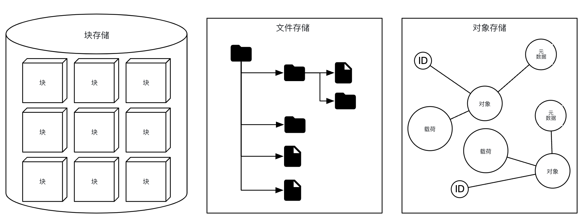
</div>

|                 | 块存储                           | 文件存储                                | 对象存储                       |
|-----------------|----------------------------------|-----------------------------------------|--------------------------------|
| 内容可变        | 是                               | 是                                      | 否（有对象版本控制）           |
| 成本            | 高                               | 中到高                                  | 低                             |
| 性能            | 中到高，非常高                   | 中到高                                  | 低到中                         |
| 一致性          | 强一致性                         | 强一致性                                | 强一致性 [5]                   |
| 数据访问        | SAS/iSCSI/FC                     | 标准文件访问、CIFS/SMB 和 NFS           | RESTful API                    |
| 可扩展性        | 中等可扩展                       | 高可扩展                                | 极大可扩展                     |
| 适合            | 虚拟机（VM）、数据库             | 通用文件系统访问                        | 二进制数据、非结构化数据       |

对象存储相关术语：
- **存储桶（bucket）** - 对象的逻辑容器。名称全局唯一。
- **对象（object）** - 存放在存储桶里的一份数据。包含对象数据和元数据（metadata）。
- **版本控制（versioning）** - 在同一存储桶中保留同一对象多个变体的功能。
- **统一资源标识符（URI）** - 每个资源由 URI 唯一标识。
- **服务等级协议（SLA）** - 服务提供方与客户之间的合约。

Amazon S3 Standard-Infrequent Access 存储类别的 SLA：
- 跨多个可用区（Availability Zone），耐久性 99.999999999%
- 整个可用区被毁时数据仍可恢复
- 设计可用性（availability）为 99.9%

---

## 步骤 1：理解问题并确定设计范围

- 候选人：应该包含哪些功能？
- 面试官：创建存储桶、对象上传/下载、版本控制、列出存储桶中的对象
- 候选人：典型数据大小是多少？
- 面试官：超大对象和小对象都要能高效存储
- 候选人：一年存多少数据？
- 面试官：100 PB
- 候选人：数据耐久性按 6 个 9（99.9999%）、服务可用性按 4 个 9（99.99%）可以吗？
- 面试官：可以，合理

### **非功能需求**

- **100 PB 数据**
- **数据耐久性 6 个 9**
- **服务可用性 4 个 9**
- 存储效率。在保持高可靠性和性能的同时降低存储成本

### **粗略估算**

对象存储的瓶颈多半在磁盘容量或每秒 IO 次数（IOPS）。

假设：
- 小对象（小于 1mb）占 20%，中等对象（1-64mb）占 60%，大对象（大于 64mb）占 20%，
- 一块硬盘（SATA，7200rpm）每秒能做 100-150 次随机寻道（100-150 IOPS）

据此可以估算系统能持久保存的对象总数。
- 为简化计算，各类对象用中位数大小——小 0.5mb、中 32mb、大 200mb。
- 给定 100PB 存储（10^11 MB），按 40% 利用率，大约 6.8 亿个对象
- 若元数据按 1kb 计，则元数据大约需要 0.68tb 空间

---

## 步骤 2：提出高层设计并达成共识

深入设计之前，先看对象存储的几个有趣性质：
- **对象不可变（immutability）** - 对象存储里的对象不可变（其他存储系统不是这样）。可以删或替换，但不能改。
- **键值存储（key-value store）** - 对象 URI 就是键，通过一次 HTTP 调用就能拿到内容
- **一次写入、多次读取** - 访问模式是写一次、读很多次。据 LinkedIn 的研究，95% 的操作是读
- 同时支持小对象和大对象

对象存储的设计哲学和 UNIX 类似——保存文件时，文件名写进叫 inode 的数据结构，文件数据存在磁盘的其他位置。
inode 里有一份文件块指针列表，指向磁盘上的不同位置。

访问文件时，先从 inode 取元数据，再取文件内容。

对象存储类似——元数据存储保存文件信息，内容存在磁盘上：

<div style="margin-left:3rem">
    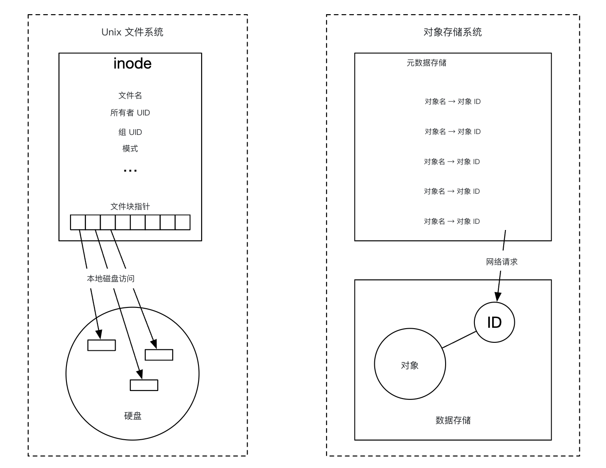
</div>

把元数据和文件内容拆开后，两类存储可以独立扩展：

<div style="margin-left:3rem">
    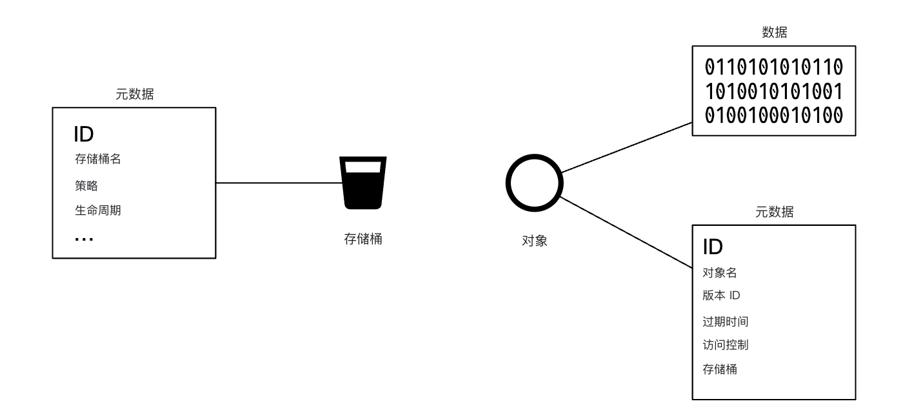
</div>

### **高层设计**

<div style="margin-left:3rem">
    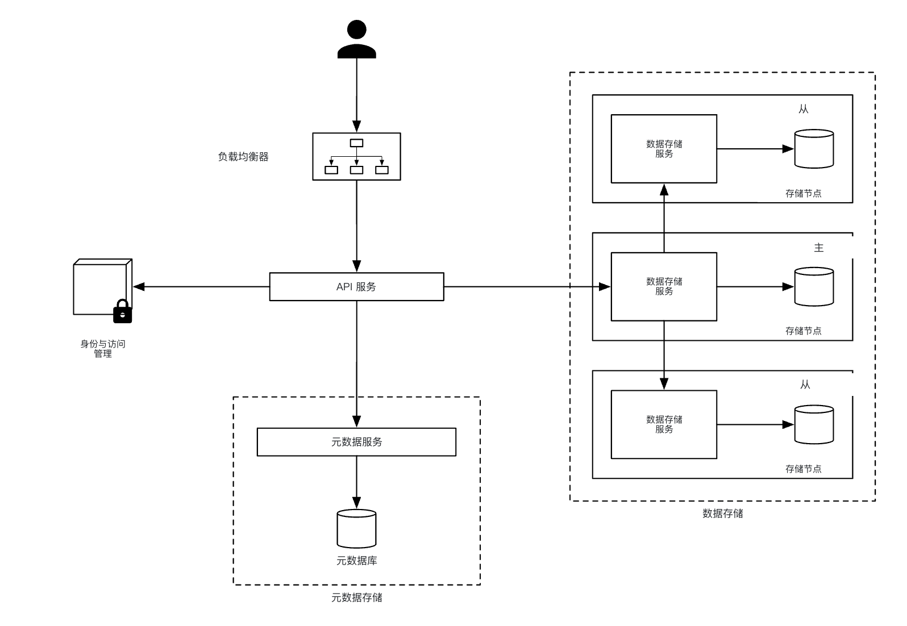
</div>

- **负载均衡器（load balancer）** - 把 API 请求分到服务副本（replica）
- **API 服务** - 无状态（stateless）服务器，编排对元数据存储、对象存储以及 IAM 服务的调用。
- **身份与访问管理（IAM）** - 认证、授权、访问控制的中心。
- **数据存储（data store）** - 存取实际数据。操作基于对象 ID（UUID）。
- **元数据存储（metadata store）** - 存放对象元数据

### **上传对象**

<div style="margin-left:3rem">
    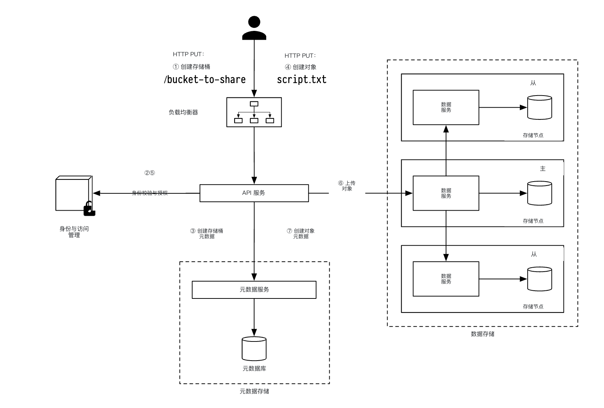
</div>

- 通过 HTTP PUT 请求创建一个名为 "bucket-to-share" 的存储桶
- API 服务调用 IAM，确认用户（user）已授权且有写权限
- API 服务调用元数据存储创建一条存储桶记录。创建成功后返回成功响应。
- 存储桶创建完成后，再发 HTTP PUT，创建名为 "script.txt" 的对象
- API 服务校验用户身份，并确认用户有写权限
- 校验通过后，对象载荷通过 HTTP PUT 发到数据存储。数据存储落盘后返回 UUID。
- API 服务调用元数据存储，用 object_id、bucket_id、bucket_name 等元数据新建一条记录。

对象上传请求示例：

```
PUT /bucket-to-share/script.txt HTTP/1.1
Host: foo.s3example.org
Date: Sun, 12 Sept 2021 17:51:00 GMT
Authorization: authorization string
Content-Type: text/plain
Content-Length: 4567
x-amz-meta-author: Alex

[4567 bytes of object data]
```

### **下载对象**

存储桶没有目录层级，但可以把存储桶名和对象名拼起来，模拟文件夹结构。

获取对象的 GET 请求示例：

```
GET /bucket-to-share/script.txt HTTP/1.1
Host: foo.s3example.org
Date: Sun, 12 Sept 2021 18:30:01 GMT
Authorization: authorization string
```

<div style="margin-left:3rem">
    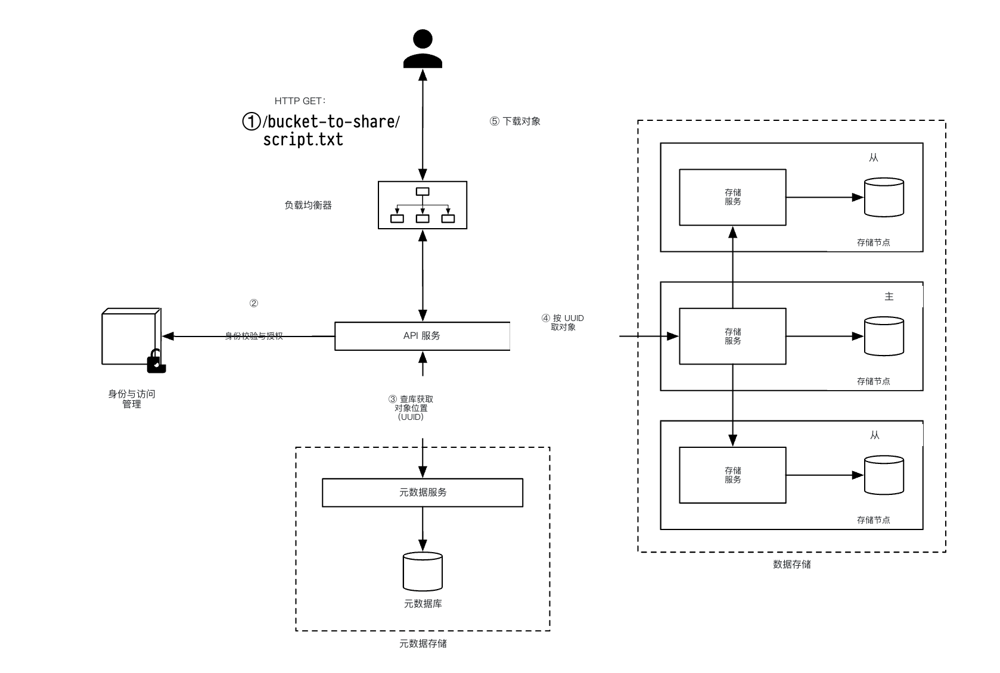
</div>

- 客户端（client）向负载均衡器发 HTTP GET，例如 `GET /bucket-to-share/script.txt`
- API 服务查询 IAM，确认用户有读该存储桶的权限
- 校验通过后，从元数据存储取出对象的 UUID
- 按 UUID 从数据存储取出对象载荷，返回给客户端

---

## 步骤 3：深入设计

### **数据存储**

API 服务与数据存储的交互如下：

<div style="margin-left:3rem">
    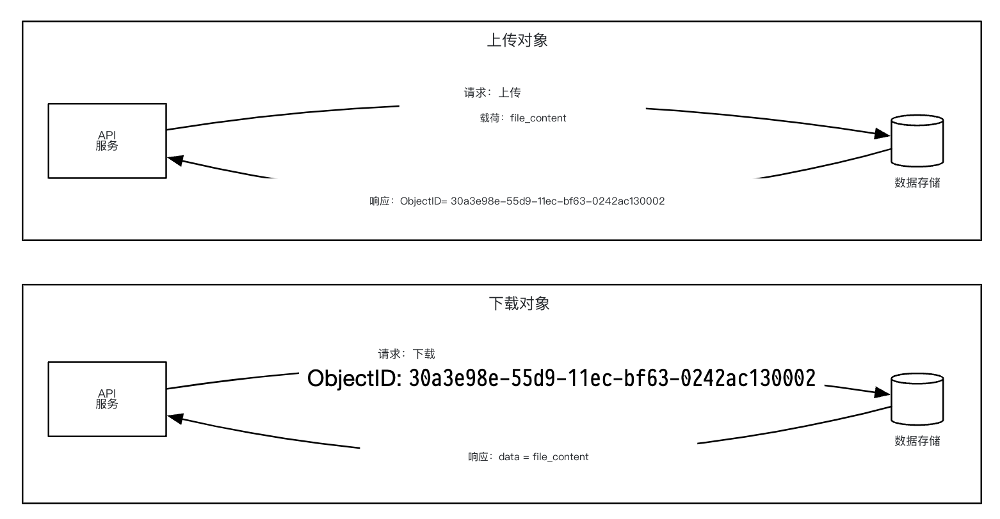
</div>

数据存储的主要组件：

<div style="margin-left:3rem">
    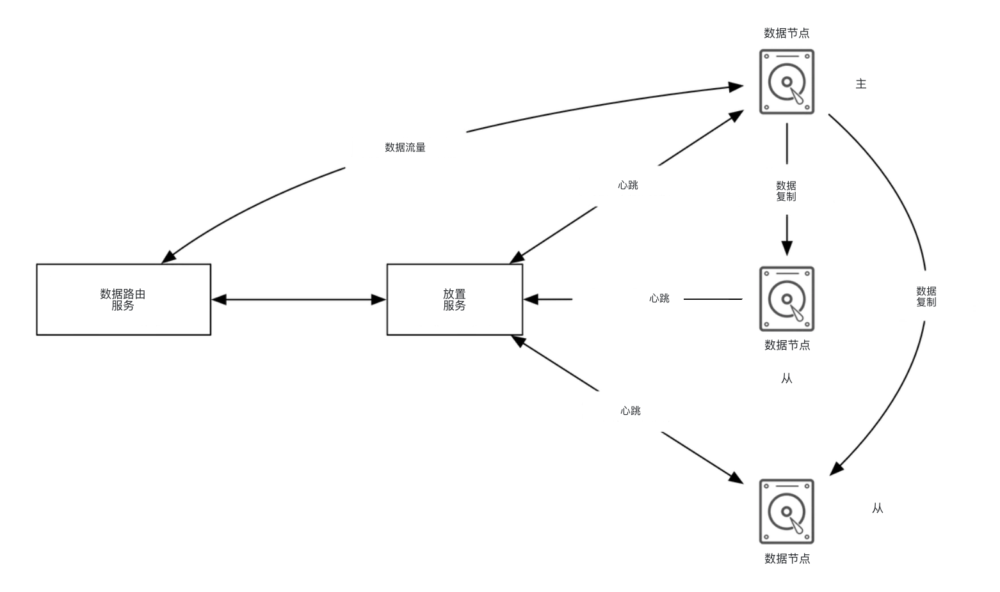
</div>

数据路由服务提供 RESTful 或 gRPC API，用来访问数据节点（data node）集群。
它是无状态服务，加机器就能扩展。

主要职责是：
- 查询放置服务（placement service），选出最合适的数据节点来存数据
- 从数据节点读数据并返回给 API 服务
- 把数据写到数据节点

放置服务决定哪些数据节点应保存某个对象。
它维护一张虚拟集群图，描述集群的物理拓扑。

<div style="margin-left:3rem">
    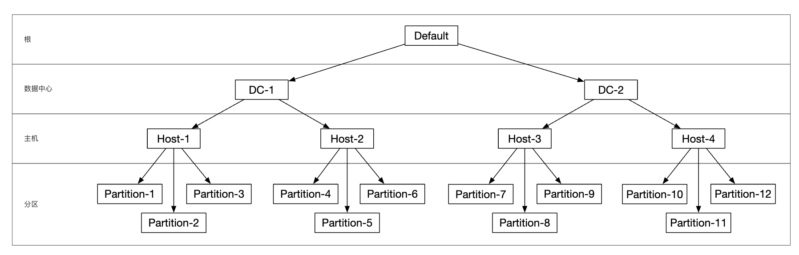
</div>

该服务还会向所有数据节点发心跳（heartbeat），以决定是否把节点从虚拟集群中摘掉。

这是关键服务，建议维持 5 或 7 个副本的集群，用 Paxos 或 Raft 共识算法同步。
例如 7 节点集群可以容忍 3 个节点故障。

数据节点存放实际对象数据。
可靠性和耐久性靠把数据复制到多个数据节点来保证。

每个数据节点上跑一个守护进程，向放置服务发心跳。

心跳里包括：
- 该数据节点管多少块磁盘（HDD 或 SSD）？
- 每块盘上存了多少数据？

#### 数据持久化流程

<div style="margin-left:3rem">
    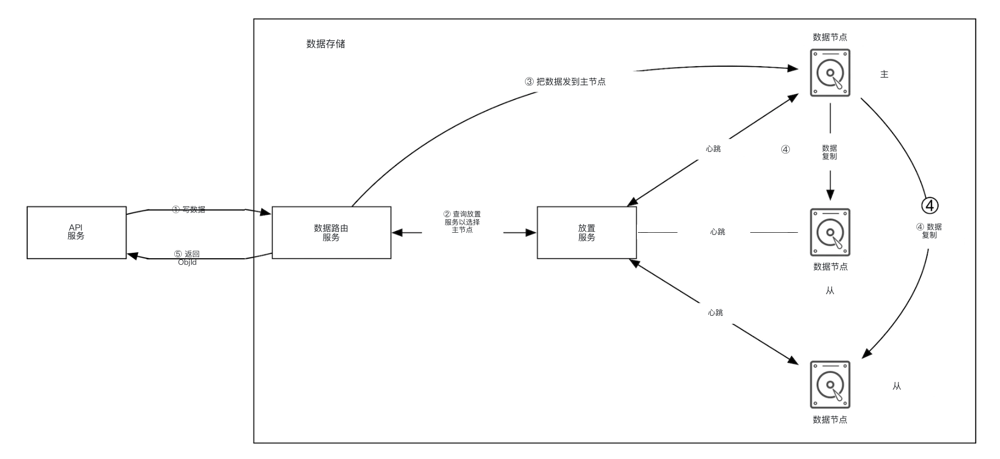
</div>

- API 服务把对象数据转发给数据存储
- 数据路由服务把数据发到主数据节点
- 主数据节点先本地保存，再复制到两个从数据节点。复制成功后才返回响应。
- 对象的 UUID 返回给 API 服务。

注意：
- 给定对象 UUID，复制组由一致性哈希（consistent hashing）确定性选出
- 第 4 步里，主数据节点先完成复制再返回响应。这是用更高延迟换强一致性（strong consistency）。

<div style="margin-left:3rem">
    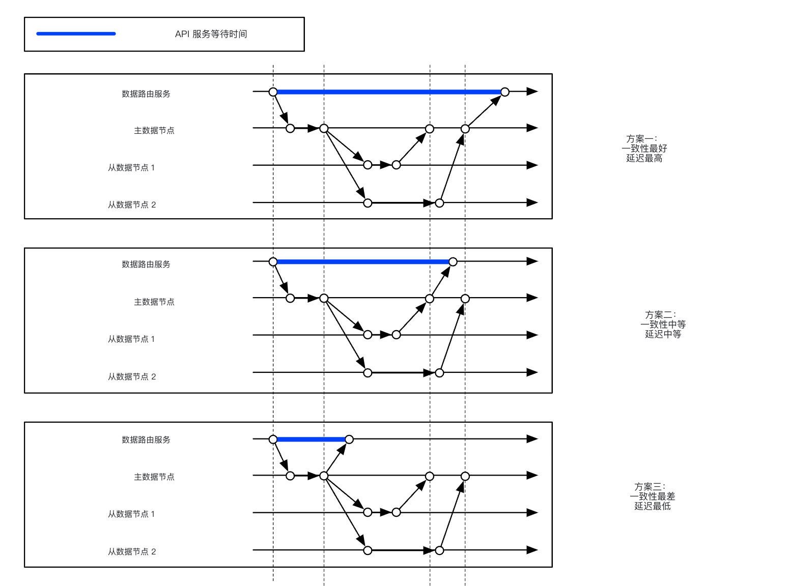
</div>

#### 数据如何组织

管理数据的一种简单做法是每个对象单独一个文件。

能用，但文件系统里小文件一多就不快：
- HDD 上的数据块会被浪费，因为每个文件都占用整块。典型块大小是 4kb。
- 文件多意味着 inode 多。操作系统不太能扛太多 inode，而且 inode 数量有上限。

可以把很多小文件通过 WAL（write-ahead log）合并成更大的文件来解决。文件写满（通常几 GB）后再开新文件：

<div style="margin-left:3rem">
    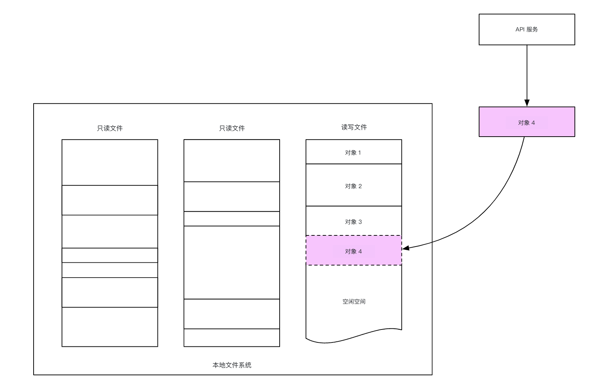
</div>

这种做法的缺点是对文件的写访问必须串行。多个核访问同一文件时要互相等待。
解决办法是把文件绑到特定核上，避免锁竞争。

#### 对象查找

要在同一文件里存多个对象，数据节点需要一张表，告诉它：
- `object_id`
- 对象所在的 `filename`
- 对象起始的 `file_offset`
- `object_size`

这张表可以放在像 RocksDB 这样的基于文件的数据库里，也可以放在传统关系数据库里。
访问模式是低写高读，关系数据库更合适。

怎么部署？
可以把数据库单独做成集群，给所有数据节点访问。

缺点：
- 集群要猛扩才能扛住全部请求
- 数据节点和数据库集群之间多一跳网络延迟

另一种做法是利用数据节点只关心自己相关的数据这一点，
把关系数据库直接部署在数据节点内部。

SQLite 是不错的选择，它是轻量的基于文件的关系数据库。

#### 更新后的数据持久化流程

<div style="margin-left:3rem">
    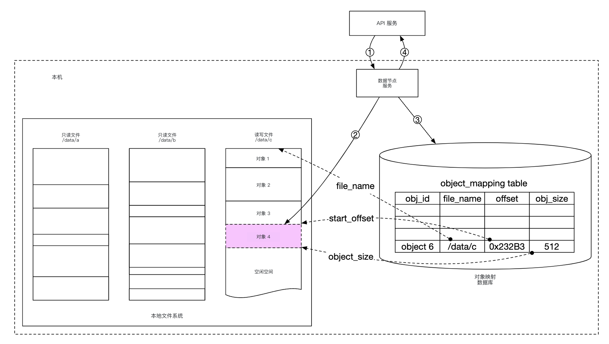
</div>

- API 服务发请求保存新对象
- 数据节点服务把新对象追加到名为 "/data/c" 的文件末尾
- 在对象映射表里插入一条新记录

#### 耐久性

数据耐久性是本设计的重要需求。要做到 6 个 9 的耐久性，每种故障都要认真过一遍。

首先要解决硬件故障。可以把数据节点做复制，降低故障概率。
除此之外，还应跨故障域（failure domain）复制（跨机架、跨数据中心、独立网络等）。
一次严重事故可能让同一故障域内多台硬件同时坏掉：

<div style="margin-left:3rem">
    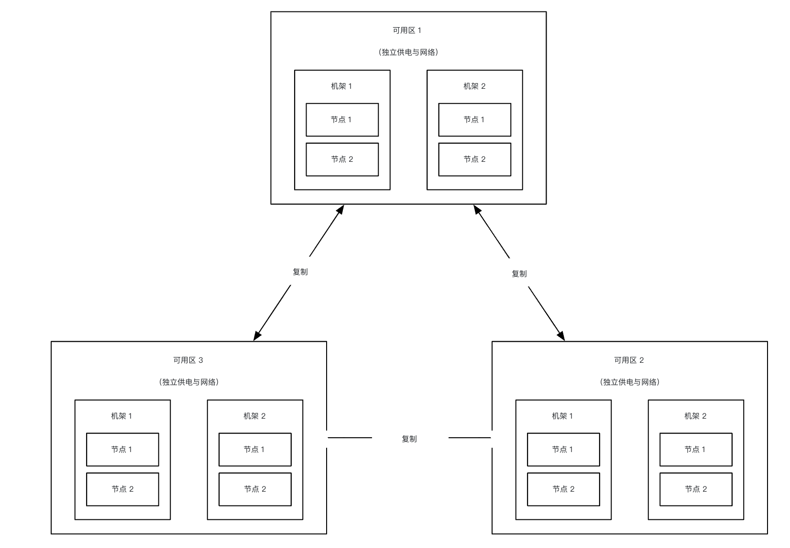
</div>

假设典型 HDD 年故障率是 0.81%，做三副本就能达到 6 个 9 的耐久性。

这样复制数据节点能得到想要的耐久性，但也可以用纠删码（erasure coding）来降低存储成本。

纠删码使用校验位（parity bits），故障时可以重建丢失的位：

<div style="margin-left:3rem">
    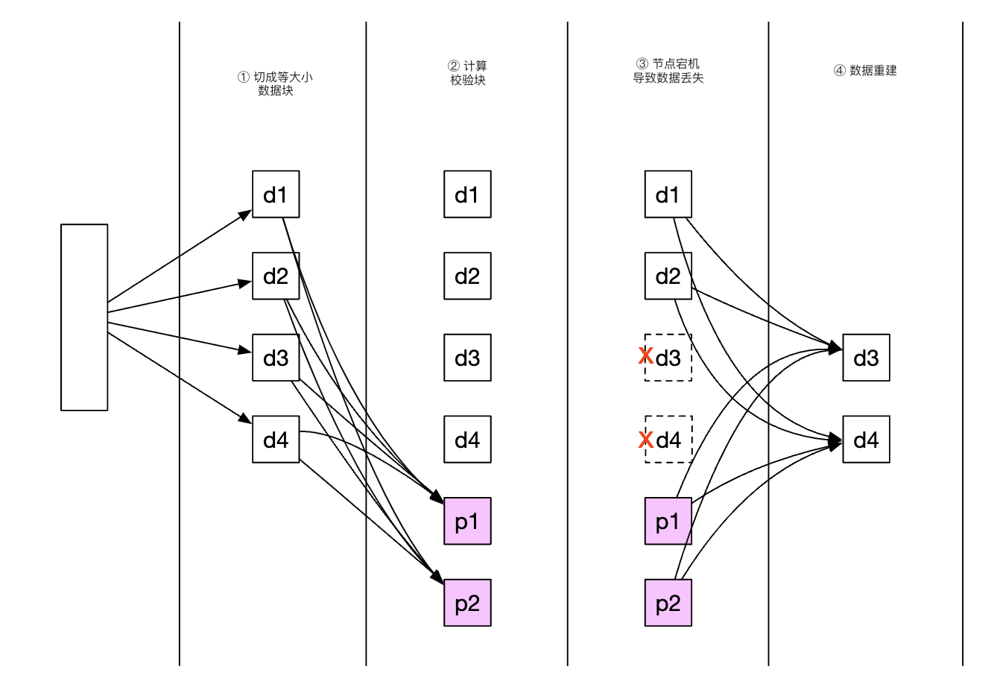
</div>

把这些位想象成数据节点。其中两个挂了，可以用剩下四个恢复。

纠删码方案有多种。这里可以用 8+4 纠删码，并拆到不同故障域以尽量提高可靠性：

<div style="margin-left:3rem">
    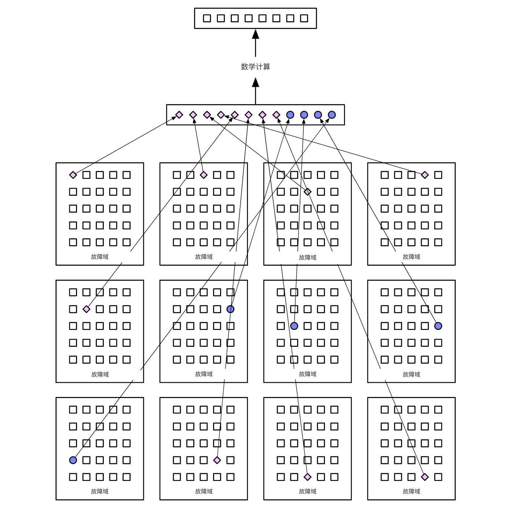
</div>

纠删码能显著降低存储成本（改进 50%），代价是访问变慢，因为数据路由服务要从多个位置收集数据：

<div style="margin-left:3rem">
    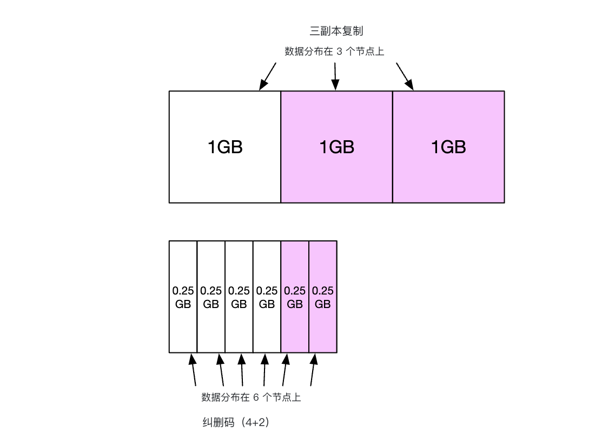
</div>

其他注意点：
- 复制的存储开销是 200%（三副本时），纠删码是 50%
- 纠删码[能做到 11 个 9 的耐久性](https://github.com/Backblaze/erasure-coding-durability)，复制是 6 个 9
- 纠删码计算和存储校验需要更多算力

总之，复制更适合对延迟敏感的应用，纠删码更吸引人的是存储成本效率和耐久性。
纠删码实现起来也难得多。

#### 正确性校验

磁盘整盘坏了，故障很容易发现。磁盘部分内存损坏时就不那么直观。

可以用校验和（checksum）来检测——文件内容的哈希，用来验证完整性。

这里会给每个文件和每个对象都存校验和：

<div style="margin-left:3rem">
    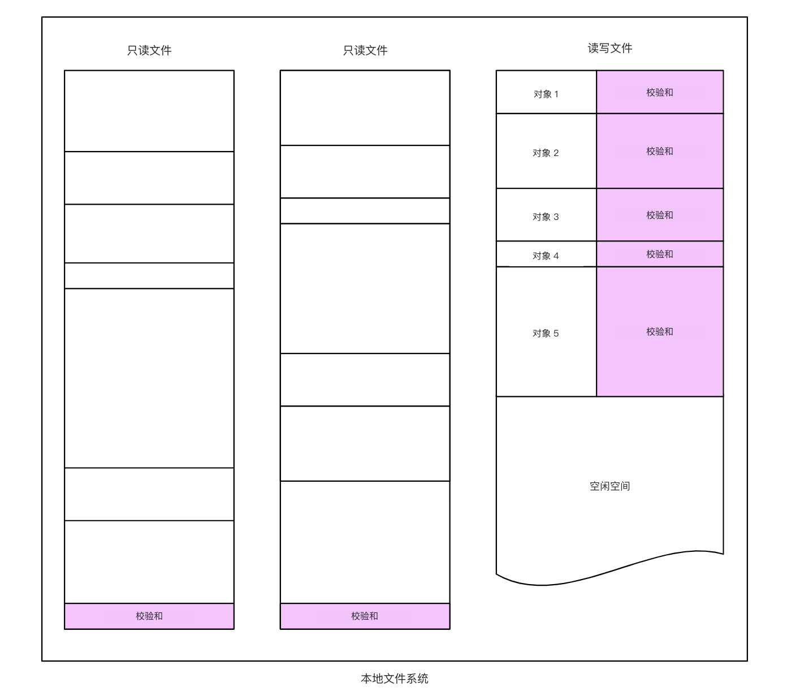
</div>

若用纠删码（8+4），需要分别取回 8 块数据，并校验每一块的校验和。

### **元数据模型**

表结构：

<div style="margin-left:3rem">
    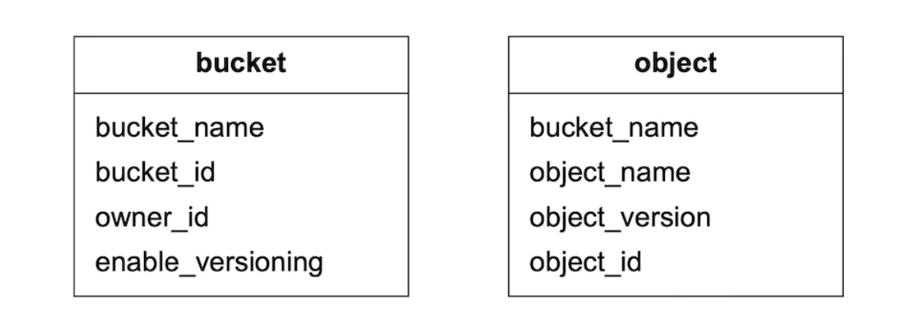
</div>

需要支持的查询：
- 按名称查找对象 ID
- 按名称插入/删除对象
- 列出存储桶中共享同一前缀的对象

用户能创建的存储桶数量通常有上限，因此 buckets 表很小，单台数据库服务器就能放下。
但仍需要为读吞吐扩展这台服务器。

object 表多半塞不进单台数据库服务器。因此可以通过分片（sharding）扩展：
- 按 bucket_id 分片会有热点（hotspot）问题，因为一个存储桶可以有数十亿对象
- 按 object_id 分片负载更均匀，但查询会变慢
- 我们选择按 `hash(bucket_name, object_name)` 分片，因为大多数查询基于对象名/存储桶名。

即便用这种分片方案，列出存储桶中的对象仍然会慢。

### **列出存储桶中的对象**

在单库里，按前缀（看起来像目录）列对象是这样：

```
SELECT * FROM object WHERE bucket_id = "123" AND object_name LIKE `abc/%`
```

数据库分片之后这就很难做。一种办法是在每个分片上跑查询，再在内存里聚合结果。
但分页会很难，因为不同分片的结果数量不同，每个分片都要单独维护 limit/offset。

可以利用对象存储通常不为列对象做优化这一点，牺牲列对象的性能。
也可以再建一张反规范化（denormalization）的列对象表，按存储桶 ID 分片。
这样列查询会足够快，因为它落在单个数据库实例上。

### **对象版本控制**

版本控制靠再加一列 `object_version`，类型是 TIMEUUID，这样可以按它排序。

每个新版本都会产生新的 `object_id`：

<div style="margin-left:3rem">
    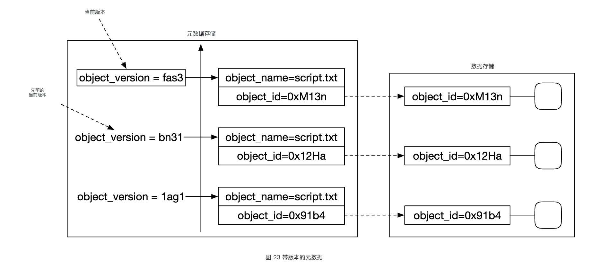
</div>

删除对象会创建一个新版本，用特殊的 `object_id` 表示对象已删除。查询它会返回 404：

<div style="margin-left:3rem">
    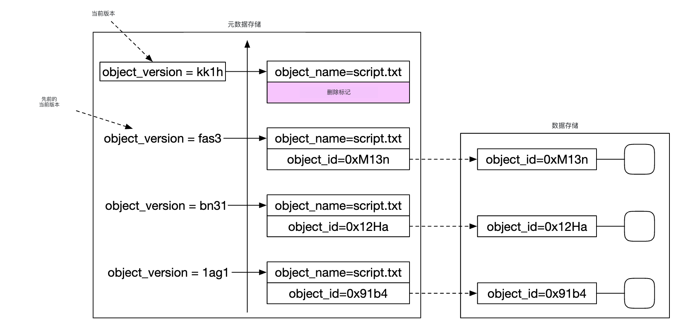
</div>

### **优化大文件上传**

大文件上传可以用分段上传（multipart upload）优化——把大文件切成若干块，各自独立上传：

<div style="margin-left:3rem">
    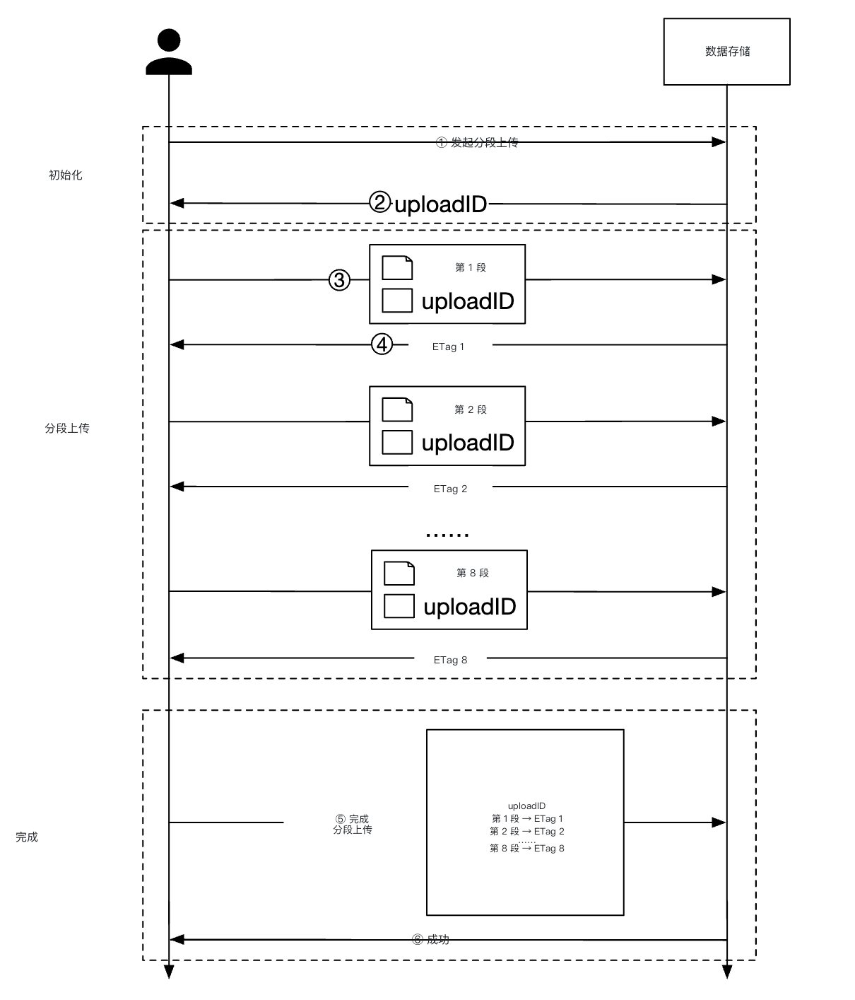
</div>

- 客户端调用服务发起分段上传
- 数据存储返回一个 upload ID，唯一标识这次上传
- 客户端把大文件切成若干块，用这个 upload id 各自独立上传
- 一块上传完成后，数据存储返回 etag，即 md5 校验和，标识该上传块
- 所有分段上传完后，客户端发完成分段上传请求，带上 upload_id、分段号和全部 etag
- 数据存储把各分段重组成对象。这个过程可能要几分钟。完成后向客户端返回成功响应。

此时不再有用的旧分段可以删掉。可以引入垃圾回收器来处理。

### **垃圾回收**

垃圾回收（garbage collection）是回收不再使用的存储空间。数据变成垃圾的几种方式：
- **惰性对象删除** - 对象只被标成已删，实际并未删掉
- **孤儿数据** - 例如上传中途失败，旧分段需要删除
- **损坏数据** - 校验和验证失败的数据

垃圾回收器还负责回收副本上不再使用的空间。
用复制时，数据和副本都要删。用纠删码（8+4）时，12 个节点都要删。

为了方便删除，我们用压缩（compaction）：
- 垃圾回收器把未删除的对象从 "data/b" 拷到 "data/d"
- 拷完后用数据库事务更新 `object_mapping` 表
- 为避免产生太多小文件，只对增长超过某阈值的文件做压缩

<div style="margin-left:3rem">
    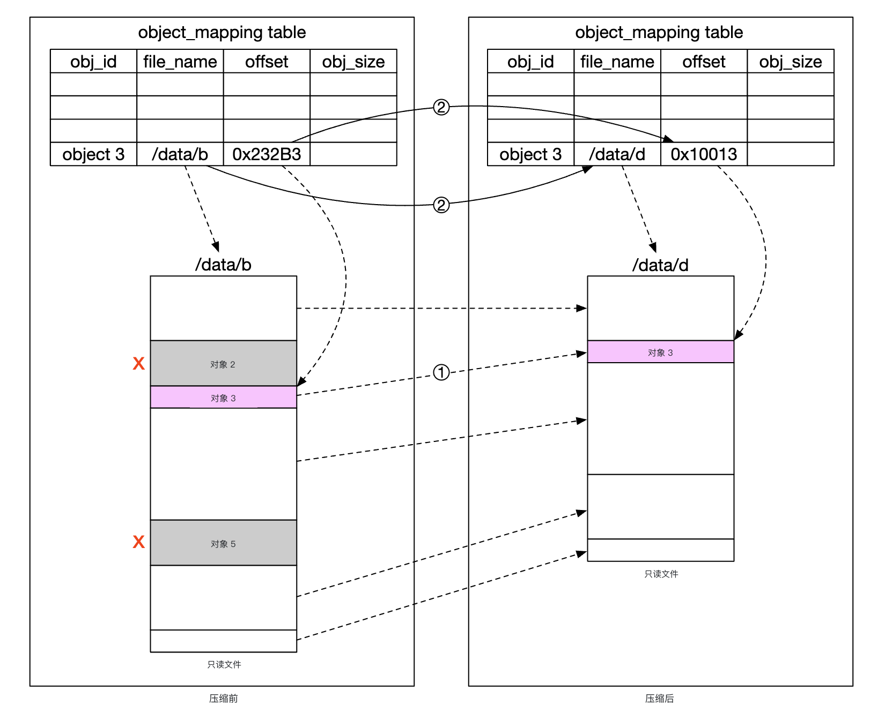
</div>

---

## 步骤 4：收尾

本章覆盖了：
- 设计类 S3 对象存储
- 比较对象存储、块存储和文件存储的差异
- 存储桶中对象的上传、下载、列出、版本控制
- 深入设计——数据存储和元数据存储、复制和纠删码、分段上传、分片
