# 第 25 章：设计实时游戏排行榜

## 简介

我们要为一个在线手游设计**排行榜（leaderboard）**：

<div style="margin-left:3rem">
    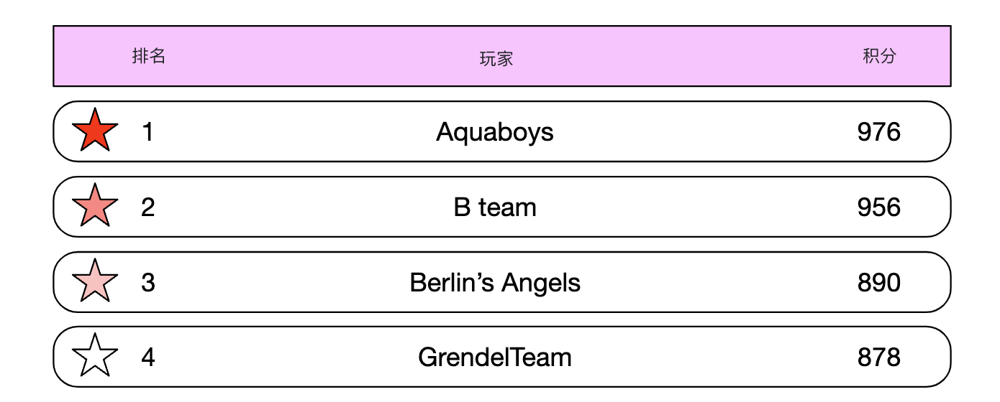
</div>

---

## 步骤 1：理解问题并确定设计范围

- 候选人：排行榜的分数怎么算？
- 面试官：用户每赢一场就得一分。
- 候选人：所有玩家都会进排行榜吗？
- 面试官：会
- 候选人：排行榜有没有时间分段？
- 面试官：每个月开一场新锦标赛，同时开一份新排行榜。
- 候选人：可以假设我们只关心前 10 名吗？
- 面试官：我们要展示前 10 名，以及某个用户的名次。如果还有时间，可以讨论展示该用户上下附近的玩家。
- 候选人：一场锦标赛有多少用户？
- 面试官：500 万 DAU、2500 万 MAU
- 候选人：一场锦标赛平均打多少场比赛？
- 面试官：每个玩家平均每天打 10 场
- 候选人：两个玩家分数相同时怎么排？
- 面试官：这种情况下名次相同。如果还有时间，可以讨论如何打破平局。
- 候选人：排行榜需要实时吗？
- 面试官：需要，我们要展示实时结果，或尽可能接近实时。用批处理的历史结果不行。

### **功能需求**

- 展示排行榜前 10 名玩家
- 展示某个用户的具体名次
- 展示给定用户上下各四名的玩家（加分项）

### **非功能需求**

- 分数实时更新
- 分数更新要实时反映到排行榜上
- 一般的可扩展性、可用性、可靠性

### **粗略估算**

按 500 万 DAU，若 24 小时内玩家分布均匀，平均每秒约 50 个用户。
不过分布通常不均匀，可以估计峰值在线用户约为每秒 250 人。

用户得分的 QPS：平均每天 10 场，50 用户/秒 * 10 = 500 QPS。峰值 QPS = 2500。

拉取前 10 名排行榜的 QPS：假设用户平均每天打开一次，QPS 是 50。

---

## 步骤 2：提出高层设计并达成共识

### **API 设计**

第一个 API 用来更新用户分数：

```
POST /v1/scores
```

这个 API 接收两个参数：`user_id`，以及赢一场得到的 `points`。

这个 API 只应给游戏服务器用，不能给终端客户端（client）。

下一个是获取排行榜前 10 名：

```
GET /v1/scores
```

响应示例：

```
{
  "data": [
    {
      "user_id": "user_id1",
      "user_name": "alice",
      "rank": 1,
      "score": 12543
    },
    {
      "user_id": "user_id2",
      "user_name": "bob",
      "rank": 2,
      "score": 11500
    }
  ],
  ...
  "total": 10
}
```

也可以查某个用户的分数：

```
GET /v1/scores/{:user_id}
```

响应示例：

```
{
    "user_info": {
        "user_id": "user5",
        "score": 1000,
        "rank": 6,
    }
}
```

### **高层架构**

<div style="margin-left:3rem">
    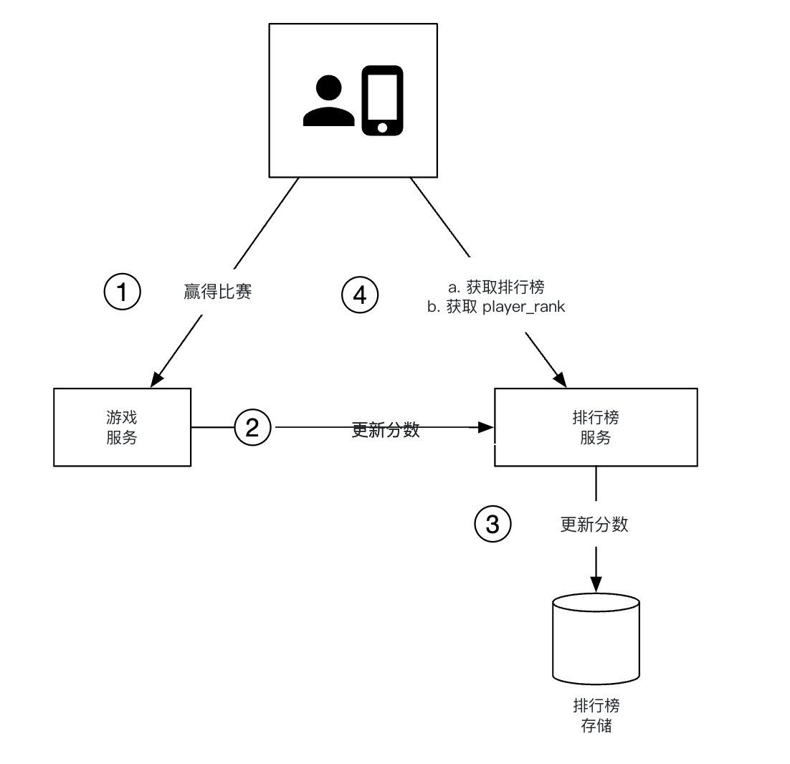
</div>

- 玩家赢了一场后，客户端向游戏服务（game service）发请求
- 游戏服务校验这场胜利是否有效，再调用排行榜服务（leaderboard service）更新玩家分数
- 排行榜服务在排行榜存储里更新该用户的分数
- 玩家调用排行榜服务拉取排行榜数据，例如前 10 名以及该玩家的名次

也曾考虑另一种设计：客户端直接在排行榜服务里更新自己的分数：

<div style="margin-left:3rem">
    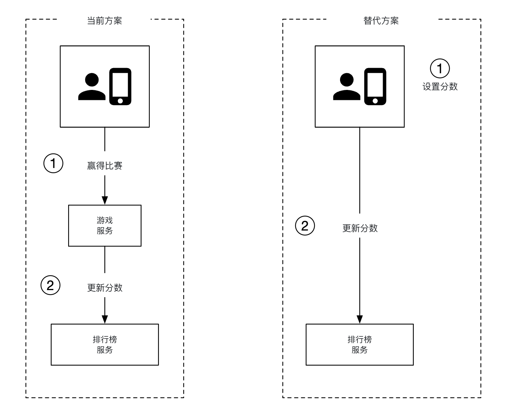
</div>

这个选项不安全，容易遭受中间人（man-in-the-middle）攻击。玩家可以挂代理，随意改自己的分数。

还有一点：游戏逻辑由服务器掌管时，客户端不必显式调服务器来记录胜利。
服务器会按游戏逻辑自动完成。

另外要考虑要不要在游戏服务器和排行榜服务之间加消息队列（message queue）。如果其他服务也关心比赛结果，这会有用，但目前面试没有明确要求，所以设计里没放：

<div style="margin-left:3rem">
    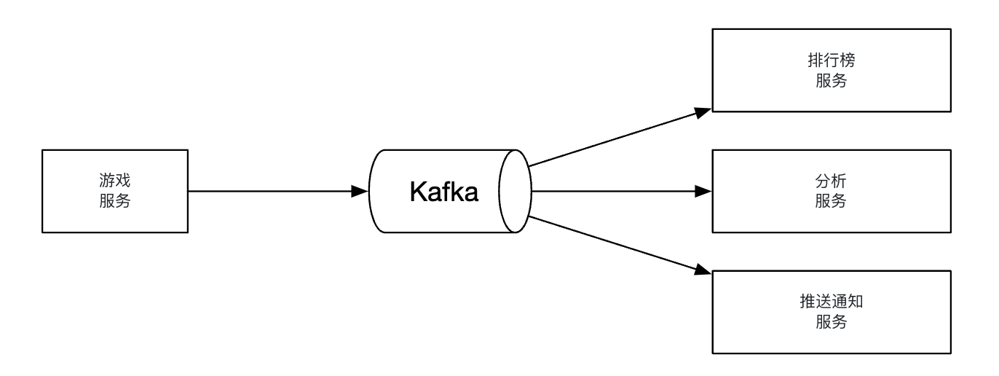
</div>

### **数据模型**

讨论一下存排行榜数据的选项：关系型数据库、Redis、NoSQL。

NoSQL 方案在深入设计一节讨论。

#### 关系型数据库方案

如果规模不大、用户也不多，关系型数据库就够用。

可以从一张简单的排行榜表开始，每个月一张（个人备注：这没必要。加一列 `month` 就行，不必每月维护新表）：

<div style="margin-left:3rem">
    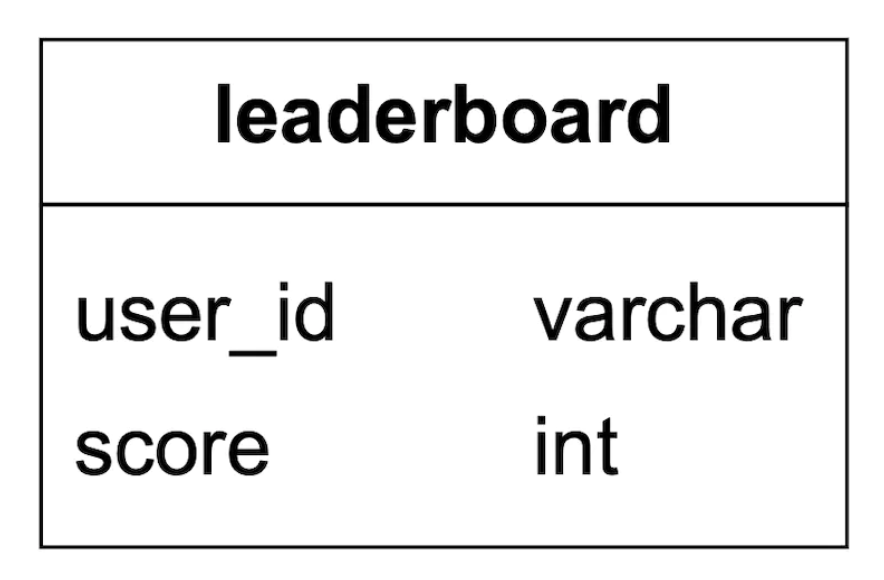
</div>

表里还可以加别的数据，但跟我们要跑的查询无关，所以略去。

用户赢一分时会发生什么？

<div style="margin-left:3rem">
    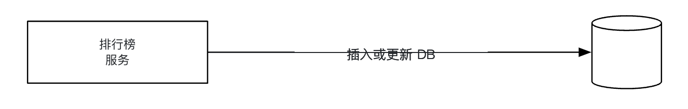
</div>

如果用户还不在表里，要先插入：

```
INSERT INTO leaderboard (user_id, score) VALUES ('mary1934', 1);
```

后续调用只需更新分数：

```
UPDATE leaderboard set score=score + 1 where user_id='mary1934';
```

怎么找排行榜上的顶尖玩家？

<div style="margin-left:3rem">
    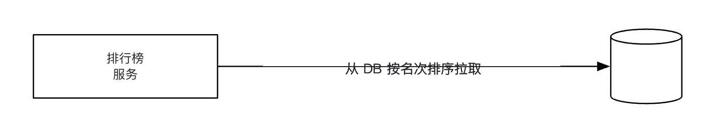
</div>

可以跑下面这条查询：

```
SELECT (@rownum := @rownum + 1) AS rank, user_id, score
FROM leaderboard
ORDER BY score DESC;
```

但这不高效，因为它会全表扫描来给所有记录排序。

可以给 `score` 加索引，再用 `LIMIT` 避免扫全表：

```
SELECT (@rownum := @rownum + 1) AS rank, user_id, score
FROM leaderboard
ORDER BY score DESC
LIMIT 10;
```

不过，如果用户不在排行榜顶部、还要定位其名次，这个做法扩展性不好。

#### Redis 方案

我们想找一个即使有数百万玩家也不必退回复杂数据库查询的方案。

Redis 是内存数据存储，因为在内存中工作所以很快，并且有适合我们需求的数据结构——有序集合（sorted set）。

有序集合类似编程语言里的集合，可以按给定规则保持有序。
内部用哈希表维护键（user_id）到值（score）的映射，再用跳表（skip list）按分数把用户排好序：

<div style="margin-left:3rem">
    
</div>

跳表怎么工作？
- 它是一种能快速搜索的链表
- 由一条有序链表和多层索引组成

<div style="margin-left:3rem">
    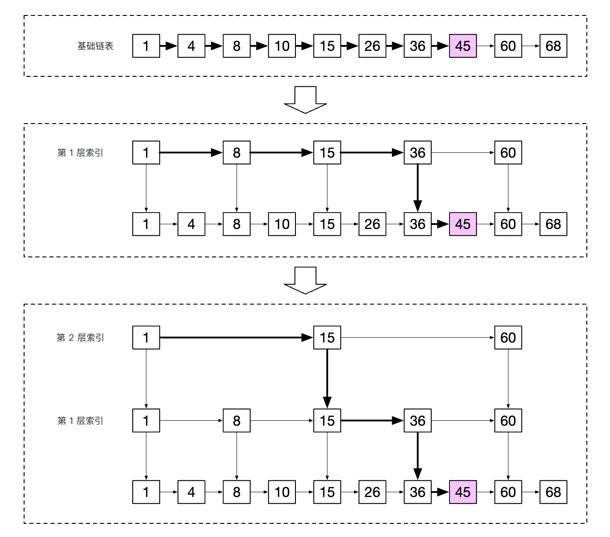
</div>

数据量足够大时，这种结构能快速查找特定值。
下面的例子（64 个节点）中，基础链表要遍历 62 个节点才能找到目标值，跳表只需 11 个：

<div style="margin-left:3rem">
    
</div>

有序集合比关系型数据库更高效，因为数据始终保持有序，代价是添加和查找都是 O(logN)。

相比之下，在关系型数据库里查某个用户的名次，需要跑这样的嵌套查询：

```
SELECT *,(SELECT COUNT(*) FROM leaderboard lb2
WHERE lb2.score >= lb1.score) RANK
FROM leaderboard lb1
WHERE lb1.user_id = {:user_id};
```

用 Redis 运营排行榜需要哪些操作？
- **ZADD** - 用户不存在则插入，否则更新分数。时间复杂度 O(logN)。
- **ZINCRBY** - 把用户分数增加给定值。用户不存在则从零开始。时间复杂度 O(logN)。
- **ZRANGE/ZREVRANGE** - 按分数取一段用户。可以指定顺序（ASC/DESC）、偏移和结果数量。时间复杂度 O(logN+M)，M 是结果大小。
- **ZRANK/ZREVRANK** - 按升序/降序取给定用户的名次。时间复杂度 O(logN)。

用户得一分时会发生什么？

```
ZINCRBY leaderboard_feb_2021 1 'mary1934'
```

每个月新建一份排行榜，旧的挪到历史存储。

用户拉取前 10 名时会发生什么？

```
ZREVRANGE leaderboard_feb_2021 0 9 WITHSCORES
```

结果示例：

```
[(user2,score2),(user1,score1),(user5,score5)...]
```

用户查自己的排行榜位置呢？

<div style="margin-left:3rem">
    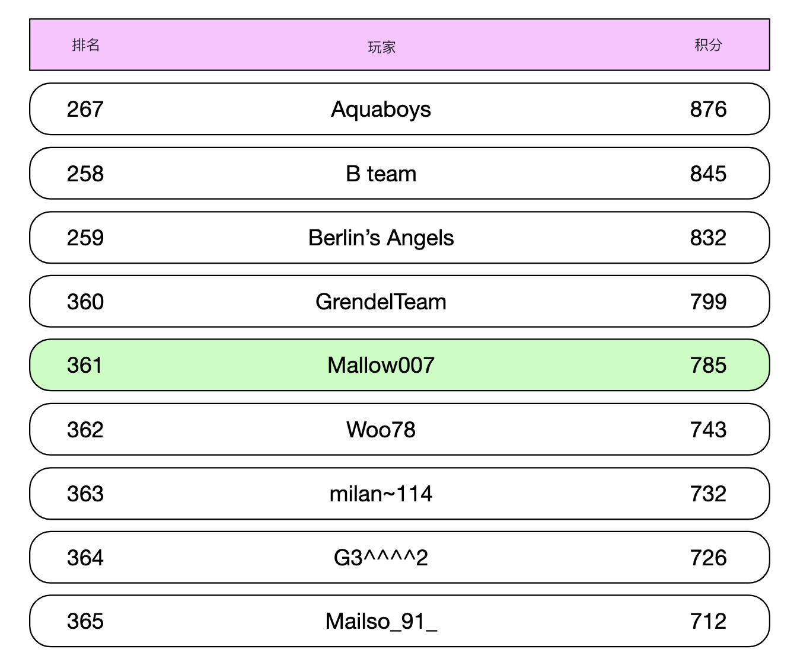
</div>

已知用户的排行榜位置后，下面这条查询很容易做到：

```
ZREVRANGE leaderboard_feb_2021 357 365
```

用户位置可以用 `ZREVRANK <user-id>` 取。

存储需求：
- 最坏情况：某月全部 2500 万 MAU 都参赛
- ID 是 24 字符字符串，分数是 16 位整数，需要 26 字节 * 2500 万 = 约 650MB
- 即便因跳表开销把存储成本翻倍，现代 Redis 集群也轻松装得下

另一个非功能需求是支持每秒 2500 次更新。单台 Redis 服务器完全能扛。

额外注意：
- 可以拉起 Redis 副本（replica），避免 Redis 服务器崩溃时丢数据
- 还可以用 Redis 持久化，崩溃时不丢数据
- 需要两张 MySQL 辅助表：一张取用户名、显示名等详情，一张存例如用户赢了一场的记录
- 第二张 MySQL 表可以在基础设施故障时重建排行榜
- 一个小的性能优化：可以把前 10 名的用户详情缓存（cache）起来，因为访问很频繁

---

## 步骤 3：深入设计

### **是否使用云厂商**

可以选择自己部署并管理服务，也可以用云厂商帮我们管。

如果自己管，排行榜数据用 Redis，用户资料用 MySQL，若要扩展数据库还可以再加一层用户资料缓存：

<div style="margin-left:3rem">
    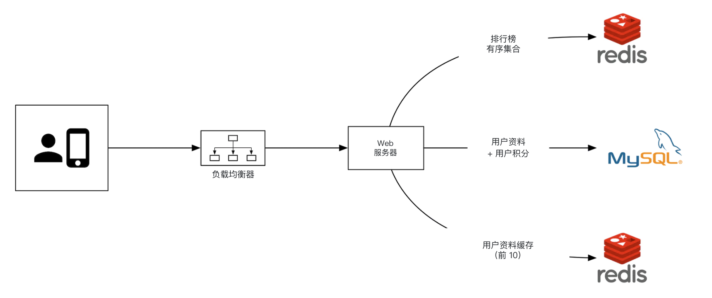
</div>

也可以用云产品帮我们管大量服务。例如用 AWS API 网关（API Gateway）把 API 调用路由到 AWS Lambda 函数：

<div style="margin-left:3rem">
    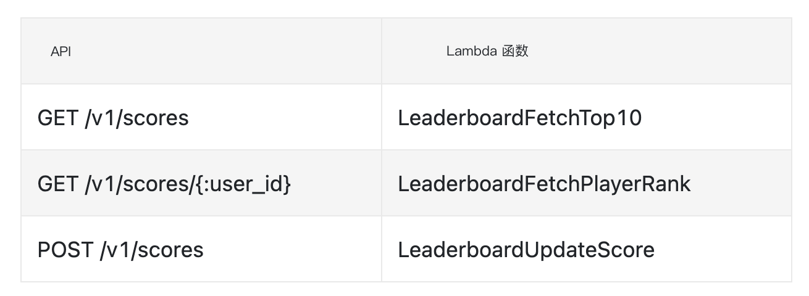
</div>

AWS Lambda 让我们无需自己管理或申请服务器就能跑代码。它按需运行，并自动扩展。

用户得一分的示例：

<div style="margin-left:3rem">
    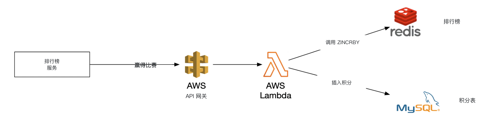
</div>

用户拉取排行榜的示例：

<div style="margin-left:3rem">
    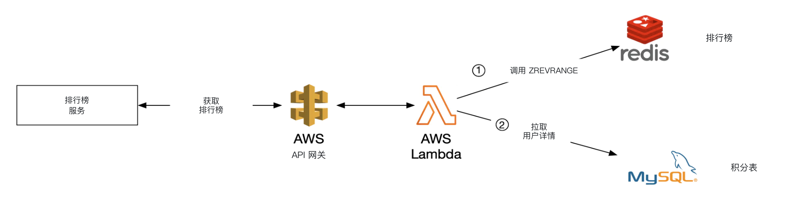
</div>

Lambda 是无服务器（serverless）架构的一种实现。我们不必自己管扩展和环境搭建。

作者建议如果从零做这款游戏，就走这条路。

### **扩展 Redis**

按 500 万 DAU，从存储和 QPS 看，单实例 Redis 就够。

但如果想象用户量增长 100 倍到 5 亿 DAU，存储需要 65GB，QPS 到 25 万。

这种规模就得分片（sharding）。

一种做法是按范围分区（range-partitioning）数据：

<div style="margin-left:3rem">
    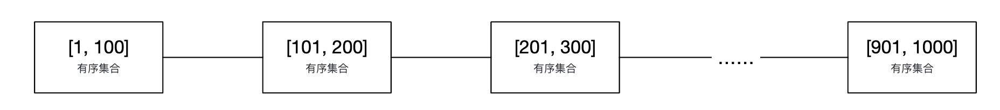
</div>

这个例子按用户分数分片。user_id 到分片的映射维护在应用代码里。
可以用 MySQL，也可以另用一层缓存来存这份映射。

拉前 10 名时，查分数最高的那个分片（`[900-1000]`）。

拉某个用户的名次时，先算该用户在自己分片内的名次，再加上其他分片里分数更高的用户数。
后者是 O(1)，因为每个分片的总记录数可以通过 info keyspace 命令很快拿到。

另一种做法是用 Redis Cluster 做哈希分区（hash partitioning）。它是一个代理，按类似一致性哈希（consistent hashing）但并不完全相同的分区方式，把数据打到各 Redis 节点：

<div style="margin-left:3rem">
    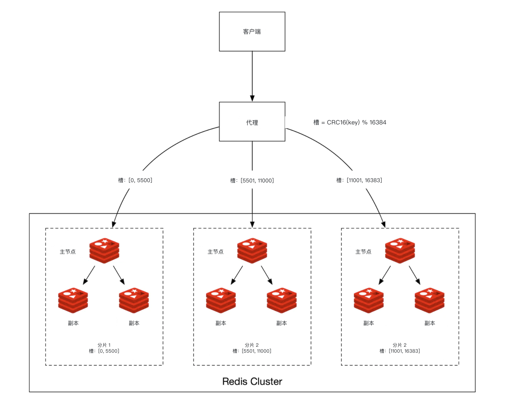
</div>

这种布局下算前 10 名比较麻烦。需要取每个分片的前 10 名，再在应用里合并：

<div style="margin-left:3rem">
    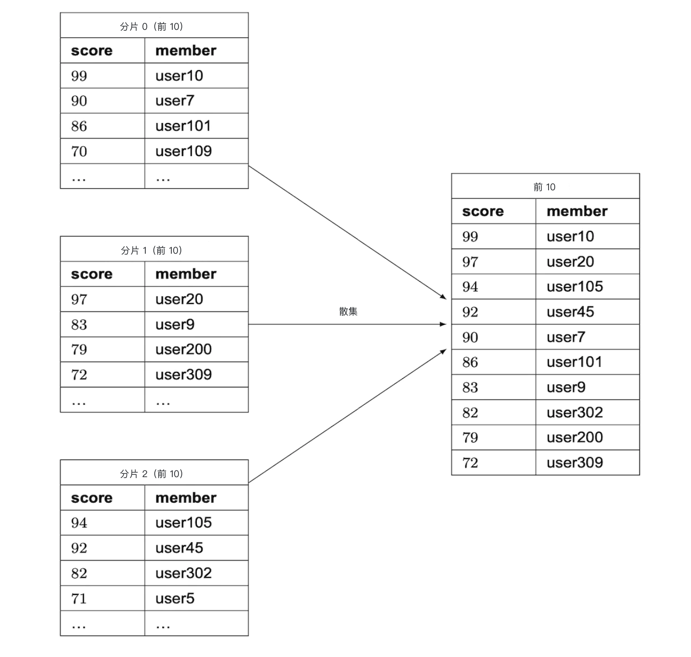
</div>

哈希分区有一些限制：
- 如果要取前 K 名且 K 很大，延迟会升高，因为要从所有分片拉很多数据
- 分区数增加时延迟也会升高
- 没有直接办法确定某个用户的名次

因此作者更倾向这个问题用固定分区。

其他注意：
- 最佳实践是给写密集的 Redis 节点分配所需内存的两倍，以便必要时做快照
- 可以用 Redis-benchmark 跟踪一套 Redis 部署的性能，再据此做决策

### **替代方案：NoSQL**

另一个方案是选合适的 NoSQL 数据库，针对：
- 写很重
- 能在同一分区内按分数高效排序

DynamoDB、Cassandra 或 MongoDB 都合适。

本章作者决定用 DynamoDB。它是全托管的 NoSQL 数据库，性能可靠、扩展性很好。
需要查询主键以外的字段时，还可以用全局二级索引（global secondary index）。

<div style="margin-left:3rem">
    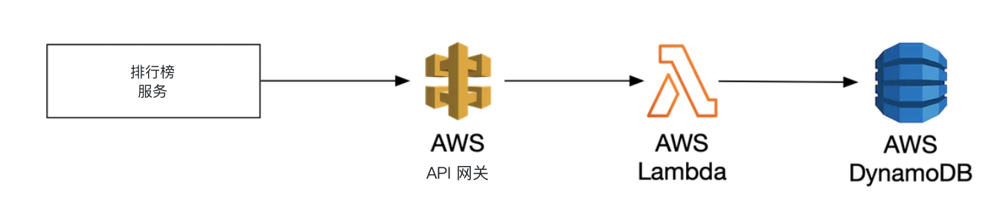
</div>

先从一张存国际象棋游戏排行榜的表开始：

<div style="margin-left:3rem">
    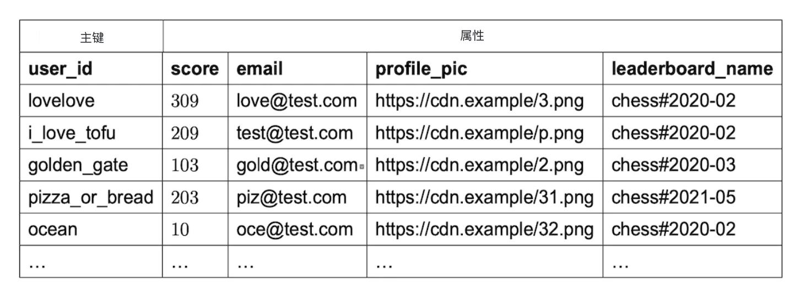
</div>

这样能工作，但按分数查询时扩展性不好。因此可以把分数做成排序键（sort key）：

<div style="margin-left:3rem">
    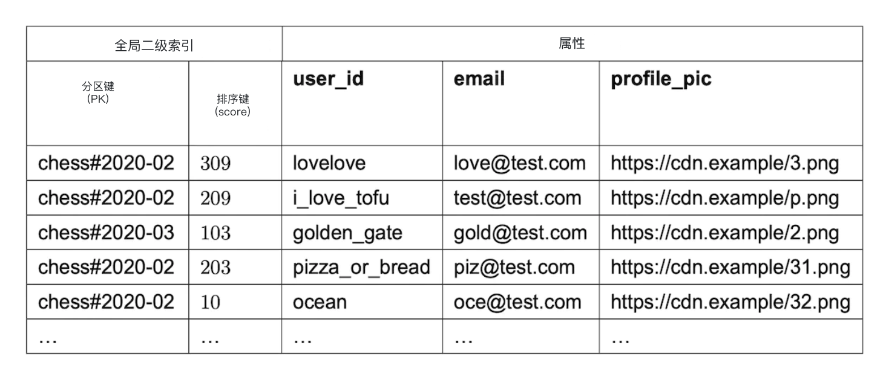
</div>

这个设计还有一个问题：按月分区。最新月份会被不均匀地访问，形成热点（hotspot）分区。

可以用写分片（write sharding）：给每个键追加一个分区号，用 `user_id % num_partitions` 计算：

<div style="margin-left:3rem">
    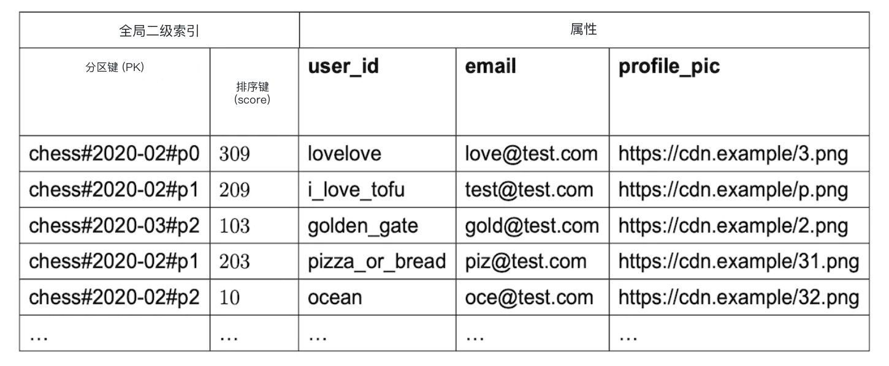
</div>

要权衡该用多少个分区：
- 分区越多，写扩展性越好
- 但读扩展性变差，因为要查更多分区才能汇总结果

这种做法需要用到前面见过的「散集（scatter-gather）」技术，时间复杂度会随分区数增加：

<div style="margin-left:3rem">
    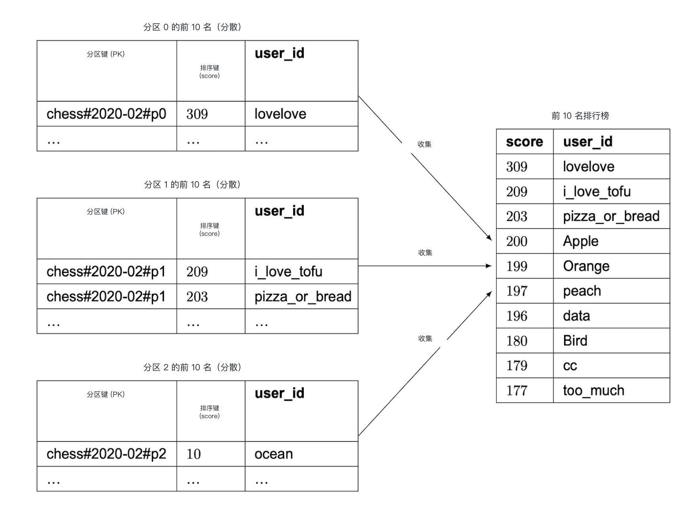
</div>

要选好分区数，需要做一些基准测试。

这个 NoSQL 方案还有一个主要缺点：很难算出某个用户的具体名次。

如果规模大到必须分片，或许可以告诉用户自己处在哪个分数「百分位（percentile）」。

可以定期跑 cron 作业分析分数分布，据此确定用户的百分位，例如：

```
10th percentile = score < 100
20th percentile = score < 500
...
90th percentile = score < 6500
```

---

## 步骤 4：收尾

如果还有时间，还可以讨论：
- **更快检索** - 可以用 Redis 哈希把用户对象缓存为 `user_id -> user object`。这样比查数据库更快。
- **打破平局** - 两个玩家分数相同时，可以按最近一场比赛的时间排序来打破平局。
- **系统故障恢复** - 发生大规模 Redis 宕机时，可以遍历 MySQL 的 WAL 条目，用临时脚本重建排行榜
