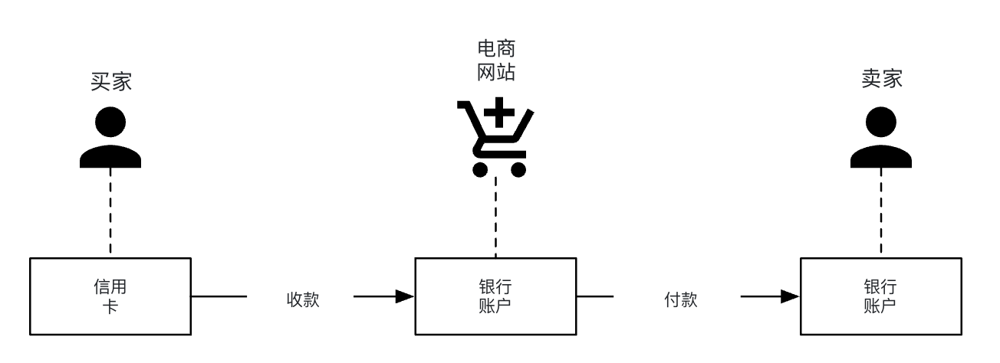
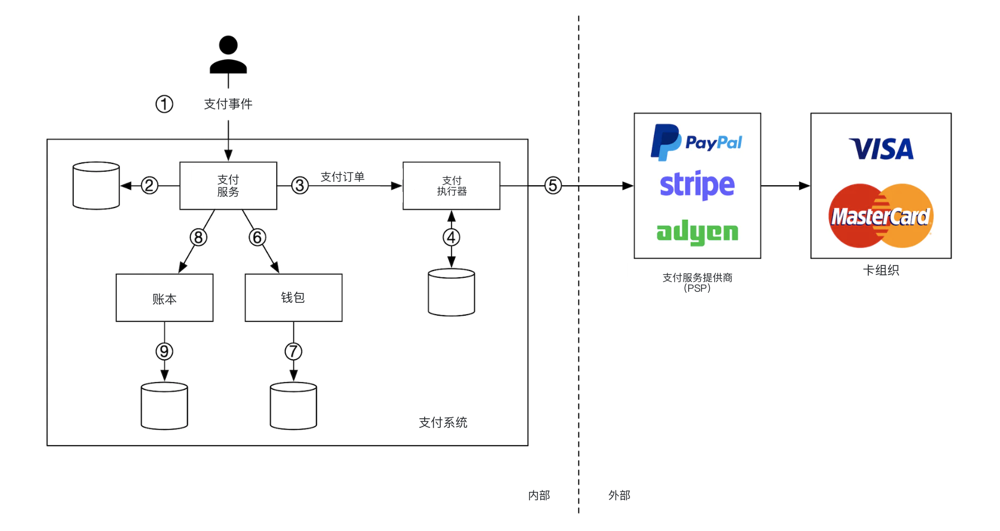
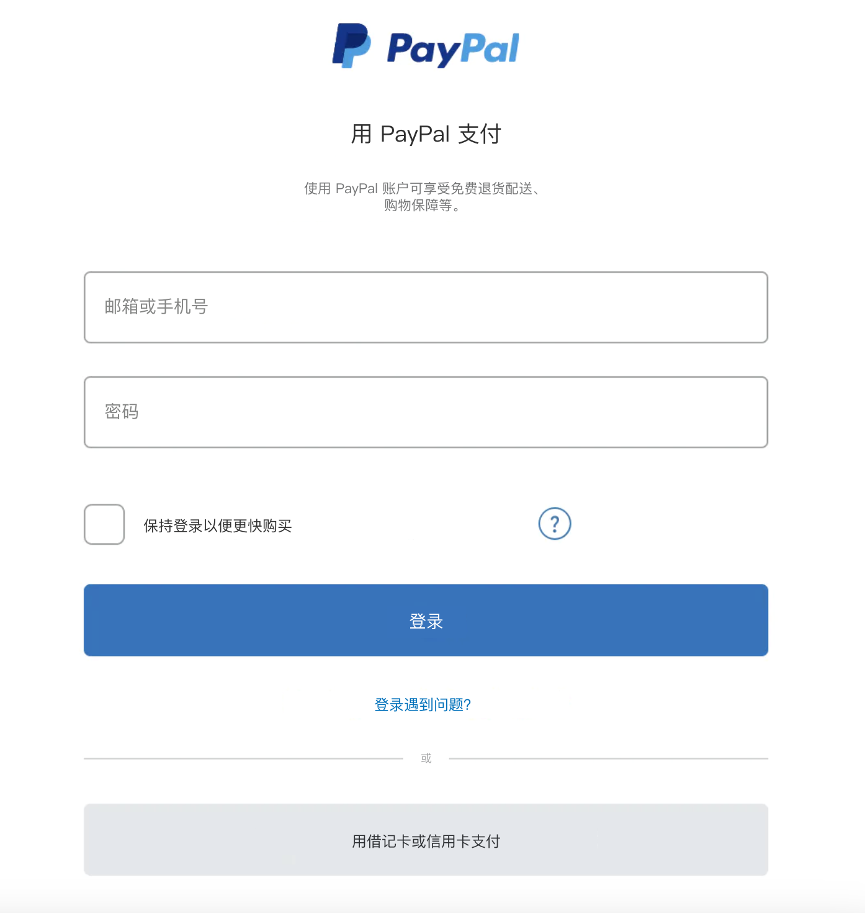
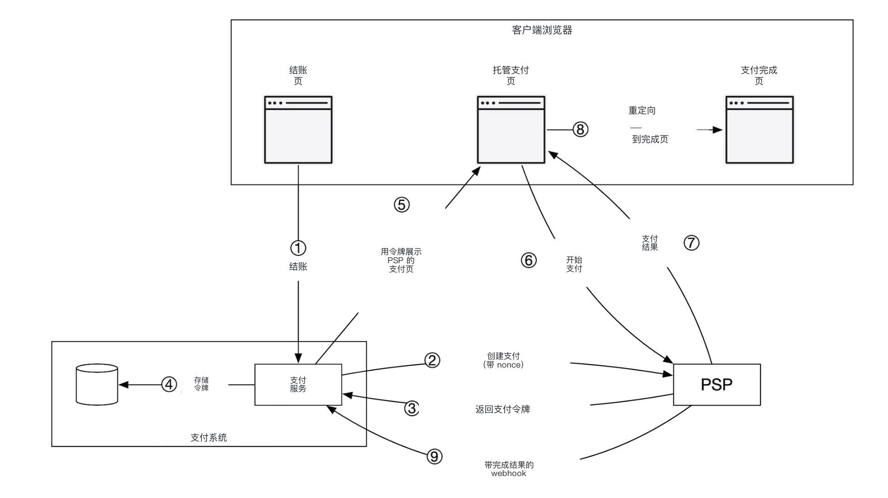
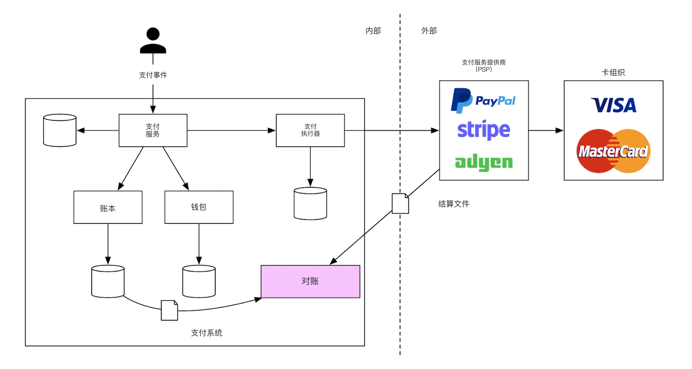
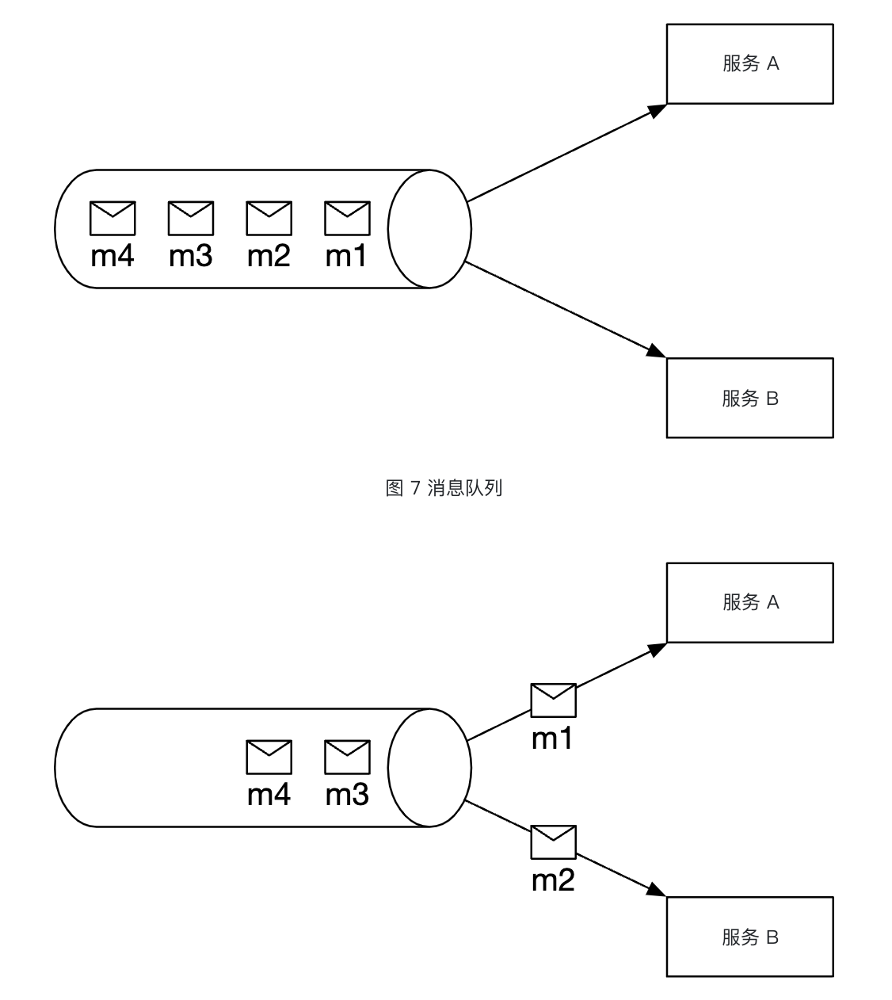
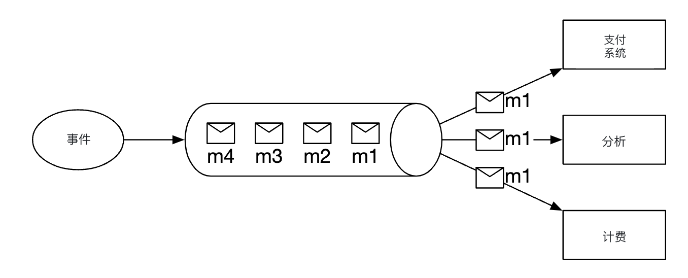
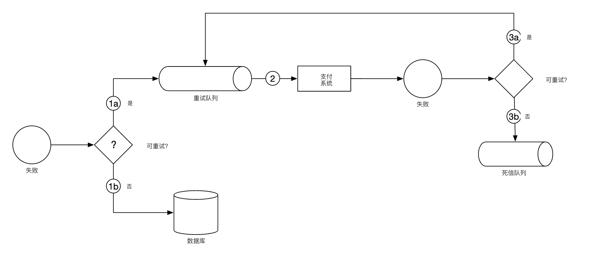
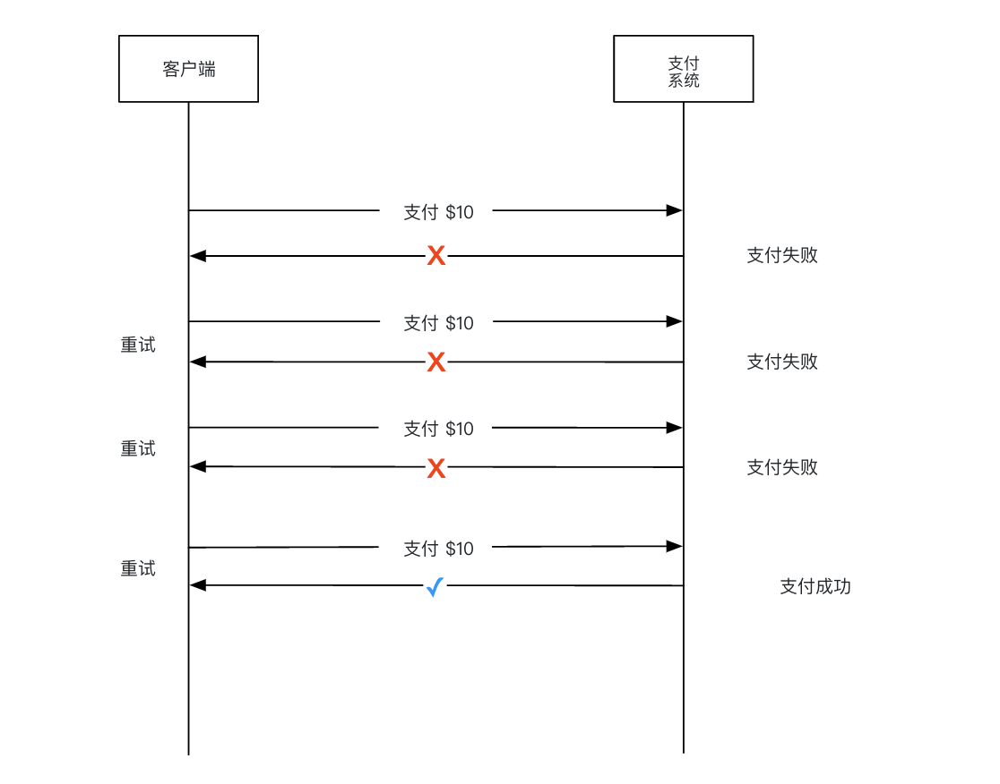
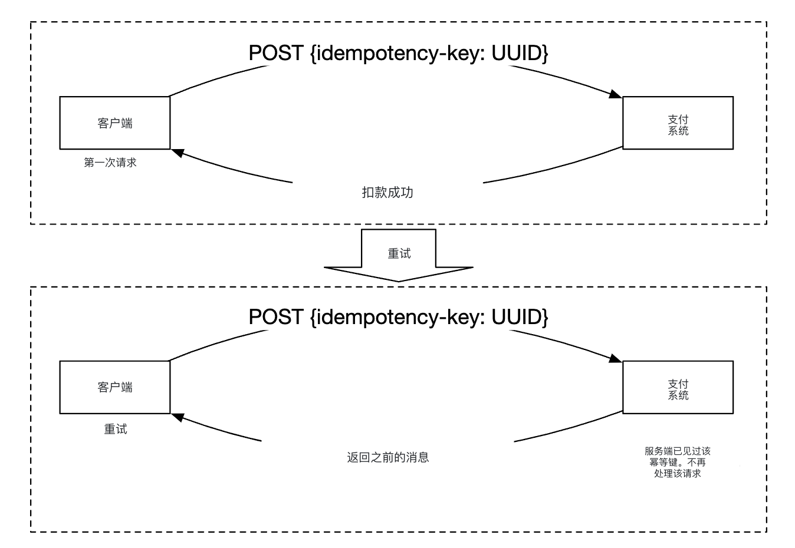

# 第 26 章：设计支付系统

## 简介
本章设计一个**支付系统（payment system）**，它是现代**电子商务（e-commerce）**的基础。

**支付系统**用来结清金融交易，转移货币价值。

---

## 步骤 1：理解问题并确定设计范围
 * 候选人：我们要做哪种支付系统？
 * 面试官：电商系统的支付后端，类似 Amazon.com。凡是资金流动相关的都归它管。
 * 候选人：支持哪些支付方式——信用卡（credit cards）、PayPal、银行卡等？
 * 面试官：实际系统应支持所有这些。面试里我们用信用卡支付即可。
 * 候选人：信用卡处理是我们自己做吗？
 * 面试官：不，我们用第三方提供商，比如 Stripe、Braintree、Square 等。
 * 候选人：信用卡数据会存在我们系统里吗？
 * 面试官：出于合规（compliance）原因，我们不直接存信用卡数据，而是依赖第三方支付处理器。
 * 候选人：应用是全球的吗？要不要支持不同货币和国际支付？
 * 面试官：应用是全球的，但面试里假设只用一种货币。
 * 候选人：每天支持多少笔支付交易？
 * 面试官：每天 100 万笔。
 * 候选人：要不要支持付款流程（payout flow），比如每月把钱付给收款方？
 * 面试官：要支持。
 * 候选人：还有什么要特别注意的？
 * 面试官：需要支持对账（reconciliation），用来修正与内部、外部系统通信时出现的不一致。

### **功能需求**
 * 收款流程（pay-in flow）——支付系统代表商户（merchant）从顾客收款
 * 付款流程——支付系统把钱打给世界各地的卖家（seller）

### **非功能需求**
 * 可靠性（reliability）和容错（fault-tolerance）。失败支付必须仔细处理
 * 需要在内部系统与外部系统之间做对账。

### **粗略估算**
系统每天要处理 100 万笔交易，即每秒 10 笔。

对任何数据库系统来说，这都不是高吞吐，所以不是这次面试的重点。

---

## 步骤 2：提出高层设计并达成共识
高层来看，资金流动里有三个参与方：

<div style="margin-left:3rem">
    
</div>

### **收款流程**
下面是收款流程的高层概览：

<div style="margin-left:3rem">
    
</div>

 * 支付服务（payment service）——接收支付事件并协调支付过程。通常还会用第三方做风险检查，排查反洗钱（AML）违规或犯罪活动。
 * 支付执行器（payment executor）——通过支付服务提供商（Payment Service Provider，PSP）执行单笔支付订单。一个支付事件可能包含多笔支付订单。
 * 支付服务提供商（PSP）——把钱从一个账户转到另一个账户，例如从买家信用卡账户转到电商网站的银行账户。
 * 卡组织（card schemes）——处理信用卡操作的机构，例如 Visa、MasterCard 等。
 * 账本（ledger）——记录所有支付交易的财务记录。
 * 钱包（wallet）——保存所有商户的账户余额。

收款流程示例：
 * 用户点击「下单」，一条支付事件发到支付服务
 * 支付服务把事件写入数据库
 * 支付服务对该支付事件里的所有支付订单调用支付执行器
 * 支付执行器把支付订单写入数据库
 * 支付执行器调用外部 PSP 处理信用卡支付
 * 支付执行器处理完后，支付服务更新钱包，记录卖家有多少钱
 * 钱包服务把更新后的余额写入数据库
 * 支付服务调用账本，记录所有资金流动

### **支付服务 API**
```
POST /v1/payments
{
  "buyer_info": {...},
  "checkout_id": "some_id",
  "credit_card_info": {...},
  "payment_orders": [{...}, {...}, {...}]
}
```

`payment_order` 示例：
```
{
  "seller_account": "SELLER_IBAN",
  "amount": "3.15",
  "currency": "USD",
  "payment_order_id": "globally_unique_payment_id"
}
```

注意：
 * `payment_order_id` 会转发给 PSP 用来去重，也就是幂等键（idempotency key）。
 * amount 字段是 `string`，因为 `double` 不适合表示货币金额。

```
GET /v1/payments/{:id}
```

该端点按 `payment_order_id` 返回单笔支付的执行状态。

### **支付服务数据模型**
需要维护两张表——`payment_events` 和 `payment_orders`。

对支付来说，性能通常不是关键因素。强一致性（strong consistency）才是。

选数据库还要考虑：
 * 容易招到有经验的 DBA 来运维数据库
 * 有被大型金融机构用过的成功先例
 * 配套工具丰富
 * 传统 SQL 优于 NoSQL/NewSQL，因为它有 ACID 保证

`payment_events` 表包含：
 * `checkout_id` - string，主键（primary key）
 * `buyer_info` - string（个人备注：更合适的可能是指向另一张表的外键）
 * `seller_info` - string（个人备注：同上）
 * `credit_card_info` - 取决于卡提供商
 * `is_payment_done` - boolean

`payment_orders` 表包含：
 * `payment_order_id` - string，主键
 * `buyer_account` - string
 * `amount` - string
 * `currency` - string
 * `checkout_id` - string，外键（foreign key）
 * `payment_order_status` - enum（`NOT_STARTED`、`EXECUTING`、`SUCCESS`、`FAILED`）
 * `ledger_updated` - boolean
 * `wallet_updated` - boolean

注意：
 * 一个支付事件会关联多笔支付订单
 * 收款流程不需要 `seller_info`。那是付款时才要
 * 调用相应服务记录支付结果时，会更新 `ledger_updated` 和 `wallet_updated`
 * 支付状态流转由后台任务管理：它检查进行中支付的更新，若一笔支付在合理时间内未处理完就告警

### **复式记账系统**
复式记账（double-entry accounting）机制是任何支付系统的关键。它通过始终把资金操作记到两个账户来追踪资金流动：一个账户余额增加（贷记，credit），另一个减少（借记，debit）：

| 账户 | 借方 | 贷方 |
|---------|-------|--------|
| 买家   | $1    |        |
| 卖家  |       | $1     |

所有交易分录之和永远为零。这套机制提供系统内所有资金流动的端到端可追溯性。

### **托管支付页**
为了避免存储信用卡信息、也不必遵守各种沉重的监管，多数公司更愿意用 PSP 提供的控件（widget），由它们来存储并处理信用卡支付：

<div style="margin-left:3rem">
    
</div>

### **付款流程**
付款流程的组件与收款流程非常相似。

主要区别：
 * 钱从电商网站的银行账户转到商户的银行账户
 * 可以用第三方应付账款（accounts payable）提供商，例如 Tipalti
 * 付款同样有大量簿记和监管要求要处理

---

## 步骤 3：深入设计
本节聚焦让系统更快、更稳健、更安全。

### **PSP 集成**
如果我们的系统能直接连银行或卡组织，就可以不经过 PSP 完成支付。
这种直连很少见，通常只有大到能撑起这笔投入的公司才会做。

走传统路线时，PSP 有两种集成方式：
 * 如果我们的支付系统能采集支付信息，就走 API
 * 走托管支付页，避免处理支付信息相关监管

托管支付页的工作流如下：

<div style="margin-left:3rem">
    
</div>

 * 用户在浏览器点击「结账（checkout）」按钮
 * 客户端（client）把支付订单信息发给支付服务
 * 支付服务收到支付订单信息后，向 PSP 发送支付登记请求
 * PSP 收到币种、金额、过期时间等信息，以及用于幂等的 UUID。通常就是支付订单的 UUID。
 * PSP 返回一个唯一标识这次支付登记的令牌（token）。令牌存在支付服务的数据库里。
 * 令牌存好后，把 PSP 托管支付页交给用户。用令牌以及成功/失败的重定向 URL 来初始化。
 * 用户在 PSP 页面填写支付详情，PSP 处理支付并返回支付状态
 * 用户被重定向回 redirectURL。重定向 URL 示例——`https://your-company.com/?tokenID=JIOUIQ123NSF&payResult=X324FSa`
 * 异步地，PSP 通过 webhook 调用我们的支付服务，把支付结果通知后端
 * 支付服务根据收到的 webhook 记录支付结果

### **对账**
上一节讲的是支付的成功路径。失败路径靠后台对账流程发现并修正。

每天晚上，PSP 会发一份结算文件（settlement file），我们用它把外部系统状态和内部系统状态做比对。

<div style="margin-left:3rem">
    
</div>

这个过程也能用来发现内部不一致，例如账本服务和钱包服务之间。

不匹配由财务团队手工处理。不匹配分为：
 * 可归类，因此是已知不匹配，可用标准流程调整
 * 可归类，但无法自动化。由财务团队手工调整
 * 无法归类。由财务团队手工调查并调整

### **处理支付延迟**
有时一笔支付可能要几小时才完成，尽管通常只要几秒。

可能原因：
 * 支付被标为高风险，需要有人手工审核
 * 信用卡需要额外保护，例如 3D Secure 认证（3D Secure Authentication），需要持卡人提供额外信息才能完成

处理方式：
 * 等 PSP 在支付完成时发 webhook；若 PSP 不提供 webhook，就轮询其 API
 * 给用户展示「处理中（pending）」状态，并提供一个页面让他们查看支付更新。支付完成后也可以发邮件通知。

### **内部服务通信**
服务之间有两种通信模式——同步（synchronous）和异步（asynchronous）。

同步通信（即 HTTP）在小规模系统里够用，但规模上去后会出问题：
 * 性能差——调用链上服务越多，请求-响应周期越长
 * 故障隔离差——PSP 或其他服务一挂，用户就收不到响应
 * 紧耦合——发送方必须知道接收方
 * 难扩展——没有缓冲，不容易扛突发流量

异步通信可以分成两类。

单接收者（single receiver）——多个接收者订阅同一主题（topic），消息只被处理一次：

<div style="margin-left:3rem">
    
</div>

多接收者（multiple receivers）——多个接收者订阅同一主题，但消息会转发给所有人：

<div style="margin-left:3rem">
    
</div>

后一种模型很适合我们的支付系统，因为一笔支付会触发多个副作用，由不同服务处理。

简单说，同步通信更简单，但不让服务自治。
异步通信用简单性和一致性换可扩展性和韧性。

### **处理失败支付**
每个支付系统都要处理失败支付。我们会用这些机制：
 * 跟踪支付状态——支付失败时，可以根据状态决定重试还是退款。
 * 重试队列（retry queue）——要重试的支付发到重试队列
 * 死信队列（dead-letter queue）——最终失败的支付推进死信队列，便于调试和排查。

<div style="margin-left:3rem">
    
</div>

### **精确一次投递**
必须保证支付精确一次（exactly-once）处理，避免向顾客重复扣款。

如果一个操作既是至少一次（at-least-once）又是至多一次（at-most-once），它就是精确一次执行。

为了至少一次保证，我们用重试机制：

<div style="margin-left:3rem">
    
</div>

决定重试间隔的常见策略：
 * 立即重试——失败后客户端马上再发一次请求
 * 固定间隔——等固定时间再重试支付
 * 递增间隔——每次重试之间逐步加大间隔
 * 指数退避（exponential back-off）——后续重试间隔翻倍
 * 取消——客户端取消请求。发生在错误是终态，或已达重试上限时

经验法则：默认用指数退避。好的做法是服务端用 `Retry-After` 头指定重试间隔。

重试的问题是服务端可能把一笔支付处理两次：
 * 客户点了两次「支付」按钮，于是被扣了两次
 * PSP 处理成功了，但下游服务（账本、钱包）没处理。重试导致 PSP 再处理一次

为解决重复支付，需要用幂等（idempotency）机制——同一操作执行多次也只处理一次。

从 API 角度看，客户端可以多次调用，结果相同。
幂等靠请求里的特殊头管理（例如 `idempotency-key`），通常是 UUID。

<div style="margin-left:3rem">
    
</div>

幂等可以用数据库的唯一键约束（unique key constraint）来实现：
 * 服务端尝试插入新行
 * 插入因唯一键约束冲突失败
 * 服务端发现该错误，把已有对象返回给客户端

PSP 侧也用前面提到的 nonce 做幂等。PSP 会保证同一个 nonce 的支付不会处理两次。

### **一致性**
支付生命周期里会调用多个有状态服务——PSP、账本、钱包、支付服务。

任意两个服务之间的通信都可能失败。
通过对所有服务实现精确一次处理和对账，可以保证最终一致性（eventual consistency）。

如果用复制（replication），就要面对复制延迟（replication lag），用户可能在主库和副本（replica）之间看到不一致数据。

缓解办法：所有读写都走主库，副本只用于冗余和故障转移。
或者用 Paxos 或 Raft 这类共识算法，保证副本始终同步。
也可以用基于共识的分布式数据库，例如 YugabyteDB 或 CockroachDB。

### **支付安全**
保证支付安全的一些机制：
 * 窃听请求/响应——用 HTTPS 保护所有通信
 * 数据篡改——强制加密和完整性监控
 * 中间人攻击——使用 SSL，并做证书固定（certificate pinning）
 * 数据丢失——跨多个区域复制数据，并做数据快照
 * DDoS 攻击——做限流（rate limiting）和防火墙
 * 信用卡被盗——用令牌，而不是在系统里存真实卡信息
 * PCI 合规——处理品牌信用卡的组织要遵守的安全标准
 * 欺诈——地址验证、卡验证值（CVV）、用户行为分析等

---

## 步骤 4：收尾
其他可谈的点：
 * 监控和告警
 * 调试工具——需要能方便看出支付为何失败的工具
 * 货币兑换——设计面向国际的支付系统时很重要
 * 地域——不同地区可能有不同支付方式
 * 现金支付——在印度、巴西等地非常普遍
 * Google/Apple Pay 集成
