# 第 27 章：设计数字钱包

## 简介
**支付平台（payment platforms）**通常会有一个**钱包服务（wallet service）**，让客户把资金存在应用里，之后再取出。

也可以用它来支付商品和服务，或把钱转给同样使用**数字钱包（digital wallet）**服务的其他用户。这往往比走普通支付通道（payment rails）更快、更便宜。

<div style="margin-left:3rem">
    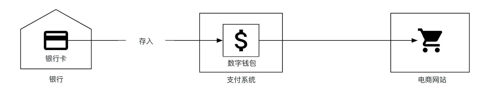
</div>

---

## 步骤 1：理解问题并确定设计范围
 * 候选人：我们只聚焦数字钱包之间的转账吗？要不要支持其他操作？
 * 面试官：先聚焦数字钱包之间的转账。
 * 候选人：系统需要支持每秒多少笔事务？
 * 面试官：假设 100 万 TPS
 * 候选人：数字钱包对正确性要求很严。能否假设有事务保证就够了？
 * 面试官：可以
 * 候选人：需要证明正确性吗？
 * 面试官：可以用对账（reconciliation）来做，但那只能发现差异，不能告诉我们根因。我们希望能从头回放数据，重建历史。
 * 候选人：可用性（availability）要求可以按 99.99% 来吗？
 * 面试官：可以
 * 候选人：要不要考虑外汇（foreign exchange）？
 * 面试官：不，超出范围

总结下来，需要支持：
 * 两个账户之间的余额转账
 * 支持 100 万 TPS
 * 可靠性 99.99%
 * 支持事务
 * 支持可复现（reproducibility）

### **粗略估算**
云上配置的传统关系数据库大约能支撑 ~1000 TPS。

要达到 100 万 TPS，需要 1000 个数据库节点。但如果每笔转账有两条腿（two legs），实际需要支撑 200 万 TPS。

设计目标之一是提高单节点能处理的 TPS，从而减少数据库节点数。

| 单节点 TPS | 节点数 |
|--------------|-------------|
| 100          | 20,000      |
| 1,000        | 2,000       |
| 10,000       | 200         |

---

## 步骤 2：提出高层设计并达成共识

### **API 设计**
这次面试只需要支持一个端点：
```
POST /v1/wallet/balance_transfer - transfers balance from one wallet to another
```

请求参数——from_account、to_account、amount（用 string 以免丢精度）、currency、transaction_id（幂等键，idempotency key）。

响应示例：
```
{
    "status": "success"
    "transaction_id": "01589980-2664-11ec-9621-0242ac130002"
}
```

### **内存分片方案**
钱包应用为每个用户账户维护账户余额。

一种合适的数据结构是 `map<user_id, balance>`，可以用内存 Redis 来实现。

单个 Redis 节点扛不住 100 万 TPS，所以要把 Redis 集群分片（sharding）到多个节点。

分区算法示例：
```
String accountID = "A";
Int partitionNumber = 7;
Int myPartition = accountID.hashCode() % partitionNumber;
```

分区数量和 Redis 节点地址可以存在 ZooKeeper 里，因为它是高可用的配置存储。

最后，钱包服务是负责执行转账操作的无状态（stateless）服务，可以轻松水平扩展（horizontal scaling）：

<div style="margin-left:3rem">
    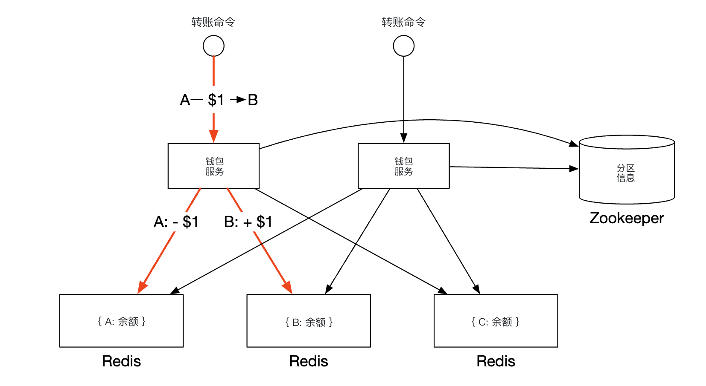
</div>

这套方案解决了可扩展性，但无法原子地执行余额转账。

### **分布式事务**
处理分布式事务（distributed transaction）的一种做法，是在标准的、已分片的关系数据库上使用两阶段提交（two-phase commit）协议：

<div style="margin-left:3rem">
    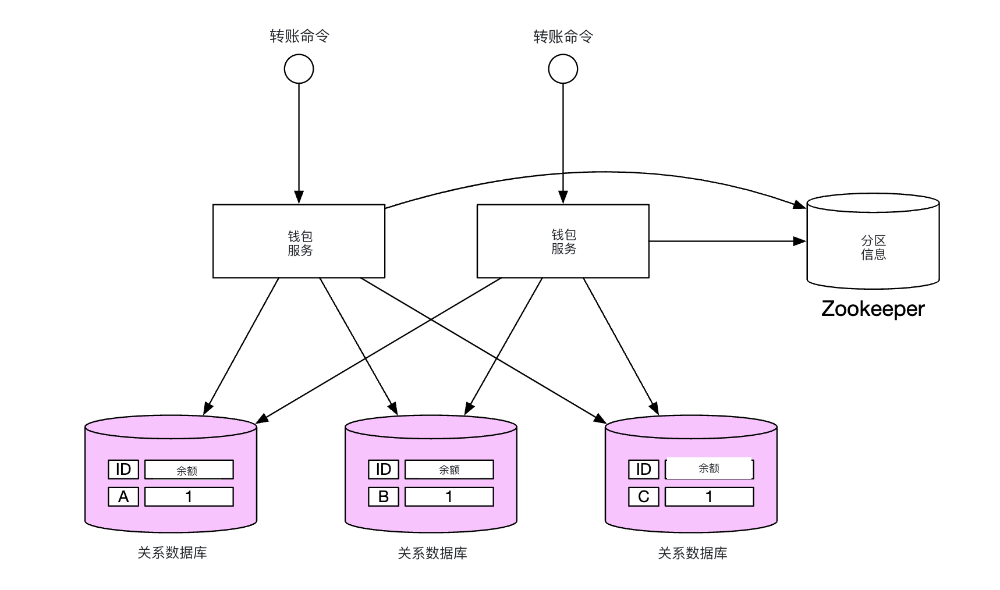
</div>

两阶段提交（2PC）协议的工作方式如下：

<div style="margin-left:3rem">
    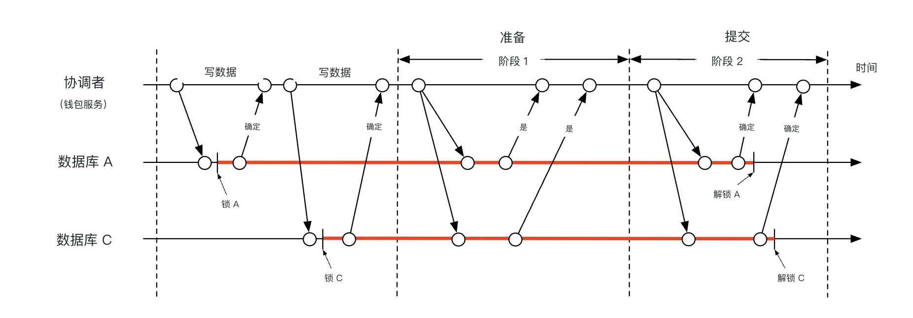
</div>

 * 协调者（coordinator，即钱包服务）像平常一样对多个数据库做读写
 * 应用准备提交事务时，协调者让所有数据库做准备
 * 如果所有数据库都回复「是」，协调者再让各数据库提交事务。
 * 否则，让所有数据库中止事务

2PC 的缺点：
 * 因为锁争用，性能不好
 * 协调者是单点故障（SPOF）

### **用 Try-Confirm/Cancel（TC/C）做分布式事务**
TC/C 是 2PC 协议的变体，配合补偿事务（compensating transaction）工作：
 * 协调者让所有数据库为事务预留资源
 * 协调者收集各库回复——若是，则让各库做确认（try-confirm）；若否，则让各库做取消（try-cancel）。

TC/C 与 2PC 的一个重要区别：2PC 执行的是单笔事务，而 TC/C 里有两笔彼此独立的事务。

TC/C 各阶段如下：

| 阶段 | 操作 | A                   | C                   |
|-------|-----------|---------------------|---------------------|
| 1     | 尝试       | 余额变化：-$1 | 无操作          |
| 2     | 确认   | 无操作          | 余额变化：+$1 |
|       | 取消    | 余额变化：+$1 | 无操作          |

阶段 1——尝试：

<div style="margin-left:3rem">
    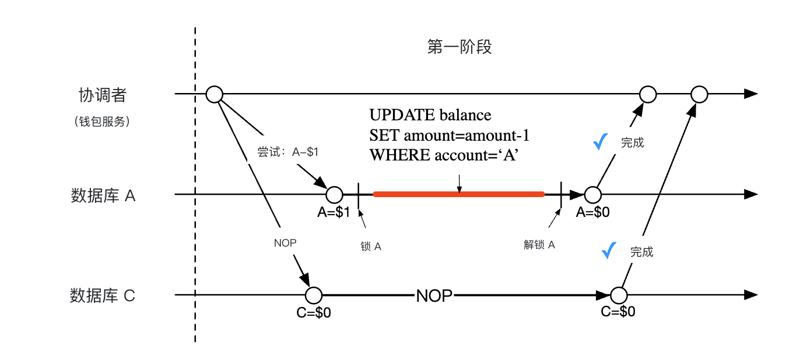
</div>

 * 协调者在 A 的数据库开启本地事务，把 A 的余额减 1$
 * C 的数据库收到 NOP 指令，什么也不做

阶段 2a——确认：

<div style="margin-left:3rem">
    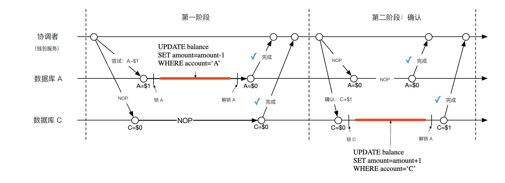
</div>

 * 如果两个数据库都回复「是」，就开始确认阶段。
 * A 的数据库收到 NOP，C 的数据库被指示把 C 的余额加 1$（本地事务）

阶段 2b——取消：

<div style="margin-left:3rem">
    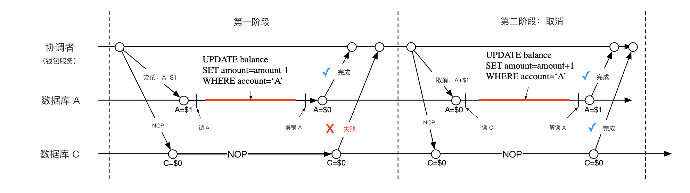
</div>

 * 如果阶段 1 中任一操作失败，就开始取消阶段。
 * A 的数据库被指示把 A 的余额加 1$，C 的数据库收到 NOP

下面是 2PC 与 TC/C 的对比：

|      | 第一阶段                                            | 第二阶段：成功              | 第二阶段：失败                        |
|------|--------------------------------------------------------|------------------------------------|-------------------------------------------|
| 2PC  | 事务尚未完成                          | 提交/取消所有事务     | 取消所有事务                   |
| TC/C | 所有事务都已完成——已提交或已取消 | 如需则执行新事务 | 回滚已经提交的事务 |

TC/C 也被称为基于补偿的分布式事务。高层操作在业务逻辑里处理。

TC/C 的其他性质：
 * 与数据库无关，只要数据库支持事务
 * 分布式事务的细节和复杂度要在业务逻辑里处理

### **TC/C 失败模式**
如果协调者在中途挂掉，需要恢复中间状态。
做法是维护阶段状态表，并在数据库分片内原子更新：

<div style="margin-left:3rem">
    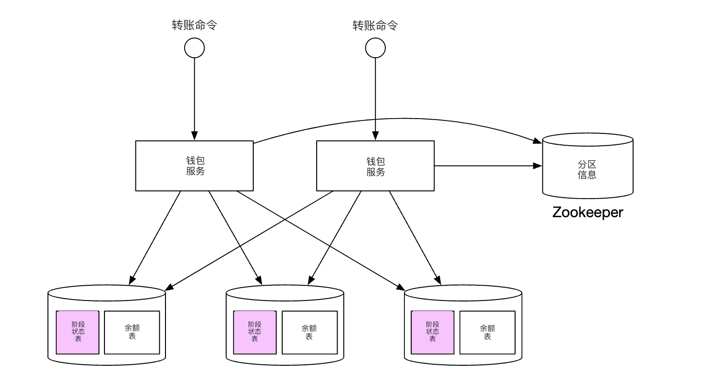
</div>

表里有什么：
 * 分布式事务的 ID 和内容
 * 尝试阶段的状态——未发送、已发送、已收到响应
 * 第二阶段名称——确认或取消
 * 第二阶段的状态
 * 乱序标志（后面解释）

使用 TC/C 的一个注意点：分布式事务进行中，账户状态会有短暂彼此不一致：

<div style="margin-left:3rem">
    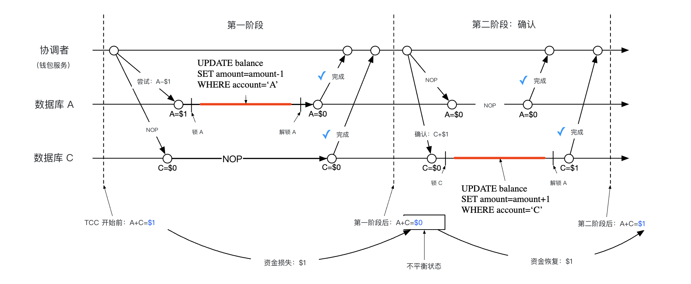
</div>

只要我们总能从这种状态恢复，并且用户不能拿中间状态去花掉，这就没问题。
保证方式是始终先做扣减、再做增加。

| 尝试阶段的选择  | 账户 A | 账户 C |
|--------------------|-----------|-----------|
| 选择 1           | -$1       | NOP       |
| 选择 2（无效） | NOP       | +$1       |
| 选择 3（无效） | -$1       | +$1       |

注意上表的选择 3 无效，因为若不依赖 2PC，就无法保证跨不同数据库的事务原子执行。

还要处理一个乱序执行的边界情况：

<div style="margin-left:3rem">
    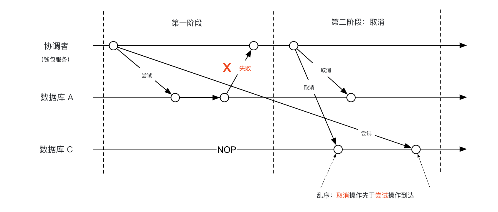
</div>

数据库有可能在收到尝试之前先收到取消。这个边界情况可以靠在阶段状态表里加乱序标志来处理。
收到尝试操作时，先检查乱序标志是否已置位；若已置位，则返回失败。

### **用 Saga 做分布式事务**
另一种常见做法是用 Saga——在微服务（microservice）架构里实现分布式事务的标准方式。

工作方式：
 * 所有操作排成一个序列。各操作在各自的数据库里独立执行。
 * 操作从前往后执行
 * 某个操作失败时，整个过程用补偿操作一直回滚到开头

<div style="margin-left:3rem">
    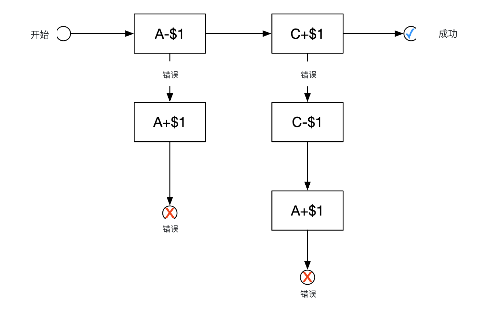
</div>

如何协调工作流？可以采取两种方式：
 * 协同（choreography）——参与 Saga 的各服务订阅相关事件，完成自己那部分
 * 编排（orchestration）——由单个协调者按正确顺序指挥各服务干活

协同的难点是业务逻辑拆到多个服务里，并且异步通信。
编排能更好地处理复杂度，所以数字钱包系统通常更倾向这种方式。

下面是 TC/C 与 Saga 的对比：

|                                           | TC/C            | Saga                     |
|-------------------------------------------|-----------------|--------------------------|
| 补偿动作                       | 在取消阶段 | 在回滚阶段        |
| 中心协调                      | 是             | 是（编排模式） |
| 操作执行顺序                 | 任意             | 线性                   |
| 能否并行执行            | 是             | 否（线性执行）    |
| 可能看到部分不一致状态 | 是             | 是                      |
| 应用逻辑还是数据库逻辑             | 应用     | 应用              |

主要差别是 TC/C 可以并行，所以决策取决于延迟要求——若要低延迟，应选 TC/C。

无论选哪种，我们仍需要支持审计，以及回放历史以从失败状态恢复。

### **事件溯源**
现实中，数字钱包应用可能被审计，我们要能回答这些问题：
 * 任意时刻的账户余额我们知道吗？
 * 如何知道历史余额和当前余额是正确的？
 * 代码变更后，如何证明系统逻辑仍然正确？

事件溯源（event sourcing）是一种能帮我们回答这些问题的技术。

它包含四个概念：
 * 命令（command）——来自现实世界的意图动作，例如从账户 A 向 B 转 1$。需要有全局顺序，因此放进 FIFO 队列。
   * 命令与事件不同，可能失败，也会因为 IO 或非法状态等带有随机性。
   * 一条命令可以产生零个或多个事件
   * 事件生成过程可以包含随机性，例如外部 IO。后面还会再谈
 * 事件（event）——系统内已经发生之事的历史事实，例如「从 A 向 B 转了 1$」。
   * 与命令不同，事件是已经在我们系统里发生的事实
   * 与命令类似，它们也需要有序，因此也入 FIFO 队列
 * 状态（state）——事件导致了什么变化。例如账户与其余额的键值存储。
 * 状态机（state machine）——驱动事件溯源过程。主要负责校验命令，并应用事件以更新系统状态。
   * 状态机应当是确定性的，因此不应读外部 IO，也不应依赖随机性。

<div style="margin-left:3rem">
    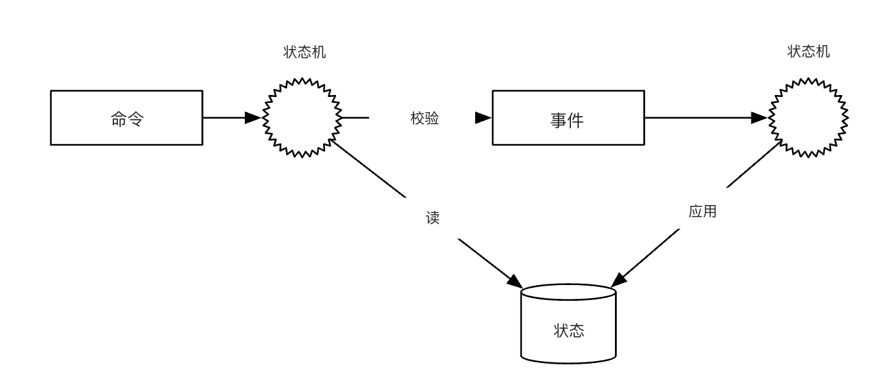
</div>

下面是事件溯源的动态视图：

<div style="margin-left:3rem">
    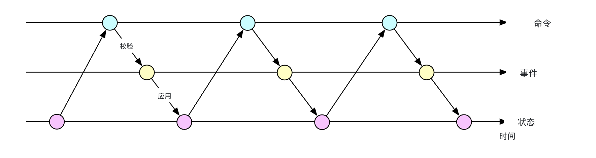
</div>

对我们的钱包服务来说，命令就是余额转账请求。可以把它们放进 FIFO 队列，例如 Kafka：

<div style="margin-left:3rem">
    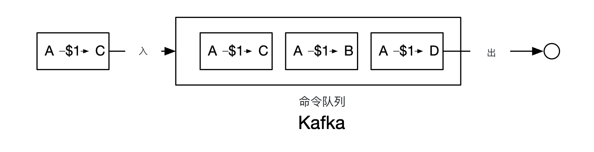
</div>

完整图景如下：

<div style="margin-left:3rem">
    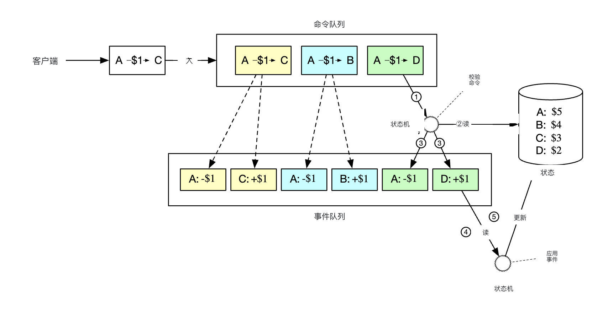
</div>

 * 状态机从命令队列读取命令
 * 从数据库读取余额状态
 * 校验命令。若有效，为两个账户各生成一个事件
 * 读取下一个事件并应用，更新数据库里的余额（状态）

事件溯源的主要优点是可复现。在这套设计里，所有状态更新操作都保存为余额变更的不可变历史。

历史余额总能通过从头回放事件来重建。
因为事件列表不可变、状态机是确定性的，回放任意中间状态都能成功。

<div style="margin-left:3rem">
    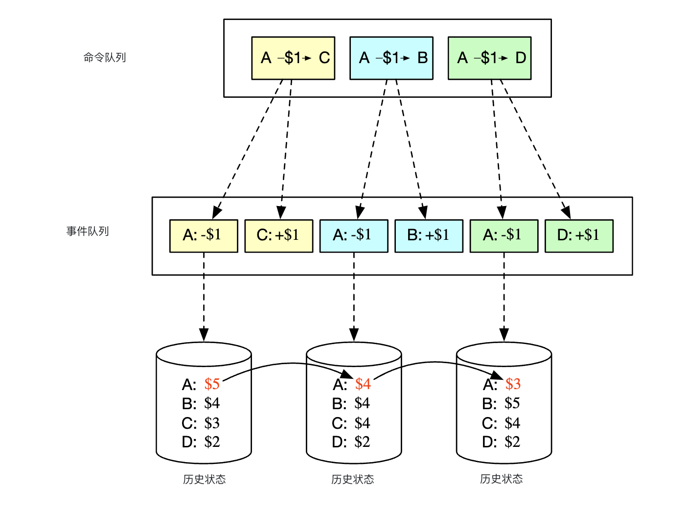
</div>

本节开头那些审计相关问题，都可以靠事件溯源来回答：
 * 任意时刻的账户余额我们知道吗？——从开头回放事件，直到我们关心的那个时间点
 * 如何知道历史余额和当前余额是正确的？——从开头重新计算所有事件即可验证正确性
 * 代码变更后，如何证明系统逻辑仍然正确？——可以用不同版本的代码对同一批事件跑一遍，验证结果相同

回答客户关于其余额的查询，可以用 CQRS 架构——可以有多台只读状态机，基于不可变的事件列表查询历史状态：

<div style="margin-left:3rem">
    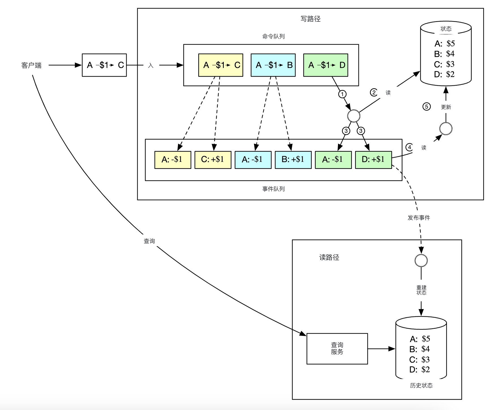
</div>

---

## 步骤 3：深入设计
本节探讨一些性能优化，因为我们仍需要扩展到 100 万 TPS。

### **高性能事件溯源**
第一项优化是把命令和事件存到本地磁盘，而不是 Kafka 这类外部存储。

这样能避免网络延迟；而且我们只做追加，对 HDD 来说通常很快。

下一项优化是把最近的命令和事件缓存在内存里，省去从磁盘重新加载的时间。

在底层，可以用 mmap 同时做到上述优化：数据存在本地磁盘，并缓存在内存中：

<div style="margin-left:3rem">
    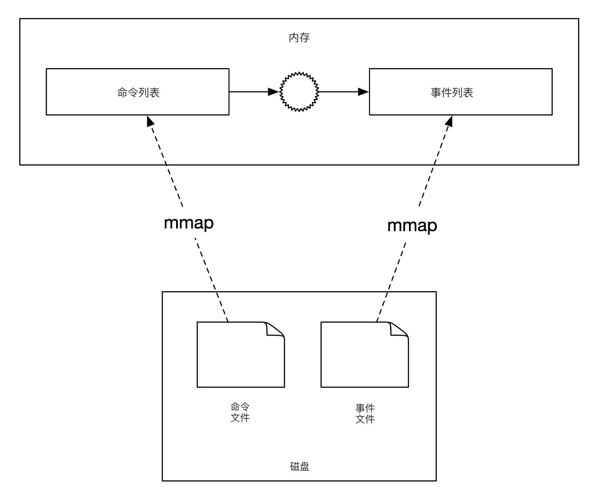
</div>

再下一步，也可以用 SQLite（基于文件的本地关系数据库）把状态存在本地文件系统。RocksDB 也是不错的选择。

我们会选 RocksDB，因为它使用 LSM 树（log-structured merge-tree），针对写操作做了优化。
读性能则靠缓存优化。

<div style="margin-left:3rem">
    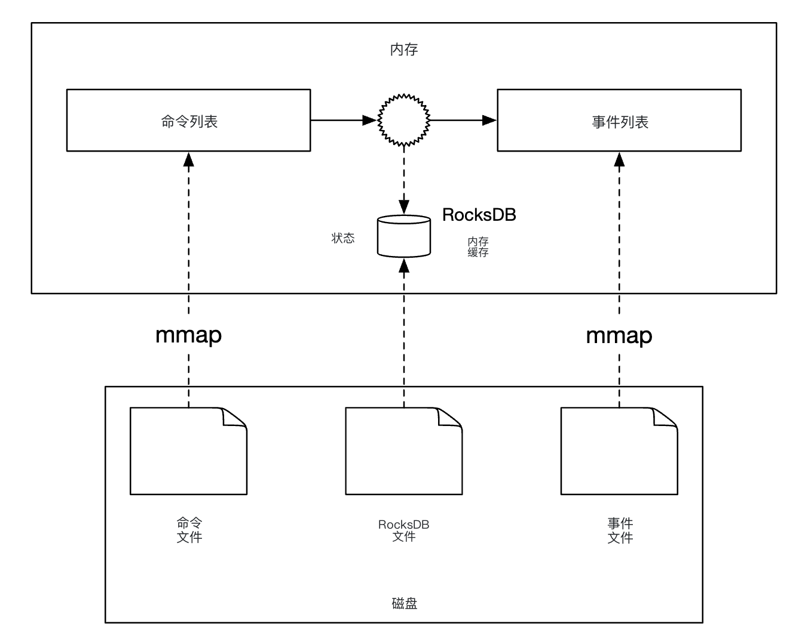
</div>

为了优化可复现，可以定期把快照（snapshot）存到磁盘，这样就不必每次都从头重建某个状态。快照可以存成大的二进制文件，放进分布式文件存储，例如 HDFS：

<div style="margin-left:3rem">
    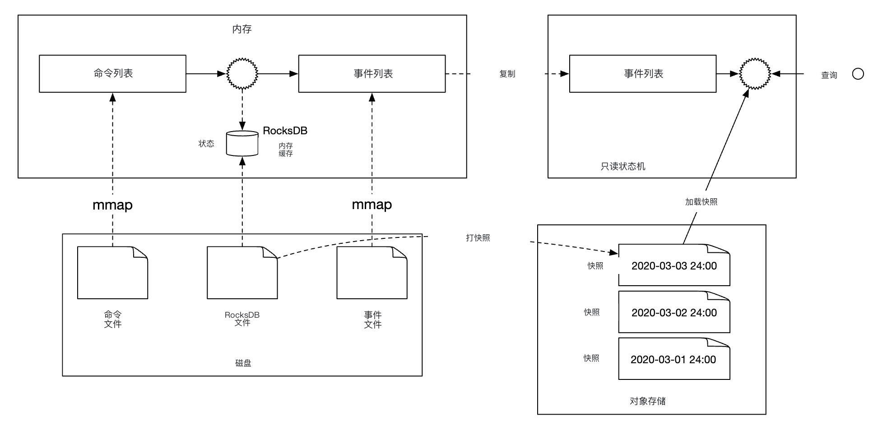
</div>

### **可靠的高性能事件溯源**
目前这些优化很好，但它们让服务变成有状态（stateful）的。为了可靠性，需要引入某种复制。

在此之前，先分析系统里哪些数据需要高可靠性：
 * 状态和快照总能通过从事件列表重放来再生。因此只需保证事件列表的可靠性。
 * 有人可能觉得事件列表总能从命令列表再生，其实不行，因为命令是非确定性的。
 * 结论是：只需保证事件列表的高可靠性

为了让事件具备高可靠性，需要把列表复制到多个节点。需要保证：
 * 没有数据丢失
 * 日志文件内数据的相对顺序在各副本上保持一致

为此可以采用共识算法（consensus algorithm），例如 Raft。

在 Raft 里，有一个活跃的领导者（leader），以及若干被动的跟随者（follower）。领导者挂了，其中一个跟随者会接上。
只要超过半数节点还活着，系统就能继续运行。

<div style="margin-left:3rem">
    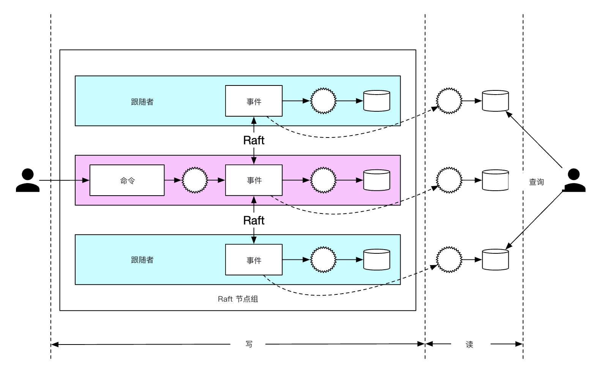
</div>

在这套做法里，所有节点都根据事件列表更新状态。Raft 保证领导者和跟随者拥有相同的事件列表。

### **分布式事件溯源**
到目前为止，我们已经设计出单节点性能高、而且可靠的系统。

还要解决的限制：
 * 单个 Raft 组的容量有限。到了某个点，需要对数据做分片，并实现分布式事务
 * 在 CQRS 架构里，请求/响应路径很慢。客户端需要定期轮询系统，才能知道钱包何时更新完成

轮询（polling）不是实时的，用户可能要等一会儿才知道余额有更新。而且如果轮询太勤，会压垮查询服务：

<div style="margin-left:3rem">
    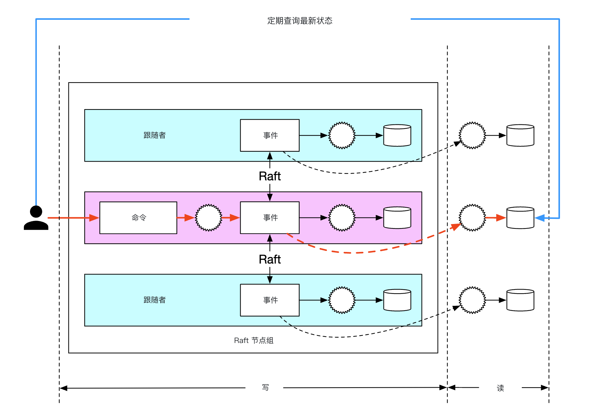
</div>

为减轻系统负载，可以引入反向代理（reverse proxy），代表用户发送命令并替他们轮询响应：

<div style="margin-left:3rem">
    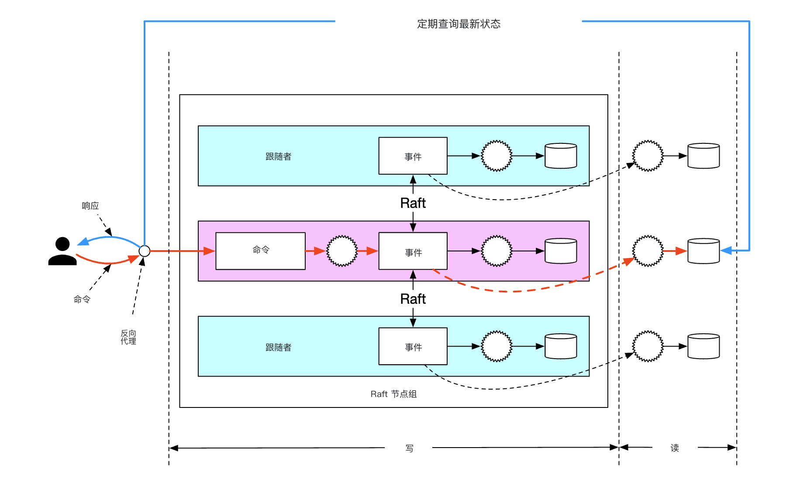
</div>

这能减轻系统负载，因为一次请求可以拉取多个用户的数据，但仍然解决不了实时回执的需求。

最后一处改动，可以让只读状态机在响应就绪后推回给反向代理。这样用户会感觉更新是实时发生的：

<div style="margin-left:3rem">
    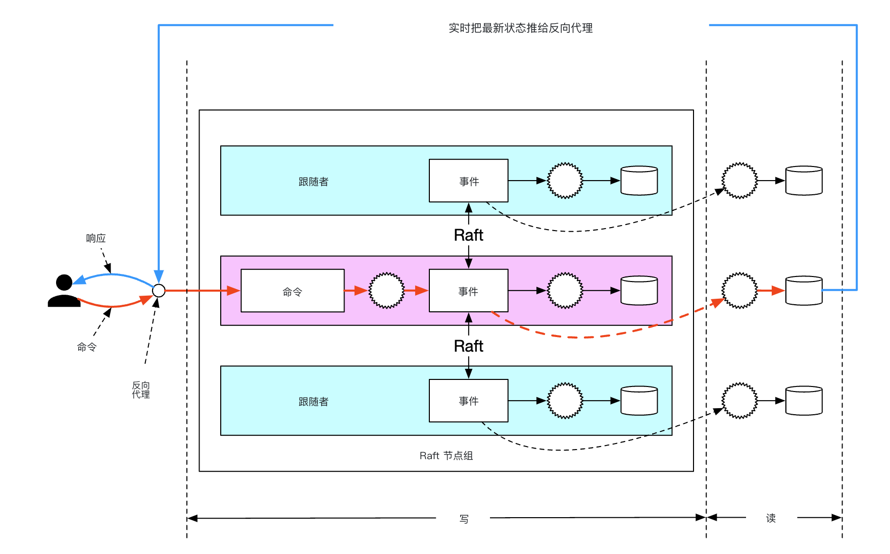
</div>

最后，为了进一步扩展，可以把系统分片成多个 Raft 组，再在它们之上用编排器通过 TC/C 或 Saga 实现分布式事务：

<div style="margin-left:3rem">
    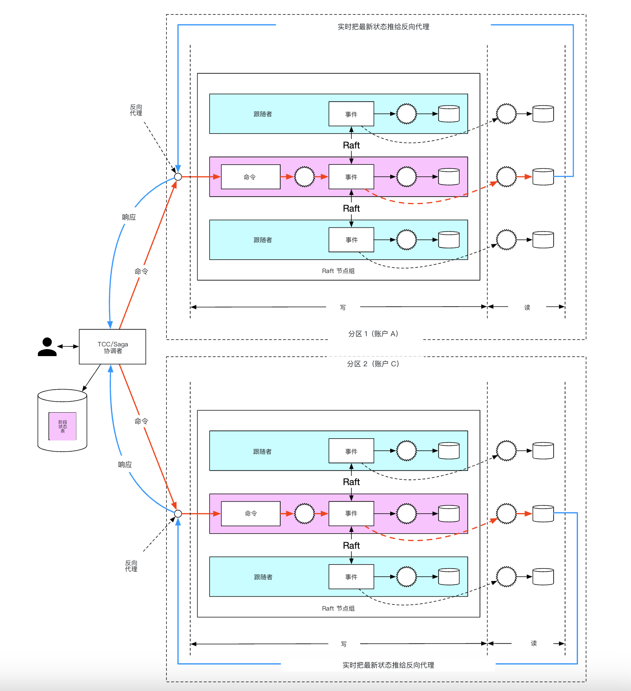
</div>

最终系统里一笔余额转账请求的生命周期示例如下：
 * 用户 A 向 Saga 协调者发送一笔包含两个操作的分布式事务——`A-1` 和 `C+1`。
 * Saga 协调者在阶段状态表里创建一条记录，跟踪事务状态
 * 协调者确定需要把命令发到哪些分区。
 * 分区 1 的 Raft 领导者收到 `A-1` 命令，校验后转成事件，并复制到该 Raft 组的其他节点
 * 事件结果同步到读状态机，读状态机把响应推回协调者
 * 协调者创建一条记录，标明该操作成功，然后继续下一个操作——`C+1`
 * 下一个操作与第一个类似——确定分区、发送命令、执行、读状态机推回响应
 * 协调者创建记录标明操作 2 也成功，最后把结果告知客户端

---

## 步骤 4：收尾
设计演进如下：
 * 从内存 Redis 方案起步。问题是它不是耐久（durable）存储。
 * 转到关系数据库，并在其上用 2PC、TC/C 或分布式 Saga 执行分布式事务。
 * 接着引入事件溯源，让所有操作可审计
 * 一开始把数据存到外部存储，用外部数据库和队列，但性能不好
 * 随后把数据存到本地文件存储，利用只追加操作的性能。还用缓存优化读路径（read path）
 * 上一方案虽然快，但不耐久。于是引入带复制的 Raft 共识，避免单点故障
 * 还采用了带反向代理的 CQRS，替用户管理事务生命周期
 * 最后把数据分区到多个 Raft 组，再用分布式事务机制编排——TC/C 或分布式 Saga
