# 第 28 章：设计证券交易所

## 简介
本章设计一个**电子证券交易所（electronic stock exchange）**。

它的基本功能是高效撮合买家和卖家。

主要证券交易所包括 **NYSE**、**NASDAQ** 等。

<div style="margin-left:3rem">
    
</div>

---

## 步骤 1：理解问题并确定设计范围
 * 候选人：我们要交易哪些证券（securities）？股票、期权还是期货？
 * 面试官：为简单起见，只做股票
 * 候选人：支持哪些订单类型——下单、撤单、改单？限价单（limit）、市价单（market）、条件单呢？
 * 面试官：需要支持下单和撤单。订单类型只考虑限价单。
 * 候选人：系统要支持盘后交易（after hours trading）吗？
 * 面试官：不，只要正常交易时段
 * 候选人：能描述一下交易所的基本功能吗？
 * 面试官：客户可以下或撤销限价单，并实时收到撮合成交。他们还要能实时看到订单簿（order book）。
 * 候选人：交易所的规模有多大？
 * 面试官：同时交易的用户数以万计，大约 100 个标的。每天数十亿笔订单。还要为合规做风控检查。
 * 候选人：什么样的风控检查？
 * 面试官：做简单风控——例如限制用户一天最多交易 100 万股苹果股票
 * 候选人：用户钱包怎么接入？
 * 面试官：下单前必须确认客户资金充足。挂单占用的资金要预扣，直到订单完结。

### **非功能需求**
面试官给出的规模，暗示我们要设计的是中小规模交易所。
也要保证以后能灵活支持更多标的和用户。

其他非功能需求：
 * 可用性（availability）——至少 99.99%。宕机会损害声誉
 * 容错（fault tolerance）——需要容错和快速恢复机制，限制生产事故的影响
 * 延迟（latency）——往返延迟应在毫秒级，重点看 99 分位。P99 持续偏高会让少数用户体验很差。
 * 安全——需要账户管理系统。为合法合规，要支持 KYC 核验用户身份。还要保护公开资源免受 DDoS。

### **粗略估算**
 * 100 个标的，每天 10 亿笔订单
 * 正常交易时段 09:30 到 16:00（6.5 小时）
 * QPS = 10 亿 / 6.5 / 3600 = 43000
 * 峰值 QPS = 5*QPS = 215000
 * 开市时成交量显著更高

---

## 步骤 2：提出高层设计并达成共识

### **业务基础**
先讨论一些和交易所相关的基本概念。

券商（broker）在交易所和终端用户之间做中介——Robinhood、Fidelity 等。

机构客户用专门交易软件做大额交易，需要特殊对待。
例如大额交易时拆单，以免冲击市场。

订单类型：
 * 限价——按固定价格买或卖。可能不会立刻撮合上，也可能部分成交。
 * 市价——不指定价格。按当前市场价格立刻执行。

价格：
 * 买价（bid）——买家愿意买入某只股票的最高价
 * 卖价（ask）——卖家愿意卖出某只股票的最低价

美国市场有三档行情（price quotes）——L1、L2、L3。

L1 行情包含最优买/卖价和数量：

<div style="margin-left:3rem">
    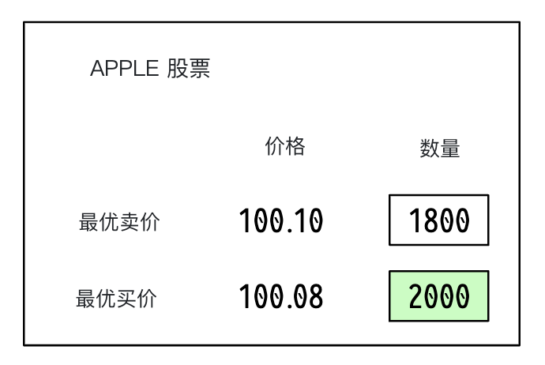
</div>

L2 包含更多价格档位：

<div style="margin-left:3rem">
    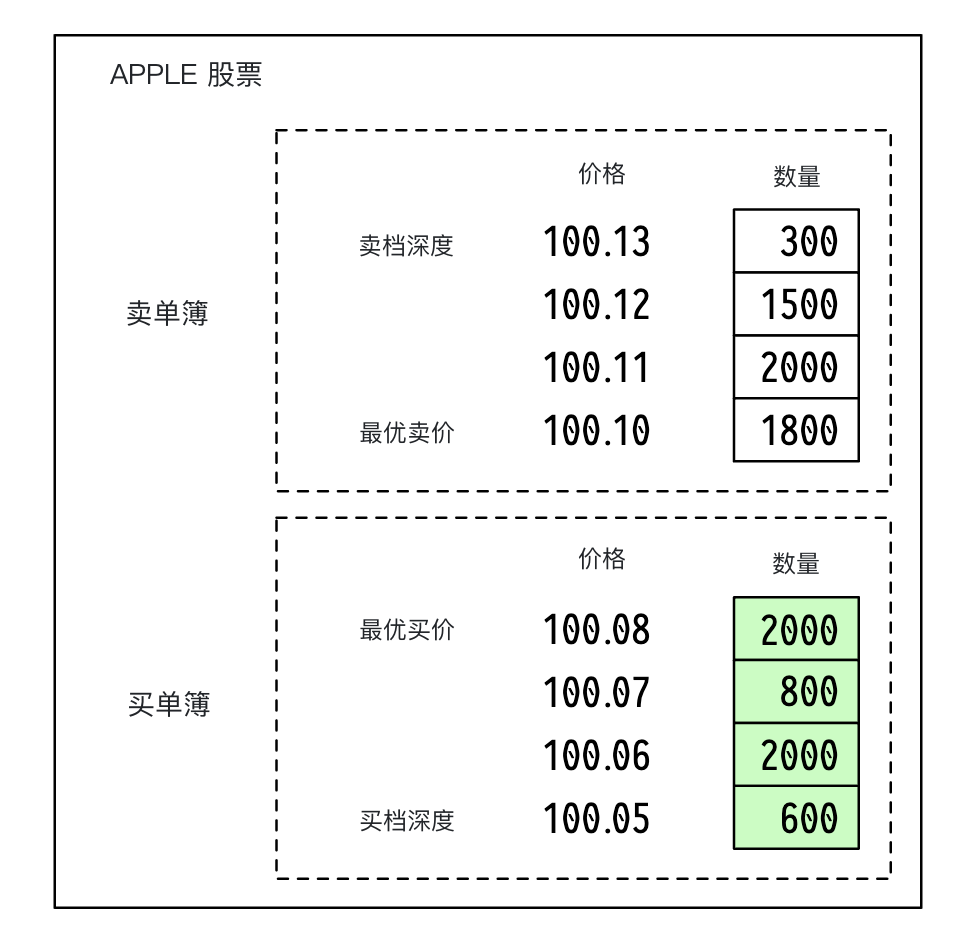
</div>

L3 展示各档位以及每一档上排队的数量：

<div style="margin-left:3rem">
    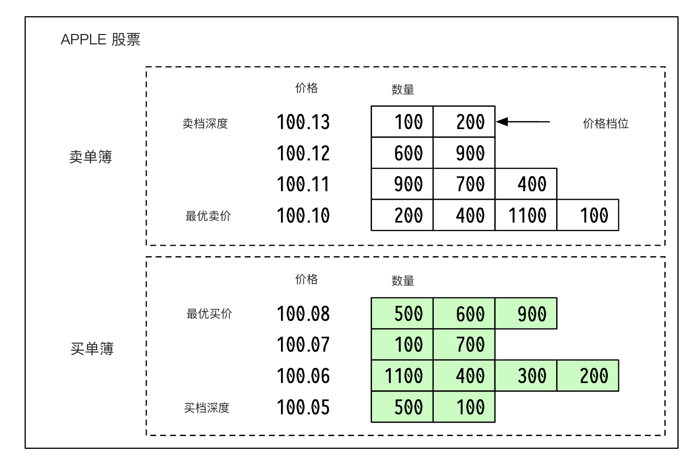
</div>

K线（candlestick）展示给定区间内的开盘价、收盘价，以及最高价和最低价：

<div style="margin-left:3rem">
    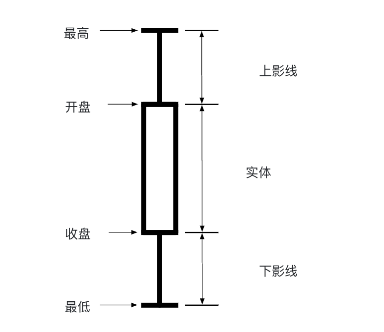
</div>

FIX 是大多数厂商用来交换证券交易信息的协议。证券交易报文示例：
```
8=FIX.4.2 | 9=176 | 35=8 | 49=PHLX | 56=PERS | 52=20071123-05:30:00.000 | 11=ATOMNOCCC9990900 | 20=3 | 150=E | 39=E | 55=MSFT | 167=CS | 54=1 | 38=15 | 40=2 | 44=15 | 58=PHLX EQUITY TESTING | 59=0 | 47=C | 32=0 | 31=0 | 151=15 | 14=0 | 6=0 | 10=128 |
```

### **高层设计**

<div style="margin-left:3rem">
    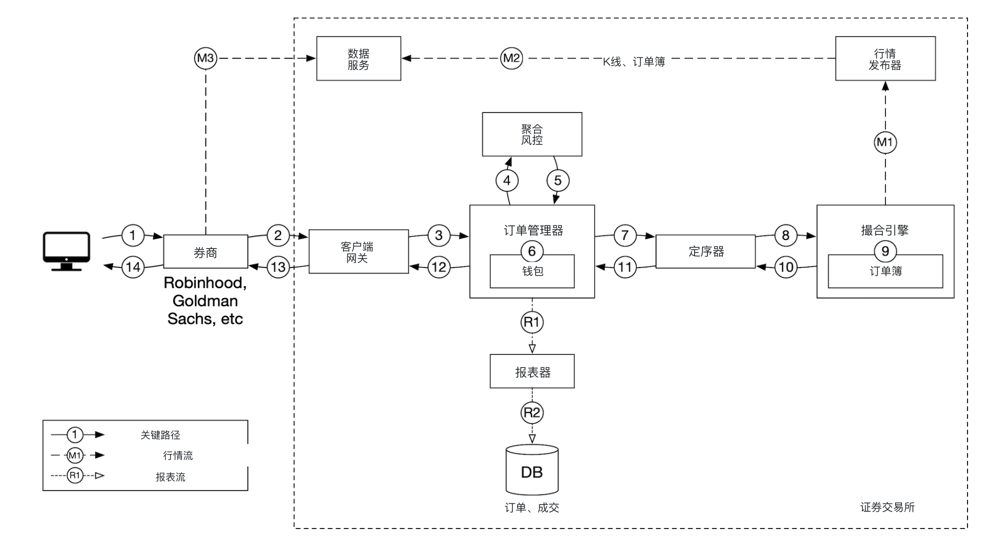
</div>

交易流：
 * 客户通过交易界面下单
 * 券商把订单发到交易所
 * 订单经客户端网关（client gateway）进入交易所，网关做校验、限流、认证等，再转给订单管理器（order manager）
 * 订单管理器按风险管理器设定的规则做风控检查
 * 通过风控后，订单管理器核对钱包里是否有足够资金
 * 订单送到撮合引擎（matching engine）。撮合成功时，撮合引擎发出两笔成交（execution，也称 fill），分别对应买、卖。两笔订单都要定序，以保证确定性。
 * 成交返回给客户。

行情流（M1-M3）：
 * 撮合引擎生成成交流，发给行情发布器（market data publisher）
 * 行情发布器构造 K线，发给数据服务
 * 行情存在专门存储里，供实时分析。券商连接数据服务，获取及时行情。

报表流（R1-R2）：
 * 报表器从订单和成交中收集全部必要报表字段，写入 DB
 * 报表字段——client_id、price、quantity、order_type、filled_quantity、remaining_quantity

交易流在关键路径上，其余流不在，因此延迟要求不同。

#### 交易流
交易流在关键路径上，因此要针对低延迟高度优化。

核心是撮合引擎，也称交叉引擎（cross engine）。主要职责：
 * 为每个标的维护订单簿——该标的的买/卖订单列表。
 * 撮合买单和卖单——一次撮合产生两笔成交（fill），买卖各一。这项功能必须又快又准
 * 把成交流作为行情分发出去
 * 撮合结果必须按确定顺序产生。这是高可用的基础

接下来是定序器（sequencer）——它给每笔入站订单和出站成交打上序列号，是让撮合引擎具备确定性的关键组件。

<div style="margin-left:3rem">
    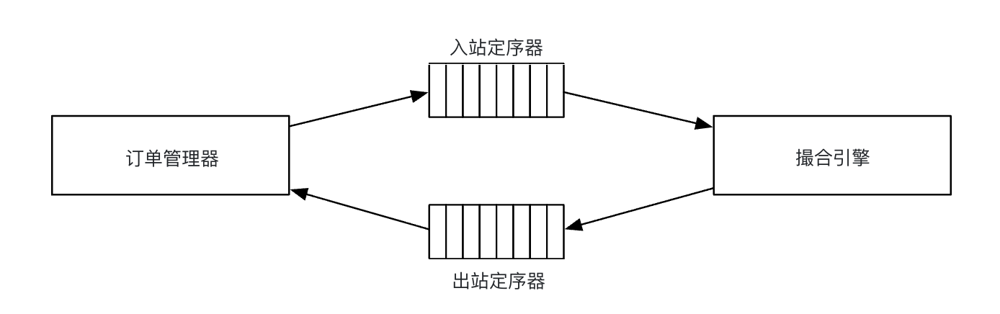
</div>

给入站订单和出站成交打序号，有几层原因：
 * 及时性与公平性
 * 快速恢复/回放
 * 精确一次（exactly-once）保证

概念上可以用 Kafka 当定序器，因为它本质上就是入站和出站消息队列。但为了更低延迟，我们自己实现。

订单管理器管理订单状态。它也和撮合引擎交互——发送订单、接收成交。

订单管理器的职责：
 * 把订单送去风控——例如确认用户交易量不超过 100 万
 * 对照用户钱包检查订单，确认有足够资金执行
 * 把订单发给定序器，再进入撮合引擎。为节省带宽，只把必要的订单信息传给撮合引擎
 * 从定序器收回成交（fill），再经客户端网关发给券商

实现订单管理器的主要难点是状态转换管理。事件溯源（event sourcing）是一种可行方案（深入设计里再讲）。

最后，客户端网关接收用户订单并发给订单管理器。它的职责：

<div style="margin-left:3rem">
    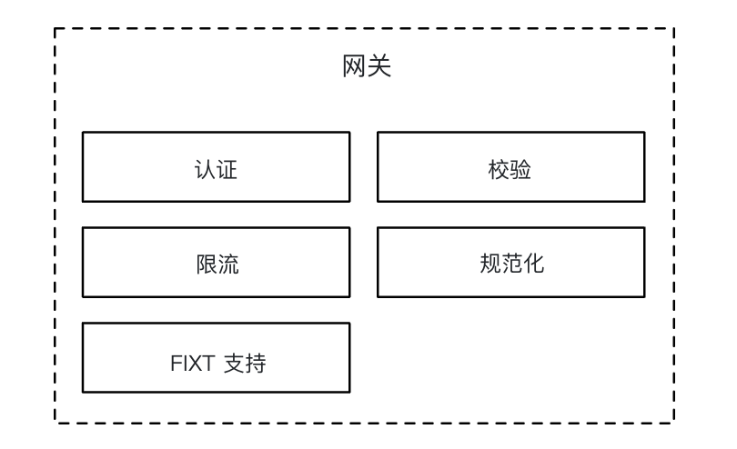
</div>

客户端网关在关键路径上，所以要保持轻量。

可以有多类客户端网关，服务不同客户。例如托管引擎（colo engine）是券商租在交易所数据中心里的交易引擎服务器：

<div style="margin-left:3rem">
    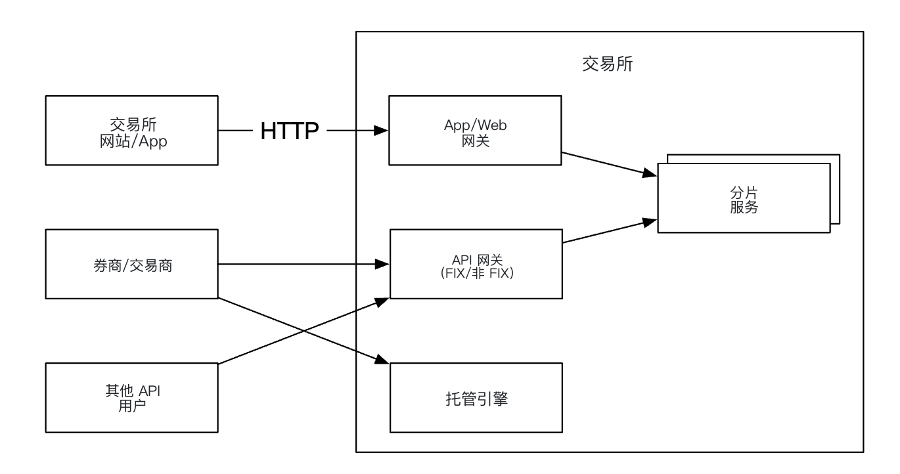
</div>

#### 行情流
行情发布器从撮合引擎接收成交，并根据成交流构建订单簿/K线。

这些数据发给数据服务，由数据服务把聚合后的数据展示给订阅者：

<div style="margin-left:3rem">
    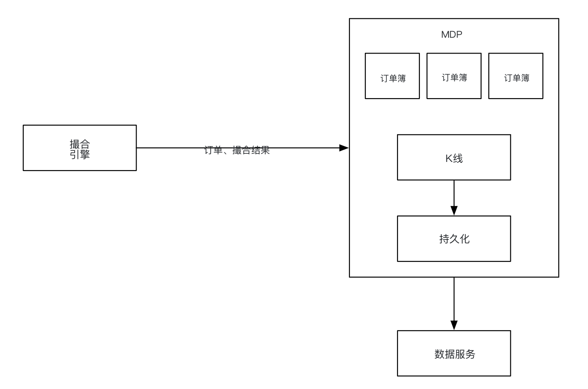
</div>

#### 报表流
报表器不在关键路径上，但仍是重要组件。

<div style="margin-left:3rem">
    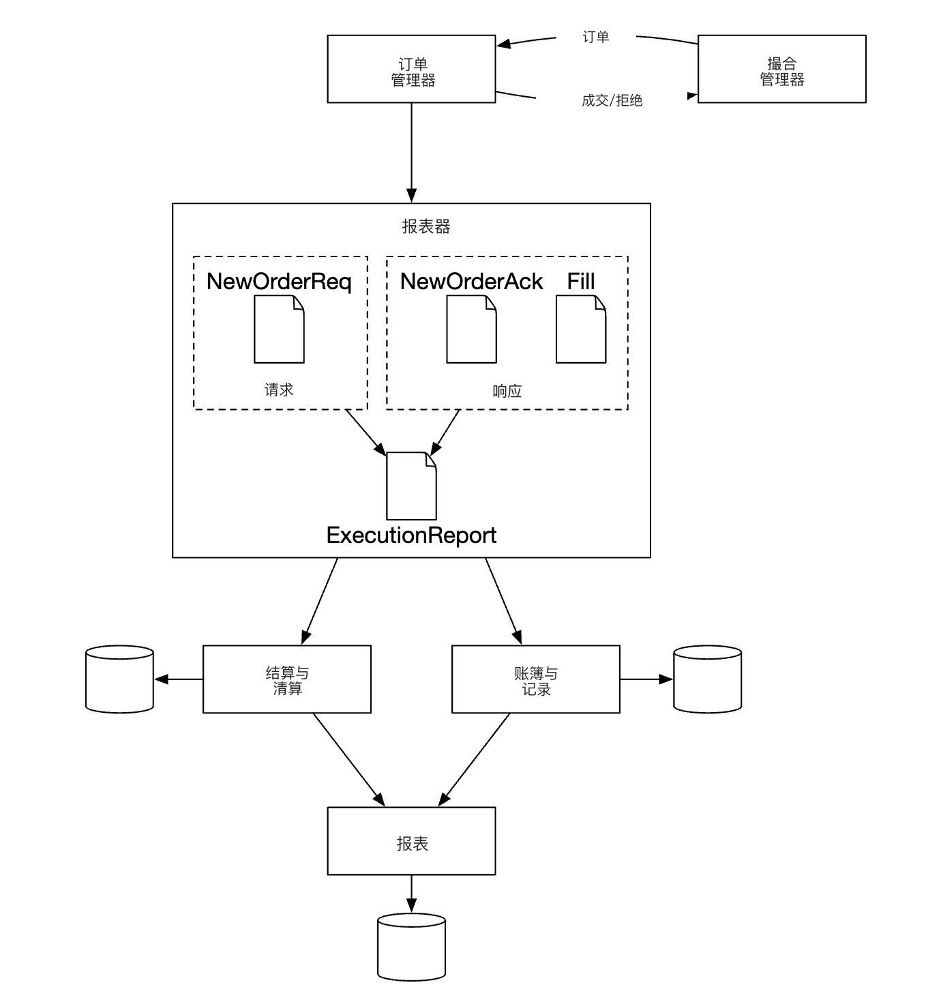
</div>

它负责交易历史、税务申报、合规报表、结算等。
报表流对延迟不是关键要求。准确性和合规更重要。

### **API 设计**
客户通过券商与证券交易所交互：下单、查看成交、看行情、下载历史数据做分析等。

客户端网关与券商之间用 RESTful API 通信。

对机构客户，使用专有协议以满足低延迟要求。

创建订单：
```
POST /v1/order
```

参数：
 * symbol - 股票代码。String
 * side - 买或卖。String
 * price - 限价单价格。Long
 * orderType - limit 或 market（本设计只支持限价单）。String
 * quantity - 订单数量。Long

响应：
 * id - 订单 ID。Long
 * creationTime - 系统创建时间。Long
 * filledQuantity - 已成功成交的数量。Long
 * remainingQuantity - 尚未成交的数量。Long
 * status - new/canceled/filled。String
 * 其余属性与入参相同

获取成交：
```
GET /execution?symbol={:symbol}&orderId={:orderId}&startTime={:startTime}&endTime={:endTime}
```

参数：
 * symbol - 股票代码。String
 * orderId - 订单 ID。可选。String
 * startTime - 查询起始时间，epoch \[11\]。Long
 * endTime - 查询结束时间，epoch。Long

响应：
 * executions - 范围内每笔成交组成的数组（属性见下）。Array
 * id - 成交 ID。Long
 * orderId - 订单 ID。Long
 * symbol - 股票代码。String
 * side - 买或卖。String
 * price - 成交价格。Long
 * orderType - limit 或 market。String
 * quantity - 成交数量。Long

获取订单簿：
```
GET /marketdata/orderBook/L2?symbol={:symbol}&depth={:depth}
```

参数：
 * symbol - 股票代码。String
 * depth - 每侧订单簿深度。Int

响应：
 * bids - 价格与数量组成的数组。Array
 * asks - 价格与数量组成的数组。Array

获取 K线：
```
GET /marketdata/candles?symbol={:symbol}&resolution={:resolution}&startTime={:startTime}&endTime={:endTime}
```

参数：
 * symbol - 股票代码。String
 * resolution - K线窗口长度，单位秒。Long
 * startTime - 窗口起始时间，epoch。Long
 * endTime - 窗口结束时间，epoch。Long

响应：
 * candles - 每根 K线数据组成的数组（属性见下）。Array
 * open - 每根 K线的开盘价。Double
 * close - 每根 K线的收盘价。Double
 * high - 每根 K线的最高价。Double
 * low - 每根 K线的最低价。Double

### **数据模型**
交易所里主要有三类数据：
 * 产品、订单、成交
 * 订单簿
 * K线

#### 产品、订单、成交
产品描述交易标的的属性——产品类型、交易代码、UI 展示代码等。

这类数据不常变，主要用于 UI 渲染。

订单表示一笔买/卖指令。成交是出站的撮合结果。

数据模型如下：

<div style="margin-left:3rem">
    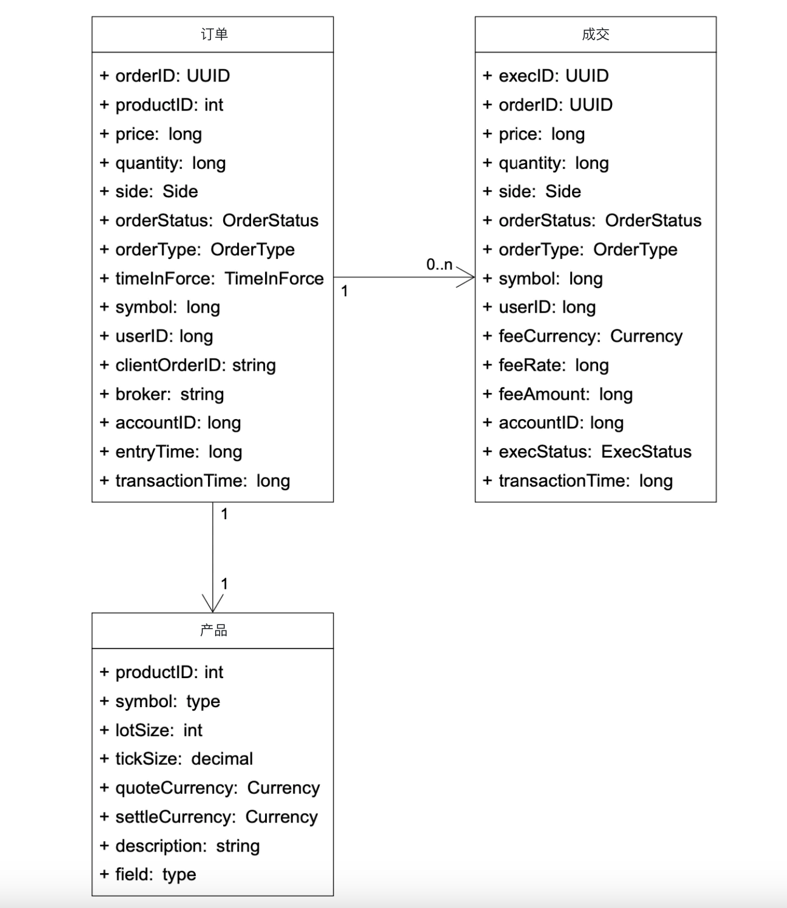
</div>

订单和成交会出现在全部三条流里：
 * 在关键路径上，为了高性能在内存中处理。它们由定序器存储并恢复。
 * 报表器把订单和成交写入数据库，供报表场景使用
 * 成交转发到行情侧，用来重建订单簿和 K线

#### 订单簿
订单簿是某只标的的买/卖订单列表，按价格档位组织。

高效的数据结构需要满足：
 * 常数查找时间——取某档或两档之间的量
 * 快速的新增/成交/撤销
 * 查询最优买/卖价
 * 遍历价格档位

订单簿成交示例：

<div style="margin-left:3rem">
    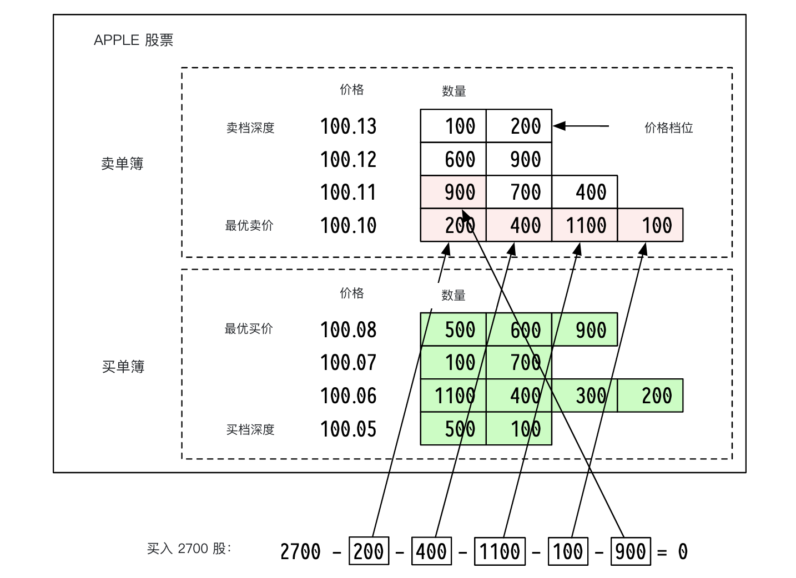
</div>

这张大单成交后，价差扩大，价格上涨。

订单簿实现伪代码示例：
```
class PriceLevel{
    private Price limitPrice;
    private long totalVolume;
    private List<Order> orders;
}

class Book<Side> {
    private Side side;
    private Map<Price, PriceLevel> limitMap;
}

class OrderBook {
    private Book<Buy> buyBook;
    private Book<Sell> sellBook;
    private PriceLevel bestBid;
    private PriceLevel bestOffer;
    private Map<OrderID, Order> orderMap;
}
```

更高效的实现可以用双向链表代替普通列表：
 * 下新单是 O(1)，因为加到链表尾。
 * 撮合是 O(1)，因为从链表头删除
 * 撤单就是从订单簿里删掉一笔。借助 `orderMap` 做 O(1) 查找，再 O(1) 删除（因为 `Order` 持有链表前驱引用）。

<div style="margin-left:3rem">
    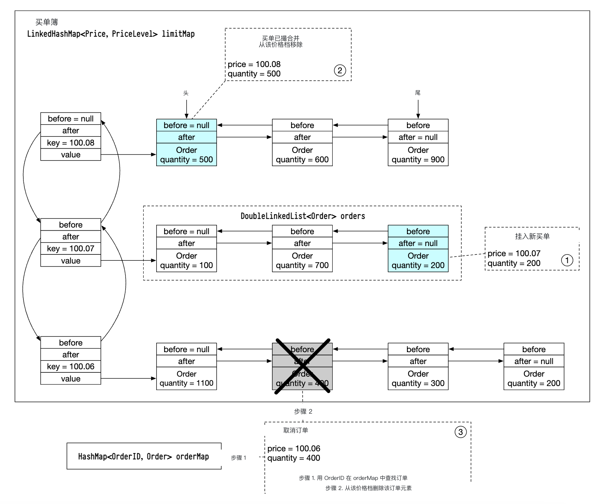
</div>

行情服务重建订单簿时也用同一套数据结构。

#### K线
K线数据由行情服务在时间窗口内处理订单后算出：
```
class Candlestick {
    private long openPrice;
    private long closePrice;
    private long highPrice;
    private long lowPrice;
    private long volume;
    private long timestamp;
    private int interval;
}

class CandlestickChart {
    private LinkedList<Candlestick> sticks;
}
```

一些避免占用过多内存的优化：
 * 用预分配环形缓冲区（ring buffer）存放 K线，减少分配次数
 * 限制内存中的 K线数量，其余落盘

实时分析用内存列式数据库（例如 KDB）。收市后数据持久化到历史数据库。

---

## 步骤 3：深入设计
现代交易所有一点和其他软件不太一样：它们通常把所有东西跑在一台巨型服务器上。

下面展开细节。

### **性能**
对交易所来说，各分位的整体延迟都要好。

如何降低延迟？
 * 减少关键路径上的任务数
 * 缩短每项任务耗时：少用网络/磁盘，并/或缩短任务执行时间

为了第一点，我们已从关键路径剥离所有多余职责，连日志都去掉，以换取最优延迟。

若沿用最初设计，会有几处瓶颈——服务间的网络延迟，以及定序器的磁盘使用。

那种设计端到端延迟能到几十毫秒。我们想要的是几十微秒。

因此把所有组件放进一台服务器，进程之间用 mmap 作为事件存储来通信：

<div style="margin-left:3rem">
    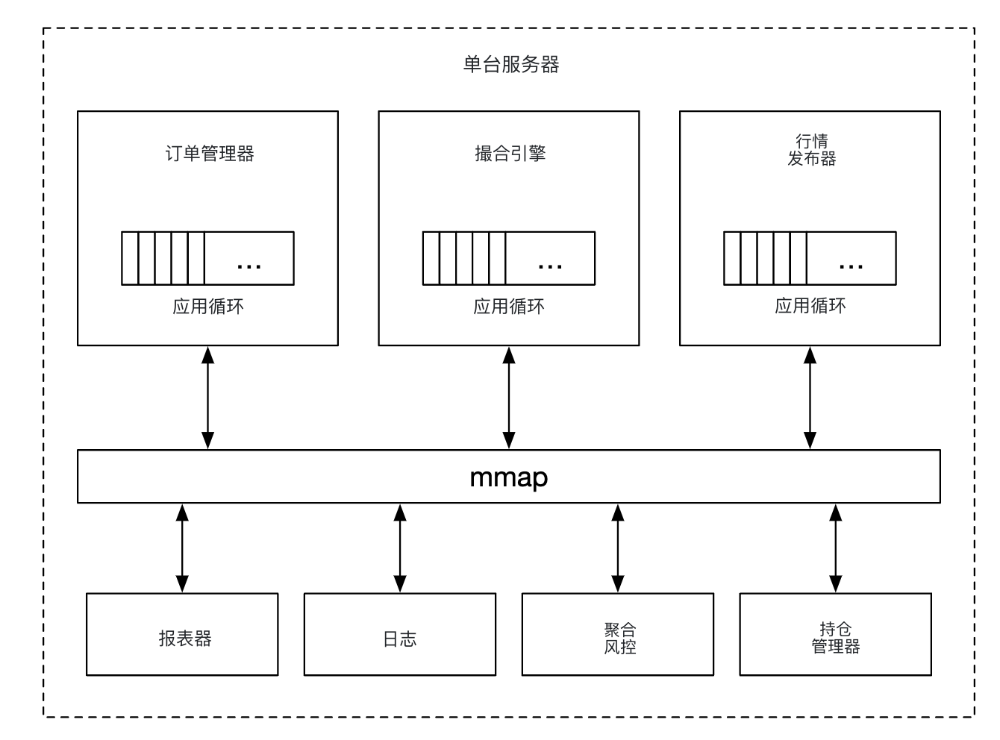
</div>

另一项优化是应用循环（application loop，执行关键任务的 while 循环），并绑到同一颗 CPU，避免上下文切换：

<div style="margin-left:3rem">
    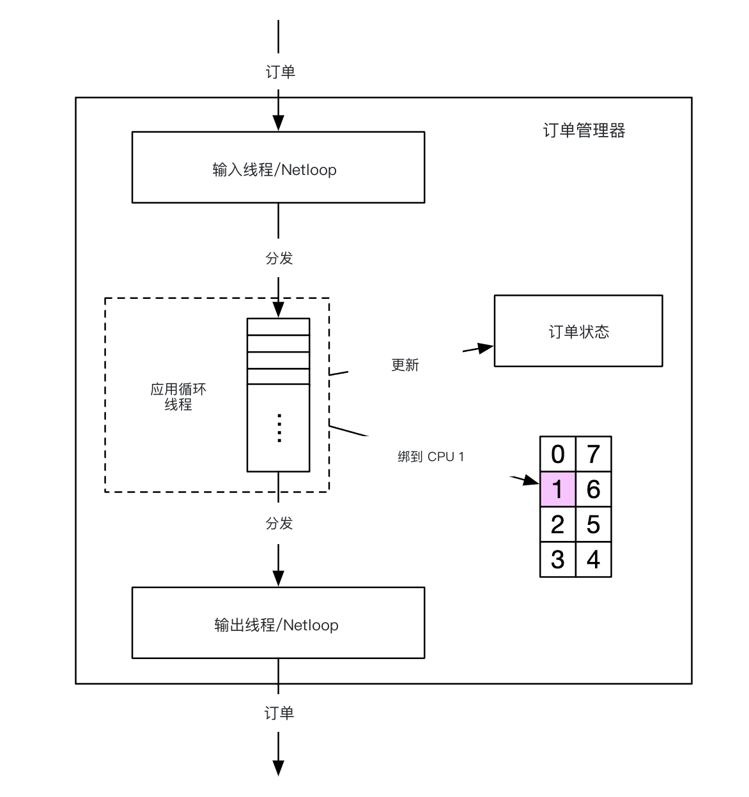
</div>

应用循环的另一个副作用是没有锁竞争——不会出现多线程争抢同一资源。

再看 mmap 怎么工作——它是 UNIX 系统调用，把磁盘上的文件映射到应用内存。

一个技巧是把文件建在 `/dev/shm` 里，也就是「共享内存」。这样完全不碰磁盘。

### **事件溯源**
事件溯源在[数字钱包一章](../27.%20%20Digital%20Wallet/README.zh.md)有深入讨论。细节请参考那一章。

一句话：我们不存当前状态，而是存不可变的状态转换：

<div style="margin-left:3rem">
    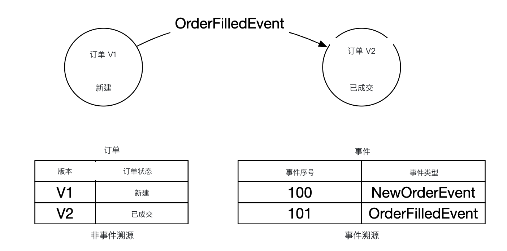
</div>

 * 左边——传统模式
 * 右边——事件溯源模式

目前设计长这样：

<div style="margin-left:3rem">
    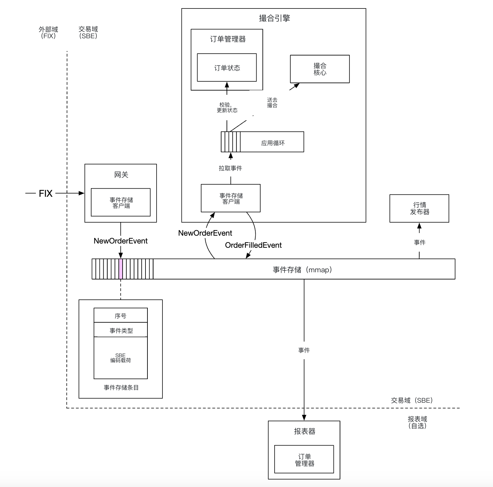
</div>

 * 外部域用 FIX 协议与客户端网关交互
 * 订单管理器收到新订单事件，校验后写入内部状态，再把订单发给撮合核心
 * 若订单撮合成功，生成 `OrderFilledEvent`，经 mmap 发出
 * 其他组件订阅事件存储，各自完成处理

再一项优化——所有组件都持有一份订单管理器的副本，并把它打成库，以免为管理订单多打一次调用

这套设计里，定序器不再充当事件存储，而是单一写者：先给事件定序，再转发到事件存储：

<div style="margin-left:3rem">
    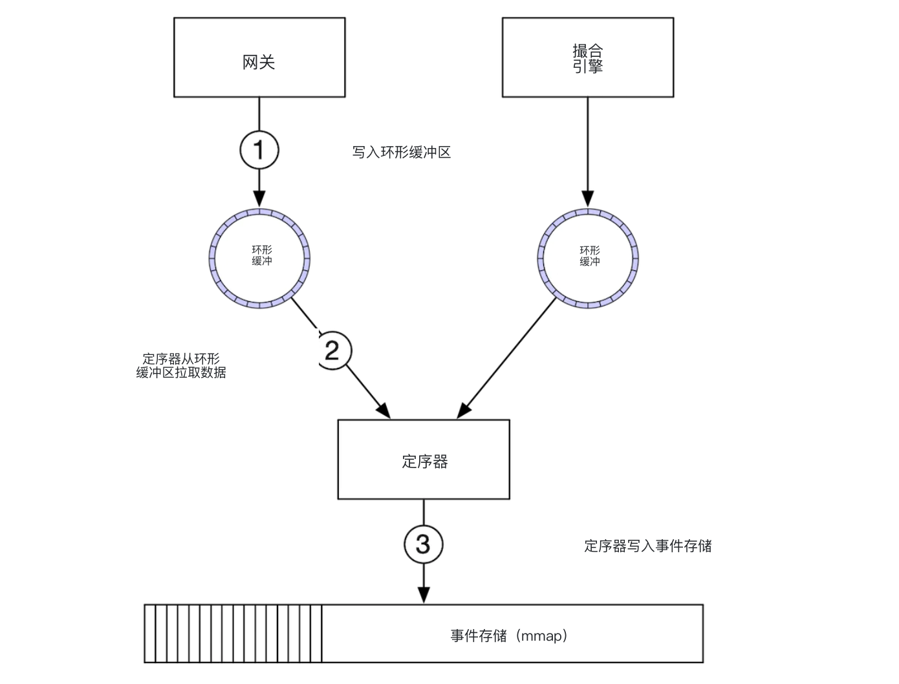
</div>

### **高可用**
目标是 99.99% 可用性——每天最多 8.64 秒宕机。

为此必须找出交易所架构里的单点故障（single-point-of-failure，SPOF）：
 * 为关键服务（例如撮合引擎）准备备用实例，处于待命
 * 积极自动化故障检测，并故障转移到备用实例

无状态服务如客户端网关，加机器即可水平扩展。

对有状态组件，可以处理入站事件，但若不是领导者就不发布出站事件：

<div style="margin-left:3rem">
    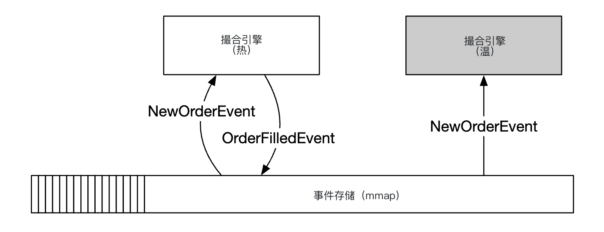
</div>

要检测主副本是否宕机，可以发心跳判断它是否失效。

这套机制只在单机边界内有效。
若要扩展，可以把整台服务器做成热/温副本，故障时切换。

要在副本之间复制事件存储，可以用可靠 UDP，通信更快。

### **容错**
如果连温实例也挂了怎么办？概率很低，但要有准备。

大型科技公司的做法是把核心数据复制到多个城市的数据中心，以抵御例如自然灾害。

需要考虑的问题：
 * 主实例宕了，如何、何时故障转移到备份实例？
 * 如何在备份实例中选出领导者？
 * 需要多长恢复时间（RTO，recovery time objective）？
 * 要恢复哪些功能？系统能否在降级条件下运转？

如何应对：
 * 系统可能因缺陷宕机（主实例和副本一起中招），可以用混沌工程（chaos engineering）把这类边角和灾难性结果暴露出来
 * 初期可以先手工做故障转移，直到充分了解系统的故障模式
 * 可以用领导者选举（例如 Raft）决定主实例宕掉后由哪个副本当领导者

跨服务器复制示例：

<div style="margin-left:3rem">
    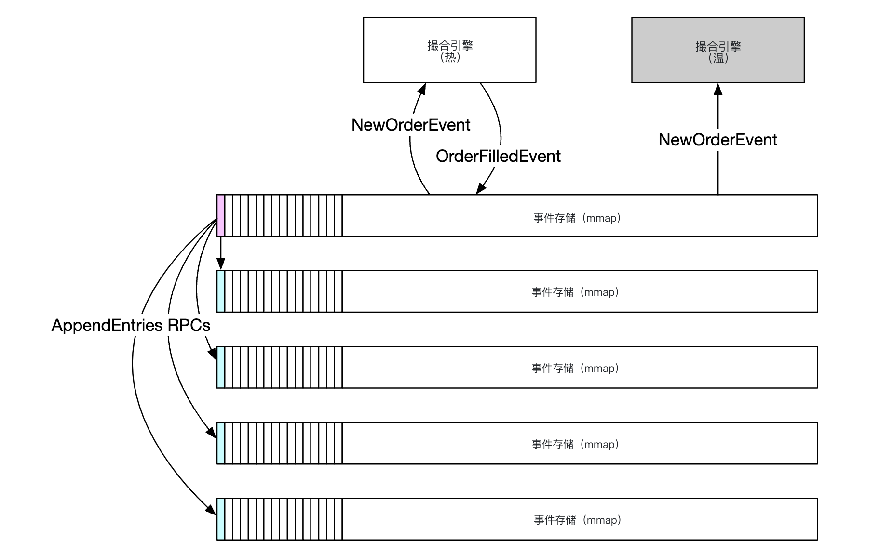
</div>

领导者选举术语示例：

<div style="margin-left:3rem">
    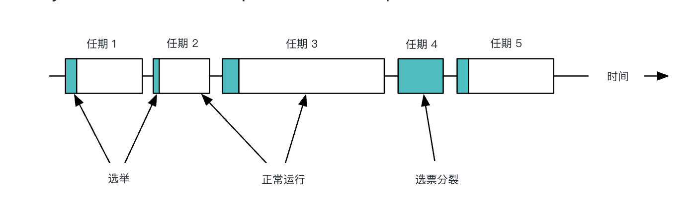
</div>

Raft 的工作原理详见[这里](https://thesecretlivesofdata.com/raft/)

最后还要考虑丢失容忍——能丢多少数据才到危险线？
这会决定备份频率。

对证券交易所来说，丢数据不可接受，所以必须频繁备份，并依靠 Raft 的复制来降低丢数据概率。

### **撮合算法**
稍微岔开，看一下撮合如何用伪代码实现：
```
Context handleOrder(OrderBook orderBook, OrderEvent orderEvent) {
    if (orderEvent.getSequenceId() != nextSequence) {
        return Error(OUT_OF_ORDER, nextSequence);
    }

    if (!validateOrder(symbol, price, quantity)) {
        return ERROR(INVALID_ORDER, orderEvent);
    }

    Order order = createOrderFromEvent(orderEvent);
    switch (msgType):
        case NEW:
            return handleNew(orderBook, order);
        case CANCEL:
            return handleCancel(orderBook, order);
        default:
            return ERROR(INVALID_MSG_TYPE, msgType);

}

Context handleNew(OrderBook orderBook, Order order) {
    if (BUY.equals(order.side)) {
        return match(orderBook.sellBook, order);
    } else {
        return match(orderBook.buyBook, order);
    }
}

Context handleCancel(OrderBook orderBook, Order order) {
    if (!orderBook.orderMap.contains(order.orderId)) {
        return ERROR(CANNOT_CANCEL_ALREADY_MATCHED, order);
    }

    removeOrder(order);
    setOrderStatus(order, CANCELED);
    return SUCCESS(CANCEL_SUCCESS, order);
}

Context match(OrderBook book, Order order) {
    Quantity leavesQuantity = order.quantity - order.matchedQuantity;
    Iterator<Order> limitIter = book.limitMap.get(order.price).orders;
    while (limitIter.hasNext() && leavesQuantity > 0) {
        Quantity matched = min(limitIter.next.quantity, order.quantity);
        order.matchedQuantity += matched;
        leavesQuantity = order.quantity - order.matchedQuantity;
        remove(limitIter.next);
        generateMatchedFill();
    }
    return SUCCESS(MATCH_SUCCESS, order);
}
```

这套撮合算法用 FIFO 决定同一价格档位上先撮合哪些订单。

### **确定性**
功能确定性由前面用的定序器技术保证。

事件实际发生的时刻并不重要：

<div style="margin-left:3rem">
    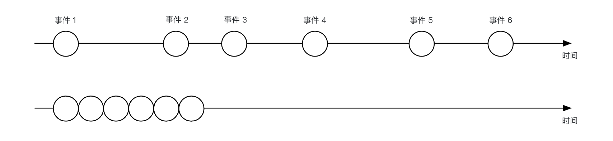
</div>

延迟确定性需要跟踪。可以根据监控 99 或 99.99 分位延迟来计算。

会造成延迟尖峰的，例如有 Java 里的垃圾回收事件。

### **行情发布优化**
行情发布器从撮合引擎接收撮合结果，并据此重建订单簿和 K线。

内存不是无限的，我们只保留部分 K线。客户可以选要多细的信息。更细的信息可能更贵：

<div style="margin-left:3rem">
    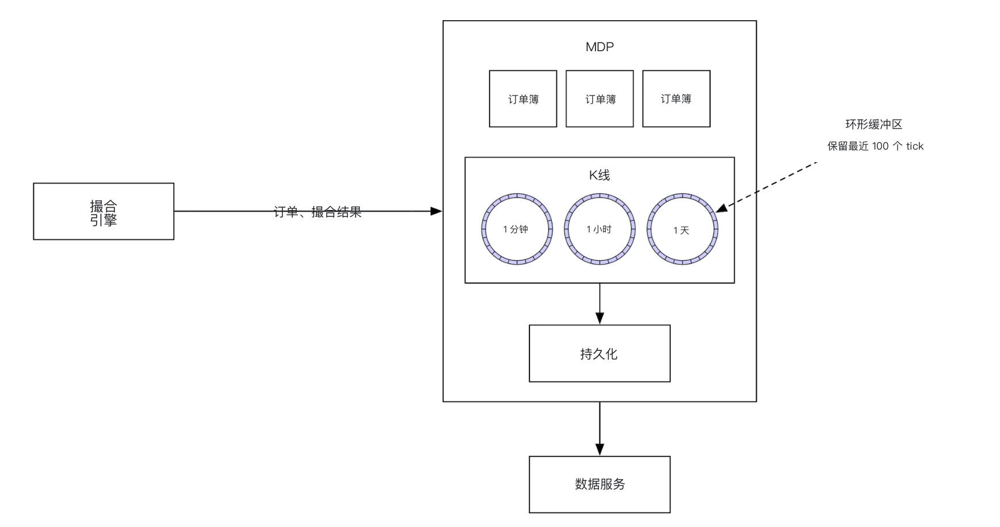
</div>

环形缓冲区（又称循环缓冲区，circular buffer）是头尾相接的固定大小队列。空间预分配以避免分配。这种数据结构也是无锁的。

优化环形缓冲区的另一项技术是填充（padding），确保序列号永远不和别的东西落在同一缓存行。

### **行情分发公平性与组播**
必须保证订阅者同时收到数据：如果有人先收到，就掌握了关键市场洞察，可能用来操纵市场。

为此，向订阅者发布数据时可以用可靠 UDP 做组播（multicast）。

数据在网上有三种传输方式：
 * 单播（unicast）——一个源，一个目的
 * 广播（broadcast）——一个源到整个子网
 * 组播——一个源到不同子网上的一组主机

理论上，用组播时所有订阅者应同时收到数据。

但 UDP 不可靠，数据可能到不了所有人。可以靠重传来增强。

### **托管**
交易所允许券商把服务器托管（colocation）到与交易所同一数据中心。

这会大幅降低延迟，可以视为 VIP 服务。

### **网络安全**
交易所面临 DDoS 挑战，因为有一部分服务暴露在互联网上。可选方案：
 * 把公共服务和数据与私有服务隔离，这样 DDoS 打不到最重要的客户
 * 用缓存层存放不常更新的数据
 * 加固 URL 以抵御 DDoS，例如优先用 `https://my.website.com/data/recent` 而不是 `https://my.website.com/data?from=123&to=456`，因为前者更易缓存
 * 需要有效的允许名单/阻止名单机制。
 * 可以用限流缓解 DDoS

---

## 步骤 4：收尾
其他有意思的点：
 * 并非所有交易所都把一切放在一台大服务器上，但有些仍然如此
 * 现代交易所更多依赖云基础设施，也依赖自动做市商（AMM，automatic market makers），以免维护订单簿
